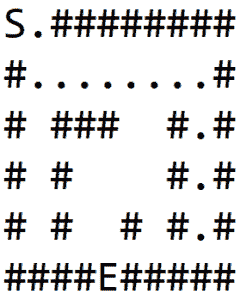
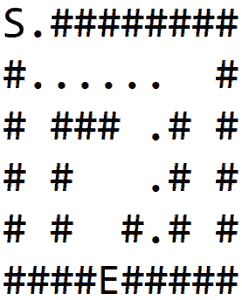
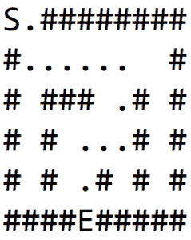
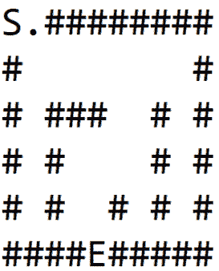

# Java 中的迷宫求解器

> 原文：<https://web.archive.org/web/20220930061024/https://www.baeldung.com/java-solve-maze>

## 1。简介

在本文中，我们将探索使用 Java 在迷宫中导航的可能方法。

假设迷宫是黑白图像，黑色像素代表墙壁，白色像素代表路径。两个白色像素是特殊的，一个是迷宫的入口，另一个是出口。

给定这样一个迷宫，我们想找到一条从入口到出口的路径。

## 2。迷宫建模

我们将认为迷宫是一个 2D 整数数组。数组中数值的含义将遵循以下约定:

*   0 ->道路
*   1 ->墙
*   2 ->迷宫入口
*   3 ->迷宫出口
*   4 ->从入口到出口路径的单元部分

我们将迷宫建模为一个图。入口和出口是两个特殊的节点，它们之间的路径待定。

一个典型的图有两个属性，节点和边。边决定了图的连通性，并将一个节点连接到另一个节点。

因此，我们假设每个节点有四条隐含的边，将给定的节点连接到它的左、右、上、下节点。

让我们定义方法签名:

```
public List<Coordinate> solve(Maze maze) {
}
```

该方法的输入是一个包含 2D 数组的`maze,` ，其命名约定如上所述。

该方法的响应是一个节点列表，它形成了从入口节点到出口节点的路径。

## 3。递归回溯器

### 3.1。算法

一个相当明显的方法是探索所有可能的路径，如果路径存在，最终会找到一条路径。但是这种方法将具有指数级的复杂性，并且不能很好地扩展。

然而，通过回溯和标记访问过的节点，可以定制上面提到的强力解决方案，以在合理的时间内获得路径。这个算法也被称为深度优先搜索。

该算法可以概括为:

1.  如果我们在墙或已经访问过的节点，返回失败
2.  否则，如果我们是出口节点，则返回成功
3.  否则，在路径列表中添加节点，并在所有四个方向上递归移动。如果返回失败，则从路径中删除该节点并返回失败。当找到出口时，路径列表将包含唯一的路径

让我们把这个算法应用到图-1(a)所示的迷宫中，其中 S 是起点，E 是出口。

对于每个节点，我们按顺序遍历每个方向:右、下、左、上。

在 1(b)中，我们探索一条道路，然后碰壁。然后，我们回溯，直到找到具有非墙邻居的节点，并探索另一条路径，如 1(c)所示。

我们再次碰壁，重复这个过程，最终找到出口，如 1(d)所示:

[](/web/20220924061505/https://www.baeldung.com/wp-content/uploads/2018/02/dfs-1-244x300.png)[](/web/20220924061505/https://www.baeldung.com/wp-content/uploads/2018/02/dfs-2-240x300.png) [](/web/20220924061505/https://www.baeldung.com/wp-content/uploads/2018/02/dfs-3-242x300.png)[](/web/20220924061505/https://www.baeldung.com/wp-content/uploads/2018/02/dfs-4-239x300-2.png)

### 3.2。实施

现在让我们看看 Java 实现:

首先，我们需要明确四个方向。我们可以用坐标来定义。当将这些坐标添加到任何给定的坐标时，将返回相邻坐标之一:

```
private static int[][] DIRECTIONS 
  = { { 0, 1 }, { 1, 0 }, { 0, -1 }, { -1, 0 } }; 
```

我们还需要一个实用方法来添加两个坐标:

```
private Coordinate getNextCoordinate(
  int row, int col, int i, int j) {
    return new Coordinate(row + i, col + j);
}
```

我们现在可以定义方法签名`solve.` **这里的逻辑很简单**——如果有从入口到出口的路径，那么返回该路径，否则，返回一个空列表:

```
public List<Coordinate> solve(Maze maze) {
    List<Coordinate> path = new ArrayList<>();
    if (
      explore(
        maze, 
        maze.getEntry().getX(),
        maze.getEntry().getY(),
        path
      )
      ) {
        return path;
    }
    return Collections.emptyList();
}
```

让我们定义上面提到的`explore`方法。如果有路径，则返回 true，参数`path`中有坐标列表。该方法有三个主要部分。

首先，我们丢弃无效的节点，即在迷宫之外或者是墙的一部分的节点。之后，我们将当前节点标记为已访问，这样我们就不会反复访问同一个节点。

最后，如果找不到出口，我们递归地向所有方向移动:

```
private boolean explore(
  Maze maze, int row, int col, List<Coordinate> path) {
    if (
      !maze.isValidLocation(row, col) 
      || maze.isWall(row, col) 
      || maze.isExplored(row, col)
    ) {
        return false;
    }

    path.add(new Coordinate(row, col));
    maze.setVisited(row, col, true);

    if (maze.isExit(row, col)) {
        return true;
    }

    for (int[] direction : DIRECTIONS) {
        Coordinate coordinate = getNextCoordinate(
          row, col, direction[0], direction[1]);
        if (
          explore(
            maze, 
            coordinate.getX(), 
            coordinate.getY(), 
            path
          )
        ) {
            return true;
        }
    }

    path.remove(path.size() - 1);
    return false;
}
```

这个解决方案使用的堆栈大小最大为迷宫的大小。

## 4。变体-最短路径(BFS)

### 4.1。算法

上面描述的递归算法找到了路径，但它不一定是最短的路径。为了找到最短路径，我们可以使用另一种称为[广度优先搜索](https://web.archive.org/web/20220924061505/https://en.wikipedia.org/wiki/Breadth-first_search)的图遍历方法。

在 DFS 中，首先浏览一个孩子及其所有孙辈，然后再浏览另一个孩子。而在 BFS，我们会先探讨所有的直系子女，然后再讨论孙辈。这将确保同时探测距父节点特定距离的所有节点。

该算法可以概括如下:

1.  在队列中添加起始节点
2.  当队列不为空时，弹出一个节点，执行以下操作:
    1.  如果我们到达墙或者节点已经被访问过，跳到下一个迭代
    2.  如果到达出口节点，则从当前节点回溯到起始节点，以找到最短路径
    3.  否则，将四个方向上的所有直接邻居加入队列

这里重要的一点是，节点必须跟踪它们的父节点，即它们是从哪里被添加到队列中的。一旦遇到出口节点，这对于找到路径很重要。

以下动画展示了使用该算法探索迷宫的所有步骤。我们可以观察到，在移动到下一个级别之前，会先浏览相同距离的所有节点:

[](/web/20220924061505/https://www.baeldung.com/wp-content/uploads/2018/02/bfs-1.gif)

### 4.2。实施

现在让我们用 Java 实现这个算法。我们将重用上一节定义的`DIRECTIONS`变量。

让我们首先定义一个实用方法，从一个给定的节点回溯到它的根。一旦找到出口，这将用于跟踪路径:

```
private List<Coordinate> backtrackPath(
  Coordinate cur) {
    List<Coordinate> path = new ArrayList<>();
    Coordinate iter = cur;

    while (iter != null) {
        path.add(iter);
        iter = iter.parent;
    }

    return path;
}
```

现在让我们定义核心方法`solve.`我们将重用 DFS 实现中使用的三个块，即验证节点、标记访问过的节点和遍历相邻节点。

我们只做一点小小的修改。代替递归遍历，我们将使用 FIFO 数据结构来跟踪邻居并迭代它们:

```
public List<Coordinate> solve(Maze maze) {
    LinkedList<Coordinate> nextToVisit 
      = new LinkedList<>();
    Coordinate start = maze.getEntry();
    nextToVisit.add(start);

    while (!nextToVisit.isEmpty()) {
        Coordinate cur = nextToVisit.remove();

        if (!maze.isValidLocation(cur.getX(), cur.getY()) 
          || maze.isExplored(cur.getX(), cur.getY())
        ) {
            continue;
        }

        if (maze.isWall(cur.getX(), cur.getY())) {
            maze.setVisited(cur.getX(), cur.getY(), true);
            continue;
        }

        if (maze.isExit(cur.getX(), cur.getY())) {
            return backtrackPath(cur);
        }

        for (int[] direction : DIRECTIONS) {
            Coordinate coordinate 
              = new Coordinate(
                cur.getX() + direction[0], 
                cur.getY() + direction[1], 
                cur
              );
            nextToVisit.add(coordinate);
            maze.setVisited(cur.getX(), cur.getY(), true);
        }
    }
    return Collections.emptyList();
}
```

## 5。结论

在本教程中，我们描述了两个主要的图形算法深度优先搜索和广度优先搜索来解决一个迷宫。我们也谈到了 BFS 如何给出从入口到出口的最短路径。

为了进一步阅读，查找其他解决迷宫的方法，如 A*和 Dijkstra 算法。

和往常一样，完整的代码可以在 GitHub 上找到[。](https://web.archive.org/web/20220924061505/https://github.com/eugenp/tutorials/tree/master/algorithms-modules/algorithms-miscellaneous-2)