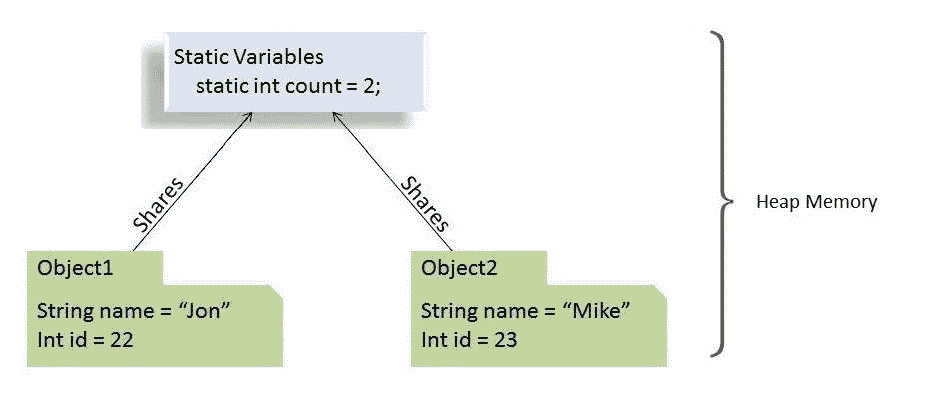

# Java 中的静态关键字指南

> 原文：<https://web.archive.org/web/20220930061024/https://www.baeldung.com/java-static>

## 1。概述

在本教程中，我们将详细探索 Java 语言的关键字`static`。

我们将了解如何将`static`关键字应用于变量、方法、块和嵌套类，以及这有什么不同。

## 延伸阅读:

## [Java 中的“final”关键字](/web/20221111164323/https://www.baeldung.com/java-final)

Learn what the final keyword in Java means when applied to classes, methods, and variables.[Read more](/web/20221111164323/https://www.baeldung.com/java-final) →

## [Java 中的 Volatile 关键字指南](/web/20221111164323/https://www.baeldung.com/java-volatile)

Learn about the Java volatile keyword and its capabilities.[Read more](/web/20221111164323/https://www.baeldung.com/java-volatile) →

## [本 Java 关键字指南](/web/20221111164323/https://www.baeldung.com/java-this)

Learn how to use Java's this keyword to reference the current object.[Read more](/web/20221111164323/https://www.baeldung.com/java-this) →

## 2。`static`关键词的解剖

在 Java 编程语言中，**关键字`static`意味着特定成员属于一个类型本身，而不是属于该类型的一个实例。**

这意味着我们将只创建该静态成员的一个实例，该实例由该类的所有实例共享。

[](/web/20221111164323/https://www.baeldung.com/wp-content/uploads/2017/10/Static_variables_shared_in_Java_1-1.jpg)

我们可以将关键字应用于变量、方法、块和嵌套类。

## 3。`static`字段(或类变量)

在 Java 中，**当我们声明一个字段`static`时，该字段的单个副本被创建并在该类的所有实例中共享。**

我们实例化一个类多少次并不重要。永远只有一个属于它的`static`字段的副本。这个`static`字段的值由同一类的所有对象共享。

从内存的角度来看，**静态变量存储在堆内存中。**

### 3.1。`static`字段的示例

假设我们有一个`Car` 类，它有几个属性(实例变量)`.`

每当我们从这个`Car`蓝图实例化新对象时，每个新对象都将拥有这些实例变量的不同副本。

然而，假设我们想要一个变量，它保存实例化的`Car`对象的数量，并且在所有实例之间共享，这样它们可以访问它，并在初始化时增加它。

这就是`static`变量发挥作用的地方:

```
public class Car {
    private String name;
    private String engine;

    public static int numberOfCars;

    public Car(String name, String engine) {
        this.name = name;
        this.engine = engine;
        numberOfCars++;
    }

    // getters and setters
}
```

现在，对于我们实例化的这个类的每个对象，`numberOfCars` 变量的相同副本都会递增。

因此，在这种情况下，这些将是真实的:

```
@Test
public void whenNumberOfCarObjectsInitialized_thenStaticCounterIncreases() {
    new Car("Jaguar", "V8");
    new Car("Bugatti", "W16");

    assertEquals(2, Car.numberOfCars);
}
```

### 3.2。使用`static`字段的令人信服的理由

以下是我们何时需要使用`static `字段的一些原因:

*   当变量的值与对象无关时
*   当值应该在所有对象之间共享时

### 3.3。需要记住的要点

由于 `static` 变量属于一个类，我们可以使用类名直接访问它们。所以，**我们不需要任何对象引用。**

我们只能在类级别声明`static`变量。

我们可以在没有对象初始化的情况下访问字段。

最后，我们可以使用对象引用(比如`ford.numberOfCars++`)来访问`static`字段。但是我们应该避免这种情况，因为很难判断它是实例变量还是类变量。相反，**我们应该总是用类名(`Car.numberOfCars++` )** 来指代`static`变量。

## 4。`static`方法(或类方法)

类似于`static`字段，`static`方法也属于一个类而不是一个对象。因此，我们可以在不创建它们所在的类的对象的情况下调用它们。

### 4.1。`static`方法的例子

我们通常使用`static`方法来执行不依赖于实例创建的操作。

为了在该类的所有实例之间共享代码，我们用一个`static`方法来编写它:

```
static void setNumberOfCars(int numberOfCars) {
    Car.numberOfCars = numberOfCars;
}
```

我们还通常使用`static`方法来创建实用程序或助手类，这样我们就可以在不创建这些类的新对象的情况下获得它们。

作为例子，我们可以看看来自 JDK 的`[Collections](https://web.archive.org/web/20221111164323/https://docs.oracle.com/en/java/javase/11/docs/api/java.base/java/util/Collections.html)`或`[Math](https://web.archive.org/web/20221111164323/https://docs.oracle.com/en/java/javase/11/docs/api/java.base/java/lang/Math.html)`实用程序类，来自 Apache 的`[StringUtils](https://web.archive.org/web/20221111164323/https://commons.apache.org/proper/commons-lang/apidocs/org/apache/commons/lang3/StringUtils.html)`，或来自 Spring framework 的`[CollectionUtils](https://web.archive.org/web/20221111164323/https://docs.spring.io/spring/docs/current/javadoc-api/org/springframework/util/CollectionUtils.html)`，并注意到它们所有的实用程序方法都是`static`。

### 4.2。使用`static`方法的令人信服的理由

让我们看看为什么我们想要使用`static`方法的几个原因:

*   访问/操作静态变量和其他不依赖于对象的静态方法。
*   方法在实用程序和助手类中被广泛使用。

### 4.3。需要记住的要点

Java 中的方法在编译时被解析。由于方法覆盖是运行时多态性的一部分， **`static`方法不能被覆盖。**

**抽象方法不能是静态的。**

`static`方法**不能使用`this`或`super`关键字。**

下列实例、类方法和变量的组合是有效的:

1.  实例方法可以直接访问实例方法和实例变量
2.  实例方法也可以直接访问`static`变量和`static`方法
3.  `static`方法可以访问所有的`static`变量和其他的`static`方法
4.  **`static`方法不能直接访问实例变量和实例方法。**他们需要一些对象引用来这样做。

## 5。一个`static`街区

我们使用一个`static`块来初始化`static`变量。虽然我们可以在声明期间直接初始化`static`变量，但是有些情况下我们需要进行多行处理。在这样的情况下，`static`街区就派上了用场。

**如果`static`变量在初始化期间需要额外的多语句逻辑，我们可以使用`static`块。**

### 5.1。`static`街区例子

例如，假设我们想用一些预定义的值初始化一个`List`对象。

使用`static` 模块，这变得很容易:

```
public class StaticBlockDemo {
    public static List<String> ranks = new LinkedList<>();

    static {
        ranks.add("Lieutenant");
        ranks.add("Captain");
        ranks.add("Major");
    }

    static {
        ranks.add("Colonel");
        ranks.add("General");
    }
}
```

不可能用所有的初始值和声明来初始化一个`List`对象。这就是为什么我们在这里使用了`static`块。

### 5.2。使用`static`区块的令人信服的理由

以下是使用`static `程序块的几个原因:

*   如果`static` 变量的初始化需要除赋值之外的一些附加逻辑
*   如果`static`变量的初始化容易出错，需要异常处理

### 5.3。需要记住的要点

一个**类可以有多个`static`块**。

`static`字段和`static`块的解析和运行顺序与它们在类中出现的顺序相同。

## 6。一堂`static`课

Java 允许我们在类中创建一个类。它提供了一种将元素分组的方法，我们只在一个地方使用。这有助于使我们的代码更有组织性和可读性。

通常，嵌套类架构分为两种类型:

*   我们声明的嵌套类`static`称为 **`static`嵌套类**
*   非`static`的嵌套类称为**内部类**

这两者之间的主要区别是内部类可以访问封闭类的所有成员(包括`private` 的成员)，而`static` 嵌套类只能访问外部类的静态成员。

事实上， **`static`嵌套类的行为与任何其他顶级类完全一样，但是被包含在将访问它的唯一类中，以提供更好的打包便利。**

### 6.1。`static`类的例子

创建单例对象最广泛使用的方法是通过一个`static`嵌套类:

```
public class Singleton  {
    private Singleton() {}

    private static class SingletonHolder {
        public static final Singleton instance = new Singleton();
    }

    public static Singleton getInstance() {
        return SingletonHolder.instance;
    }
}
```

我们使用这种方法是因为它不需要任何同步，并且易于学习和实现。

### 6.2。使用内部类`static`的令人信服的理由

让我们看看在我们的代码中使用`static `内部类的一些原因:

*   将只在一个地方使用的类分组增加了封装性
*   我们把代码放在唯一会用到它的地方。这增加了可读性，并且代码更易于维护。
*   如果一个嵌套类不需要任何对其封闭类实例成员的访问，最好将其声明为`static`。这样，它就不会耦合到外部类，因此更加优化，因为它们不需要任何堆或堆栈内存。

### 6.3。需要记住的要点

**基本上，`static`嵌套类不能访问外部类的任何实例成员。**它只能通过一个对象的引用来访问它们。

嵌套类可以访问封闭类的所有静态成员，包括私有成员。

**Java 编程规范不允许我们将顶级类声明为`static`** 。只有类(嵌套类)中的类才能成为`static`。

## 7。`Non-static variable cannot be referenced from a static context”`理解错误“

通常，当我们在静态上下文中使用非静态变量时，会出现这种错误。

正如我们前面看到的，静态变量属于类，在类装入时装入。另一方面，我们需要创建一个对象来引用非静态变量。

所以，**Java 编译器抱怨是因为需要一个对象来调用或使用非静态变量。**

现在我们知道了错误的原因，让我们用一个例子来说明它:

```
public class MyClass { 
    int instanceVariable = 0; 

    public static void staticMethod() { 
        System.out.println(instanceVariable); 
    } 

    public static void main(String[] args) {
        MyClass.staticMethod();
    }
} 
```

正如我们所见，我们在静态方法`staticMethod.` 中使用了非静态变量`instanceVariable,`

结果，我们会得到错误`Non-static variable cannot be referenced from a static context.`

## 8。结论

在本文中，我们看到了`static`关键字的作用。

我们还讨论了使用静态字段、静态方法、静态块和静态内部类的原因和优点。

最后，我们了解了导致编译器失败并出现错误“`Non-static variable cannot be referenced from a static context”`”的原因。

和往常一样，我们可以在 GitHub 上找到完整的代码[。](https://web.archive.org/web/20221111164323/https://github.com/eugenp/tutorials/tree/master/core-java-modules/core-java-lang-oop-modifiers)