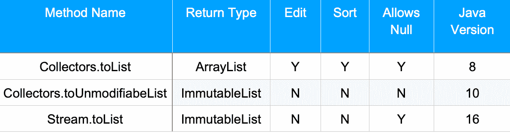
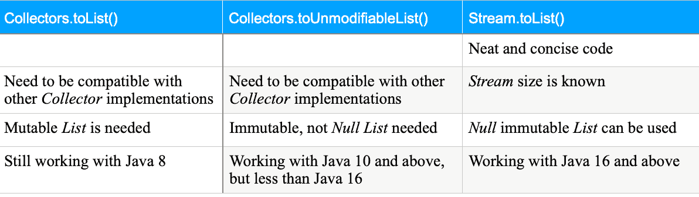

# 在 Java 中将流元素收集到一个列表中

> 原文：<https://web.archive.org/web/20220930061024/https://www.baeldung.com/java-stream-to-list-collecting>

## 1.概观

在本教程中，我们将看看从一个`Stream`获取一个`List`的不同方法。我们还将讨论它们之间的区别以及何时使用哪种方法。

## 2。将流元素收集到一个列表中

从一个`Stream`得到一个`List`是`Stream`流水线最常用的[终端操作](/web/20220810100919/https://www.baeldung.com/java-8-streams#pipeline)。在 Java 16 之前，我们习惯于调用`Stream.collect()`方法，并将其作为参数传递给`Collector`来收集元素。`Collector`本身是通过调用 [`Collectors.toList()`](/web/20220810100919/https://www.baeldung.com/java-8-collectors) 方法创建的。

然而，对于一个直接从`Stream`实例获取`List`的方法，已经有[个变更请求](https://web.archive.org/web/20220810100919/https://bugs-stage.openjdk.java.net/browse/JDK-8256441)。**在 Java 16 发布后，我们现在可以调用 [`toList()`](/web/20220810100919/https://www.baeldung.com/java-stream-immutable-collection#3-using-streamtolist-method) ，直接在`Stream`上新增一个方法，来得到`List`** 。像`[StreamEx](/web/20220810100919/https://www.baeldung.com/streamex)`这样的库也提供了一种直接从`Stream`获取`List`的便捷方式。

我们可以使用以下方法将`Stream` 个元素累积到一个`List`中:

*   `Stream.collect(Collectors.toList())`:从 Java 8 开始
*   `Stream.collect([Collectors.toUnmodifiableList()](/web/20220810100919/https://www.baeldung.com/java-stream-immutable-collection#1-using-javas-tounmodifiablelist))`:从 Java 10 开始
*   `Stream.toList()`:从 Java 16 开始

我们将按照方法发布的时间顺序来使用它们。

## 3。分析列表

让我们首先根据上一节描述的方法创建列表。之后，我们来分析一下它们的性质。

我们将在所有示例中使用以下`Stream`个国家代码:

```
Stream.of(Locale.getISOCountries()); 
```

### 3.1.创建列表

现在，我们将使用不同的方法从给定的国家代码`Stream`中创建一个`List`:

首先，让我们使用`Collectors:toList()`创建一个`List`:

```
List<String> result = Stream.of(Locale.getISOCountries()).collect(Collectors.toList());
```

之后，让我们使用` Collectors.toUnmodifiableList()`来收集它:

```
List<String> result = Stream.of(Locale.getISOCountries()).collect(Collectors.toUnmodifiableList());
```

在这里，在这些方法中，我们通过`Collector`接口`.`将`Stream`累积到一个`List`中，这导致了额外的分配和复制，因为我们不直接使用`Stream.`

然后，让我们用` Stream.toList()`重复收集:

```
List<String> result = Stream.of(Locale.getISOCountries()).toList();
```

这里，我们直接从`Stream,`中获取`List`，从而防止额外的分配和复制。

**因此，与其他两个调用相比，在`Stream`上直接使用`toList()`更加简洁、整洁、方便和优化。**

### 3.2。检查累积列表

让我们从检查我们创建的`List`的类型开始。

`Collectors.toList()`，将`Stream`个元素收集成一个`ArrayList`:

```
java.util.ArrayList
```

`Collectors.toUnmodifiableList()`，将`Stream`元素收集到一个不可修改的`List`中。

```
java.util.ImmutableCollections.ListN
```

`Stream.toList()`，将元素收集到一个不可修改的`List`中。

```
java.util.ImmutableCollections.ListN
```

**尽管`Collectors.toList()`的当前实现创建了一个可变的`List`，但是方法规范本身并不能保证`List.`** 的类型、可变性、可序列化性或线程安全性

另一方面，`Collectors.toUnmodifiableList()`和 `Stream.toList(),`都产生不可修改的列表。

**这意味着我们可以对`Collectors.toList(),`的元素执行加法和排序等操作，但不能对`Collectors.toUnmodifiableList()` 和`Stream.toList()`的元素执行这些操作。**

### 3.3。列表中允许空元素

虽然`Stream.toList()`产生了一个不可修改的`List`，但它仍然和`Collectors.toUnmodifiableList().`不一样，这是因为`Stream.toList()`允许`null` 元素而`Collectors.toUnmodifiableList()`不允许`null`元素。然而，`Collectors.toList()`允许`null`元素。

当一个包含`null`元素的`Stream`被收集时`Collectors.toList()` 不会抛出一个`Exception`:

```
Assertions.assertDoesNotThrow(() -> {
    Stream.of(null,null).collect(Collectors.toList());
});
```

`Collectors.toUnmodifiableList()`收集包含`null` 元素的`Stream`时抛出一个`NulPointerException`:

```
Assertions.assertThrows(NullPointerException.class, () -> {
    Stream.of(null,null).collect(Collectors.toUnmodifiableList());
});
```

当我们试图收集一个包含`null` 元素的`Stream`时，`Stream.toList()` 不会抛出一个`NulPointerException`:

```
Assertions.assertDoesNotThrow(() -> {
    Stream.of(null,null).toList();
});
```

**因此，在将我们的代码从 Java 8 迁移到 Java 10 或 Java 16 时，这是需要注意的事情。我们不能盲目地用`Stream.toList()`代替`Collectors.toList()` 或`Collectors.toUnmodifiableList().`**

### 3.4。分析总结

下表总结了我们分析的列表的差异和相似之处:

[](/web/20220810100919/https://www.baeldung.com/wp-content/uploads/2021/09/stream-list-summary.png)

## 4。何时使用不同的`toList()`方法

添加`Stream.toList()`的主要目的是减少`Collector` API 的冗长。

如前所示，使用`C` `ollectors`方法获取`List` s 非常冗长。另一方面，使用`Stream.toList()`方法使得代码简洁明了。

然而，正如前面几节所看到的，`Stream.toList()` 不能用作`Collectors.toList()` 或`Collectors.toUnmodifiableList()`的快捷方式。

其次，`Stream.toList()`使用更少的内存，因为它的[实现独立于`Collector`接口](https://web.archive.org/web/20220810100919/https://blogs.oracle.com/javamagazine/hidden-gems-jdk16-jdk17-jep)。它将`Stream`元素直接累积到`List`中。因此，如果我们预先知道流的大小，使用`Stream.toList().`将是最佳的

第三，我们知道`Stream` API 只为`toList()`方法提供实现。它不包含获取地图或集合的类似方法。因此，如果我们想要一个统一的方法来获得任何转换器，比如 list、map 或 set，我们将继续使用`Collector` API。这也将保持一致性，避免混乱。

最后，如果我们使用低于 Java 16 的版本，我们必须继续使用`Collectors`方法。

下表总结了给定方法的最佳用法:

[](/web/20220810100919/https://www.baeldung.com/wp-content/uploads/2021/09/comparison.png)

## 5。结论

在本文中，我们分析了从`Stream`获取`List`的三种最流行的方法。然后，我们看了主要的区别和相似之处。我们还讨论了如何以及何时使用这些方法。

与往常一样，本文中使用的示例的源代码可以在 GitHub 上的[处获得。](https://web.archive.org/web/20220810100919/https://github.com/eugenp/tutorials/tree/master/core-java-modules/core-java-16)