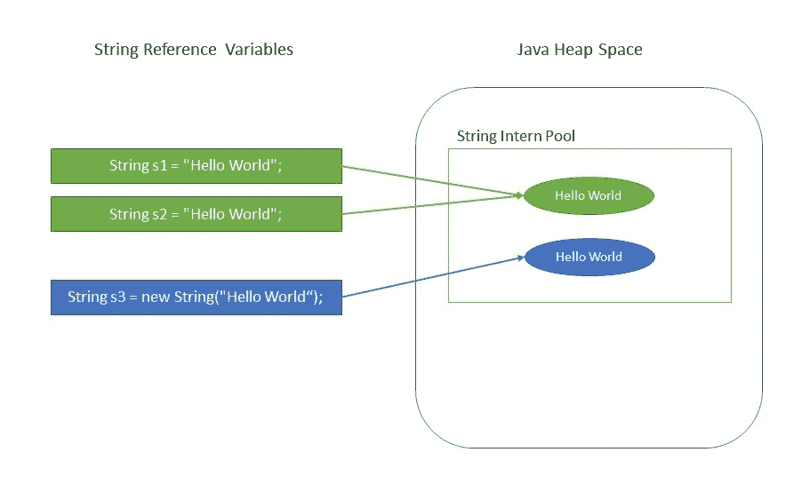

# 为什么 Java 中字符串是不可变的？

> 原文：<https://web.archive.org/web/20220930061024/https://www.baeldung.com/java-string-immutable>

## 1。简介

在 Java 中，字符串是不可变的。一个在面试中非常普遍的问题是“为什么字符串在 Java 中被设计成不可变的？”

Java 的创始人詹姆斯·高斯林曾经在一次采访中被问到什么时候应该使用不变量，他回答道:

> 我会尽可能使用不可变的。

他进一步支持自己的观点，陈述了不变性提供的特性，比如缓存、安全性、无需复制的简单重用等。

在本教程中，我们将进一步探究为什么 Java 语言设计者决定保持`String`不可变。

## 2.什么是不可变对象？

不可变对象是一个**对象，它的内部状态在完全创建**后保持不变。这意味着一旦对象被赋值给一个变量，我们既不能更新引用，也不能以任何方式改变内部状态。

我们有一篇单独的文章详细讨论了不可变对象。要了解更多信息，请阅读 Java 中的[不可变对象文章。](/web/20220630013956/https://www.baeldung.com/java-immutable-object)

## 3。为什么`String`在 Java 中是不可变的？

保持这个类不变的主要好处是缓存、安全性、同步和性能。

让我们讨论一下这些东西是如何工作的。

### 3.1。介绍给`String`池

`String`是使用最广泛的数据结构。缓存`String`文字并重用它们可以节省大量堆空间，因为不同的`String`变量引用了`String`池中的同一个对象。`String`实习生人才库正是为此服务的。

Java 字符串池**是 JVM** 存储`Strings`的特殊内存区域。由于`Strings`在 Java 中是不可变的，JVM 通过在池中只存储每个文字`String`的一个副本来优化分配给它们的内存量。这个过程叫做实习:

```
String s1 = "Hello World";
String s2 = "Hello World";

assertThat(s1 == s2).isTrue();
```

因为在前面的例子中存在`String`池，两个不同的变量从池中指向同一个`String`对象，因此节省了重要的内存资源。

[](/web/20220630013956/https://www.baeldung.com/wp-content/uploads/2018/08/Why_String_Is_Immutable_In_Java.jpg)

我们有一篇单独的文章专门讨论 Java `String` Pool。要了解更多信息，请阅读那篇文章。

### 3.2。安全性

`String`在 Java 应用程序中广泛用于存储敏感信息，如用户名、密码、连接 URL、网络连接等。JVM 类装入器在装入类时也广泛使用它。

因此，一般来说，保护`String`类对于整个应用程序的安全性至关重要。例如，考虑这个简单的代码片段:

```
void criticalMethod(String userName) {
    // perform security checks
    if (!isAlphaNumeric(userName)) {
        throw new SecurityException(); 
    }

    // do some secondary tasks
    initializeDatabase();

    // critical task
    connection.executeUpdate("UPDATE Customers SET Status = 'Active' " +
      " WHERE UserName = '" + userName + "'");
}
```

在上面的代码片段中，假设我们从一个不可信的来源收到了一个`String`对象。我们正在进行所有必要的安全检查，首先检查`String`是否只是字母数字，然后是一些更多的操作。

记住，我们不可靠的源调用者方法仍然引用这个`userName`对象。

**如果`Strings`是可变的，那么当我们执行更新的时候，我们不能确定我们收到的`String`是安全的，即使在执行了安全检查之后。**不可信的调用者方法仍然有引用，可以在完整性检查之间改变`String`。因此在这种情况下，我们的查询容易出现 SQL 注入。因此，随着时间的推移，易变的`Strings`可能会导致安全性降低。

还可能发生的情况是，`String` `userName`对另一个线程是可见的，该线程可能在完整性检查之后改变它的值。

总的来说，在这种情况下，不变性帮助了我们，因为当值不变时，操作敏感代码更容易，因为可能影响结果的操作交错更少。

### 3.3。同步

不可变自动使`String`线程安全，因为它们在被多个线程访问时不会被改变。

因此，一般来说，不可变对象可以在同时运行的多个线程之间共享。它们也是线程安全的，因为如果一个线程改变了值，那么不是修改它，而是在`String`池中创建一个新的`String`。因此，`Strings`对于多线程来说是安全的。

### 3.4。哈希码缓存

因为`String`对象被大量用作数据结构，所以它们也被广泛用于哈希实现，如`HashMap`、`HashTable`、`HashSet`等。当操作这些散列实现时，`hashCode()`方法被频繁地调用以进行分桶。

不变性保证了它们的值不会改变。所以**的`hashCode()`方法在`String`类中被覆盖以方便缓存，这样散列在第一次`hashCode()`调用时被计算并缓存，从那以后返回相同的值。**

**这反过来提高了使用散列实现的集合在操作`String`对象时的性能。**

另一方面，如果在操作后修改了`String`的内容，可变的`Strings`将在插入和检索时产生两个不同的 hashcodes，潜在地丢失了`Map`中的值对象。

### 3.5。性能

正如我们之前看到的，`String`池的存在是因为`Strings`是不可变的。反过来，当使用`Strings.`操作时，它通过节省堆内存和更快地访问散列实现来提高性能

因为`String`是最广泛使用的数据结构，所以提高`String`的性能对提高整个应用程序的性能有相当大的影响。

## 4。结论

通过本文，我们可以得出结论，**字符串是精确不可变的，因此它们的引用可以被视为普通变量，人们可以在方法之间和线程之间传递它们，而不用担心它所指向的实际的`String`对象是否会改变。**

我们还了解了促使`Java`语言设计者将这个类设为不可变的其他原因。