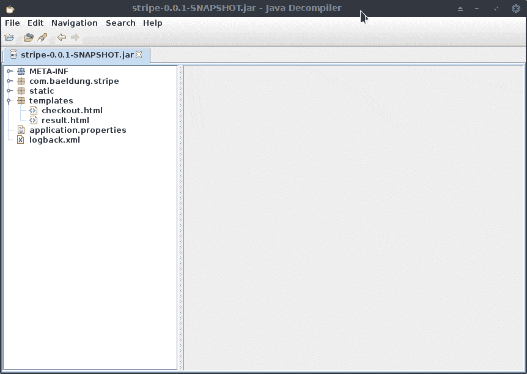
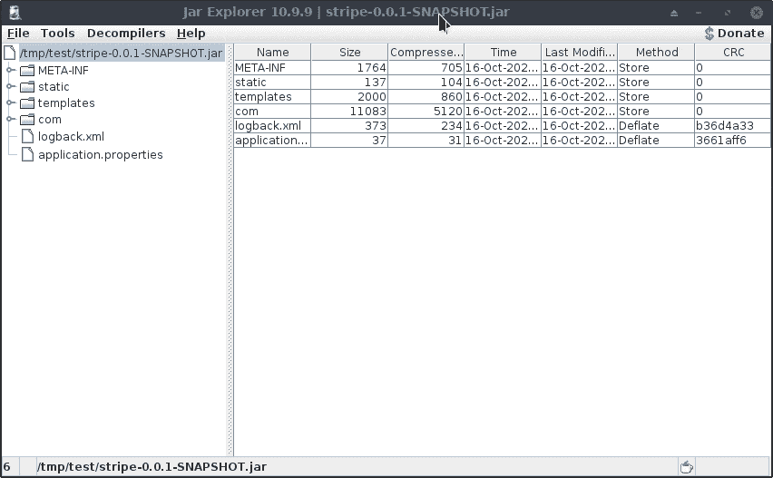
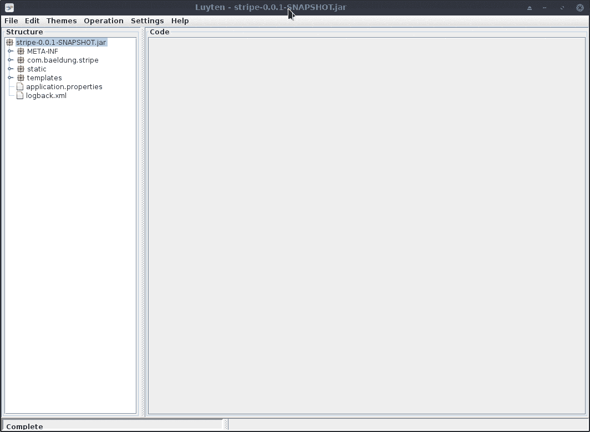

# 查看 JAR 文件的内容

> 原文：<https://web.archive.org/web/20220930061024/https://www.baeldung.com/java-view-jar-contents>

## 1.概观

我们已经学习了[从 JAR 文件](/web/20220625230552/https://www.baeldung.com/jar-file-get-class-names)中获取类名。此外，在该教程中，我们讨论了如何在 Java 应用程序的 JAR 文件中获取类名。

在本教程中，我们将学习从命令行列出 JAR 文件内容的另一种方法。

我们还将看到几个 GUI 工具，用于查看 JAR 文件的更详细内容——例如，Java 源代码。

## 2.示例 JAR 文件

在本教程中，我们仍然以`[stripe-0.0.1-SNAPSHOT.jar](https://web.archive.org/web/20220625230552/https://github.com/eugenp/tutorials/tree/master/stripe)`文件为例来说明如何查看 JAR 文件中的内容:

[](/web/20220625230552/https://www.baeldung.com/wp-content/uploads/2020/10/a_jar_example-1.png)

## 3.查看`jar`命令

我们已经知道，我们可以使用 JDK 附带的`jar`命令来检查 JAR 文件的内容:

```java
$ jar tf stripe-0.0.1-SNAPSHOT.jar 
META-INF/
META-INF/MANIFEST.MF
...
templates/result.html
templates/checkout.html
application.properties
com/baeldung/stripe/StripeApplication.class
com/baeldung/stripe/ChargeRequest.class
com/baeldung/stripe/StripeService.class
com/baeldung/stripe/ChargeRequest$Currency.class
```

如果我们想过滤输出，只得到我们想要的信息，例如类名或属性文件，我们可以将输出通过管道传输到过滤工具，如 [`grep`](/web/20220625230552/https://www.baeldung.com/linux/common-text-search) 。

如果我们的系统安装了 JDK，那么使用`jar`命令非常方便。

然而，有时我们想在没有安装 JDK 的系统上检查 JAR 文件的内容。在这种情况下，`jar`命令不可用。

我们接下来会看看这个。

## 4.使用`unzip`命令

**JAR 文件以 ZIP 文件格式打包。**换句话说，如果一个实用程序可以读取 ZIP 文件，我们也可以用它来查看 JAR 文件。

`unzip`命令是从 Linux 命令行处理 ZIP 文件的常用工具。

因此，我们可以使用 [`unzip`](https://web.archive.org/web/20220625230552/https://linux.die.net/man/1/unzip) 命令的`-l`选项来列出一个 JAR 文件的内容，而不需要提取它:

```java
$ unzip -l stripe-0.0.1-SNAPSHOT.jar
Archive:  stripe-0.0.1-SNAPSHOT.jar
  Length      Date    Time    Name
---------  ---------- -----   ----
        0  2020-10-16 20:53   META-INF/
...
      137  2020-10-16 20:53   static/index.html
      677  2020-10-16 20:53   templates/result.html
     1323  2020-10-16 20:53   templates/checkout.html
       37  2020-10-16 20:53   application.properties
      715  2020-10-16 20:53   com/baeldung/stripe/StripeApplication.class
     3375  2020-10-16 20:53   com/baeldung/stripe/ChargeRequest.class
     2033  2020-10-16 20:53   com/baeldung/stripe/StripeService.class
     1146  2020-10-16 20:53   com/baeldung/stripe/ChargeRequest$Currency.class
     2510  2020-10-16 20:53   com/baeldung/stripe/ChargeController.class
     1304  2020-10-16 20:53   com/baeldung/stripe/CheckoutController.class
...
---------                     -------
    15394                     23 files 
```

感谢`unzip`命令，我们可以在没有 JDK 的情况下查看 JAR 文件的内容。

上面的输出非常清楚。它以表格的形式列出了 JAR 文件中的文件。

## 5.使用 GUI 实用程序探索 JAR 文件

`jar` 和`unzip`命令都很方便，但是它们只列出了 JAR 文件中的文件名。

有时候，我们想知道更多关于 JAR 文件中文件的信息，例如，检查一个类的 Java 源代码。

在这一节中，我们将介绍几个独立于平台的 GUI 工具来帮助我们查看 JAR 文件中的文件。

### 5.1.使用 JD-GUI

首先我们来看看 [JD-GUI](https://web.archive.org/web/20220625230552/https://java-decompiler.github.io/) 。

JD-GUI 是一个很好的开源 GUI 实用程序，用于探索由 Java 反编译程序 [JD-Core](https://web.archive.org/web/20220625230552/https://github.com/java-decompiler/jd-core) 反编译的 Java 源代码。

JD-GUI 附带了一个 JAR 文件。我们可以通过使用带有 `-jar`选项的`java`命令来启动该实用程序，例如:

```java
$ java -jar jd-gui-1.6.6.jar
```

当我们看到 JD-GUI 的主窗口时，我们可以通过导航菜单“`File -> Open File…`”来打开我们的 JAR 文件，或者只是在窗口中拖放 JAR 文件。

一旦我们打开一个 JAR 文件，JAR 文件中的所有类都将被反编译。

然后我们可以在左侧选择我们感兴趣的文件来检查它们的源代码:

[](/web/20220625230552/https://www.baeldung.com/wp-content/uploads/2020/12/20201209_232956.gif)

正如我们在上面的演示中看到的，**在左侧的大纲中，也列出了类和每个类的成员，如方法和字段，就像我们通常在 ide 中看到的**。

定位方法或字段非常方便，特别是当我们需要检查一些有很多行代码的类时。

当我们点击左侧的不同类时，每个类将在右侧的选项卡中打开。

如果我们需要在几个类之间切换，选项卡功能会很有帮助。

### 5.2.使用 Jar 资源管理器

[Jar Explorer](https://web.archive.org/web/20220625230552/http://dst.in.ua/jarexp/index.html?l=en) 是另一个用于查看 Jar 文件内容的开源 GUI 工具。它提供了一个`jar`文件和一个启动脚本`Jar Explorer.sh`。它还支持拖放功能，使得打开 JAR 文件变得非常容易。

Jar Explorer 提供的另一个很好的特性是**它支持三种不同的 Java 反编译器:JD-Core、 [Procyon](https://web.archive.org/web/20220625230552/https://github.com/mstrobel/procyon) 和[fern flower](https://web.archive.org/web/20220625230552/https://github.com/fesh0r/fernflower)T5。**

当我们检查源代码时，我们可以在反编译器之间切换:

[](/web/20220625230552/https://www.baeldung.com/wp-content/uploads/2020/12/20201210_000351.gif)

Jar Explorer 非常容易使用。反编译器的切换特性也很好。但是，左侧的大纲止步于类级别。

此外，由于 Jar Explorer 不提供 tab 特性，我们一次只能打开一个文件。

而且，我们每次选择左侧的一个类，这个类就会被当前选择的反编译程序反编译。

### 5.3.使用卢伊滕

[卢伊滕](https://web.archive.org/web/20220625230552/https://github.com/deathmarine/Luyten)是 Java 反编译器 Procyon 的一个很好的开源 GUI 工具，它为不同的平台提供[下载，例如，`.exe`格式和 JAR 格式。](https://web.archive.org/web/20220625230552/https://github.com/deathmarine/Luyten/releases)

一旦我们下载了 JAR 文件，我们可以使用`java -jar`命令启动卢伊滕:

```java
$ java -jar luyten-0.5.4.jar 
```

我们可以将 JAR 文件拖放到卢伊滕中，并浏览 JAR 文件中的内容:

[](/web/20220625230552/https://www.baeldung.com/wp-content/uploads/2020/12/20201210_003959.gif)

使用卢伊滕，我们不能选择不同的 Java 反编译器。但是，正如上面的演示所示，卢伊滕提供了各种反编译选项。此外，我们可以在选项卡中打开多个文件。

除此之外，卢伊滕支持一个不错的主题系统，我们可以选择一个舒适的主题，同时检查源代码。

然而，卢伊滕只列出了文件级的 JAR 文件的结构。

## 6.结论

在本文中，我们学习了如何从命令行列出 JAR 文件中的文件。稍后，我们看到了三个 GUI 实用程序来查看 JAR 文件的更详细的内容。

如果我们想反编译类并检查 JAR 文件的源代码，选择 GUI 工具可能是最直接的方法。