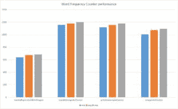

# Java 中高效的词频计算器

> 原文：<https://web.archive.org/web/20220930061024/https://www.baeldung.com/java-word-frequency>

## 1。概述

在本教程中，我们将展示用 Java 实现单词计数器的各种方法。

## 2。计数器实现

让我们从简单地计算这个数组中单词的字数开始:

```java
static String[] COUNTRY_NAMES 
  = { "China", "Australia", "India", "USA", "USSR", "UK", "China", 
  "France", "Poland", "Austria", "India", "USA", "Egypt", "China" }; 
```

如果我们想要处理巨大的文件，我们需要选择这里描述的其他选项。

### 2.1。`Map`同`Integers`

最简单的解决方案之一是创建一个`Map`，将单词存储为键，将出现的次数存储为值:

```java
Map<String, Integer> counterMap = new HashMap<>();

for (String country : COUNTRY_NAMES) { 
    counterMap.compute(country, (k, v) -> v == null ? 1 : v + 1); 
}

assertEquals(3, counterMap.get("China").intValue());
assertEquals(2, counterMap.get("India").intValue());
```

我们简单地使用了`Map`的便利的`compute`方法，如果键不存在，该方法递增计数器或者用 1 初始化它。

然而，**这种创建计数器的方法效率不高，因为`Integer`是不可变的，所以每当我们递增计数器时，我们就创建一个新的`Integer`对象。**

### 2.2。流 API

现在，让我们利用 Java 8 流 API、并行`Streams`和 [`groupingBy` ()](/web/20221003190704/https://www.baeldung.com/java-groupingby-collector) 收集器:

```java
@Test
public void whenMapWithLambdaAndWrapperCounter_runsSuccessfully() {
    Map<String, Long> counterMap = new HashMap<>();

    Stream.of(COUNTRY_NAMES)
      .collect(Collectors.groupingBy(k -> k, ()-> counterMap,
	    Collectors.counting());

    assertEquals(3, counterMap.get("China").intValue());
    assertEquals(2, counterMap.get("India").intValue());
} 
```

类似地，我们可以使用一个`parallelStream`:

```java
@Test
public void whenMapWithLambdaAndWrapperCounter_runsSuccessfully() {
    Map<String, Long> counterMap = new HashMap<>();

    Stream.of(COUNTRY_NAMES).parallel()
      .collect(Collectors.groupingBy(k -> k, ()-> counterMap,
	    Collectors.counting());

    assertEquals(3, counterMap.get("China").intValue());
    assertEquals(2, counterMap.get("India").intValue());
} 
```

### 2.3。`Map`用一个`Integer`数组

接下来，让我们使用一个`Map`，它将一个计数器包装在一个用作值的`Integer`数组中:

```java
@Test
public void whenMapWithPrimitiveArrayCounter_runsSuccessfully() {
    Map<String, int[]> counterMap = new HashMap<>();

    counterWithPrimitiveArray(counterMap);

    assertEquals(3, counterMap.get("China")[0]);
    assertEquals(2, counterMap.get("India")[0]);
}

private void counterWithPrimitiveArray(Map<String, int[]> counterMap) {
    for (String country : COUNTRY_NAMES) {
        counterMap.compute(country, (k, v) -> v == null ? 
          new int[] { 0 } : v)[0]++;
    }
} 
```

请注意我们是如何创建一个简单的以 `int arrays`为值的`HashMap`的。

在`counterWithPrimitiveArray`方法中，当迭代数组的每个值时，我们:

*   通过将国家名称作为一个键传递来调用`counterMap`上的`get`
*   检查密钥是否已经存在。如果条目已经存在，我们用单个“1”创建一个原始整数数组的新实例。如果条目不存在，我们增加数组中的计数器值

这种方法比包装器实现–**更好，因为它创建的对象更少。**

### 2.4。`Map`同`MutableInteger`

接下来，让我们创建一个封装器对象，它嵌入了一个原始整数计数器，如下所示:

```java
private static class MutableInteger {
    int count = 1;

    public void increment() {
        this.count++;
    }

    // getter and setter
} 
```

让我们看看如何利用上面的类作为计数器:

```java
@Test
public void whenMapWithMutableIntegerCounter_runsSuccessfully() {
    Map<String, MutableInteger> counterMap = new HashMap<>();

    mapWithMutableInteger(counterMap);

    assertEquals(3, counterMap.get("China").getCount());
    assertEquals(2, counterMap.get("India").getCount());
}
private void counterWithMutableInteger(
  Map<String, MutableInteger> counterMap) {
    for (String country : COUNTRY_NAMES) {
        counterMap.compute(country, (k, v) -> v == null 
          ? new MutableInteger(0) : v).increment();
    }
}
```

在`mapWithMutableInteger`方法中，当迭代`COUNTRY_NAMES`数组中的每个国家时，我们:

*   通过将国家名称作为键传递来调用对`counterMap`的 get
*   检查密钥是否已经存在。如果没有条目，我们创建一个`MutableInteger`的实例，将计数器值设置为 1。如果国家出现在地图上，我们增加出现在`MutableInteger`中的计数器值

这种创建计数器的方法优于前面的方法-**,因为我们重用了同一个`MutableInteger`,从而创建了更少的对象。**

这就是 Apache Collections `HashMultiSet`的工作方式，它在内部嵌入一个值为`MutableInteger` 的`HashMap`。

## 3。性能分析

这张图表比较了上面列出的每种方法的性能。
[](/web/20221003190704/https://www.baeldung.com/wp-content/uploads/2017/12/WordFrequencyCounter.jpg)

上面的图表是使用 JMH 创建的，下面是创建上面的统计数据的代码:

```java
Map<String, Integer> counterMap = new HashMap<>();
Map<String, MutableInteger> counterMutableIntMap = new HashMap<>();
Map<String, int[]> counterWithIntArrayMap = new HashMap<>();
Map<String, Long> counterWithLongWrapperMap = new HashMap<>();

@Benchmark
public void wrapperAsCounter() {
    counterWithWrapperObject(counterMap);
}

@Benchmark
public void lambdaExpressionWithWrapper() {
    counterWithLambdaAndWrapper(counterWithLongWrapperMap );
}

@Benchmark
public void parallelStreamWithWrapper() {
    counterWithParallelStreamAndWrapper(counterWithLongWrapperStreamMap);
}

@Benchmark
public void mutableIntegerAsCounter() {
    counterWithMutableInteger(counterMutableIntMap);
}

@Benchmark
public void mapWithPrimitiveArray() {
   counterWithPrimitiveArray(counterWithIntArrayMap);
} 
```

## 4。结论

在这篇简短的文章中，我们举例说明了使用 Java 创建单词计数器的各种方法。

这些例子的实现可以在 GitHub 项目中找到——这是一个基于 Maven 的项目，所以应该很容易导入和运行。