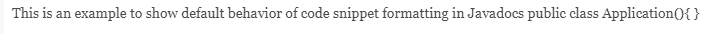
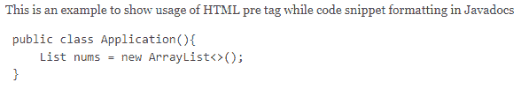
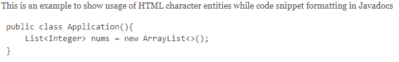
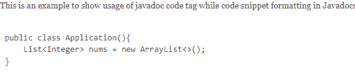
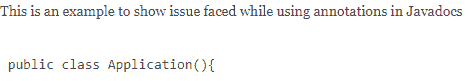
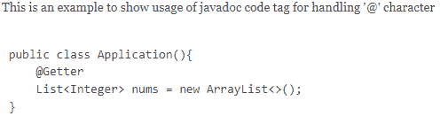
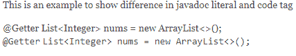
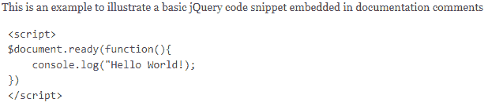
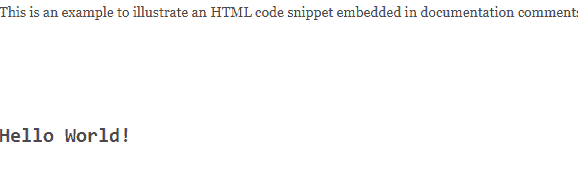

# Javadoc 注释中的多行代码示例

> 原文：<https://web.archive.org/web/20220930061024/https://www.baeldung.com/javadoc-multi-line-code>

## 1.概观

在本教程中，我们将探索格式化 Javadoc 注释的不同方法。我们将**重点分析作为文档注释编写的代码片段**的格式。

## 2.介绍

Javadoc 是一个为 Java 类生成文档的工具。它**处理 Java 源文件中指定的文档注释，并生成相应的 HTML 页面**。

请参考我们的文章来了解更多关于 [Javadoc 文档](/web/20220627185125/https://www.baeldung.com/javadoc)的信息。

## 3.作为 Javadoc 注释的代码片段

我们可以将代码片段作为 Java 类文档注释的一部分。我们希望在生成的 HTML 页面上查看具有正确缩进和字符的代码片段。

让我们尝试添加一个 Java 代码片段作为我们注释的一部分:

```java
/**
* This is an example to show default behavior of code snippet formatting in Javadocs
* 
* public class Application(){
* 
* }
* 
*/
```

相应的 HTML 页面:

[](/web/20220627185125/https://www.baeldung.com/wp-content/uploads/2021/12/Javadoc-Default.png)

**默认情况下，Javadoc 注释**中不保留换行符和空格。这会导致不正确的缩进，尤其是在多行代码片段的情况下。

让我们找到一种方法来保持我们评论中正确的缩进。

### 3.1.使用`<pre>`标签

HTML 提供了`<pre>`标签来表示预先格式化的文本。**它保留了包含文本的空格和换行符**，从而保留了代码片段所需的缩进:

```java
/**
* This is an example to show usage of HTML pre tag while code snippet formatting in Javadocs
* 
* <pre>
* public class Application(){
*     List<Integer> nums = new ArrayList<>();
* }
* 
* </pre>
*/
```

相应的 HTML 页面:

[](/web/20220627185125/https://www.baeldung.com/wp-content/uploads/2021/12/Javadoc-PRE.png)

在这里，我们成功地保留了代码片段所需的空格和换行符。不过，我们现在遇到了一个不同的问题:我们看不到作为代码片段的一部分输入的`[Generics](/web/20220627185125/https://www.baeldung.com/java-generics)` 。

当注释被解析成 HTML 页面时，**部分代码片段可能会被误解为 HTML 标签**，就像上面例子中的`<Integer>`。

让我们探索一下如何保持嵌入评论中的 HTML 字符的正确格式。

### 3.2.使用 HTML `Character`实体

如果我们的代码片段包含 HTML 保留字符，如“`<`”、“`>`”或“`&`”，在解析注释时，这些字符会被解释为 HTML 字符。为了保留这些字符，**我们可以使用`Character`实体**来代替所需的字符。

比如我们可以用&lt；表示'`<`'字符:

```java
/**
* This is an example to show usage of HTML character entities while code snippet formatting in Javadocs
* 
* <pre>
* public class Application(){
*     List<Integer> nums = new ArrayList<>();
* }
* 
* </pre>
*/
```

相应的 HTML 页面:

[](/web/20220627185125/https://www.baeldung.com/wp-content/uploads/2021/12/Javadoc-CharacterEntities.png)

### 3.3.使用`@code`标签

J avadoc 提供了一个`@code`标签，该标签**将括号内嵌入的注释视为源代码，而不是 HTML 字符**。这使我们能够直接使用 HTML 保留字符，而不用使用`Character`实体:来转义它们

```java
/**
* This is an example to show usage of javadoc code tag while code snippet formatting in Javadocs
* 
* <pre>
* 
* public class Application(){
*     {@code List<Integer> nums = new ArrayList<>(); }
* }
*
* </pre>
*/
```

相应的 HTML 页面:

[](/web/20220627185125/https://www.baeldung.com/wp-content/uploads/2021/12/Javadoc-Code-Tag.png)

请注意， **`@code`标签没有解决我们评论中涉及的**缩进问题。为此，我们需要额外使用`<pre>`标签。

正如我们在上面看到的， **Javadoc 使用“`@`”字符**来识别标签。如果我们在代码片段中使用了'【T1]'，Javadoc 会误解它，导致注释的不正确呈现。

让我们看一个例子:

```java
/**
* This is an example to show issue faced while using annotations in Javadocs
* 
* <pre>
* 
* public class Application(){
*            @Getter
*     {@code List<Integer> nums = new ArrayList<>(); }
* }
*
* </pre>
*/
```

对应的 HTML 页面:

[](/web/20220627185125/https://www.baeldung.com/wp-content/uploads/2021/12/Javadoc-Annotation-Issue.png)

正如我们所看到的，Javadoc 将`@Getter`作为一个标签处理，并且注释没有被正确呈现。我们可以**在 Javadoc:** 提供的`@code`标签中嵌入注释(或使用`@`字符的代码)

```java
/**
* This is an example to show usage of javadoc code tag for handling '@' character
* 
* <pre>
* 
* public class Application(){
*     {@code @Getter}
*     {@code List<Integer> nums = new ArrayList<>(); }
* }
*
* </pre>
*/
```

相应的 HTML 页面:

[](/web/20220627185125/https://www.baeldung.com/wp-content/uploads/2021/12/Javadoc-Annotations-Code-Tag.png)

### 3.4.使用`@literal`标签

我们也可以通过使用`@literal`标签来实现**类似的行为。`@code`标签和`@literal`标签之间的唯一区别是 **`@code`标签将包含的文本格式化为代码字体** :**

```java
/**
* This is an example to show difference in javadoc literal and code tag
* 
* <p>
* 
* {@literal @Getter}
* {@literal List<Integer> nums = new ArrayList<>(); }
*   
* <br />
* {@code @Getter}
* {@code List<Integer> nums = new ArrayList<>(); }
* </p>
*/
```

相应的 HTML 页面:

[](/web/20220627185125/https://www.baeldung.com/wp-content/uploads/2021/12/Javadoc-Literal-Vs-Code-Tag.png)

因此，我们在 HTML 页面上正确地呈现了我们的代码片段。

### 3.5.格式化 jQuery 代码片段

这里，我们举了一个 Java 代码片段的例子。同样的功能也适用于任何其他语言。

让我们包含一个简单的 jQuery 代码片段作为文档注释:

```java
/**
* This is an example to illustrate a basic jQuery code snippet embedded in documentation comments
* <pre>
* {@code <script>}
* $document.ready(function(){
*     console.log("Hello World!);
* })
* {@code </script>}
* </pre>
*/
```

相应的 HTML 页面:

[](/web/20220627185125/https://www.baeldung.com/wp-content/uploads/2021/12/Javadoc-jQuery-Code.png)

### 3.6.格式化 HTML 代码段

到目前为止，我们已经意识到，一方面，Javadoc 使我们能够使用 HTML 标记来格式化我们的注释，而另一方面，当我们想要使用没有标记的 HTML 字符时，它也会导致问题。

例如，我们可能想在注释中插入 HTML 代码片段。

让我们插入一个 HTML 代码片段作为我们文档注释的一部分，看看它的表现如何:

```java
/**
* This is an example to illustrate an HTML code snippet embedded in documentation comments
* <pre>
* <html>
* <body>
* <h1>Hello World!</h1>
* </body>
* </html>
* </pre>
* 
*/
```

相应的 HTML 页面:

[](/web/20220627185125/https://www.baeldung.com/wp-content/uploads/2021/12/Javadoc-HTML-Code-Snippet.png)

在这里，我们可以看到嵌入在注释中的代码片段已经被**解析成一个带有 HTML 标记的 HTML 页面**。我们可以**使用上面讨论的`@code`标签**来修复这个问题:

```java
/**
* This is an example to illustrate an HTML code snippet embedded in documentation comments
* <pre>{@code
* <html>
* <body>
* <h1>Hello World!</h1>
* </body>
* </html>}
* </pre>
* 
*/
```

相应的 HTML 页面:

[](/web/20220627185125/https://www.baeldung.com/wp-content/uploads/2021/12/Javadoc-HTML-Code-Snippet-Fixed.png)

## 4.结论

我们已经探索了格式化 Javadoc 注释的不同方法。**我们可以根据自己的需求选择格式化选项，生成格式良好的文档。**

我们可以使用 HTML 标签来增强 Javadoc 注释的格式，也可以根据我们的需要对它们进行转义。