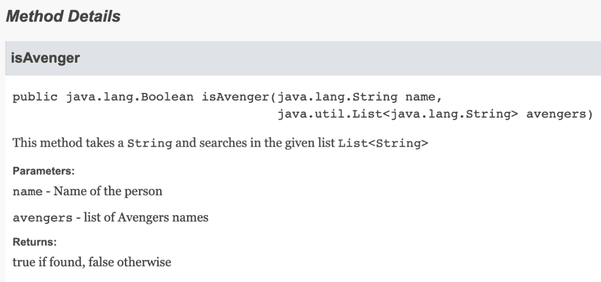
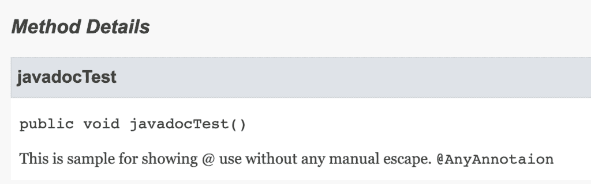
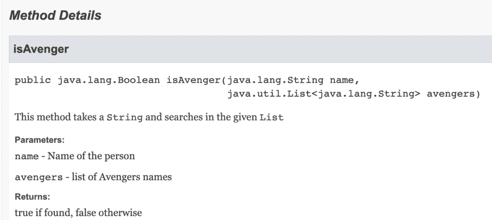

# 在 Javadoc 中添加对方法参数的引用

> 原文：<https://web.archive.org/web/20220930061024/https://www.baeldung.com/javadoc-reference-method-parameter>

## 1.概观

在 Java 语言中，我们可以使用 [Javadoc](/web/20221208143830/https://www.baeldung.com/javadoc) 从 Java 源代码生成 HTML 格式的文档。在本教程中，我们将学习在 Javadoc 中添加方法参数引用的不同方法。

## 2.向方法参数添加引用的不同方式

在这一节中，我们将讨论在 Javadoc 中添加对方法参数的引用。我们将看到内联标签`{@code}`和 HTML 样式标签`</co` `de>` 在 Javadoc 中的用法。

此外，我们将看到` {@code}`和`<code>`标签如何处理一些特殊情况:

*   显示特殊字符“”和“@”
*   缩进和换行
*   处理 HTML 代码的转义，例如，

### 2.1.`{@code}`标签

`{@code text}`是一个内嵌标签，包含在 [JDK 1.5](https://web.archive.org/web/20221208143830/https://docs.oracle.com/javase/7/docs/technotes/guides/javadoc/whatsnew-1.5.0.html) 中。

标签格式化代码字体中的文字文本。`{@code abc}`相当于`<code>{@literal abc}</code>`。

**我们不需要手动转义任何在`{@code}`标签中使用的特殊字符。**

当我们使用`{@code}`标签时，它:

*   正确显示''
*   正确显示“@”
*   不需要通过 HTML 数字代码对特殊字符进行转义
*   可读性更强，更简洁

让我们在类中创建一个简单的方法，并使用`{@code}`标签添加一些 Javadoc:

```java
/**
  * This method takes a {@code String} 
  * and searches in the given list {@code List<String>}
  * 
  * @param name
  *        Name of the person
  * @param avengers
  *        list of Avengers names
  * @return true if found, false otherwise
  */
public Boolean isAvenger(String name, List<String> avengers) {
    return avengers.contains(name);
} 
```

**在这里，我们可以看到，我们不需要对特殊字符“<”和“>”进行转义。**

生成的 Javadoc 会将 HTML 输出呈现为:

**[](/web/20221208143830/https://www.baeldung.com/wp-content/uploads/2021/09/method1-1024x482-1.png)**

**同样，我们可以看到我们不需要对' @ '字符进行转义:**

```java
/**
  * This is sample for showing @ use without any manual escape.
  * {@code @AnyAnnotaion}
  * 
  */
public void javadocTest() {
} 
```

这会将 HTML Javadoc 呈现为:

[](/web/20221208143830/https://www.baeldung.com/wp-content/uploads/2021/09/method2-1024x320-1.png)

对于 Javadoc 中的多行代码片段，`{@code}`不会保持缩进和换行符。为了克服这个问题，我们可以使用 HTML 标签`<pre>`和`{@code}`。但是，在这种情况下，我们需要对' @ '字符进行转义。

### 2.2.`<code>`标签

`<code>`是 Javadoc 支持的 HTML 样式标签。

当我们使用`<code>`标签时，它:

*   未正确显示''
*   要求通过 HTML 数字代码转义特殊字符
*   可读性不是很好

让我们再次考虑同一个例子。我们可以看到**生成的 Javadoc HTML 在我们的段落**中的`List`后缺少了`<String>`参数化类型:

```java
/**
  * This method takes a <code>String</code>
  * and searches in the given <code>List<String></code>
  * 
  * @param name
  *        Name of the person
  * @param avengers
  *        list of Avengers names
  * @return true if found, false otherwise
  */
public Boolean isAvenger(String name, List<String> avengers) {
    return avengers.contains(name);
} 
```

[](/web/20221208143830/https://www.baeldung.com/wp-content/uploads/2021/09/method3-1024x459-1.png) 
在这里，如果我们在我们的方法注释中对特殊字符'<'和'>'进行转义，那么它将在 Javadoc 中呈现正确的`<String>`:

```java
/**
  * This method takes a <code>String</code>
  * and searches in the given <code>List<String></code>
  * 
  * @param name
  *        Name of the person
  * @param avengers
  *        list of Avengers names
  * @return true if found, false otherwise
  */
public Boolean isAvenger(String name, List<String> avengers) {
    return avengers.contains(name);
} 
```

[](/web/20221208143830/https://www.baeldung.com/wp-content/uploads/2021/09/method4-1024x482-1.png)

## 3.结论

在本教程中，我们首先讨论了如何使用`{@code}`和`<code>`来引用 Javadoc 中的方法参数。然后我们描述了这些标签对特殊字符的处理。总之，我们现在了解了如何在 Javadoc 中添加对方法参数的引用，并且**我们可以看到 `{@code}` 比`<code>`** 更好。