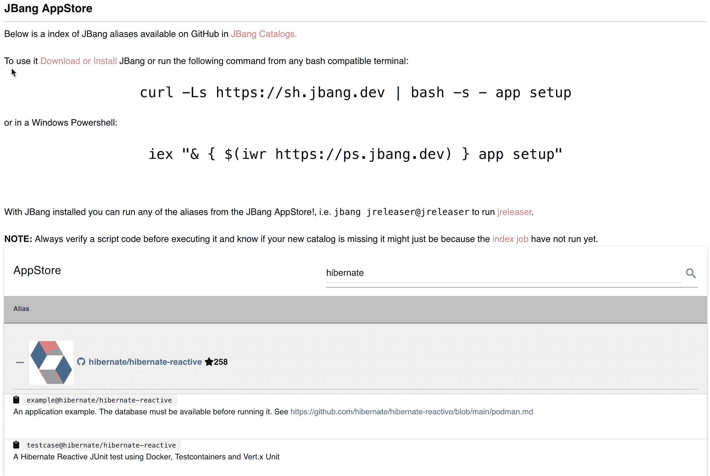

# JBang 指南

> 原文：<https://web.archive.org/web/20220930061024/https://www.baeldung.com/jbang-guide>

## 1.介绍

在本教程中，我们来看看 [JBang](https://web.archive.org/web/20221208073738/https://www.jbang.dev/) 。

JBang 让学生、教育工作者和专业开发人员**以前所未有的轻松创建、编辑和运行独立的纯源代码或二进制 Java 程序**。JBang 的目标是减少甚至**消除每个人在 Java 周围都习以为常的仪式和繁琐的设置**。

我们可以让 JBang 只需**一次下载和一个命令就能创建、编辑和运行 Java** ，就像 Python、JavaScript、PHP 和类似的语言一样简单。

从表面上看，JBang 看起来像 Java 11 中引入的 Launch 单文件源代码特性。然而，JBang 通过**支持使用来自任何 Maven 兼容库**的依赖项的多个文件而超越了这一点，并且它可以与最近发布的 **Java 17 以及更高版本**的 **Java 8** 一起工作。

## 2.安装 JBang

首先要做的是安装 JBang。

我们可以为我们的操作系统使用我们选择的软件包管理器，或者使用更通用的基于`curl/iex`的下载。我们可以在 jbang.dev/download 找到所有主要操作系统的下载说明。在本指南中，我们将使用通用方法:

在带有 bash 兼容 shell 的 Linux、Mac 或 Windows 上，我们可以使用 curl:

```java
curl -Ls https://sh.jbang.dev | bash -s - app setup
```

或者在使用 PowerShell 的 Windows 上，我们可以使用 iex:

```java
iex "& { $(iwr https://ps.jbang.dev) } app setup"
```

在这两种情况下，当在新系统上运行时，会打印出如下内容:

```java
$ curl -Ls https://sh.jbang.dev | bash -s - app setup
Downloading JBang...
Installing JBang...
Downloading JDK 11\. Be patient, this can take several minutes...
Installing JDK 11...
[jbang] Default JDK set to 11
[jbang] Setting up Jbang environment...
Please start a new Shell for changes to take effect
```

我们会注意到我们不需要安装 Java 来开始——JBang 会在需要的时候从 adoptopenjdk(现在的 Eclipse Adoptium)下载一个 Java 开发包(JDK)。

要检查 JBang 安装是否正确，启动一个新的 shell 并运行 `jbang version.` JBang 将打印出版本信息(注意:JBang 经常发布，所以版本可能已经更高了):

```java
$ jbang version
0.83.1
```

现在我们准备开始使用 JBang 了。

## 3.我们的第一个 Java(脚本)

为了**创建我们的第一个 Java 文件，我们可以使用 `jbang init`** :

```java
$ jbang init hello.java
[jbang] File initialized. You can now run it with 'jbang hello.java' or edit it using 'jbang edit --open=[editor] hello.java' where [editor] is your editor or IDE, e.g. 'netbeans'

```

如果我们的 shell 允许，我们现在可以用`jbang hello.java`或`./hello.java`来运行它。让我们试着运行两次:

```java
./hello.java
[jbang] Building jar...
Hello World
❯ ./hello.java
Hello World
```

我们开始了——创建和运行 java，而不需要设置构建工具，甚至不需要编译。全部由 JBang 处理。注意它是如何首先打印“Building jar”而不是第二次。第二次它只是打印“Hello World”。

JBang 第二次重用已经构建好的 jar 时，源代码没有改变。

让我们使它更令人兴奋，并创建一个使用外部依赖的 java 文件。我们可以使用模板来实现:

```java
jbang init -t cli hellocli.java
```

`cli`是可用的默认模板之一。通过运行 `jbang template list`，我们可以看到可供使用的列表:

```java
$ jbang template list
agent = Agent template
cli = CLI template
hello = Basic Hello World template
hello.kt = Basic kotlin Hello World template
qcli = Quarkus CLI template
qmetrics = Quarkus Metrics template
qrest = Quarkus REST template
```

当我们运行我们创建的 hellocli.java 时，我们应该看到它获取 Picocli 依赖项并使用我们传入的参数:

```java
$ jbang hellocli.java Baeldung
[jbang] Resolving dependencies...
[jbang]     Resolving info.picocli:picocli:4.5.0...Done
[jbang] Dependencies resolved
[jbang] Building jar...
Hello Baeldung
```

如果我们再次运行它，它不需要再次解决依赖关系，因为我们没有编辑源代码。

## 4.JBang 评论

现在，如果我们看看 hello.java 或 hellocli.java，我们会看到它只是一个普通的 java 类:

```java
///usr/bin/env jbang "$0" "[[email protected]](/web/20221208073738/https://www.baeldung.com/cdn-cgi/l/email-protection)" ; exit $?
//DEPS info.picocli:picocli:4.5.0

import picocli.CommandLine;
import picocli.CommandLine.Command;
import picocli.CommandLine.Parameters;

import java.util.concurrent.Callable;

@Command(name = "hellocli", mixinStandardHelpOptions = true, version = "hellocli 0.1",
        description = "hellocli made with jbang")
class hellocli implements Callable<Integer> {

    @Parameters(index = "0", description = "The greeting to print", defaultValue = "World!")
    private String greeting;

    public static void main(String... args) {
        int exitCode = new CommandLine(new hellocli()).execute(args);
        System.exit(exitCode);
    }

    @Override
    public Integer call() throws Exception { // your business logic goes here...
        System.out.println("Hello " + greeting);
        return 0;
    }
}
```

注意最初的两行以//开头，这意味着这一行是 Java 中的注释。

`///usr/bin/env jbang "$0" "[[email protected]](/web/20221208073738/https://www.baeldung.com/cdn-cgi/l/email-protection)" ; exit $?`

但是在 bash/zsh shell 中，第一行让我们直接运行这个文件。/hellocli.java。

`//DEPS info.picocli:picocli:4.5.0`

以`//DEPS`开头的第二行是一个神奇的标记行，jbang 选择它并将其用作依赖项。**依赖项使用的语法是 Gradle 等构建工具中使用的规范 maven 依赖项格式。**我们可以有多行，每行有多个依赖项，声明所有需要的依赖项。JBang 也会获取可传递的依赖关系。因此，我们只需要列出顶级的。

JBang 还会找到其他魔法标记。以下是主要的几个:

`JAVA`–指定要使用的 Java 版本，JAVA 11+表示 JAVA 11 或更高版本，JAVA 14 表示 Java 14

`JAVA_OPTIONS`–将被添加到 java 命令行，用它来设置内存设置和系统属性

`JAVAC_OPTIONS`–将为 javac 编译命令添加。使用它来启用预览或其他标志。

JBang 文档中有更多的例子。

## 5.编辑

现在我们理解了 JBang 从文件中读取什么来使事情工作。那么，我们如何编辑这样一个. java 文件，并拥有传统的基于 Java 的编辑器所具有的内容辅助、重构和其他有价值的特性呢？

答案是`jbang edit`。JBang 将准备一个象征性链接的项目，大多数支持 Java 的现代编辑器都可以打开这个项目。如果我们以`jbang edit hellocli.java,`的身份运行它，JBang 会询问它是否应该下载并配置 VSCodium，以便在没有任何手动设置的情况下开始运行。当然，如果我们喜欢的 IDE 在路径中可用，即 Intellij IDEA，我们可以运行`jbang edit –open=idea hellocli.java`，JBang 将改为通过`idea`打开。

## 6.多个文件

到目前为止，我们只处理了一个文件；当我们有多个文件时怎么办？ **JBang 处理多个源文件和任意资源(比如。html 文件)**这两个命令是`//SOURCES`和`//FILES`。

要包含特定的源文件，使用 `//SOURCE myfile.java`要包含所有的 java 源文件，使用 `//SOURCE **/*.java`。

对于资源，语法是`//FILES <mountpoint>[=<sourcefile>]`。

```java
//FILES resource.properties
//FILES META-INF/resources/index.html=index.html
```

这里`resource.properties`将被原样复制，`META-INF/resources/index.html`从`index.html`获取其内容。

All locations are relative to the script location.

下面是一个包含多个文件的最小但完整的工作示例:

```java
///usr/bin/env jbang "$0" "[[email protected]](/web/20221208073738/https://www.baeldung.com/cdn-cgi/l/email-protection)" ; exit $?
// Update the Quarkus version to what you want here or run jbang with
// `-Dquarkus.version=<version>` to override it.
//DEPS io.quarkus:quarkus-bom:${quarkus.version:2.4.0.Final}@pom
//DEPS io.quarkus:quarkus-resteasy
//JAVAC_OPTIONS -parameters

//FILES META-INF/resources/index.html=index.html

import javax.enterprise.context.ApplicationScoped;
import javax.ws.rs.GET;
import javax.ws.rs.Path;

@Path("/hello")
@ApplicationScoped
public class jbangquarkus {
    @GET
    public String sayHello() {
        return "Hello from Quarkus with jbang.dev";
    }
} 
```

这个例子也展示了 JBang 与 [Quarkus](https://web.archive.org/web/20221208073738/https://quarkus.io/) 的整合。通过使用 Quarkus 作为一个依赖项，这个例子可以在 [http://localhost:8080](https://web.archive.org/web/20221208073738/http://localhost:8080/) 提供一个索引页面，在[http://localhost:8080/hello](https://web.archive.org/web/20221208073738/http://localhost:8080/hello)提供一个 REST 端点。

有了它，我们可以使用 JBang 和任何基于 Java 的框架来构建小脚本和成熟的微服务，甚至是应用程序。

## 7.共享代码

我们现在可以编写、运行和编辑基于 JBang 的应用程序，但是共享代码让其他人也能运行呢？

使用`jbang export`创建一个 jar，我们可以像其他 Java 应用程序一样共享它。更有趣的是使用 GitHub、Gitlab、BitBucket 等进行分享。

**JBang 支持运行位于某个 URL 的源代码，并了解其背后是何种服务**。例如，要运行上面的 JBang Quarkus 示例，我们可以直接从源代码库中运行它:

`jbang https://github.com/eugenp/tutorials/blob/jbangguide/jbang/jbangquarkus.java`

JBang 将计算出需要下载、编译和运行的多个文件，就像我们之前处理本地文件一样。

这样，我们可以快速试用他人的代码或与他人分享。**无需打包设置——JBang 天生支持轻松共享**。

### 7.1.别名

URL 可能很难键入。幸运的是，我们也可以使用别名，也就是说， `jbang alias add https://github.com/eugenp/tutorials/blob/jbangguide/jbang/jbangquarkus.java`会让您将它用作`jbang jbangquarkus`。

默认情况下，JBang 会为当前用户全局安装这些别名。不过，也可以使用`-f,`将它们添加到一个特定的目录，因此它只适用于这个目录及其子目录。

`jbang alias add -f . https://github.com/eugenp/tutorials/blob/jbangguide/jbang/jbangquarkus.java`

非常适合添加特定于项目的命令。可以共享的命令不依赖也不需要编写 Gradle 或 Maven 插件。

这些别名存储在 jbang-catalog.json 文件中，我们可以将它们添加到任何地方，并从任何地方托管它们。

### 7.2.应用安装

别名引出了除 Java 之外的大多数其他流行生态系统中的另一个有用的命令:安装脚本/应用程序。想想`npm install`、`pip install`等。

对于 JBang，它被称为`jbang app install,`,可以与本地和远程 JBang 脚本和 jar 一起工作。

例如，要安装我们的 hello.java:

`jbang app install hello.java`

现在，我们的路径中添加了一个“hello”命令。

遥控器`jbangquarkus.java`也是如此:

`jbang app install https://github.com/eugenp/tutorials/blob/jbangguide/jbang/jbangquarkus.java`

当您运行这样一行时，它将使路径上一个名为`jbangquarkus`的命令可用。

也适用于别名。

如前所述，**别名可以在任何地方**存储和共享，因此为了能够找到它， **aliasesjbang.dev 在`https://jbang.dev/apppstore`** 托管一个 JBang AppStore。在这里，我们可以搜索和查找通过`jbang-catalog.json`文件发布的脚本:

[](/web/20221208073738/https://www.baeldung.com/wp-content/uploads/2021/12/jbang-appstore.png)

因此，如果我们制作一个`jbang-catalog.json,`,它的内容和描述将显示在这里。尝试搜索“eugenp”并找到本文中使用的脚本。

## 8.结论

在本文中，我们安装了 JBang，让我们可以前所未有地轻松创建、编辑、构建、运行和安装 Java 应用程序和脚本。
**从 Java** 开始，不需要任何关于 Maven 或 Gradle 的设置或预先存在的知识。当我们更进一步时，JBang 支持使用 Maven 坐标来获取依赖项，允许我们使用来自庞大 Java 生态系统的任何东西，包括 Spring 和 Quarkus 等运行时框架，甚至 JavaFX 等图形框架。

JBang 可以与任何现代 IDE 一起工作，支持多个文件，并且理解 URL 背后的内容，允许轻松发布和共享运行 jar 的源代码和别名。

JBang 的网站上有文档和应用商店。

本教程中的例子可以在 GitHub 的[中找到。](https://web.archive.org/web/20221208073738/https://github.com/eugenp/tutorials/tree/master/jbang)