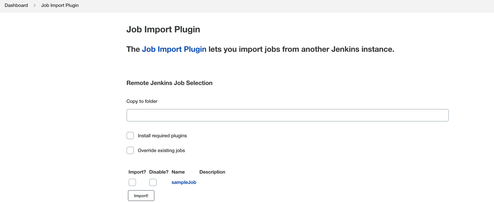

# 詹金斯的出口/进口工作

> 原文：<https://web.archive.org/web/20220930061024/https://www.baeldung.com/ops/jenkins-export-import-jobs>

## 1.概观

Jenkins 是一个开源的 CI/CD 自动化工具，用于交付任何平台的项目。在本教程中，我们将学习在两台不同的计算机之间导出和导入 Jenkins 作业。

首先，我们将在 Docker 容器中启动 Jenkins 服务器。稍后，我们将使用[作业导入插件](https://web.archive.org/web/20221010124232/https://plugins.jenkins.io/job-import-plugin/)和 Jenkins XML 配置将作业从源机器导出到目标机器。

## 2.**初始设置**

在开始之前，让我们先为演示创建一个设置。这里，设置包括两个 Linux 虚拟机、一个源机器和一个目标机器。自然，在 Linux 中安装 Jenkins 有[种不同的方法。通常，最简单的方法是一个](/web/20221010124232/https://www.baeldung.com/linux/jenkins-install-run) [Docker 容器](/web/20221010124232/https://www.baeldung.com/ops/docker-guide)。当然，Jenkins 服务器必须在两台机器上运行。

此外，我们需要一个样本工作来导出和导入。要创建作业，我们需要遵循几个步骤:

1.  点击 Jenkins 仪表盘上的`New Item`
2.  设置一个作业名(我们用`sampleJob`)
3.  选择工作类型(我们使用`Freestyle project)`
4.  保存作业

以上步骤将在源 Jenkins 机器上创建一个基本作业。

## 3.詹金斯的出口/进口工作

无论如何，Jenkins 的作业可以通过多种方式转移到不同的服务器上。然而，**为了将 Jenkins 作业文件从一个实例迁移到另一个实例，我们需要确保源和目标机器之间的正确连接**。

### 3.1.使用作业导入插件

在 Jenkins 中，作业导入插件允许我们迁移作业。事实上，所有插件都可以从 Jenkins UI 管理和安装。当然，我们在目标机器上安装作业导入插件。

现在，为了导入作业，我们必须对目标 Jenkins 机器的配置进行更改。首先，从 Jenkins 仪表板，我们转到`Manage Jenkins` > `Configure System`。接下来，我们向下滚动到`Job Import Plugin`部分。

[](/web/20221010124232/https://www.baeldung.com/wp-content/uploads/2022/08/Screenshot-2022-08-06-at-8.49.32-PM.png)

这里，我们将添加源 Jenkins 机器的 URL 和凭证。
[](/web/20221010124232/https://www.baeldung.com/wp-content/uploads/2022/08/Screenshot-2022-08-06-at-8.52.25-PM.png) 
在这里，我们填入所有相关的值，然后保存并应用更改。

最后，我们将在 Jenkins 仪表板的左侧导航栏中获得一个`Job Import Plugin`项目。点击它，我们可以看到插件提供的选项。

[](/web/20221010124232/https://www.baeldung.com/wp-content/uploads/2022/08/Screenshot-2022-08-06-at-8.57.22-PM.png)

从此以后，我们可以通过点击`query`按钮获得源机器的所有作业。此外，当我们使用`Import`复选框时，来自源机器的作业将被导入到目标机器。

### 3.2.使用`jenkins-cli.jar`文件

此外，我们还可以使用`jenkins-cli.jar`文件迁移 Jenkins 作业。要下载`jenkins-cli.jar`，我们可以去`http://JENKINS_IP:JENKINS_PORT/jnlpJars/jenkins-cli.jar.`

此外，**要从源机器导出作业，我们需要源机器的 Jenkins 用户**的密码。这个密码在 Docker 容器的`stdout`日志中。

现在让我们看看从源机器获取`sampleJob`的配置文件的命令:

```
$ java -jar jenkins-cli.jar -s http://JENKINS_USER:[[email protected]](/web/20221010124232/https://www.baeldung.com/cdn-cgi/l/email-protection)_IP:JENKINS_PORT get-job sampleJob > sampleJob.xml
```

这里，我们有几条信息，我们需要用来自源机器的相应值来更新这些信息:

*   `JENKINS_USER`
*   `JENKINS_PASSWORD`
*   `JENKINS_IP`
*   `JENKINS_PORT`

重要的是，我们必须从`jenkins-cli.jar`所在的目录运行该命令。此外，使用`get-job`选项，我们可以获得 XML 格式的作业转储。

让我们来看看将`sampleJob.xml`导入目标机器的命令:

```
$ java -jar jenkins-cli.jar -s http://JENKINS_USER:[[email protected]](/web/20221010124232/https://www.baeldung.com/cdn-cgi/l/email-protection)_IP:JENKINS_PORT create-job sampleJob < sampleJob.xml
```

同样，需要替换这些值，但这一次是根据目标机器。

最后，上面的命令读取`sampleJob.xml`文件，并在目标机器上导入新的作业。

## 4.结论

在本文中，我们演示了如何在不同的 Jenkins 服务器上导出和导入 Jenkins 作业。首先，我们学习了使用作业导入插件导出和导入。之后，我们对`jenkins-cli.jar`文件做了同样的处理。