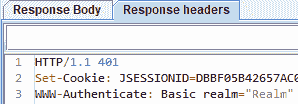
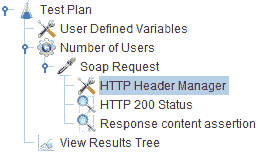
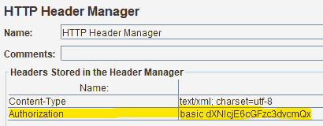
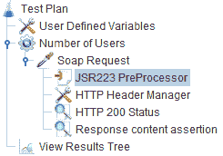
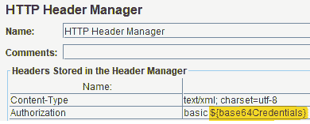
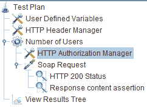
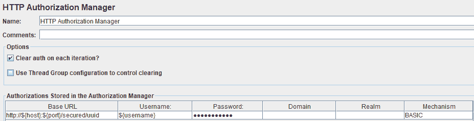
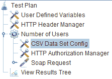
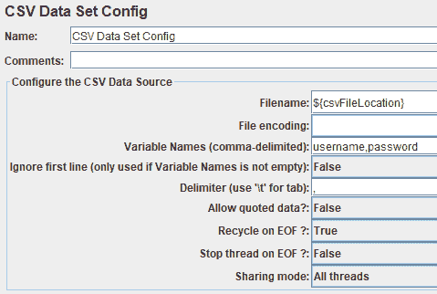

# JMeter 中的基本认证

> 原文：<https://web.archive.org/web/20220930061024/https://www.baeldung.com/jmeter-basic-auth>

## 1.概观

当我们用 JMeter 进行[性能测试时，我们可能会遇到受 HTTP 基本认证协议保护的 web 服务。](/web/20220524052013/https://www.baeldung.com/jmeter)

在本教程中，我们将看到如何配置 [Apache JMeter](https://web.archive.org/web/20220524052013/https://jmeter.apache.org/) 以在测试期间提供必要的凭证。

## 2.什么是基本身份验证？

基本身份验证是我们可以用来保护 web 资源的最简单的访问控制方法。它由客户端发送的 HTTP 报头组成:

```java
Authorization: Basic <credentials>
```

在这里，凭据被编码为用户名和密码的 Base64 字符串，由单个冒号“:”分隔。

我们可以看到，当在浏览器窗口而不是 HTML 表单中询问凭证时，使用了基本身份验证。我们可能会在浏览器中看到提示:

[](/web/20220524052013/https://www.baeldung.com/wp-content/uploads/2022/04/basicAuthenticationChrome.png)

因此，如果我们试图在安全的 web 资源上启动 JMeter 测试，响应代码将是 HTTP 401，这意味着“未授权”。我们还将收到一个“WWW-Authenticate”响应头，它将描述服务器所需的身份验证类型。在这种情况下，它将是“基本的”:

[](/web/20220524052013/https://www.baeldung.com/wp-content/uploads/2022/04/http-401-response-code.png)

## 3.在 JMeter 中实现基本认证的简单方法

### 3.1.添加一个`Authorization`标题

发送凭据的最简单方法是将凭据直接添加到请求标头中。**我们可以通过`HTTP Header Manager`组件**轻松做到这一点，它允许我们向 HTTP 请求组件发送的请求添加头部。标头管理器必须是 HTTP 请求组件的子组件:

[](/web/20220524052013/https://www.baeldung.com/wp-content/uploads/2022/04/jmeter-header-manager.png)

在`HTTP Header Manager`的配置选项卡中，我们只需添加一个密钥/值条目，其中包含我们的身份验证详细信息，并将`Authorization`作为名称:

[](/web/20220524052013/https://www.baeldung.com/wp-content/uploads/2022/04/http-header-manager-config.png)

我们可以使用[在线工具](https://web.archive.org/web/20220524052013/https://www.base64encode.org/)对我们的字符串进行编码并粘贴到标题管理器中。我们应该注意在我们的编码凭证前添加`“basic”`。

如果一切顺利，我们应该会从服务器收到 200 响应代码。

### 3.2.使用 JSR223 预处理器对凭证进行编码

如果我们希望 JMeter 为我们编码凭证，我们可以使用`JSR223 PreProcessor`组件。如果我们想要改变我们的测试计划所使用的凭证，我们将需要使用它。

我们所要做的就是在我们的`HTTP Header Manager`组件前添加一个`JSR223 PreProcessor`:

[](/web/20220524052013/https://www.baeldung.com/wp-content/uploads/2022/04/jsr223-preprocessor.png)

有了这个组件，我们可以在运行时执行脚本。我们需要提供一个脚本来检索凭证并对它们进行编码。让我们使用 Java:

```java
import org.apache.commons.codec.binary.Base64;

String username = vars.get("username");
String password = vars.get("password");
String credentials = username + ":" + password;
byte[] encodedUsernamePassword = Base64.encodeBase64(credentials.getBytes());
vars.put("base64Credentials", new String(encodedUsernamePassword));
```

我们现在应该在`User Defined Variables`组件中定义`username`和`password`变量:

[](/web/20220524052013/https://www.baeldung.com/wp-content/uploads/2022/04/User-Defined-Variables.png)

最后，在`HTTP Header Manager`组件中，我们必须设置`Authorization`头以使用编码的凭证:

[](/web/20220524052013/https://www.baeldung.com/wp-content/uploads/2022/04/HTTP-Header-Manager-Config-with-JSR223.png)

我们完事了。一切都应该工作正常，并且我们能够在用户定义的变量中轻松地更改凭证。

## 4.使用 HTTP 授权管理器

JMeter 提供了`HTTP Authorization Manager`组件来简化认证凭证的使用。**使用该组件，我们可以为多个域和认证协议提供凭证。**该组件必须是`Thread Group`的子组件，并在`HTTP Request`组件之前定义:

[](/web/20220524052013/https://www.baeldung.com/wp-content/uploads/2022/04/JMeter-Authorization-Manager.png)

在组件的“配置”选项卡中，我们必须定义用于身份验证的用户名和密码:

[](/web/20220524052013/https://www.baeldung.com/wp-content/uploads/2022/04/HTTP-Authorization-Manager-Configuration.png)

如果我们在`User Defined Variables`组件中定义了`username`和`password`，我们可以在这个选项卡中使用变量。它也适用于密码。虽然它仍然是屏蔽的，但是我们可以在`password`字段中输入`“${password}”`。

我们必须注意选择正确的`Mechanism`进行认证。这里我们就选`“BASIC”`。

就是这样！`HTTP Request`组件会自动在请求中添加一个`Authorization`头，我们应该会得到一个 HTTP 200 OK 响应代码。

## 5.在 HTTP 授权管理器中使用多个凭据

有时，我们可能希望在测试过程中使用多个凭证。例如，这可能有助于验证基于角色的访问限制。

为了配置这个测试用例，我们应该创建一个 CSV 文件，在其中我们将存储对我们的测试计划有用的凭证和其他信息。这个文件由 JMeter 中的一个`CSV Data Set Config`组件读取。该组件应该是`Thread Group`的子组件，并将在每个`Thread Group`循环中迭代 CSV 行:

[](/web/20220524052013/https://www.baeldung.com/wp-content/uploads/2022/04/CSV-Data-Set-Config-Component.png)

然后，在这个组件中，我们必须定义:

*   作为路径的文件在`User Defined Variables`组件中的位置
*   由`CSV Data Set`组件在执行后设置的`Variable Names`
*   组件是否应该忽略第一行——在 CSV 文件中有列名的情况下很有用
*   CSV 文件中使用了哪个`Delimiter`

[](/web/20220524052013/https://www.baeldung.com/wp-content/uploads/2022/04/CSV-Data-Set-Config-Tab.png)

**当在一个 CSV 文件中定义几个凭证时，我们应该注意配置我们的`Thread Group`来执行几个循环。**

有了这些设置，我们应该能够看到在我们的请求头中使用了不同的凭证。

## 6.结论

在本文中，我们研究了 HTTP 资源的基本认证是如何工作的。

我们还学习了如何在 Apache JMeter 中设置一个测试计划来使用这个协议进行身份验证。我们讨论了使用 JSR223 预处理器进行硬编码的凭证，然后从一个 CSV 文件中提供多个凭证。

和往常一样，这些例子的代码可以在 GitHub 的[上找到。](https://web.archive.org/web/20220524052013/https://github.com/eugenp/tutorials/tree/master/jmeter)