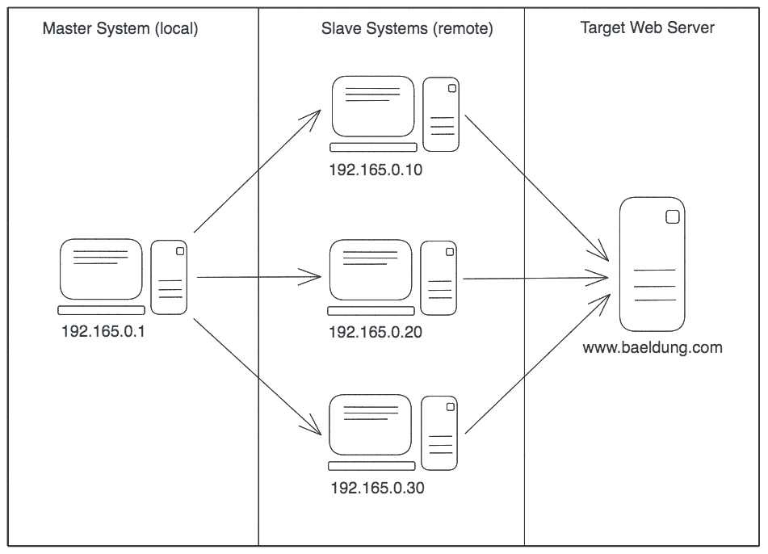
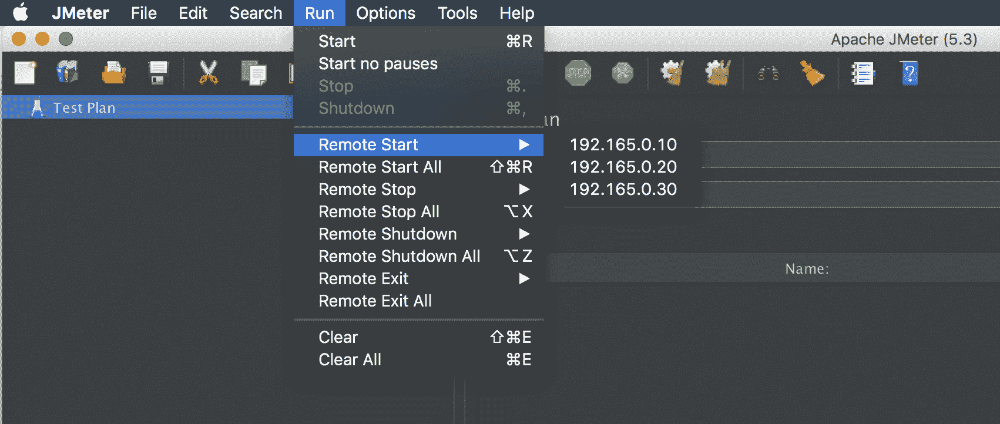
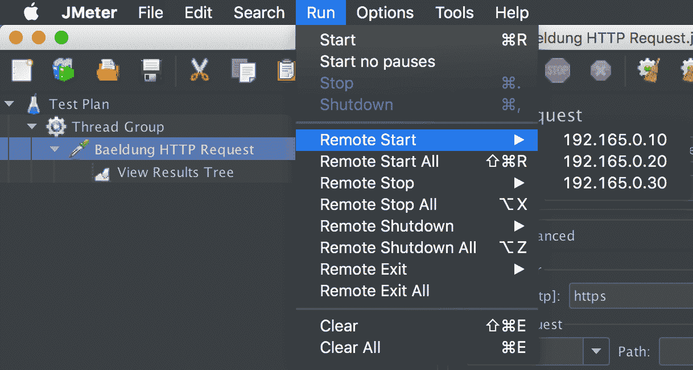
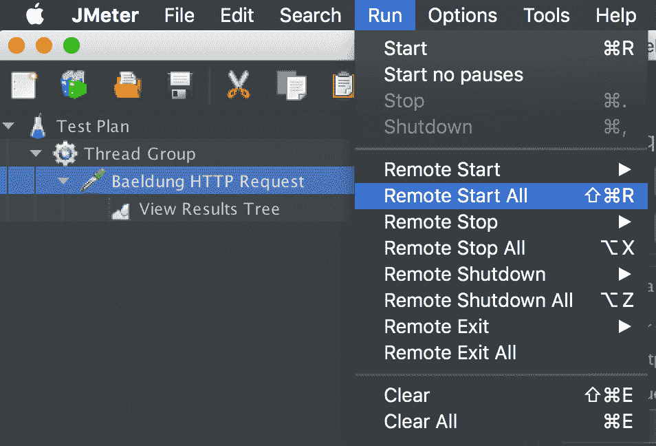
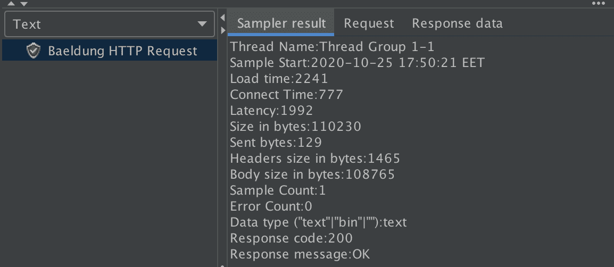

# 用 JMeter 进行分布式性能测试

> 原文：<https://web.archive.org/web/20220930061024/https://www.baeldung.com/jmeter-distributed-testing>

## 1.概观

在本文中，我们将探索使用 JMeter 的分布式[性能测试。](/web/20221208034115/https://www.baeldung.com/jmeter)

## 2.什么是分布式性能测试？

**分布式性能测试是指使用多个主从配置的系统来测试 web 应用程序或服务器的性能。**

在这个过程中，我们将使用一个本地客户机作为主客户机，它使用多个远程客户机来处理测试执行，每个远程客户机作为从客户机将在我们的目标服务器上执行测试。

每个从系统按照主系统设置的确切条件执行负载测试。因此，分布式性能测试有助于我们实现更多并发用户请求目标服务器。

简而言之，使用 JMeter 的分布式性能测试的概要如下:

[](/web/20221208034115/https://www.baeldung.com/wp-content/uploads/2020/11/jmeter_distributed.png)

## 3.设置

### 3.1.先决条件

为了顺利设置和测试运行，我们应该遵循一些先决条件:

*   每台安装了 JMeter 的多台电脑
*   系统上的防火墙已关闭，或者所需的连接端口已打开
*   所有系统(主/从)都在同一子网上
*   每个系统上的 JMeter 都可以访问目标服务器
*   在所有系统(主系统和从系统)上使用相同版本的 Java 和 JMeter
*   为了简单起见，禁用 RMI 的 SSL

现在我们已经准备好了我们的系统，让我们配置从系统和主系统。

### 3.2.配置从属系统

在从属系统上，我们将转到 `jmeter/bin`目录，并在 Windows 上执行`jmeter-server.bat`文件。或者，我们可以在 Unix 上运行`jmeter-server`文件。

### 3.3.配置主系统

在主系统上，我们将转到`jmeter/bin`目录并编辑`jmeter.properties`文件中的`remote_hosts`属性，以添加从系统的 IP 地址(用逗号分隔):

```java
remote_hosts=192.165.0.10,192.165.0.20,192.165.0.30
```

这里，我们添加了三个从属系统。

因此，通过在 GUI 模式下启动 JMeter(主设备),我们可以确认在`Run > Remote Start`选项中列出的所有从设备:

[](/web/20221208034115/https://www.baeldung.com/wp-content/uploads/2020/11/jmeter-slaves.png)

就是这样！我们准备启动 JMeter 主系统，使用多个客户机在目标服务器上执行测试。

## 4.远程测试

对于远程测试，为了简单起见，我们可以在 GUI 模式下运行 JMeter。然而，在执行实际测试时，我们应该使用 [CLI 模式运行它。](/web/20221208034115/https://www.baeldung.com/jmeter#jmeter-nongui)

首先，我们将在主系统中创建一个简单的测试计划，它包含请求 baeldung.com 服务器的`HTTP Request`采样器和一个`View Results Tree`监听器。

### 4.1.启动单个从机

然后，我们可以通过使用`Run > Remote Start`选项选择使用 GUI 模式运行哪个从系统:

[](/web/20221208034115/https://www.baeldung.com/wp-content/uploads/2020/11/jmeter-start-slave.png)

### 4.2.启动所有从属服务器

类似地，我们可以通过使用`Run > Remote Start All`选项来选择运行所有从系统:

[](/web/20221208034115/https://www.baeldung.com/wp-content/uploads/2020/11/jmeter-start-all.png)

此外，还有一些选项可以用来处理从属系统上的测试执行，比如`Remote Stop`、`Remote Stop All`和`Remote Shutdown All.`

### 4.3.试验结果

最后，一旦测试执行完成，我们可以在本地 JMeter (master)中看到测试结果:

[](/web/20221208034115/https://www.baeldung.com/wp-content/uploads/2020/11/jmeter-master-results.png)

同样，在远程 JMeter 系统(从系统)上，我们可以找到关于测试执行的开始/停止的日志:

```java
Starting the test on host 192.165.0.10 @ Sun Oct 25 17:50:21 EET 2020
Finished the test on host 192.165.0.10 @ Sun Oct 25 17:50:25 EET 2020
```

## 5.结论

在这个快速教程中，我们已经看到了如何开始使用 JMeter 进行分布式性能测试。

首先，我们查看了顺利设置和测试运行的一些先决条件。然后，我们为分布式性能测试环境配置了我们的从系统和主系统。

最后，我们启动从系统，从主系统运行测试，并观察结果。