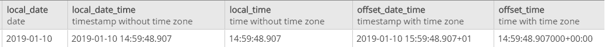

# JPA 2.2 支持 Java 8 日期/时间类型

> 原文：<https://web.archive.org/web/20220930061024/https://www.baeldung.com/jpa-java-time>

## 1。概述

JPA 2.2 版本已经正式引入了对 [Java 8 `Date`和`Time` API](/web/20221206032053/https://www.baeldung.com/java-8-date-time-intro) 的支持。在此之前，我们要么必须依赖专有的解决方案，要么必须使用 JPA Converter API。

在本教程中，**我们将展示如何映射各种 Java 8 `Date`和`Time`类型**。我们将特别关注考虑偏移信息的那些。

## 2。Maven 依赖关系

在开始之前，我们需要将 JPA 2.2 API 包含到项目类路径中。在基于 Maven 的项目中，我们可以简单地将它的依赖项添加到我们的`pom.xml`文件中:

```java
<dependency>
    <groupId>javax.persistence</groupId>
    <artifactId>javax.persistence-api</artifactId>
    <version>2.2</version>
</dependency>
```

此外，要运行这个项目，我们需要一个 JPA 实现和我们将要使用的数据库的 JDBC 驱动程序。在本教程中，我们将使用 EclipseLink 和 PostgreSQL 数据库:

```java
<dependency>
    <groupId>org.eclipse.persistence</groupId>
    <artifactId>eclipselink</artifactId>
    <version>2.7.4</version>
    <scope>runtime</scope>
</dependency>
<dependency>
    <groupId>org.postgresql</groupId>
    <artifactId>postgresql</artifactId>
    <version>42.2.5</version>
    <scope>runtime</scope>
    <type>bundle</type>
</dependency>
```

请在 Maven Central 上随意查看最新版本的 [JPA API](https://web.archive.org/web/20221206032053/https://search.maven.org/search?q=g:javax.persistence%20AND%20a:javax.persistence-api&core=gav) 、 [EclipseLink](https://web.archive.org/web/20221206032053/https://search.maven.org/search?q=g:org.eclipse.persistence%20AND%20a:eclipselink&core=gav) 和 [PostgreSQL JDBC 驱动程序](https://web.archive.org/web/20221206032053/https://search.maven.org/search?q=g:org.postgresql%20AND%20a:postgresql&core=gav)。

当然，我们可以使用其他数据库或 JPA 实现，如 Hibernate。

## 3。时区支持

我们可以使用任何数据库，但首先，我们应该检查对这些标准 SQL 类型的支持，因为 JDBC 4.2 是基于:

*   `TIMESTAMP(n) WITH TIME ZONE`
*   `TIMESTAMP(n) WITHOUT TIME ZONE`
*   `TIME(n) WITH TIME ZONE`
*   `TIME(n) WITHOUT TIME ZONE`

这里，`n`是小数秒精度，在 0 到 9 位之间。`WITHOUT TIME ZONE`可选，可以省略。如果指定了`WITH TIME ZONE`，则需要时区名称或相对于 UTC 的偏移量。

我们可以用以下两种格式之一来表示时区:

*   时区名称
*   从 UTC 的偏移量或 UTC 的字母 Z

对于我们的例子，我们选择了 PostgreSQL 数据库，因为它完全支持 SQL 类型`TIME WITH TIME ZONE`。

请注意，其他数据库可能不支持这些类型。

## 4。Java 8 之前的映射日期类型

在 Java 8 之前，我们通常必须将通用 SQL 类型`TIME, DATE`和`TIMESTAMP`分别映射到`java.sql.*`类`java.sql.Time`、`java.sql.Date,`和`java.sql.Timestamp,`，或者映射到`java.util`类型`java.util.Date`和`java.util.Calendar`。

首先，让我们看看如何使用`java.sql`类型。这里，我们简单地定义了作为`@Entity`类一部分的`java.sql`类型的属性:

```java
@Entity
public class JPA22DateTimeEntity {

    private java.sql.Time sqlTime;
    private java.sql.Date sqlDate;
    private java.sql.Timestamp sqlTimestamp;

    // ...
}
```

**虽然`java.sql`类型像任何其他类型一样工作，不需要任何额外的映射，但是`java.util`类型需要指定相应的时态类型。**

这是通过`@Temporal`注释完成的，注释的`value`属性允许我们使用`TemporalType`枚举指定相应的 JDBC 类型:

```java
@Temporal(TemporalType.TIME)
private java.util.Date utilTime;

@Temporal(TemporalType.DATE)
private java.util.Date utilDate;

@Temporal(TemporalType.TIMESTAMP)
private java.util.Date utilTimestamp;
```

注意，如果我们使用 Hibernate 作为实现，它不支持从`Calendar`到`TIME`的映射。

类似地，我们可以使用`Calendar`类:

```java
@Temporal(TemporalType.TIME)
private Calendar calendarTime;

@Temporal(TemporalType.DATE)
private Calendar calendarDate;

@Temporal(TemporalType.TIMESTAMP)
private Calendar calendarTimestamp;
```

这些类型都不支持时区或偏移量。为了处理这些信息，我们传统上必须存储 UTC 时间。

## 5。映射 Java 8 日期类型

Java 8 引入了`java.time`包，JDBC 4.2 API 增加了对附加 SQL 类型`TIMESTAMP WITH TIME ZONE`和`TIME WITH TIME ZONE`的支持。

**我们现在可以将 JDBC 类型`TIME, DATE,`和`TIMESTAMP`映射到`java.time`类型**–`LocalTime,``LocalDate`和`LocalDateTime`:

```java
@Column(name = "local_time", columnDefinition = "TIME")
private LocalTime localTime;

@Column(name = "local_date", columnDefinition = "DATE")
private LocalDate localDate;

@Column(name = "local_date_time", columnDefinition = "TIMESTAMP")
private LocalDateTime localDateTime;
```

此外，我们通过`OffsetTime`和`OffsetDateTime`类支持将本地时区偏移到 UTC:

```java
@Column(name = "offset_time", columnDefinition = "TIME WITH TIME ZONE")
private OffsetTime offsetTime;

@Column(name = "offset_date_time", columnDefinition = "TIMESTAMP WITH TIME ZONE")
private OffsetDateTime offsetDateTime;
```

对应的映射列类型应该是`TIME WITH TIME ZONE`和`TIMESTAMP WITH TIME ZONE`。不幸的是，并不是所有的数据库都支持这两种类型。

正如我们所看到的，JPA 支持这五个类作为基本类型，并且不需要额外的信息来区分日期和/或时间信息。

保存实体类的新实例后，我们可以检查数据是否被正确插入:

[](/web/20221206032053/https://www.baeldung.com/wp-content/uploads/2019/01/date_time.png)

## 6。结论

在 Java 8 和 JPA 2.2 之前，开发人员通常必须在持久化日期/时间类型之前将其转换为 UTC。JPA 2.2 现在通过支持 UTC 偏移和利用 JDBC 4.2 对时区的支持来支持这一特性。

这些示例的完整源代码可以在 Github 的[中找到。](https://web.archive.org/web/20221206032053/https://github.com/eugenp/tutorials/tree/master/persistence-modules/java-jpa)