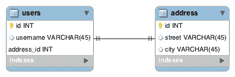
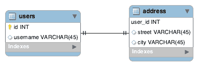
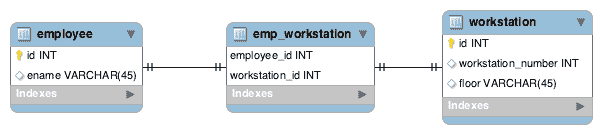

# JPA 中的一对一关系

> 原文：<https://web.archive.org/web/20220930061024/https://www.baeldung.com/jpa-one-to-one>

## 1.概观

在本教程中，我们将看看在 JPA 中创建一对一映射的不同方法。

我们需要对 Hibernate 框架有一个基本的了解，所以请查看我们的[指南来了解更多的背景知识。](/web/20220913085316/https://www.baeldung.com/hibernate-5-spring)

## 延伸阅读:

## [JPA/Hibernate 级联类型概述](/web/20220913085316/https://www.baeldung.com/jpa-cascade-types)

A quick and practical overview of JPA/Hibernate Cascade Types.[Read more](/web/20220913085316/https://www.baeldung.com/jpa-cascade-types) →

## [Hibernate 一对多注释教程](/web/20220913085316/https://www.baeldung.com/hibernate-one-to-many)

In this tutorial we'll have a look at the one-to-many mapping using JPA annotations with a practical example.[Read more](/web/20220913085316/https://www.baeldung.com/hibernate-one-to-many) →

## 2.描述

假设我们正在构建一个用户管理系统，我们的老板要求我们为每个用户存储一个邮件地址。一个用户将有一个邮寄地址，并且一个邮寄地址将只与一个用户相关联。

这是一对一关系的一个例子，在这个例子中是在`user `和 `address`实体之间。

让我们在接下来的部分看看如何实现这一点。

## 3.使用外键

### 3.1.使用外键建模

让我们看看下面的 [ER 图](https://web.archive.org/web/20220913085316/https://en.wikipedia.org/wiki/Entity%E2%80%93relationship_model)，它代表了基于外键的一对一映射:

[](/web/20220913085316/https://www.baeldung.com/wp-content/uploads/2018/12/1-1_FK.png)

在这个例子中，`users`中的`address_id `列是到`address`的[外键。](https://web.archive.org/web/20220913085316/https://en.wikipedia.org/wiki/Foreign_key)

### 3.2.在 JPA 中用外键实现

首先，让我们创建`User `类并对其进行适当的注释:

```java
@Entity
@Table(name = "users")
public class User {

    @Id
    @GeneratedValue(strategy = GenerationType.AUTO)
    @Column(name = "id")
    private Long id;
    //... 

    @OneToOne(cascade = CascadeType.ALL)
    @JoinColumn(name = "address_id", referencedColumnName = "id")
    private Address address;

    // ... getters and setters
} 
```

注意，**我们将`@OneToOne `注释**放在相关的实体字段`Address`上。

另外，**我们需要将`@JoinColumn `注释** 放置在`users`表中，以配置映射到`address`表中主键的列的名称。如果我们不提供名称，Hibernate 将[遵循一些规则](https://web.archive.org/web/20220913085316/http://docs.jboss.org/hibernate/jpa/2.2/api/javax/persistence/JoinColumn.html)来选择一个默认名称。

最后，注意在下一个实体中，我们不会使用`@JoinColumn `注释。这是因为我们只在外键关系的拥有方需要它。**简单地说，谁拥有外键列，谁就获得了`@JoinColumn`注释。**

`Address `实体变得更加简单:

```java
@Entity
@Table(name = "address")
public class Address {

    @Id
    @GeneratedValue(strategy = GenerationType.AUTO)
    @Column(name = "id")
    private Long id;
    //...

    @OneToOne(mappedBy = "address")
    private User user;

    //... getters and setters
}
```

我们还需要在这里放置`@OneToOne `注释。那是因为这是一种[双向关系](https://web.archive.org/web/20220913085316/https://docs.oracle.com/cd/E19798-01/821-1841/bnbqj/index.html)。**关系的地址方称为非拥有方。**

## 4.使用共享主键

### 4.1.使用共享主键建模

在这个策略中，我们没有创建新的列`address_id`，**，而是将`address` 表的主键列(`user_id`)标记为`users `表**的外键:

[](/web/20220913085316/https://www.baeldung.com/wp-content/uploads/2018/12/1-1-SK.png)

我们利用这些实体之间存在一对一关系的事实，优化了存储空间。

### 4.2.在 JPA 中用共享主键实现

请注意，我们的定义仅略有变化:

```java
@Entity
@Table(name = "users")
public class User {

    @Id
    @GeneratedValue(strategy = GenerationType.AUTO)
    @Column(name = "id")
    private Long id;

    //...

    @OneToOne(mappedBy = "user", cascade = CascadeType.ALL)
    @PrimaryKeyJoinColumn
    private Address address;

    //... getters and setters
}
```

```java
@Entity
@Table(name = "address")
public class Address {

    @Id
    @Column(name = "user_id")
    private Long id;

    //...

    @OneToOne
    @MapsId
    @JoinColumn(name = "user_id")
    private User user;

    //... getters and setters
} 
```

因为外键现在出现在`address `表中，所以`mappedBy`属性现在被移到了`User `类中。我们还添加了**注释`@PrimaryKeyJoinColumn`，这表明`User`实体的主键被用作关联的`Address`实体的外键值。**

我们仍然需要在`Address`类中定义一个`@Id`字段。但是请注意，这引用了`user_id`列，并且不再使用`@GeneratedValue `注释。此外，在引用`User`的字段上，我们添加了**注释`@MapsId`，这表明主键值将从`User`实体中复制**。

## 5.使用连接表

一对一映射有两种类型:可选的和强制的。到目前为止，我们只看到了强制关系。

现在，让我们想象我们的员工与一个工作站相关联。这是一对一的，但有时员工可能没有工作站，反之亦然。

### 5.1.使用连接表建模

到目前为止，我们已经讨论过的策略迫使我们在列中放置空值来处理可选的关系。

通常，当我们考虑连接表**时，我们会想到[多对多关系](/web/20220913085316/https://www.baeldung.com/jpa-many-to-many)，但是在这种情况下使用连接表可以帮助我们消除这些空值**:

[](/web/20220913085316/https://www.baeldung.com/wp-content/uploads/2018/12/1-1-JT.png)

现在，每当我们有关系时，我们将在 *emp_workstation* 表中创建一个条目，并完全避免空值。

### 5.2.用 JPA 中的连接表实现

我们的第一个例子使用了`@JoinColumn`。这一次，我们将使用`@JoinTable`:

```java
@Entity
@Table(name = "employee")
public class Employee {
    @Id
    @GeneratedValue(strategy = GenerationType.AUTO)
    @Column(name = "id")
    private Long id;

    //...

    @OneToOne(cascade = CascadeType.ALL)
    @JoinTable(name = "emp_workstation", 
      joinColumns = 
        { @JoinColumn(name = "employee_id", referencedColumnName = "id") },
      inverseJoinColumns = 
        { @JoinColumn(name = "workstation_id", referencedColumnName = "id") })
    private WorkStation workStation;

    //... getters and setters
}
```

```java
@Entity
@Table(name = "workstation")
public class WorkStation {

    @Id
    @GeneratedValue(strategy = GenerationType.AUTO)
    @Column(name = "id")
    private Long id;

    //...

    @OneToOne(mappedBy = "workStation")
    private Employee employee;

    //... getters and setters
}
```

[@ `JoinTable`](https://web.archive.org/web/20220913085316/http://docs.jboss.org/hibernate/jpa/2.2/api/javax/persistence/JoinTable.html) 指示 Hibernate 在维护关系时采用连接表策略。

另外，`Employee `是这个关系的所有者，因为我们选择在它上面使用连接表注释。

## 6.结论

在本文中，我们学习了在 JPA 和 Hibernate 中维护一对一关联的不同方法，以及何时使用每种方法。

这篇文章的源代码可以在 GitHub 上找到[。](https://web.archive.org/web/20220913085316/https://github.com/eugenp/tutorials/tree/master/persistence-modules/hibernate-jpa)