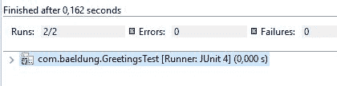

# JUnit5 @RunWith

> 原文：<https://web.archive.org/web/20220930061024/https://www.baeldung.com/junit-5-runwith>

## 1。简介

在这个快速教程中，我们将讨论在 JUnit 5 框架中使用`@RunWith`注释。

在 JUnit 5 中，**的`@RunWith`注释已经被更强大的`@ExtendWith`注释**所取代。

然而，为了向后兼容，在 JUnit 5 中仍然可以使用`@RunWith`注释。

## 2。用基于 JUnit 4 的运行器运行测试

我们可以使用`@RunWith`注释在任何旧的 JUnit 环境中运行 JUnit 5 测试。

让我们看一个在只支持 JUnit 4 的 Eclipse 版本中运行测试的例子。

首先，让我们创建将要测试的类:

```
public class Greetings {
    public static String sayHello() {
        return "Hello";
    }  
}
```

然后我们将创建这个普通的 JUnit 5 测试:

```
public class GreetingsTest {
    @Test
    void whenCallingSayHello_thenReturnHello() {
        assertTrue("Hello".equals(Greetings.sayHello()));
    }
}
```

最后，让我们添加这个注释，以便能够运行测试:

```
@RunWith(JUnitPlatform.class)
public class GreetingsTest {
    // ...
}
```

`JUnitPlatform`类是一个基于 JUnit 4 的运行程序，它允许我们在 JUnit 平台上运行 JUnit 4 测试。

让我们记住，JUnit 4 并不支持新 JUnit 平台的所有特性，所以这个 runner 的功能有限。

如果我们在 Eclipse 中检查测试结果，我们可以看到使用了 JUnit 4 runner:

[](/web/20221105002446/https://www.baeldung.com/wp-content/uploads/2017/11/junit4.jpg)

## 3。在 JUnit 5 环境中运行测试

现在让我们在支持 JUnit 5 的 Eclipse 版本中运行相同的测试。在这种情况下，我们不再需要`@RunWith`注释，我们可以在没有运行器的情况下编写测试:

```
public class GreetingsTest {
    @Test
    void whenCallingSayHello_thenReturnHello() {
        assertTrue("Hello".equals(Greetings.sayHello()));
    }
}
```

测试结果表明，我们现在使用的是 JUnit 5 runner:

[](/web/20221105002446/https://www.baeldung.com/wp-content/uploads/2017/11/junit5.jpg)

## 4。从基于 JUnit 4 的运行程序迁移

现在让我们将一个使用基于 JUnit 4 的运行程序的测试迁移到 JUnit 5。

我们将以弹簧测试为例:

```
@RunWith(SpringJUnit4ClassRunner.class)
@ContextConfiguration(classes = { SpringTestConfiguration.class })
public class GreetingsSpringTest {
    // ...
}
```

**如果我们想将这个测试迁移到 JUnit 5，我们需要用新的`@ExtendWith` :** 替换`@RunWith`注释

```
@ExtendWith(SpringExtension.class)
@ContextConfiguration(classes = { SpringTestConfiguration.class })
public class GreetingsSpringTest {
    // ...
}
```

`SpringExtension`类由 Spring 5 提供，将 Spring TestContext 框架集成到 JUnit 5 中。`@ExtendWith`注释接受任何实现`Extension`接口的类。

## 5。结论

在这篇简短的文章中，我们介绍了 JUnit 4 的`@RunWith`注释在 JUnit 5 框架中的使用。

本文的完整源代码可以在 GitHub 上的[处获得。](https://web.archive.org/web/20221105002446/https://github.com/eugenp/tutorials/tree/master/testing-modules/junit-5-basics)