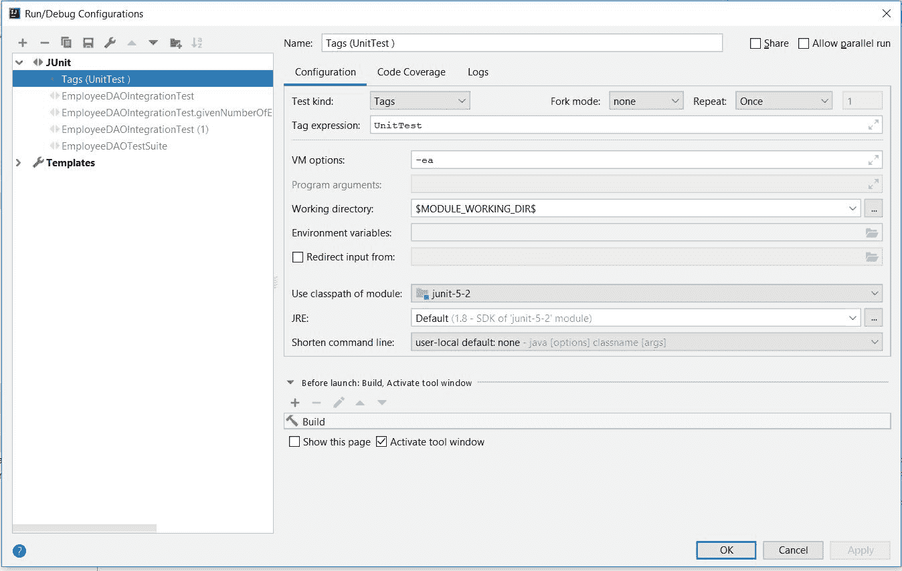
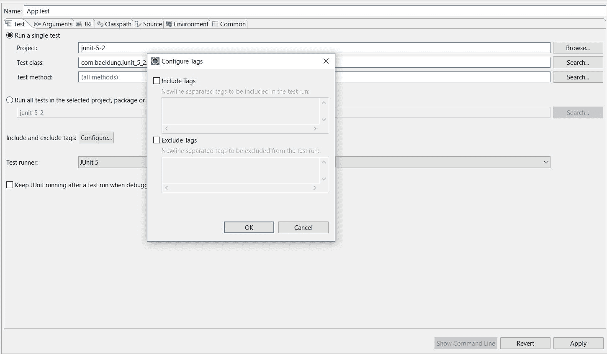

# 标记和过滤 JUnit 测试

> 原文：<https://web.archive.org/web/20220930061024/https://www.baeldung.com/junit-filtering-tests>

## 1.概观

作为使用 Maven 构建 CI 的一部分，自动执行所有 JUnit 测试是非常常见的。然而，这通常是耗时的。

因此，我们经常想要过滤我们的测试，并在构建过程的不同阶段执行单元测试或集成测试，或者两者都执行。

在本教程中，我们将会看到一些使用 [JUnit 5](/web/20220926195143/https://www.baeldung.com/junit-5) 测试用例的过滤技术。在接下来的小节中，我们还将了解 JUnit 5 之前的各种过滤机制。

## 2.JUnit 5 标签

### 2.1.用`Tag`注释 JUnit 测试

使用 JUnit 5，我们可以通过在唯一的标签名称下标记测试子集来过滤测试。例如，假设我们使用 JUnit 5 实现了单元测试和集成测试。我们可以在两组测试用例上添加标签:

```java
@Test
@Tag("IntegrationTest")
public void testAddEmployeeUsingSimpelJdbcInsert() {
}

@Test
@Tag("UnitTest")
public void givenNumberOfEmployeeWhenCountEmployeeThenCountMatch() {
}
```

从今以后，我们可以**在一个特定的标签名称下分别执行所有的测试**。我们也可以标记类而不是方法。从而将一个类别中的所有测试包含在一个标签下。

在接下来的几节中，我们将看到过滤和执行标记的 JUnit 测试的各种方法。

### 2.2.使用测试套件过滤标签

JUnit 5 允许我们实现测试套件，通过它我们可以执行标记的测试用例:

```java
@SelectPackages("com.baeldung.tags")
@IncludeTags("UnitTest")
public class EmployeeDAOUnitTestSuite {
}
```

现在，如果我们运行这个套件，**标签下的所有 JUnit 测试都将被执行**。类似地，我们可以排除带有`ExcludeTags `注释的测试。

### 2.3.使用 Maven Surefire 插件过滤标签

为了在 Maven 构建的各个阶段过滤 JUnit 测试，我们可以使用 Maven Surefire 插件。**Surefire 插件允许我们在插件配置中包含或排除标签**:

```java
<plugin>
    <artifactId>maven-surefire-plugin</artifactId>
    <version>2.22.2</version>
    <configuration>
        <groups>UnitTest</groups>
    </configuration>
</plugin>
```

如果我们现在执行这个插件，它将执行所有被标记为`UnitTest. `的测试。类似地，我们可以排除标记名称下的测试用例:

```java
<excludedGroups>IntegrationTest</excludedGroups>
```

### 2.4.使用 IDE 过滤标签

ide 现在允许通过标签过滤 JUnit 测试。这样，我们可以直接从我们的 IDE 中执行一组特定的标记测试。

IntelliJ 允许通过自定义运行/调试配置进行这种过滤:

[](/web/20220926195143/https://www.baeldung.com/wp-content/uploads/2019/05/JUnit5-Tags-in-IntelliJ.jpg)

如该图所示，我们选择测试种类作为标记，并在标记表达式中选择要执行的标记。

JUnit 5 允许各种[标签表达式](https://web.archive.org/web/20220926195143/https://junit.org/junit5/docs/current/user-guide/#running-tests-tag-expressions)，可以用来过滤标签。例如，**运行除集成测试之外的所有测试，我们可以使用`!IntegrationTest `作为标签表达式。**或者为了同时执行`UnitTest `和`IntegrationTest, `，我们可以使用`UnitTest | IntegrationTest.` 

类似地，Eclipse 还允许在 JUnit 运行/调试配置中包含或排除标记:

[](/web/20220926195143/https://www.baeldung.com/wp-content/uploads/2019/05/JUnit5-Tags-in-Eclipse.jpg)

## 3.JUnit 4 类别

### 3.1.对 JUnit 测试进行分类

JUnit 4 允许我们通过将它们添加到不同的类别中来执行 JUnit 测试的子集。因此，我们可以在排除其他类别的情况下执行特定类别的测试用例。

**我们可以通过实现[标记接口](/web/20220926195143/https://www.baeldung.com/java-marker-interfaces)来创建尽可能多的类别，其中标记接口的名称代表类别的名称。**对于我们的例子，我们将实现两个类别，`UnitTest:`

```java
public interface UnitTest {
}
```

和`IntegrationTest:`

```java
public interface IntegrationTest {
}
```

现在，我们可以通过用`Category`注释对 JUnit 进行注释来对其进行分类:

```java
@Test
@Category(IntegrationTest.class)
public void testAddEmployeeUsingSimpelJdbcInsert() {
}

@Test
@Category(UnitTest.class)
public void givenNumberOfEmployeeWhenCountEmployeeThenCountMatch() {
}
```

在我们的例子中，我们将`Category `注释放在测试方法上。类似地，我们也可以在 test 类上添加这个注释，从而将所有测试添加到一个类别中。

### 3.2.`Categories `跑步者

为了在一个类别中执行 JUnit 测试，我们需要实现一个测试套件类:

```java
@RunWith(Categories.class)
@IncludeCategory(UnitTest.class)
@SuiteClasses(EmployeeDAOCategoryIntegrationTest.class)
public class EmployeeDAOUnitTestSuite {
}
```

这个测试套件可以从 IDE 中执行，并且可以执行所有属于`UnitTest`类别的 JUnit 测试。类似地，我们也可以在套件中排除一类测试:

```java
@RunWith(Categories.class)
@ExcludeCategory(IntegrationTest.class)
@SuiteClasses(EmployeeDAOCategoryIntegrationTest.class)
public class EmployeeDAOUnitTestSuite {
}
```

### 3.3.在 Maven 中排除或包含类别

最后，我们还可以在 Maven 构建中包含或排除 JUnit 测试的类别。因此，我们可以在不同的 Maven 概要文件中执行不同类别的 JUnit 测试。

为此，我们将使用 Maven Surefire 插件:

```java
<plugin>
    <artifactId>maven-surefire-plugin</artifactId>
    <version>2.22.2</version>
    <configuration>
        <groups>com.baeldung.categories.UnitTest</groups>
    </configuration>
</plugin>
```

同样，我们可以从 Maven 构建中排除一个类别:

```java
<plugin>
    <artifactId>maven-surefire-plugin</artifactId>
    <version>2.22.2</version>
    <configuration>
        <excludedGroups>com.baeldung.categories.IntegrationTest</excludedGroups>
    </configuration>
</plugin>
```

这类似于我们在上一节中讨论的例子。**唯一的区别是我们用`Category `实现的完全限定名替换了标签名。**

## 4.用 Maven Surefire 插件过滤 JUnit 测试

我们讨论的两种方法都已经用 JUnit 库实现了。一种与实现无关的过滤测试用例的方法是遵循命名约定。对于我们的例子，我们将对单元测试使用 UnitTest 后缀，对集成测试使用 IntegrationTest。

现在我们将使用 [Maven Surefire 插件](/web/20220926195143/https://www.baeldung.com/maven-surefire-plugin)来执行单元测试或集成测试:

```java
<plugin>
    <artifactId>maven-surefire-plugin</artifactId>
    <version>2.22.2</version>
    <configuration>
        <excludes>
            **/*IntegrationTest.java
        </excludes>
    </configuration>
</plugin>
```

这里的标签过滤所有的集成测试，并且只执行单元测试。这种配置将节省大量的构建时间。

此外，我们可以在不同的 Maven 概要文件中执行`Surefire `插件，包含或不包含不同的内容。

**尽管`Surefire `在过滤方面表现良好，但还是推荐使用[故障保护插件](/web/20220926195143/https://www.baeldung.com/maven-failsafe-plugin)在 Maven 中执行集成测试。**

## 5.结论

在本文中，我们看到了用 JUnit 5 标记和过滤测试用例的方法。**我们使用了`Tag `注释，也看到了通过 IDE 或在使用 Maven 的构建过程中过滤带有特定标签的 JUnit 测试的各种方法。**

我们还讨论了 JUnit 5 之前的一些过滤机制。

所有的例子都可以在 [Github](https://web.archive.org/web/20220926195143/https://github.com/eugenp/tutorials/tree/master/testing-modules/junit-5-basics) 上找到。