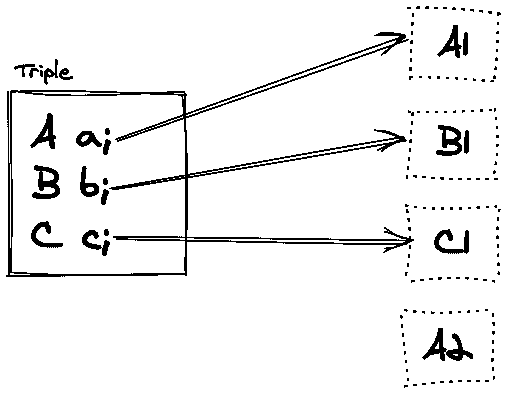
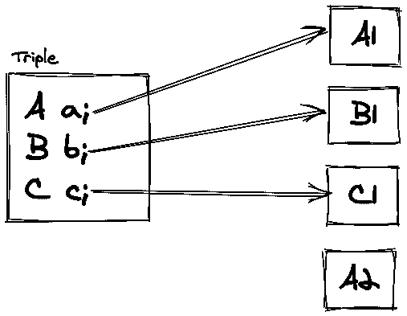
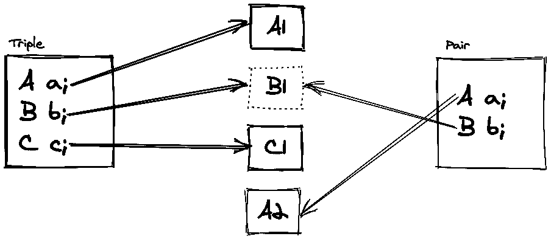
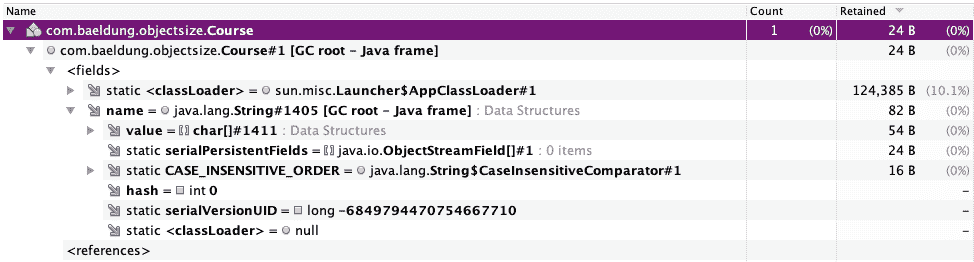

# 测量 JVM 中的对象大小

> 原文：<https://web.archive.org/web/20220930061024/https://www.baeldung.com/jvm-measuring-object-sizes>

## 1.概观

在本教程中，我们将看到每个对象在 Java 堆中消耗了多少空间。

首先，我们将熟悉计算对象大小的不同度量。然后，我们将看到几种测量实例大小的方法。

通常，运行时数据区的内存布局不是 JVM 规范的一部分，而是留给实现者来决定。因此，每个 JVM 实现可能有不同的策略来布局内存中的对象和数组。这反过来会影响运行时的实例大小。

在本教程中，我们将关注一个特定的 JVM 实现:HotSpot JVM。

在整个教程中，我们还交替使用 JVM 和 HotSpot JVM 这两个术语。

## 2.浅、保留和深对象大小

为了分析对象大小，我们可以使用三种不同的度量:浅、保留和深大小。

在计算物体的浅层尺寸时，我们只考虑物体本身。也就是说，如果对象有对其他对象的引用，我们只考虑对目标对象的引用大小，而不考虑它们的实际对象大小。例如:

[](/web/20220826185127/https://www.baeldung.com/wp-content/uploads/2020/07/simple-ol-4-1.png)

如上所示，`Triple `实例的浅层大小只是三个引用的总和。我们从这个尺寸中排除了所指对象的实际尺寸，即`A1, B1, `和`C1, `。

相反，**除了浅尺寸:**之外，对象的深尺寸包括所有引用对象的尺寸

[](/web/20220826185127/https://www.baeldung.com/wp-content/uploads/2020/07/simple-ol-5-1.png)

在这里，`Triple `实例的深度大小包含三个引用，加上`A1, B1, `和`C1. `的实际大小。因此，深度大小本质上是递归的。

当 GC 回收一个对象占用的内存时，它会释放一定数量的内存。该数量就是该对象的保留大小:

[](/web/20220826185127/https://www.baeldung.com/wp-content/uploads/2020/07/simple-ol-6.png)

除了`Triple `实例本身之外，`Triple `实例的保留大小只包括`A1 `和`C1`。另一方面，这个保留的大小不包括`B1, `，因为`Pair `实例也引用了`B1. `

有时这些额外的引用是由 JVM 本身间接产生的。因此，计算保留大小可能是一项复杂的任务。

**为了更好地理解保留大小，我们应该从垃圾收集的角度来考虑。**收集`Triple `实例使得`A1 `和`C1 `不可达，但是`B1 `仍然可以通过另一个对象到达。根据具体情况，保留的大小可以是浅大小和深大小之间的任意值。

## 3.属国

为了检查 JVM 中对象或数组的内存布局，我们将使用 Java 对象布局( [JOL](https://web.archive.org/web/20220826185127/https://openjdk.java.net/projects/code-tools/jol/) )工具。因此，我们需要添加 [`jol-core`](https://web.archive.org/web/20220826185127/https://search.maven.org/artifact/org.openjdk.jol/jol-core) 的依赖关系:

```java
<dependency> 
    <groupId>org.openjdk.jol</groupId> 
    <artifactId>jol-core</artifactId>    
    <version>0.10</version> 
</dependency>
```

## 4.简单数据类型

为了更好地理解更复杂对象的大小，我们应该首先知道每个简单数据类型消耗多少空间。为此，我们可以要求 Java 内存布局或 JOL 打印 VM 信息:

```java
System.out.println(VM.current().details());
```

上述代码将打印简单数据类型大小，如下所示:

```java
# Running 64-bit HotSpot VM.
# Using compressed oop with 3-bit shift.
# Using compressed klass with 3-bit shift.
# Objects are 8 bytes aligned.
# Field sizes by type: 4, 1, 1, 2, 2, 4, 4, 8, 8 [bytes]
# Array element sizes: 4, 1, 1, 2, 2, 4, 4, 8, 8 [bytes]
```

下面是 JVM 中每个简单数据类型的空间需求:

*   对象引用消耗 4 个字节
*   `[boolean](/web/20220826185127/https://www.baeldung.com/jvm-boolean-memory-layout) `和`byte `值消耗 1 个字节
*   `short `和`char `值消耗 2 个字节
*   `int `和`float `值消耗 4 个字节
*   `long `和`double `值消耗 8 个字节

这在 32 位架构和 64 位架构中都是如此，其中[压缩引用](/web/20220826185127/https://www.baeldung.com/jvm-compressed-oops)有效。

同样值得一提的是，当用作数组组件类型时，所有数据类型都消耗相同数量的内存。

### 4.1.未压缩的引用

如果我们通过`-XX:-UseCompressedOops `调整标志禁用压缩引用，那么大小要求将会改变:

```java
# Objects are 8 bytes aligned.
# Field sizes by type: 8, 1, 1, 2, 2, 4, 4, 8, 8 [bytes]
# Array element sizes: 8, 1, 1, 2, 2, 4, 4, 8, 8 [bytes]
```

现在对象引用将消耗 8 个字节，而不是 4 个字节。其余的数据类型仍然消耗相同数量的内存。

此外，当堆大小超过 32 GB 时，HotSpot JVM 也不能使用压缩的引用([，除非我们改变对象对齐方式](/web/20220826185127/https://www.baeldung.com/jvm-compressed-oops#2beyond-32-gb))。

**底线是，如果我们显式禁用压缩引用或者堆大小超过 32 GB，对象引用将消耗 8 个字节。**

现在我们已经知道了基本数据类型的内存消耗，让我们来计算一下更复杂的对象的内存消耗。

## 5.复杂物体

为了计算复杂对象的大小，让我们考虑一个典型的教授与课程的关系:

```java
public class Course {

    private String name;

    // constructor
}
```

每个`Professor, `除了个人详细信息，还可以有一个`Course`列表:

```java
public class Professor {

    private String name;
    private boolean tenured;
    private List<Course> courses = new ArrayList<>();
    private int level;
    private LocalDate birthDay;
    private double lastEvaluation;

    // constructor
}
```

### 5.1.浅尺寸:`Course`级

`Course `类实例的浅层大小应该包括一个 4 字节的对象引用(用于`name `字段)加上一些对象开销。我们可以使用 JOL 来检验这个假设:

```java
System.out.println(ClassLayout.parseClass(Course.class).toPrintable());
```

这将打印以下内容:

```java
Course object internals:
 OFFSET  SIZE               TYPE DESCRIPTION               VALUE
      0    12                    (object header)           N/A
     12     4   java.lang.String Course.name               N/A
Instance size: 16 bytes
Space losses: 0 bytes internal + 0 bytes external = 0 bytes total
```

如上所示，shallow 的大小是 16 个字节，包括一个对`name `字段的 4 个字节的对象引用和对象头。

### 5.2.浅尺寸:`Professor `级

如果我们为`Professor `类运行相同的代码:

```java
System.out.println(ClassLayout.parseClass(Professor.class).toPrintable());
```

然后 JOL 将打印出`Professor `类的内存消耗，如下所示:

```java
Professor object internals:
 OFFSET  SIZE                  TYPE DESCRIPTION                     VALUE
      0    12                       (object header)                 N/A
     12     4                   int Professor.level                 N/A
     16     8                double Professor.lastEvaluation        N/A
     24     1               boolean Professor.tenured               N/A
     25     3                       (alignment/padding gap)                  
     28     4      java.lang.String Professor.name                  N/A
     32     4        java.util.List Professor.courses               N/A
     36     4   java.time.LocalDate Professor.birthDay              N/A
Instance size: 40 bytes
Space losses: 3 bytes internal + 0 bytes external = 3 bytes total
```

正如我们可能预料的那样，封装的字段占用了 25 个字节:

*   三个对象引用，每个引用占用 4 个字节。所以引用其他对象总共需要 12 个字节
*   一个消耗 4 个字节的`int `
*   一个消耗 1 字节的`boolean `
*   一个消耗 8 字节的`double `

加上对象头的 12 字节开销加上 3 字节的对齐填充，shallow 大小为 40 字节。

**这里的关键要点是，除了每个对象的封装状态之外，在计算不同的对象大小时，我们还应该考虑[对象头和对齐填充](/web/20220826185127/https://www.baeldung.com/java-memory-layout)。**

### 5.3.浅尺寸:实例

JOL 中的`[sizeOf()](https://web.archive.org/web/20220826185127/https://www.javadoc.io/doc/org.openjdk.jol/jol-core/latest/org/openjdk/jol/vm/VirtualMachine.html#sizeOf-java.lang.Object-) `方法提供了一种更简单的方法来计算对象实例的浅层大小。如果我们运行下面的代码片段:

```java
String ds = "Data Structures";
Course course = new Course(ds);

System.out.println("The shallow size is: " + VM.current().sizeOf(course));
```

它将打印如下的浅尺寸:

```java
The shallow size is: 16
```

### 5.4.未压缩大小

如果我们禁用压缩引用或使用超过 32 GB 的堆，浅层大小将会增加:

```java
Professor object internals:
 OFFSET  SIZE                  TYPE DESCRIPTION                               VALUE
      0    16                       (object header)                           N/A
     16     8                double Professor.lastEvaluation                  N/A
     24     4                   int Professor.level                           N/A
     28     1               boolean Professor.tenured                         N/A
     29     3                       (alignment/padding gap)                  
     32     8      java.lang.String Professor.name                            N/A
     40     8        java.util.List Professor.courses                         N/A
     48     8   java.time.LocalDate Professor.birthDay                        N/A
Instance size: 56 bytes
Space losses: 3 bytes internal + 0 bytes external = 3 bytes total
```

**禁用压缩引用时，对象头和对象引用将消耗更多内存。**因此，如上图所示，现在同一个`Professor `类多消耗了 16 个字节。

### 5.5.深度尺寸

为了计算深度大小，我们应该包括物体本身及其所有合作者的完整大小。例如，对于这个简单的场景:

```java
String ds = "Data Structures";
Course course = new Course(ds);
```

`Course `实例的深度大小等于`Course `实例本身的深度加上特定的`String `实例的深度。

也就是说，让我们看看`String `实例消耗了多少空间:

```java
System.out.println(ClassLayout.parseInstance(ds).toPrintable());
```

每个`String `实例封装了一个`char[] `(稍后会详细介绍)和一个`int ` hashcode:

```java
java.lang.String object internals:
 OFFSET  SIZE     TYPE DESCRIPTION                               VALUE
      0     4          (object header)                           01 00 00 00 
      4     4          (object header)                           00 00 00 00 
      8     4          (object header)                           da 02 00 f8
     12     4   char[] String.value                              [D, a, t, a,  , S, t, r, u, c, t, u, r, e, s]
     16     4      int String.hash                               0
     20     4          (loss due to the next object alignment)
Instance size: 24 bytes
Space losses: 0 bytes internal + 4 bytes external = 4 bytes total
```

这个`String `实例的浅层大小是 24 个字节，其中包括 4 个字节的缓存哈希代码、4 个字节的`char[] `引用和其他典型的对象开销。

为了查看`char[], `的实际大小，我们也可以解析它的类布局:

```java
System.out.println(ClassLayout.parseInstance(ds.toCharArray()).toPrintable());
```

`char[]`的布局看起来是这样的:

```java
[C object internals:
 OFFSET  SIZE   TYPE DESCRIPTION                               VALUE
      0     4        (object header)                           01 00 00 00
      4     4        (object header)                           00 00 00 00
      8     4        (object header)                           41 00 00 f8 
     12     4        (object header)                           0f 00 00 00
     16    30   char [C.<elements>                             N/A
     46     2        (loss due to the next object alignment)
Instance size: 48 bytes
Space losses: 0 bytes internal + 2 bytes external = 2 bytes total
```

**因此，`Course `实例有 16 个字节，`String `实例有 24 个字节，`char[]. `总共有 48 个字节，那个`Course `实例的深度大小是 88 个字节。**

随着 Java 9 中[紧凑字符串](/web/20220826185127/https://www.baeldung.com/java-9-compact-string)的引入，`String` 类在内部使用一个`byte[] `来存储字符:

```java
java.lang.String object internals:
 OFFSET  SIZE     TYPE DESCRIPTION                               
      0     4          (object header)                         
      4     4          (object header)                           
      8     4          (object header)                           
     12     4   byte[] String.value # the byte array                             
     16     4      int String.hash                               
     20     1     byte String.coder # encodig                             
     21     3          (loss due to the next object alignment)
```

因此，在 Java 9+上，`Course `实例的总内存将是 72 字节，而不是 88 字节。

### 5.6.对象图布局

不用单独解析对象图中每个对象的类布局，我们可以将`GraphLayout.` 与`GraphLayot, `一起使用，我们只需传递对象图的起点，它将报告从该起点开始的所有可到达对象的布局。这样，我们就可以计算出图形起点的深度大小。

例如，我们可以看到`Course `实例的总占用空间如下:

```java
System.out.println(GraphLayout.parseInstance(course).toFootprint());
```

它打印以下摘要:

```java
[[email protected]](/web/20220826185127/https://www.baeldung.com/cdn-cgi/l/email-protection) footprint:
     COUNT       AVG       SUM   DESCRIPTION
         1        48        48   [C
         1        16        16   com.baeldung.objectsize.Course
         1        24        24   java.lang.String
         3                  88   (total)
```

总共有 88 个字节。`totalSize() `方法返回对象的总占用空间，为 88 字节:

```java
System.out.println(GraphLayout.parseInstance(course).totalSize());
```

## 6.使用仪器

为了计算一个对象的浅层大小，我们也可以使用 Java [检测包](/web/20220826185127/https://www.baeldung.com/java-instrumentation)和 Java 代理。首先，我们应该用`premain() `方法创建一个类:

```java
public class ObjectSizeCalculator {

    private static Instrumentation instrumentation;

    public static void premain(String args, Instrumentation inst) {
        instrumentation = inst;
    }

    public static long sizeOf(Object o) {
        return instrumentation.getObjectSize(o);
    }
}
```

如上所示，我们将使用`[getObjectSize()](https://web.archive.org/web/20220826185127/https://docs.oracle.com/en/java/javase/11/docs/api/java.instrument/java/lang/instrument/Instrumentation.html#getObjectSize(java.lang.Object)) `方法来找到一个对象的浅尺寸。我们还需要一个清单文件:

```java
Premain-Class: com.baeldung.objectsize.ObjectSizeCalculator
```

然后使用这个`MANIFEST.MF `文件，我们可以[创建一个 JAR 文件](/web/20220826185127/https://www.baeldung.com/java-create-jar)，并将其用作 Java 代理:

```java
$ jar cmf MANIFEST.MF agent.jar *.class
```

最后，如果我们使用`-javaagent:/path/to/agent.jar `参数运行任何代码，那么我们可以使用`sizeOf() `方法:

```java
String ds = "Data Structures";
Course course = new Course(ds);

System.out.println(ObjectSizeCalculator.sizeOf(course));
```

这将打印 16 作为`Course `实例的浅尺寸。

## 7.班级统计

要查看已经运行的应用程序中对象的浅层大小，我们可以使用`jcmd:`来查看类统计信息

```java
$ jcmd <pid> GC.class_stats [output_columns]
```

例如，我们可以看到所有`Course `实例的每个实例大小和数量:

```java
$ jcmd 63984 GC.class_stats InstSize,InstCount,InstBytes | grep Course 
63984:
InstSize InstCount InstBytes ClassName
 16         1        16      com.baeldung.objectsize.Course
```

同样，这是将每个`Course `实例的浅层大小报告为 16 个字节。

要查看类统计数据，我们应该使用`-XX:+UnlockDiagnosticVMOptions `调优标志启动应用程序。

## 8.堆转储

使用[堆转储](/web/20220826185127/https://www.baeldung.com/java-heap-dump-capture)是检查正在运行的应用程序中的实例大小的另一种选择。这样，我们可以看到每个实例的保留大小。要进行堆转储，我们可以如下使用`jcmd `:

```java
$ jcmd <pid> GC.heap_dump [options] /path/to/dump/file
```

例如:

```java
$ jcmd 63984 GC.heap_dump -all ~/dump.hpro
```

这将在指定位置创建一个堆转储。此外，使用`-all `选项，所有可到达和不可到达的对象都将出现在堆转储中。如果没有这个选项，JVM 将在创建堆转储之前执行完整的 GC。

获得堆转储后，我们可以将它导入到像 Visual VM 这样的工具中:

[](/web/20220826185127/https://www.baeldung.com/wp-content/uploads/2020/07/retained-size.png)

如上所示，唯一的`Course `实例的保留大小是 24 字节。如前所述，保留的大小可以是浅(16 字节)和深(88 字节)之间的任何值。

同样值得一提的是，在 Java 9 之前，Visual VM 是 Oracle 和开放 JDK 发行版的一部分。然而，从 Java 9 开始就不再是这样了，我们应该从它的[网站](https://web.archive.org/web/20220826185127/https://visualvm.github.io/)单独下载 Visual VM。

## 9.结论

在本教程中，我们熟悉了在 JVM 运行时测量对象大小的不同标准。之后，我们实际上用各种工具测量了实例大小，比如 JOL、Java 代理和`jcmd `命令行实用程序。

像往常一样，所有的例子都可以在 GitHub 上找到[。](https://web.archive.org/web/20220826185127/https://github.com/eugenp/tutorials/tree/master/core-java-modules/core-java-jvm-2)