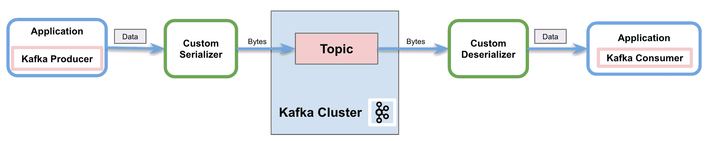

# Apache Kafka 中的自定义序列化程序

> 原文：<https://web.archive.org/web/20220930061024/https://www.baeldung.com/kafka-custom-serializer>

## 1.介绍

在用 Apache Kafka 传输消息的过程中，客户机和服务器同意使用一种通用的语法格式。Apache Kafka 带来了默认的转换器(比如`String`和`Long`)，但也支持针对特定用例的定制序列化器。在本教程中，我们将看到如何实现它们。

## 2.阿帕奇卡夫卡中的序列化程序

**序列化是将对象转换成字节**的过程。反序列化是相反的过程—将字节流转换为对象。简而言之，它**将内容转换成可读和可解释的信息**。

正如我们提到的，Apache Kafka 为几种基本类型提供了默认的序列化程序，它允许我们实现定制的序列化程序:

[](/web/20221129004247/https://www.baeldung.com/wp-content/uploads/2021/08/kafka1.png)

上图显示了通过网络向一个 Kafka 主题发送消息的过程。在此过程中，自定义序列化程序在生成器将消息发送到主题之前将对象转换为字节。同样，它还展示了反序列化器如何将字节转换回对象，以便使用者正确处理它。

### 2.1.自定义序列化程序

Apache Kafka 为几种基本类型提供了预构建的序列化程序和反序列化程序:

*   [T2`StringSerializer`](https://web.archive.org/web/20221129004247/https://kafka.apache.org/24/javadoc/org/apache/kafka/common/serialization/StringSerializer.html)
*   [T2`ShortSerializer`](https://web.archive.org/web/20221129004247/https://kafka.apache.org/24/javadoc/org/apache/kafka/common/serialization/ShortSerializer.html)
*   [T2`IntegerSerializer`](https://web.archive.org/web/20221129004247/https://kafka.apache.org/24/javadoc/org/apache/kafka/common/serialization/IntegerSerializer.html)
*   `[LongSerializer](https://web.archive.org/web/20221129004247/https://kafka.apache.org/24/javadoc/org/apache/kafka/common/serialization/LongSerializer.html)`
*   [T2`DoubleSerializer`](https://web.archive.org/web/20221129004247/https://kafka.apache.org/24/javadoc/org/apache/kafka/common/serialization/DoubleSerializer.html)
*   [T2`BytesSerializer`](https://web.archive.org/web/20221129004247/https://kafka.apache.org/24/javadoc/org/apache/kafka/common/serialization/BytesSerializer.html)

但是它也提供了实现定制(反)序列化器的能力。为了序列化我们自己的对象，我们将实现`[Serializer](https://web.archive.org/web/20221129004247/https://kafka.apache.org/24/javadoc/org/apache/kafka/common/serialization/Serializer.html)` 接口。类似地，为了创建一个定制的反序列化器，我们将实现 [`Deserializer`](https://web.archive.org/web/20221129004247/https://kafka.apache.org/24/javadoc/org/apache/kafka/common/serialization/Deserializer.html) 接口。

有两种方法可用于覆盖这两种接口:

*   `configure`:用于实现配置细节
*   `serialize/deserialize` : **这些方法包括我们自定义序列化和反序列化**的实际实现。
*   `close`:使用此方法关闭 Kafka 会话

## 3.在 Apache Kafka 中实现自定义序列化程序

Apache Kafka 提供了定制序列化器的能力。不仅可以为消息值，还可以为键实现特定的转换器。

### 3.1.属国

为了实现这些示例，我们只需将 [Kafka 消费者 API](https://web.archive.org/web/20221129004247/https://search.maven.org/classic/#search%7Cgav%7C1%7Cg%3A%22org.apache.kafka%22%20AND%20a%3A%22kafka-clients%22) 依赖项添加到我们的`pom.xml`:

```java
<dependency>
    <groupId>org.apache.kafka</groupId>
    <artifactId>kafka-clients</artifactId>
    <version>2.8.0</version>
</dependency> 
```

### 3.2.自定义序列化程序

首先，我们将使用 [Lombok](/web/20221129004247/https://www.baeldung.com/intro-to-project-lombok) 来指定要通过 Kafka 发送的自定义对象:

```java
@Data
@AllArgsConstructor
@NoArgsConstructor
@Builder
public class MessageDto {
    private String message;
    private String version;
}
```

接下来，我们将实现 Kafka 为生产者提供的用于发送消息的`[Serializer](https://web.archive.org/web/20221129004247/https://kafka.apache.org/24/javadoc/org/apache/kafka/common/serialization/Serializer.html)`接口:

```java
public class CustomSerializer implements Serializer<MessageDto> {
    private final ObjectMapper objectMapper = new ObjectMapper();

    @Override
    public void configure(Map<String, ?> configs, boolean isKey) {
    }

    @Override
    public byte[] serialize(String topic, MessageDto data) {
        try {
            if (data == null){
                System.out.println("Null received at serializing");
                return null;
            }
            System.out.println("Serializing...");
            return objectMapper.writeValueAsBytes(data);
        } catch (Exception e) {
            throw new SerializationException("Error when serializing MessageDto to byte[]");
        }
    }

    @Override
    public void close() {
    }
} 
```

**我们将覆盖接口**的`serialize`方法。因此，在我们的实现中，我们将使用一个`Jackson ObjectMapper`来转换定制对象。然后，我们将返回字节流，以正确地将消息发送到网络。

### 3.3.自定义反序列化程序

同样，我们将为消费者实现 [`Deserializer`](https://web.archive.org/web/20221129004247/https://kafka.apache.org/24/javadoc/org/apache/kafka/common/serialization/Deserializer.html) 接口:

```java
@Slf4j
public class CustomDeserializer implements Deserializer<MessageDto> {
    private ObjectMapper objectMapper = new ObjectMapper();

    @Override
    public void configure(Map<String, ?> configs, boolean isKey) {
    }

    @Override
    public MessageDto deserialize(String topic, byte[] data) {
        try {
            if (data == null){
                System.out.println("Null received at deserializing");
                return null;
            }
            System.out.println("Deserializing...");
            return objectMapper.readValue(new String(data, "UTF-8"), MessageDto.class);
        } catch (Exception e) {
            throw new SerializationException("Error when deserializing byte[] to MessageDto");
        }
    }

    @Override
    public void close() {
    }
} 
```

和上一节一样，**我们将覆盖接口**的`deserialize`方法。因此，我们将使用相同的`Jackson ObjectMapper`将字节流转换成自定义对象。

### 3.4.使用示例消息

让我们看一个使用自定义序列化程序和反序列化程序发送和接收示例消息的工作示例。

首先，我们将创建并配置 Kafka 生成器:

```java
private static KafkaProducer<String, MessageDto> createKafkaProducer() {
    Properties props = new Properties();
    props.put(ProducerConfig.BOOTSTRAP_SERVERS_CONFIG, kafka.getBootstrapServers());
    props.put(ProducerConfig.CLIENT_ID_CONFIG, CONSUMER_APP_ID);
    props.put(ProducerConfig.KEY_SERIALIZER_CLASS_CONFIG, "org.apache.kafka.common.serialization.StringSerializer");
    props.put(ProducerConfig.VALUE_SERIALIZER_CLASS_CONFIG, "com.baeldung.kafka.serdes.CustomSerializer");

    return new KafkaProducer(props);
}
```

**我们将使用自定义类**配置值序列化程序属性，使用默认的`StringSerializer`配置键序列化程序。

其次，我们将创建卡夫卡式的消费者:

```java
private static KafkaConsumer<String, MessageDto> createKafkaConsumer() {
    Properties props = new Properties();
    props.put(ConsumerConfig.BOOTSTRAP_SERVERS_CONFIG, kafka.getBootstrapServers());
    props.put(ConsumerConfig.CLIENT_ID_CONFIG, CONSUMER_APP_ID);
    props.put(ConsumerConfig.GROUP_ID_CONFIG, CONSUMER_GROUP_ID);
    props.put(ConsumerConfig.AUTO_OFFSET_RESET_CONFIG, "earliest");
    props.put(ConsumerConfig.KEY_DESERIALIZER_CLASS_CONFIG, "org.apache.kafka.common.serialization.StringDeserializer");
    props.put(ConsumerConfig.VALUE_DESERIALIZER_CLASS_CONFIG, "com.baeldung.kafka.serdes.CustomDeserializer");

    return new KafkaConsumer<>(props);
}
```

**除了自定义类**的键和值反序列化器之外，还必须包含组 id。除此之外，我们将自动偏移重置配置设置为`earliest` ，以确保生产者在消费者启动之前发送所有消息。

一旦我们创建了生产者和消费者客户端，就该发送示例消息了:

```java
MessageDto msgProd = MessageDto.builder().message("test").version("1.0").build();

KafkaProducer<String, MessageDto> producer = createKafkaProducer();
producer.send(new ProducerRecord<String, MessageDto>(TOPIC, "1", msgProd));
System.out.println("Message sent " + msgProd);
producer.close();
```

我们可以通过订阅主题与消费者一起接收消息:

```java
AtomicReference<MessageDto> msgCons = new AtomicReference<>();

KafkaConsumer<String, MessageDto> consumer = createKafkaConsumer();
consumer.subscribe(Arrays.asList(TOPIC));

ConsumerRecords<String, MessageDto> records = consumer.poll(Duration.ofSeconds(1));
records.forEach(record -> {
    msgCons.set(record.value());
    System.out.println("Message received " + record.value());
});

consumer.close();
```

控制台中的结果是:

```java
Serializing...
Message sent MessageDto(message=test, version=1.0)
Deserializing...
Message received MessageDto(message=test, version=1.0)
```

## 4.结论

在本教程中，我们展示了生产者如何使用 Apache Kafka 中的序列化程序通过网络发送消息。同样，我们还展示了消费者如何使用反序列化程序来解释收到的消息。

此外，我们学习了可用的默认序列化程序，最重要的是，实现自定义序列化程序和反序列化程序的能力。

和往常一样，代码可以在 GitHub 的[上获得。](https://web.archive.org/web/20221129004247/https://github.com/eugenp/tutorials/tree/master/apache-kafka)