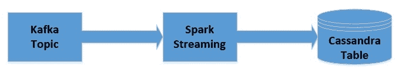
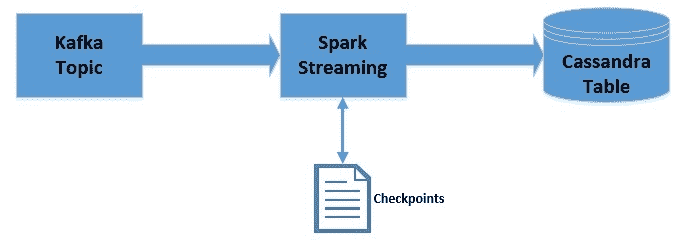

# 与 Kafka、Spark Streaming 和 Cassandra 一起构建数据管道

> 原文：<https://web.archive.org/web/20220930061024/https://www.baeldung.com/kafka-spark-data-pipeline>

## 1。概述

Apache Kafka 是一个可扩展的、高性能、低延迟的平台，**允许像消息系统一样读写数据流**。[我们可以很容易地从 Java 中的卡夫卡开始。](/web/20221205220604/https://www.baeldung.com/spring-kafka)

[Spark Streaming](https://web.archive.org/web/20221205220604/https://spark.apache.org/streaming/) 是 [Apache Spark](https://web.archive.org/web/20221205220604/https://spark.apache.org/) 平台的一部分，该平台**能够对数据流**进行可扩展、高吞吐量、容错处理。虽然是用 Scala 编写的， [Spark 提供了 Java APIs 来与](/web/20221205220604/https://www.baeldung.com/apache-spark)协同工作。

Apache Cassandra 是一个**分布式宽列 NoSQL 数据存储**。[关于卡珊德拉](/web/20221205220604/https://www.baeldung.com/cassandra-with-java)的更多细节可以在我们之前的文章中找到。

在本教程中，我们将结合这些来为实时数据流创建一个**高度可伸缩和容错的数据管道。**

 **## 延伸阅读:

## [使用 Cassandra、Astra 和 Stargate 构建仪表板](/web/20221205220604/https://www.baeldung.com/cassandra-astra-stargate-dashboard)

了解如何使用 DataStax Astra 构建仪表板，这是一种由 Apache Cassandra 和 Stargate APIs 支持的数据库即服务。[阅读更多](/web/20221205220604/https://www.baeldung.com/cassandra-astra-stargate-dashboard) →

## [用 Cassandra、Astra、REST&graph QL——记录状态更新](/web/20221205220604/https://www.baeldung.com/cassandra-astra-rest-dashboard-updates)

用 Cassandra 存储时序数据的例子。[阅读更多信息](/web/20221205220604/https://www.baeldung.com/cassandra-astra-rest-dashboard-updates) →

## [用卡珊德拉、阿斯特拉和 CQL 构建一个仪表盘——绘制事件数据](/web/20221205220604/https://www.baeldung.com/cassandra-astra-rest-dashboard-map)

了解如何根据存储在阿斯特拉数据库中的数据在交互式地图上显示事件。[阅读更多](/web/20221205220604/https://www.baeldung.com/cassandra-astra-rest-dashboard-map) →**

## 2。安装

首先，我们需要在我们的机器上本地安装 Kafka、Spark 和 Cassandra 来运行应用程序。我们将看到如何使用这些平台开发数据管道。

但是，我们将保留所有默认配置，包括所有安装的端口，这将有助于教程顺利运行。

### 2.1.卡夫卡

在我们的本地机器上安装 Kafka 相当简单，可以在官方文档的[中找到。我们将使用 Kafka 的 2.1.0 版本。](https://web.archive.org/web/20221205220604/https://kafka.apache.org/quickstart)

此外， **Kafka 需要 [Apache Zookeeper](https://web.archive.org/web/20221205220604/https://zookeeper.apache.org/) 来运行**，但是出于本教程的目的，我们将利用 Kafka 打包的单节点 Zookeeper 实例。

一旦我们按照官方指南在本地启动了 Zookeeper 和 Kafka，我们就可以开始创建我们的主题，名为“messages”:

```java
 $KAFKA_HOME$\bin\windows\kafka-topics.bat --create \
  --zookeeper localhost:2181 \
  --replication-factor 1 --partitions 1 \
  --topic messages
```

请注意，上面的脚本适用于 Windows 平台，但是也有类似的脚本适用于类似 Unix 的平台。

### 2.2.火花

Spark 将 Hadoop 的客户端库用于 HDFS 和 YARN。因此，**组装所有这些**的兼容版本会非常棘手。然而，[官方下载的 Spark](https://web.archive.org/web/20221205220604/https://spark.apache.org/downloads.html) 预装了流行版本的 Hadoop。对于本教程，我们将使用版本 2.3.0 包“为 Apache Hadoop 2.7 和更高版本预构建”。

一旦正确的 Spark 包被打开，可用的脚本就可以用来提交应用程序。稍后我们在 Spring Boot 开发应用程序时会看到这一点。

### 2.3.卡桑德拉

DataStax 为包括 Windows 在内的不同平台提供了 Cassandra 社区版。根据官方文档，我们可以很容易地在本地机器上下载并安装这个软件[。我们将使用 3.9.0 版。](https://web.archive.org/web/20221205220604/https://academy.datastax.com/planet-cassandra//cassandra)

一旦我们成功地在本地机器上安装并启动了 Cassandra，我们就可以继续创建我们的键空间和表了。这可以通过使用我们设备附带的 CQL 外壳来实现:

```java
CREATE KEYSPACE vocabulary
    WITH REPLICATION = {
        'class' : 'SimpleStrategy',
        'replication_factor' : 1
    };
USE vocabulary;
CREATE TABLE words (word text PRIMARY KEY, count int);
```

注意，我们已经创建了一个名为`vocabulary`的名称空间和一个名为`words`的表，表中有两列`word`和`count`。

## 3.属国

我们可以通过 Maven 将 Kafka 和 Spark 依赖项集成到我们的应用程序中。我们将从 Maven Central 获取这些依赖项:

*   [核心火花](https://web.archive.org/web/20221205220604/https://search.maven.org/classic/#search%7Cgav%7C1%7Cg%3A%22org.apache.spark%22%20AND%20a%3A%22spark-core_2.11%22)
*   [SQL 火花](https://web.archive.org/web/20221205220604/https://search.maven.org/classic/#search%7Cgav%7C1%7Cg%3A%22org.apache.spark%22%20AND%20a%3A%22spark-sql_2.11%22)
*   [流动的火花](https://web.archive.org/web/20221205220604/https://search.maven.org/classic/#search%7Cgav%7C1%7Cg%3A%22org.apache.spark%22%20AND%20a%3A%22spark-streaming_2.11%22)
*   [流媒体卡夫卡火花](https://web.archive.org/web/20221205220604/https://search.maven.org/classic/#search%7Cgav%7C1%7Cg%3A%22org.apache.spark%22%20AND%20a%3A%22spark-streaming-kafka-0-10_2.11%22)
*   [卡珊德拉火花](https://web.archive.org/web/20221205220604/https://search.maven.org/classic/#search%7Cgav%7C1%7Cg%3A%22com.datastax.spark%22%20AND%20a%3A%22spark-cassandra-connector_2.11%22)
*   [卡珊德拉 Java Spark](https://web.archive.org/web/20221205220604/https://search.maven.org/classic/#search%7Cgav%7C1%7Cg%3A%22com.datastax.spark%22%20AND%20a%3A%22spark-cassandra-connector-java_2.11%22)

我们可以相应地将它们添加到 pom 中:

```java
<dependency>
    <groupId>org.apache.spark</groupId>
    <artifactId>spark-core_2.11</artifactId>
    <version>2.3.0</version>
    <scope>provided</scope>
</dependency>
<dependency>
    <groupId>org.apache.spark</groupId>
    <artifactId>spark-sql_2.11</artifactId>
    <version>2.3.0</version>
    <scope>provided</scope>
</dependency>
<dependency>
    <groupId>org.apache.spark</groupId>
    <artifactId>spark-streaming_2.11</artifactId>
    <version>2.3.0</version>
    <scope>provided</scope>
</dependency>
<dependency>
    <groupId>org.apache.spark</groupId>
    <artifactId>spark-streaming-kafka-0-10_2.11</artifactId>
    <version>2.3.0</version>
</dependency>
<dependency>
    <groupId>com.datastax.spark</groupId>
    <artifactId>spark-cassandra-connector_2.11</artifactId>
    <version>2.3.0</version>
</dependency>
<dependency>
    <groupId>com.datastax.spark</groupId>
    <artifactId>spark-cassandra-connector-java_2.11</artifactId>
    <version>1.5.2</version>
</dependency>
```

**注意，这些依赖关系中的一些在范围上被标记为`provided`。**这是因为这些将由 Spark 装置提供，我们将使用 spark-submit 提交执行的应用程序。

## 4.火花流–卡夫卡整合策略

在这一点上，有必要简单谈谈斯帕克和卡夫卡的融合策略。

**Kafka 在 0.8 和 0.10 版本之间引入了新的消费者 API。**因此，相应的 Spark 流包可用于两个代理版本。根据可用的代理和期望的特性选择正确的包是很重要的。

### 4.1.火花流媒体卡夫卡 0.8

0.8 版本是稳定的集成 API **，可以选择使用基于接收者的方法或者直接方法**。我们不会深入这些方法的细节，因为[我们可以在官方文件](https://web.archive.org/web/20221205220604/https://spark.apache.org/docs/2.2.0/streaming-kafka-0-8-integration.html)中找到。这里需要注意的重要一点是，这个包与 Kafka Broker 版本 0.8.2.1 或更高版本兼容。

### 4.2.火花流媒体卡夫卡 0.10

这目前处于试验状态，仅与 Kafka Broker 版本 0.10.0 或更高版本兼容。这个包**只提供直接的方法，现在使用新的 Kafka 消费者 API** 。我们可以在官方文件中找到更多关于这个[的细节。重要的是，它**不向后兼容旧的 Kafka Broker 版本**。](https://web.archive.org/web/20221205220604/https://spark.apache.org/docs/2.2.0/streaming-kafka-0-10-integration.html)

请注意，对于本教程，我们将使用 0.10 包。上一节提到的依赖关系仅指此。

## 5.开发数据管道

我们将使用 Spark 在 Java 中创建一个简单的应用程序，它将与我们之前创建的 Kafka 主题集成。该应用程序将读取发布的消息，并计算每条消息中的单词频率。这将在我们之前创建的 Cassandra 表中更新。

让我们快速想象一下数据将如何流动:

[](/web/20221205220604/https://www.baeldung.com/wp-content/uploads/2019/01/Simple-Data-Pipeline-1.jpg)

### 5.1.获取`JavaStreamingContext`

首先，我们将从初始化 **`JavaStreamingContext`开始，这是所有 Spark 流应用**的入口点:

```java
SparkConf sparkConf = new SparkConf();
sparkConf.setAppName("WordCountingApp");
sparkConf.set("spark.cassandra.connection.host", "127.0.0.1");

JavaStreamingContext streamingContext = new JavaStreamingContext(
  sparkConf, Durations.seconds(1));
```

### 5.2.从卡夫卡那里得到`DStream`

现在，我们可以从`JavaStreamingContext`开始连接到卡夫卡的话题:

```java
Map<String, Object> kafkaParams = new HashMap<>();
kafkaParams.put("bootstrap.servers", "localhost:9092");
kafkaParams.put("key.deserializer", StringDeserializer.class);
kafkaParams.put("value.deserializer", StringDeserializer.class);
kafkaParams.put("group.id", "use_a_separate_group_id_for_each_stream");
kafkaParams.put("auto.offset.reset", "latest");
kafkaParams.put("enable.auto.commit", false);
Collection<String> topics = Arrays.asList("messages");

JavaInputDStream<ConsumerRecord<String, String>> messages = 
  KafkaUtils.createDirectStream(
    streamingContext, 
    LocationStrategies.PreferConsistent(), 
    ConsumerStrategies.<String, String> Subscribe(topics, kafkaParams));
```

请注意，我们必须在这里为键和值提供反序列化器。**对于常见的数据类型，如`String`，反序列化器默认可用**。然而，如果我们希望检索定制的数据类型，我们必须提供定制的反序列化器。

这里，我们已经获得了`JavaInputDStream`，它是离散化流或**数据流的实现，是由 Spark Streaming** 提供的基本抽象。内部数据流只不过是一系列连续的 rdd。

### 5.3.获得的处理`DStream`

我们现在将对`JavaInputDStream`执行一系列操作，以获得消息中的词频:

```java
JavaPairDStream<String, String> results = messages
  .mapToPair( 
      record -> new Tuple2<>(record.key(), record.value())
  );
JavaDStream<String> lines = results
  .map(
      tuple2 -> tuple2._2()
  );
JavaDStream<String> words = lines
  .flatMap(
      x -> Arrays.asList(x.split("\\s+")).iterator()
  );
JavaPairDStream<String, Integer> wordCounts = words
  .mapToPair(
      s -> new Tuple2<>(s, 1)
  ).reduceByKey(
      (i1, i2) -> i1 + i2
    );
```

### 5.4.将已处理的`DStream`保存到 Cassandra 中

最后，我们可以迭代经过处理的`JavaPairDStream`,将它们插入到 Cassandra 表中:

```java
wordCounts.foreachRDD(
    javaRdd -> {
      Map<String, Integer> wordCountMap = javaRdd.collectAsMap();
      for (String key : wordCountMap.keySet()) {
        List<Word> wordList = Arrays.asList(new Word(key, wordCountMap.get(key)));
        JavaRDD<Word> rdd = streamingContext.sparkContext().parallelize(wordList);
        javaFunctions(rdd).writerBuilder(
          "vocabulary", "words", mapToRow(Word.class)).saveToCassandra();
      }
    }
  );
```

### 5.5.运行应用程序

由于这是一个流处理应用程序，我们希望让它继续运行:

```java
streamingContext.start();
streamingContext.awaitTermination();
```

## 6.利用检查点

在流处理应用程序中，**保留正在处理的数据批次之间的状态通常很有用**。

例如，在我们之前的尝试中，我们只能存储单词的当前频率。如果我们想存储累积频率呢？Spark Streaming 通过一个叫做检查点的概念使之成为可能。

现在，我们将修改之前创建的管道，以利用检查点:

[](/web/20221205220604/https://www.baeldung.com/wp-content/uploads/2019/01/Data-Pipeline-With-Checkpoints-1.jpg)

请注意，我们将只在数据处理会话中使用检查点。这不提供容错。然而，检查点也可以用于容错。

为了利用检查点，我们必须在应用程序中进行一些更改。这包括向`JavaStreamingContext`提供检查点位置:

```java
streamingContext.checkpoint("./.checkpoint");
```

这里，我们使用本地文件系统来存储检查点。然而，为了稳健，这应该存储在一个位置，如 HDFS，S3 或卡夫卡。关于这一点的更多信息可以在官方文档中找到。

接下来，我们必须获取检查点，并在使用映射函数处理每个分区时创建累计字数:

```java
JavaMapWithStateDStream<String, Integer, Integer, Tuple2<String, Integer>> cumulativeWordCounts = wordCounts
  .mapWithState(
    StateSpec.function( 
        (word, one, state) -> {
          int sum = one.orElse(0) + (state.exists() ? state.get() : 0);
          Tuple2<String, Integer> output = new Tuple2<>(word, sum);
          state.update(sum);
          return output;
        }
      )
    );
```

一旦我们获得了累计字数，我们就可以像以前一样继续迭代并保存在 Cassandra 中。

请注意，虽然**数据检查点对于有状态处理很有用，但它也带来了延迟成本**。因此，有必要结合最佳检查点间隔来明智地使用它。

## 7.了解偏移

如果我们回忆一下我们之前设定的一些卡夫卡参数:

```java
kafkaParams.put("auto.offset.reset", "latest");
kafkaParams.put("enable.auto.commit", false);
```

这基本上意味着**我们不希望自动提交偏移量，而是希望在每次消费者组初始化时选择最新的偏移量**。因此，我们的应用程序将只能使用它运行期间发布的消息。

如果我们想要使用所有提交的消息，而不管应用程序是否正在运行，并且还想要跟踪已经提交的消息，**我们将不得不适当地配置偏移量并保存偏移量状态，**尽管这超出了本教程的范围。

这也是 Spark Streaming 提供特定级别保证的一种方式，比如“恰好一次”。这基本上意味着在 Kafka topic 上发布的每条消息只会被 Spark Streaming 恰好处理一次。

## 8.部署应用程序

我们可以**使用 Spark 安装预打包的 Spark 提交脚本**部署我们的应用程序:

```java
$SPARK_HOME$\bin\spark-submit \
  --class com.baeldung.data.pipeline.WordCountingAppWithCheckpoint \
  --master local[2] 
  \target\spark-streaming-app-0.0.1-SNAPSHOT-jar-with-dependencies.jar
```

请注意，我们使用 Maven 创建的 jar 应该包含范围内没有标记为`provided`的依赖项。

一旦我们提交了这个应用程序，并在我们之前创建的 Kafka 主题中发布了一些消息，我们应该会看到在我们之前创建的 Cassandra 表中发布的累积字数。

## 9。结论

总而言之，在本教程中，我们学习了如何使用 Kafka、Spark Streaming 和 Cassandra 创建一个简单的数据管道。我们还学习了如何利用 Spark 流中的检查点来维护批处理之间的状态。

和往常一样，这些例子的代码可以在 GitHub 的[上找到。](https://web.archive.org/web/20221205220604/https://github.com/eugenp/tutorials/tree/master/apache-spark)