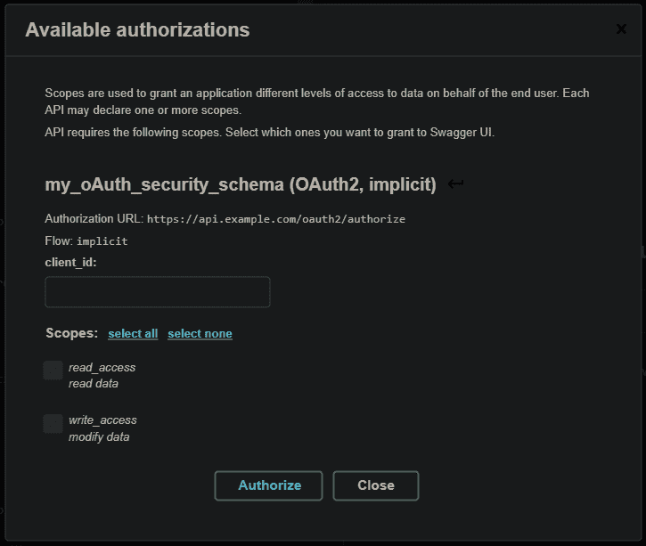
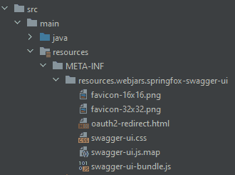

# Keycloak 集成–oauth 2 和 OpenID 与 Swagger UI

> 原文：<https://web.archive.org/web/20220930061024/https://www.baeldung.com/keycloak-oauth2-openid-swagger>

## 1.概观

在本教程中，我们将关注如何测试一个 REST 服务，该服务是安全的，并使用 Keycloak 通过 Swagger UI 进行身份验证和授权。

## 2.挑战

像其他 web 资源一样，REST APIs 通常是安全的。因此，服务消费者(比如 Swagger UI)不仅需要处理 HTTP 调用本身，还需要向服务提供者提供认证信息。

Keycloak 是一个 IAM 服务器，它允许在服务提供者实现之外进行身份验证和授权。它是架构的一部分，如下图所示:

[](/web/20220627175715/https://www.baeldung.com/wp-content/uploads/2022/01/oauth.svg)

正如我们所看到的，服务提供者和服务消费者都需要联系 Keycloak 服务器。首先，我们需要安装一个 [Keycloak 服务器，并将其作为 REST 服务提供者集成到 Spring Boot](/web/20220627175715/https://www.baeldung.com/spring-boot-keycloak) 应用程序中。然后，我们需要扩展 Swagger UI。

## 3.自定义 Swagger UI

我们可以通过在 HTML 中包含这样一个脚本来直接扩展 Swagger UI:

```java
<script src="keycloak/keycloak.js"></script>
<script>
  var keycloak = Keycloak('keycloak.json');
    keycloak.init({ onLoad: 'login-required' })
      .success(function (authenticated) {
        console.log('Login Successful');
        window.authorizations.add("oauth2", new ApiKeyAuthorization("Authorization", "Bearer " + keycloak.token, "header"));
      }).error(function () {
        console.error('Login Failed');
        window.location.reload();
      }
    );
 </script>
```

该脚本可以作为 [NPM 包](https://web.archive.org/web/20220627175715/https://www.npmjs.com/package/keycloak-js)获得，因此可以派生 [Swagger UI 源代码库](https://web.archive.org/web/20220627175715/https://github.com/swagger-api/swagger-ui)并通过相应的依赖项扩展项目。

## 4.使用标准

通过特定于供应商的代码扩展 Swagger UI 只有在非常特殊的情况下才有意义。因此，**我们应该更喜欢使用独立于供应商的标准**。以下部分将描述如何实现这一点。

### 4.1.现有标准

首先，我们需要知道存在哪些标准。对于认证和授权，有一个类似于 [OAuth2](https://web.archive.org/web/20220627175715/https://oauth.net/2/) 的协议。对于单点登录，我们可以使用 [OpenID Connect](https://web.archive.org/web/20220627175715/https://openid.net/connect/) (OIDC)作为 OAuth2 的[扩展。](https://web.archive.org/web/20220627175715/https://developer.okta.com/blog/2019/10/21/illustrated-guide-to-oauth-and-oidc)

描述一个 REST API 的标准是 [OpenAPI](https://web.archive.org/web/20220627175715/https://www.openapis.org/) 。该标准包括定义多个[安全方案](https://web.archive.org/web/20220627175715/https://swagger.io/docs/specification/authentication)，包括 OAuth2 和 OIDC:

```java
paths:
  /api/v1/products:
    get:
      ...
      security:
        - my_oAuth_security_schema:
          - read_access
...
securitySchemes:
  my_oAuth_security_schema:
    type: oauth2
    flows:
      implicit:
        authorizationUrl: https://api.example.com/oauth2/authorize
        scopes:
          read_access: read data
          write_access: modify data
```

### 4.2.扩展服务提供商

在代码优先的方法中，服务提供商可以基于代码生成 OpenAPI 文档。因此，安全方案也必须以这种方式提供。例如，Spring Boot 包括 SpringFox，我们可以编写这样一个配置类:

```java
@Configuration
public class OpenAPISecurityConfig {

    @Autowired
    void addSecurity(Docket docket) {
        docket
          .securitySchemes(of(authenticationScheme()))
          .securityContexts(of(securityContext()));
    }

    private SecurityScheme authenticationScheme() {
        return new OAuth2SchemeBuilder("implicit")
          .name("my_oAuth_security_schema")
          .authorizationUrl("https://api.example.com/oauth2/authorize")
          .scopes(authorizationScopes())
          .build();
    }

    private List<AuthorizationScope> authorizationScopes() {
        return Arrays.asList(
          new AuthorizationScope("read_access", "read data"),
          new AuthorizationScope("write_access", "modify data")
        );
    }

    private SecurityContext securityContext() {
        return SecurityContext.builder()
          .securityReferences(readAccessAuth())
          .operationSelector(operationContext ->
            HttpMethod.GET.equals(operationContext.httpMethod())
          )
          .build();
    }

    private List<SecurityReference> readAccessAuth() {
        AuthorizationScope[] authorizationScopes = new AuthorizationScope[] { authorizationScopes().get(0) };
        return of(new SecurityReference("my_oAuth_security_schema", authorizationScopes));
    }

} 
```

当然，使用其他技术会导致不同的实现。但是我们应该始终意识到必须生成的 OpenAPI。

### 4.3.扩展服务消费者

Swagger UI 默认支持 OpenAPI 认证方案——无需定制。我们将有可能进行身份验证:



其他客户会有不同的解决方案。例如，有一个用于 Angular 应用程序的 [NPM 模块](https://web.archive.org/web/20220627175715/https://github.com/manfredsteyer/angular-oauth2-oidc)，它以一种直接的方式提供 OAuth2 和 OpenID Connect (OIDC)。

### 4.4.虚张声势的用户界面限制

Swagger UI 从 3.38.0 版本开始支持 OpenID 连接发现(Swagger 编辑器从 3.14.8 版本开始)。可惜目前 3.0.0 版本的 SpringFox 打包了一个 Swagger UI 3.26.2。因此，**如果我们想要包含一个新版本的 Swagger UI，我们需要使用与 SpringFox 相同的目录结构将它直接包含在我们的应用程序**中，以掩盖 SpringFox 打包的文件:



相反，SpringDoc 1.6.1 并没有封装一个 Swagger UI，而是声明了一个对 [Swagger UI 4.1.3](https://web.archive.org/web/20220627175715/https://search.maven.org/artifact/org.webjars/swagger-ui/4.1.3/jar) 的可传递依赖，所以我们在 SpringDoc 上不会有任何问题。

## 5.结论

在本文中，我们指出了在使用 Keycloak 作为 IAM 的情况下，使用 Swagger UI 测试 REST 服务的可能性。最好的解决方案是使用 OpenAPI、OAuth2 和 OpenID Connect 等标准，这些工具都支持这些标准。

和往常一样，GitHub 上的所有代码[都是可用的。](https://web.archive.org/web/20220627175715/https://github.com/eugenp/tutorials/tree/master/spring-boot-modules/spring-boot-swagger-keycloak)