# 使用 Lightrun 深入探索

> 原文：<https://web.archive.org/web/20220930061024/https://www.baeldung.com/lightrun-diving-deeper>

## 1。简介

在我们的[上一篇文章](/web/20220909105024/https://www.baeldung.com/java-lightrun)中，我们介绍了[Lightrun](/web/20220909105024/https://www.baeldung.com/lightrun)——一个开发者观察平台。**在这篇文章中，我们将更深入地了解它所提供的特性，如何在我们的应用程序中更好地使用它们，以及我们能从中获得什么。**

## 2。快照

在我们的上一篇文章中，我们简要地研究了什么是[快照](/web/20220909105024/https://www.baeldung.com/lightrun-snapshots)以及它们能为我们做什么。在这里，我们将更深入地了解它们是什么，我们如何最好地使用它们，以及它们能为我们做什么。

快照类似于调试器断点。我们可以在应用程序的任何一行代码上注册快照。每次它被触发时，它会自动记录完整的堆栈跟踪和每个可见变量的值。就像普通的断点一样，这将包括局部变量、方法参数和类字段，并将在整个堆栈框架中这样做。

快照和调试器断点之间的主要区别在于快照是非侵入性的。它们不会阻塞任何东西——不管是整个应用程序还是正在执行的线程。它们记录当前的执行状态，应用程序继续运行，不会以任何方式中断应用程序。

在我们查看细节时，传统的阻塞断点(如调试器中的断点)会导致单个线程或整个应用程序停止暂停。Lightrun 允许我们在完全不影响实时应用程序的情况下完成所有这些工作。

### 2.1。放置快照

快照直接从我们的代码编辑器放入我们的应用程序。在本文中，我们使用的是 IntelliJ IDEA，但是一切也可以通过 Visual Studio 代码实现。我们需要确定在应用程序中的什么位置放置快照。然后我们可以右键单击这行代码，从菜单中选择“Lightrun >快照(虚拟断点)”:

[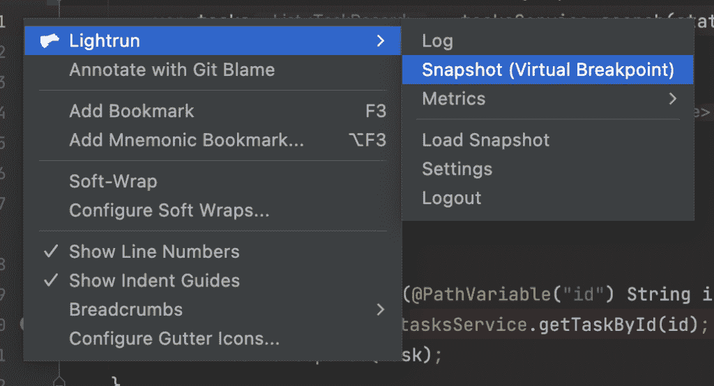](/web/20220909105024/https://www.baeldung.com/wp-content/uploads/2022/09/place-snapshot.png)

这样做将打开一个对话框，允许我们指定快照的详细信息:

[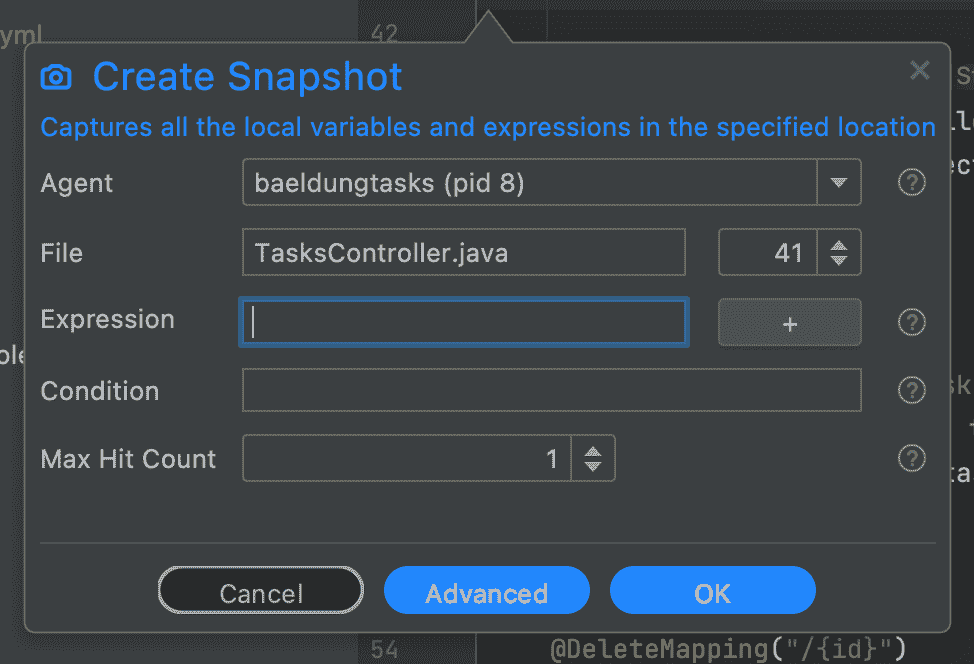](/web/20220909105024/https://www.baeldung.com/wp-content/uploads/2022/09/create-snapshot.png)

这种方法的默认行为相对简单，但通常是最有用的。它将:

*   在选定的行上拍摄快照。
*   没有关于何时触发快照的条件。
*   不需要用快照记录额外的表达式。
*   仅记录第一次触发快照的时间。
*   添加一小时后过期。

这意味着它将在下一次执行该行代码时记录确切的执行状态，只要是在下一个小时内。当我们诊断一个问题时，这通常是最有用的设置，因为我们希望控制记录的内容，而不会在记录中出现任何噪音。我们将在本文后面看到更多关于这些的内容。

一旦我们完成了这一步，一个蓝色的摄像头图标就会出现在注册快照的代码行旁边。这表明我们的快照已成功放置，并将在触发时记录:

[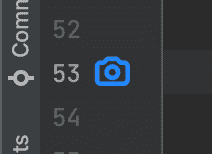](/web/20220909105024/https://www.baeldung.com/wp-content/uploads/2022/09/snapshot-added.png)

当快照被触发时，我们将自动在编辑器中看到详细信息。这与 IntelliJ 断点面板的外观和功能几乎完全相同，因为它的设计目的相同:

[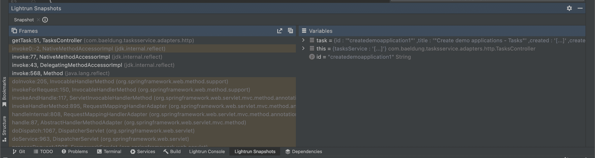](/web/20220909105024/https://www.baeldung.com/wp-content/uploads/2022/09/snapshot-triggered.png)

在这里，我们可以立即看到对我们执行的完整堆栈跟踪，以及我们可以访问的变量。这包括变量`this`，在其中我们可以看到当前类实例的字段。我们还可以深入到这些方法中，并点击进入堆栈框架中的其他方法，就像使用传统调试器一样。

### 2.2。条件快照

在某些情况下，我们希望仅在满足特定条件时记录快照。例如，仅当当前用户是特定用户名时。

Lightrun 快照允许我们在设置快照时指定一个条件。这与我们调试器中条件断点的工作方式非常相似。我们的条件被指定为计算结果为`true`或`false`的 Java 表达式。这可以访问在触发快照时可见的任何内容，即任何局部变量、参数、类字段或任何其他内容。

例如，假设我们有一个带参数`id`的方法。我们希望在调用时记录一个快照，但仅当提供的 ID 是一个特定值时。我们可以根据需要设置一个触发条件:

[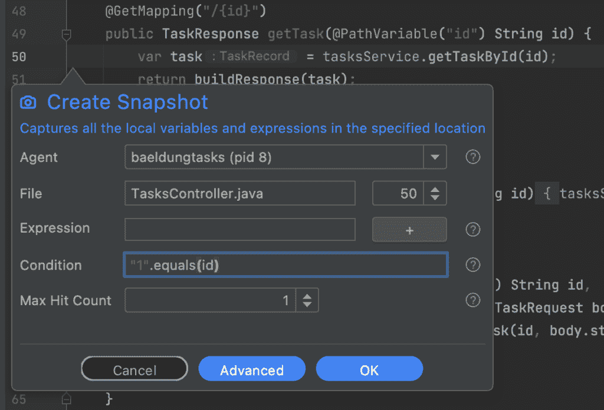](/web/20220909105024/https://www.baeldung.com/wp-content/uploads/2022/09/conditional-snapshot.png)

这意味着快照只有在使用我们的特定测试值调用时才会被触发，但是服务的任何其他实时使用都将被忽略，除非它们碰巧使用了相同的值。这有助于确保我们在快照窗格中看到的正是我们想要的，没有任何额外的噪声干扰它，使我们的诊断更加困难。

### 2.3。附加表达式

**在某些情况下，我们可能需要记录一些额外的值作为快照的一部分。**

这些可能是来自其他值的计算，只是为了让生活变得更容易——例如，钻取嵌套值以更容易地显示它们。这些也可能是获取值的调用，否则这些值不会被记录——例如，从静态变量如 [`RequestContextHolder`](https://web.archive.org/web/20220909105024/https://docs.spring.io/spring-framework/docs/current/javadoc-api/org/springframework/web/context/request/RequestContextHolder.html) 或 [`SecurityContextHolder`](/web/20220909105024/https://www.baeldung.com/get-user-in-spring-security#interface) 中获取。它们甚至可以是对我们能看到的任何值的方法调用，并记录这些方法的结果。

通过在快照对话框中输入要记录的表达式，以非常类似于条件的方式添加表达式:

[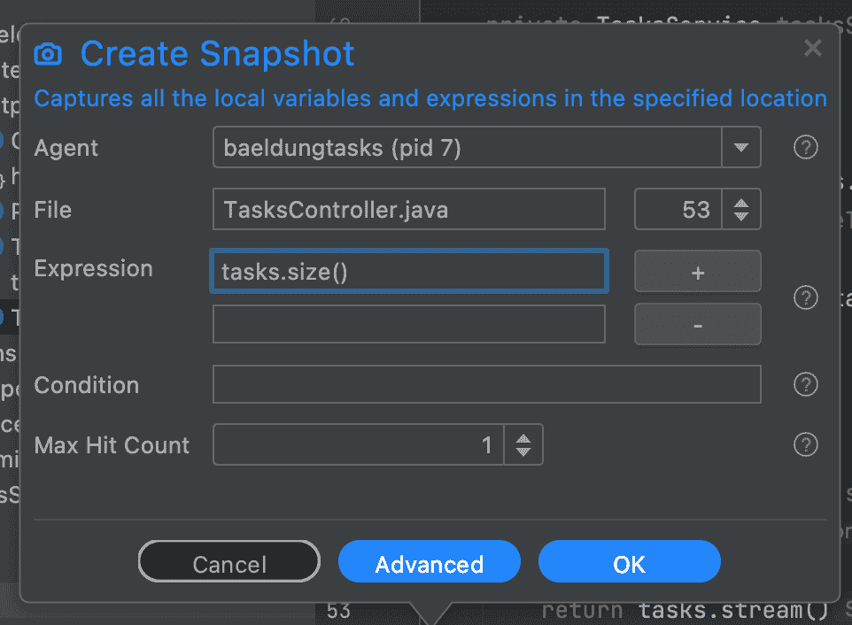](/web/20220909105024/https://www.baeldung.com/wp-content/uploads/2022/09/snapshot-expressions.png)

我们可以根据需要向单个快照添加任意多的表达式，只要触发快照，就会计算并记录所有这些表达式。

然后，这些值会作为“变量”窗格的一部分出现在记录的快照中，并带有不同的图标，表示它们是手动添加的表达式，而不是自动检测到的变量:

[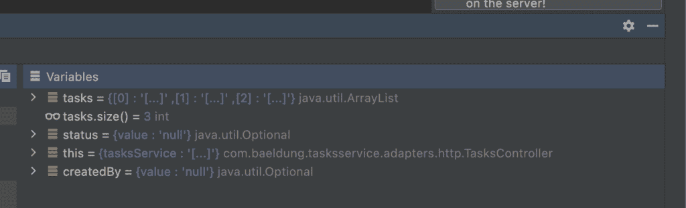](/web/20220909105024/https://www.baeldung.com/wp-content/uploads/2022/09/snapshot-variables.png)

### 2.4.记录多个快照

在某些情况下，我们可能希望从同一个地方记录多个快照。例如，我们可能希望在系统中运行几个稍有不同的请求，并且能够比较它们的快照来识别差异。

默认情况下，Lightrun 快照将只记录一个快照，但是我们可以通过在快照对话框中输入最大命中次数来配置它，以记录我们想要的数量:

[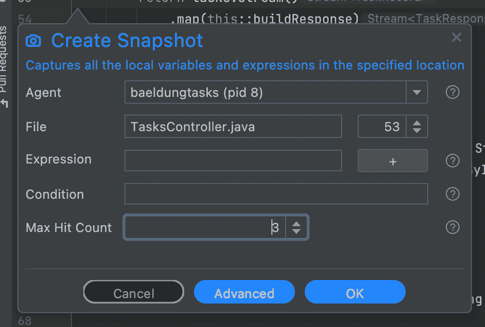](/web/20220909105024/https://www.baeldung.com/wp-content/uploads/2022/09/multiple-snapshot.png)

这样做将记录该执行次数的快照，并在我们的编辑器中提供给我们:

[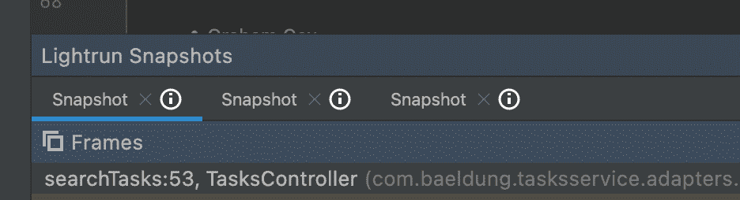](/web/20220909105024/https://www.baeldung.com/wp-content/uploads/2022/09/view-multiples-snapshots.png)

既然我们有多个快照要处理，我们需要知道哪些是哪些。通过单击“Snapshot”选项卡旁边的“I”图标，我们会看到一个关于该快照的信息对话框:

[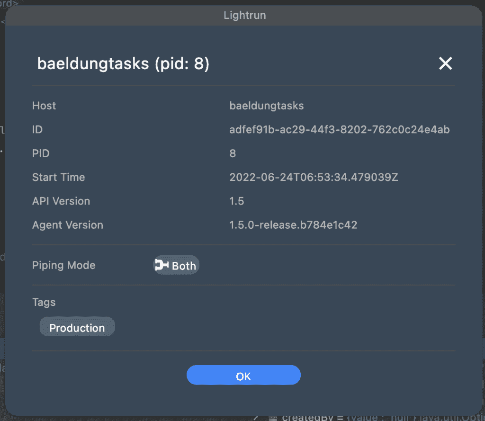](/web/20220909105024/https://www.baeldung.com/wp-content/uploads/2022/09/snapshot-info.png)

在这里，我们可以看到记录快照的服务器实例及其记录时间。我们现在可以根据需要记录尽可能多的快照，并确定哪些是哪些，以便我们可以更好地诊断发生了什么。

### 2.5。自动过期快照

记录快照确实会对我们的应用程序造成很小的性能损失。它们还会导致数据从我们的应用程序传输到 Lightrun 服务器，这可能会产生成本。这意味着，虽然快照对于诊断问题非常有用，但我们希望确保它们不会停留超过需要的时间。Lightrun 为我们解决了这个问题，它会自动让快照过期，这样它们只会根据我们的确切需求影响我们的应用程序。

默认情况下，快照将在 1 小时后自动禁用。如果我们想在影响最小的情况下进行一些有针对性的测试，我们可以将这个时间设置得非常短。或者，我们可以将其设置为一个很长的时间段，例如，捕获某个特定问题在一夜之间、一个周末甚至更长时间内发生的任何事件。

我们可以从“Create Snapshot”对话框的“Advanced”部分调整快照的持续时间。这为我们提供了一个额外的到期时间选项，使我们能够以小时、分钟和秒为单位指定快照的活动时间:

[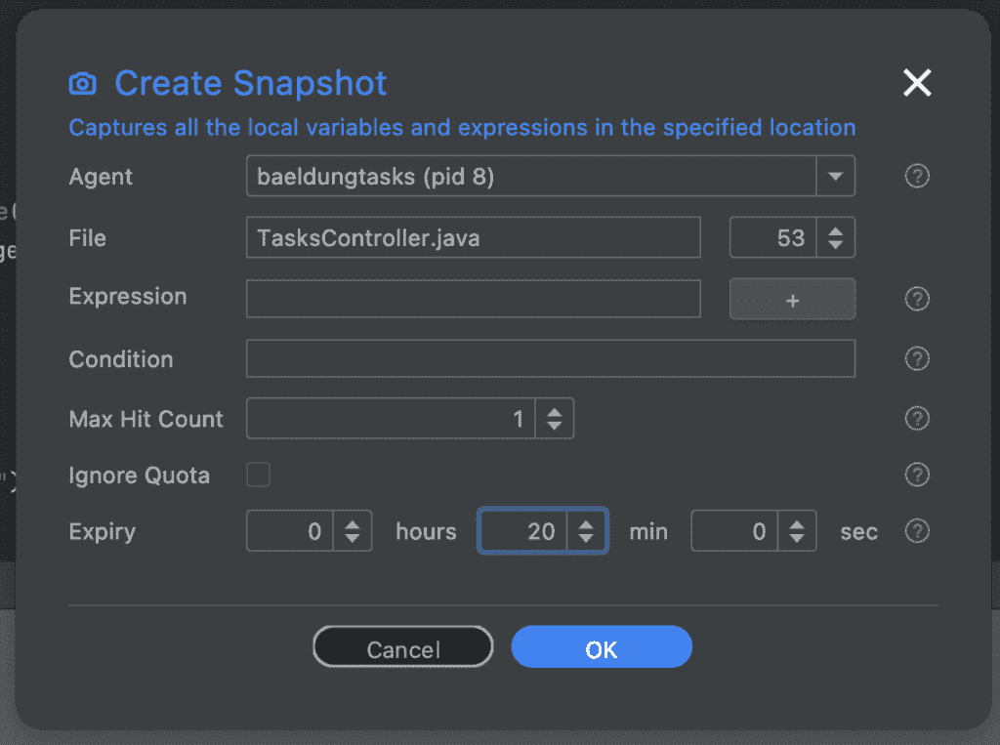](/web/20220909105024/https://www.baeldung.com/wp-content/uploads/2022/09/snapshot-expiry.png)

**此后，快照将保持存在，因此记录的快照仍然可用。**然而，它将停止记录任何东西——即使我们还没有达到最大点击数。如果我们不改变这一点，那么默认将是 1 小时。这段时间过后，快照的摄像机图标会变成红色，表示它不再处于活动状态:

[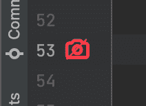](/web/20220909105024/https://www.baeldung.com/wp-content/uploads/2022/09/stop-recording.png)

请注意，快照保留在我们的系统中，因为否则记录的数据将不可用。但是，除非重新启用，否则它不会再记录任何数据。

## 3。日志

Lightrun 提供的另一个功能是能够动态地将[日志记录语句](/web/20220909105024/https://www.baeldung.com/lightrun-logs)添加到我们的应用程序中，而不需要改变或重启任何东西。

日志在配置方式上类似于快照，但用途不同。快照通过记录触发时线程的确切状态来工作。相反，日志会将所需的信息写到日志流中。

这意味着许多日志消息——无论是内置在应用程序中的还是由 Lightrun 动态添加的——都将在日志流中混合在一起，并给出正在发生的事情的更大画面。我们将看到来自我们的应用程序的日志消息和 Lightrun 添加到同一个流中的任何日志，这让我们对正在发生的事情有了一个全面的了解。

### 3.1。添加动态日志

**使用 Lightrun 添加动态日志的方式与添加快照非常相似。**我们右键单击要添加日志语句的行，并从菜单中选择“Lightrun > Log ”:

[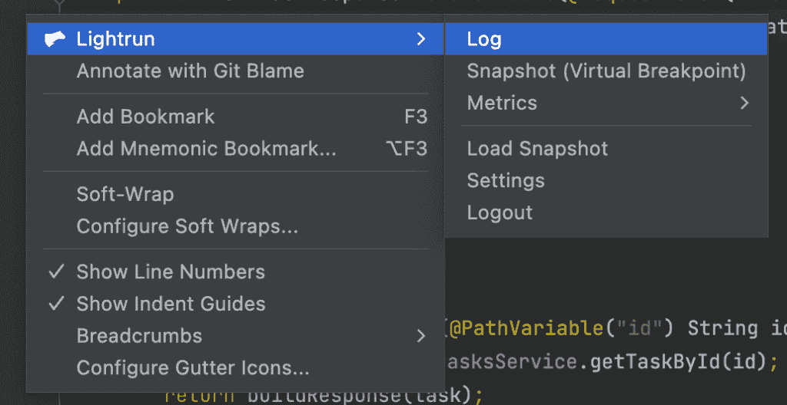](/web/20220909105024/https://www.baeldung.com/wp-content/uploads/2022/09/dynamic-log.png)

这为我们提供了一个对话框来配置动态日志语句，然后将它添加到我们正在运行的应用程序中:

[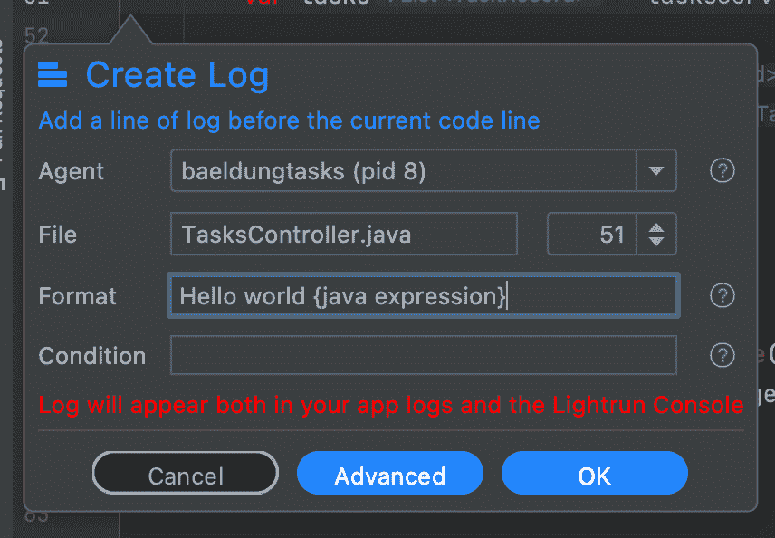](/web/20220909105024/https://www.baeldung.com/wp-content/uploads/2022/09/create-log.png)

这使我们能够指定将要输出的日志消息——可以将动态表达式作为消息的一部分。我们还可以指定触发日志消息所需的条件，与快照条件的工作方式完全相同。

默认情况下，这些日志消息将在 1 小时后过期，但这也可以通过单击“Advanced”按钮进行更改，与快照一样。

日志消息也有日志级别，默认为 INFO，但是我们可以根据需要将它们更改为 DEBUG、WARN 或 ERROR。

一旦我们添加了日志语句，编辑器将在代码视图中指出这一点，以显示日志语句在哪里以及它在做什么:

[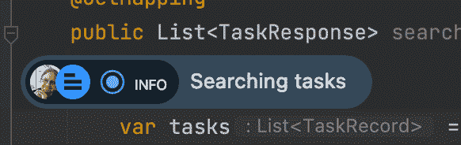](/web/20220909105024/https://www.baeldung.com/wp-content/uploads/2022/09/log-statement.png)

### 3.2。查看日志

默认情况下，我们的动态日志消息是使用 Java Util 日志记录编写的。在这种情况下，我们可以看到它们与应用程序生成的任何其他日志消息交织在一起，这可以提供更多信息:

[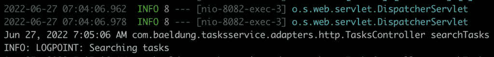](/web/20220909105024/https://www.baeldung.com/wp-content/uploads/2022/09/view-logs.png)

也可以将日志信息发送到我们的编辑器进行本地查看。这些可以在 Lightrun 控制台中看到，类似于我们看到的快照。如果我们希望在不增加输出日志文件的额外噪声的情况下向系统添加日志记录，这可能非常有用，尤其是在其他团队成员或其他系统正在使用这些日志的情况下:

[](/web/20220909105024/https://www.baeldung.com/wp-content/uploads/2022/09/lightrun-console-logs.png)

我们可以通过打开侧栏中的代理菜单并选择日志管道来更改日志消息输出的位置:

[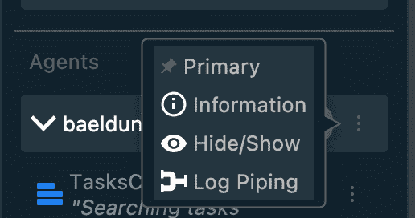](/web/20220909105024/https://www.baeldung.com/wp-content/uploads/2022/09/log-piping.png)

在这里，我们可以选择 App(这意味着写入应用程序的已配置 Java Util 日志设置)或 Plugin(这意味着写入我们编辑器中活动的 Lightrun 插件),或者两者都选。请注意，这是针对整个 Lightrun 代理完成的，而不是针对单个日志消息。

由于 Lightrun 代理的工作方式，Java Util 日志配置不是应用程序的标准配置。相反，当 Lightrun 动态记录器写入 Java Util 日志时，需要一些 [Lightrun 代理标志](https://web.archive.org/web/20220909105024/https://docs.lightrun.com/jvm/agent-configuration/#jvm-flags)来配置它的目标和输出格式。

### 3.3。日志表达式

记录简单的字符串已经很有用了。然而，记录应用程序的值要有用得多。同样，我们的快照可以包含自定义表达式，我们也可以对日志这样做。

当我们对日志这样做时，我们将表达式直接添加到日志消息中。这是通过用花括号将表达式括起来实现的:

```java
Searching tasks: status={status}, createdBy={createdBy}
```

当我们这样做时，这些表达式中的任何一个都将在生成 log 语句时自动展开:

[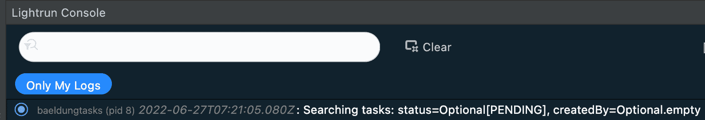](/web/20220909105024/https://www.baeldung.com/wp-content/uploads/2022/09/logging-expressions.png)

这些表达式可以是在生成日志语句时可以确定的任何内容，与快照的方式完全相同。

这些表达式有时会占用大量 CPU 时间来计算。如果发生这种情况，Lightrun 可能会自动暂停某个特定的日志，这样它们就不会干扰应用程序的运行。因此，建议尽可能简单地记录表达式。

## 4。指标

我们可以对 Lightrun 执行的最后一个操作是记录一些关于我们应用程序的[指标](/web/20220909105024/https://www.baeldung.com/lightrun-metrics)。这使我们能够查看应用程序的使用细节——例如，某些事情发生的频率或持续的时间。

与快照和日志一样，通过右键单击相应的代码行并选择“Lightrun”>“Metrics”来添加指标:

[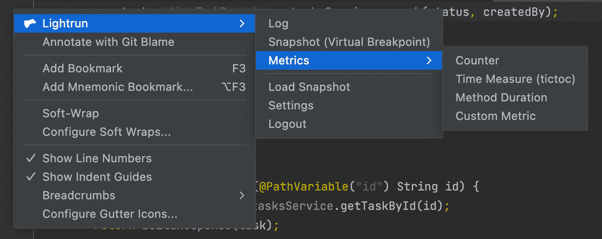](/web/20220909105024/https://www.baeldung.com/wp-content/uploads/2022/09/lightrun-metrics.png)

我们可以立即看出这略有不同——我们可以添加不同类型的指标:

*   计数器——记录一行代码被执行的简单次数。
*   时间度量——记录两行代码之间花费的时间。
*   方法持续时间–记录进入和退出方法之间的时间。
*   自定义指标–这使用自定义表达式根据代码中的可用值生成指标。

在每种情况下，我们都会得到标准的 Lightrun 对话框来创建我们的度量。这使我们能够配置指标，包括为指标添加名称、触发条件以及过期时间，过期时间过后指标将停止工作，就像我们对快照和日志所做的一样。

默认情况下，这些指标会输出到日志记录流程，但如果需要，也可以集成到 StatsD、Prometheus 和其他工具中。

### 4.1。计数器

计数器是一些代码被执行的次数的简单测量。每次到达我们的代码行，计数器就增加 1，然后我们可以看到这种情况发生的频率。

添加计数器的方法是从 Lightrun 菜单中选择 counter，然后填写对话框:

[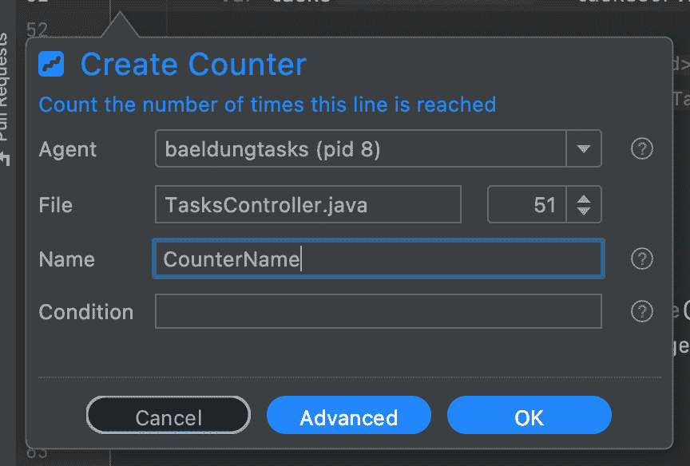](/web/20220909105024/https://www.baeldung.com/wp-content/uploads/2022/09/lightrun-counter.png)

这大部分是相当标准的。唯一不同寻常的是“Name”字段——我们需要给每个计数器一个唯一的名称，以便我们可以跟踪它们。

特别是，这里的一个强大的特性是，我们可以设置计数器——与所有的指标一样——并为它们附加条件。这使我们能够只在满足其他条件时才计算某一行代码被执行的次数，例如只针对某个用户或影响某些记录。

添加计数器不会立即做任何事情。然而，**一旦第一次被触发，它将开始以类似于日志输出的方式报告度量值**-基于管道设置的日志输出。

我们的编辑器每 10 秒显示一次指标值:

[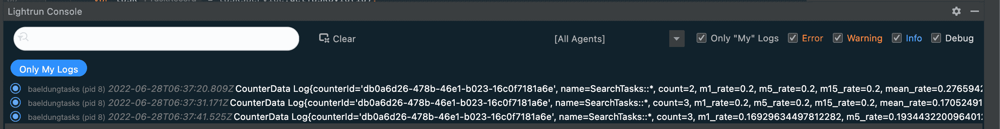](/web/20220909105024/https://www.baeldung.com/wp-content/uploads/2022/09/log-metrics.png)

而日志输出显示每秒的度量值:

[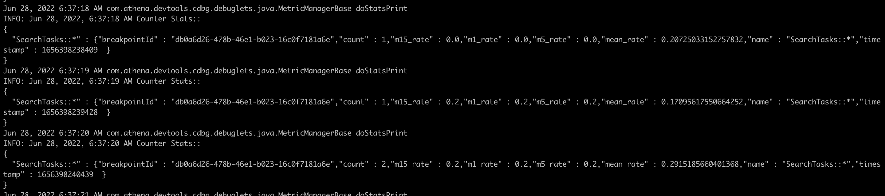](/web/20220909105024/https://www.baeldung.com/wp-content/uploads/2022/09/log-output-metrics.png)

该输出由与日志输出完全相同的设置控制，并将我们的指标与我们的日志交错，以更好地描述正在发生的事情。这使我们能够跟踪指标随时间的变化，以查看代码被触发的速率。

### 4.2。持续时间

当计数器被用来测量一行代码被执行的次数时，持续时间被用来测量代码运行的时间。这些也称为“TicToc”指标——Tic 开始记录，Toc 停止记录，类似于时钟的噪声。

当创建持续时间时，我们需要准确地配置我们正在测量的代码片段。这是通过指定开始和停止记录的行来完成的–在打开对话框之前选择一个代码块，或者在对话框中输入行号:

[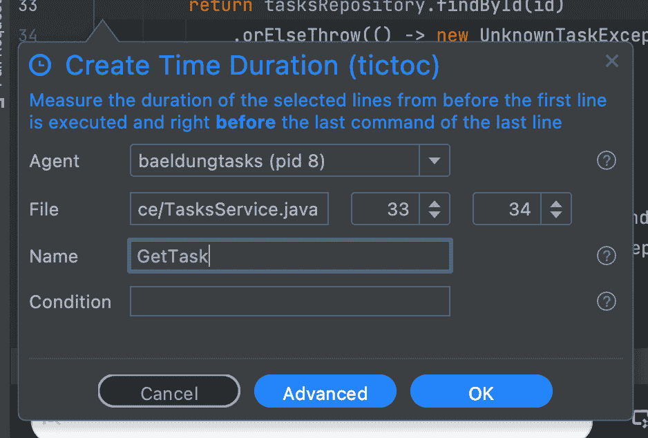](/web/20220909105024/https://www.baeldung.com/wp-content/uploads/2022/09/time-duration.png)

除此之外，创建持续时间与创建计数器是一样的。

**一旦创建，这些指标将立即开始输出，而不是等待第一次触发。**这些输出是插件和应用程序的标准输出，与计数器的输出完全相同，将向我们显示代码段的运行频率以及代码运行的最快、最慢和平均时间:

[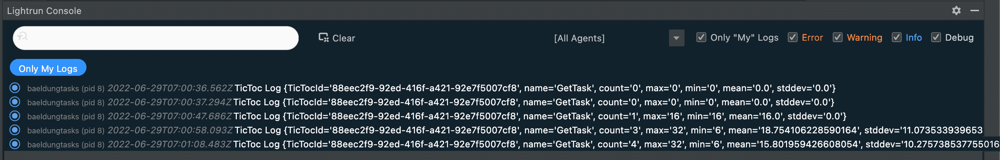](/web/20220909105024/https://www.baeldung.com/wp-content/uploads/2022/09/time-duration-metrics.png)

### 4.3。方法持续时间

方法持续时间度量基本上与持续时间相同，但是我们没有指定开始和结束行，而是指定了完整的方法:

[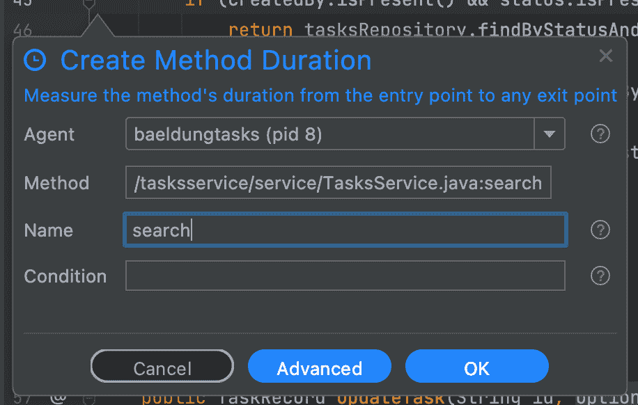](/web/20220909105024/https://www.baeldung.com/wp-content/uploads/2022/09/method-duration.png)

一旦添加，它的功能与覆盖整个方法体的持续时间度量完全相同。开始时间被认为是进入方法的时间，结束时间被认为是离开方法的时间，不管是通过返回还是通过异常:

[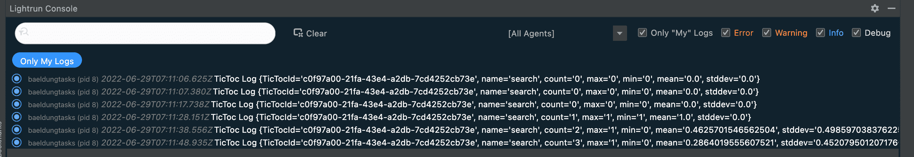](/web/20220909105024/https://www.baeldung.com/wp-content/uploads/2022/09/method-duration-logs.png)

我们可以从这里的输出中看到，这些实际上也是“TicToc 日志”条目，只是 Lightrun 根据方法本身而不是根据代码行为我们自动确定了开始和停止点。

### 4.4。自定义指标

我们的最终指标只是一个自定义指标。这让我们可以聚合代码中的数字，不管这些数字是什么。例如，我们可能想要计算一些搜索结果中返回的记录数。

当创建这种类型的指标时，我们需要指定一个表达式。该表达式返回我们的指标将聚合的数字，像其他地方一样，它可以是在我们的代码中可以计算的任何表达式:

[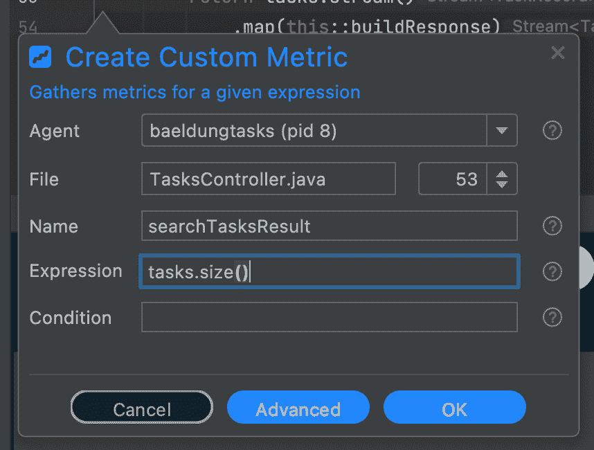](/web/20220909105024/https://www.baeldung.com/wp-content/uploads/2022/09/custom-metrics.png)

当这些指标输出时，它向我们显示了它被触发的次数以及表达式的最大值、最小值和平均值:

[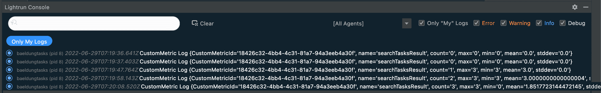](/web/20220909105024/https://www.baeldung.com/wp-content/uploads/2022/09/custom-metrics-logs.png)

## 5。总结

在这里，我们已经详细介绍了 Lightrun 可以让我们更深入地了解我们的应用程序并更好地理解它们是如何工作的主要方式。

为什么不在您的下一个应用程序中使用它，以更好地了解正在发生的事情，甚至帮助诊断可能会发生的任何问题。