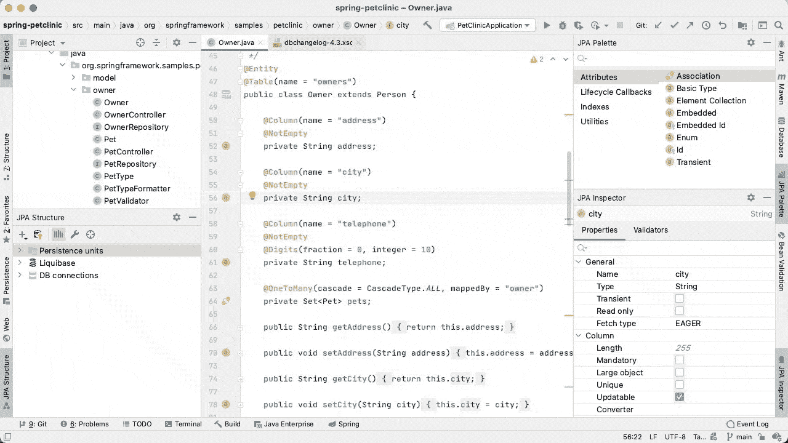

# 使用 Liquibase 安全地发展您的数据库模式

> 原文：<https://web.archive.org/web/20220930061024/https://www.baeldung.com/liquibase-refactor-schema-of-java-app>

## 1。概述

在这个快速教程中，我们将利用 **[Liquibase](https://web.archive.org/web/20220617075740/http://www.liquibase.org/) 来发展 Java web 应用程序的数据库模式**。

我们将首先看一个通用的 Java 应用程序，我们还将重点看一些适用于 Spring 和 Hibernate 的有趣选项。

简而言之，使用 Liquibase 的核心是**`changeLog`文件**，这是一个 XML 文件，它跟踪所有需要运行来更新数据库的更改。

让我们从需要添加到我们的 `pom.xml`中的 Maven 依赖项开始:

```java
<dependency>
    <groupId>org.liquibase</groupId>
     <artifactId>liquibase-core</artifactId>
      <version>3.4.1</version>
</dependency>
```

我们还可以在这里检查是否有 liquibase-core 的新版本[。](https://web.archive.org/web/20220617075740/https://mvnrepository.com/artifact/org.liquibase/liquibase-core)

## 延伸阅读:

## [liqui base 回滚简介](/web/20220617075740/https://www.baeldung.com/liquibase-rollback)

Learn how to use the rollback feature of a Liquibase framework.[Read more](/web/20220617075740/https://www.baeldung.com/liquibase-rollback) →

## [使用 Flyway 进行数据库迁移](/web/20220617075740/https://www.baeldung.com/database-migrations-with-flyway)

This article describes key concepts of Flyway and how we can use this framework to continuously remodel our application's database schema reliably and easily.[Read more](/web/20220617075740/https://www.baeldung.com/database-migrations-with-flyway) →

## [使用 Spring Boot 加载初始数据的快速指南](/web/20220617075740/https://www.baeldung.com/spring-boot-data-sql-and-schema-sql)

A quick and practical example of using data.sql and schema.sql files in Spring Boot.[Read more](/web/20220617075740/https://www.baeldung.com/spring-boot-data-sql-and-schema-sql) →

## 2。数据库更改日志

现在我们来看一个简单的`changeLog`文件。

这只是在表“`users`”中增加了一列“`address`”:

```java
<databaseChangeLog 

  xmlns:ext="http://www.liquibase.org/xml/ns/dbchangelog-ext" 
  xmlns:xsi="http://www.w3.org/2001/XMLSchema-instance" 
  xsi:schemaLocation="http://www.liquibase.org/xml/ns/dbchangelog-ext
   http://www.liquibase.org/xml/ns/dbchangelog/dbchangelog-ext.xsd 
   http://www.liquibase.org/xml/ns/dbchangelog 
   http://www.liquibase.org/xml/ns/dbchangelog/dbchangelog-3.4.xsd">

    <changeSet author="John" id="someUniqueId">
        <addColumn tableName="users">
            <column name="address" type="varchar(255)" />
        </addColumn>
    </changeSet>

</databaseChangeLog>
```

注意变更集是如何被一个`id`和一个`author`识别的，以确保它可以被唯一地识别并且只被应用一次。

现在让我们看看如何将它连接到我们的应用程序中，并确保它在应用程序启动时运行。

## 3。使用 Spring Bean 运行 Liquibase】

我们在应用程序启动时运行更改的第一个选项是通过 Spring bean。

当然，还有许多其他方法，但是如果我们正在处理一个 Spring 应用程序，这是一个好的、简单的方法:

```java
@Bean
public SpringLiquibase liquibase() {
    SpringLiquibase liquibase = new SpringLiquibase();
    liquibase.setChangeLog("classpath:liquibase-changeLog.xml");
    liquibase.setDataSource(dataSource());
    return liquibase;
}
```

注意我们是如何将它指向需要存在于类路径中的有效的`changeLog`文件的。

## 4。将 Liquibase 与 Spring Boot 一起使用

如果我们使用的是 [Spring Boot](https://web.archive.org/web/20220617075740/http://liquibase.change-log=classpath:liquibase-changeLog.xml) ，就不需要为 Liquibase 定义一个 *bean* ，但是我们仍然需要确保我们添加了 liquibase-core 依赖项。

然后，我们只需要将我们的更改日志放入**db/changelog/db . changelog-master . YAML**中，Liquibase 迁移将在启动时自动运行。

我们可以使用`**liquibase.change-log**`属性更改默认的 changelog 文件:

```java
liquibase.change-log=classpath:liquibase-changeLog.xml
```

## 5.禁用 Spring Boot 的 Liquibase

有时，我们可能需要在启动时禁用 Liquibase 迁移的执行。

**我们最简单的选择是使用一个`spring.liquibase.enabled`属性。**这样，所有剩余的 Liquibase 配置保持不变。

这是 Spring Boot 新协议的例子:

```java
spring.liquibase.enabled=false
```

对于 Spring Boot 1.x，我们需要使用一个`liquibase.enabled`属性:

```java
liquibase.enabled=false
```

## 6。用一个 Maven 插件生成`changeLog`

我们可以使用 Liquibase Maven 插件来生成一个文件，而不是手动编写`changeLog`文件，这样可以节省很多工作。

### 6.1。插件配置

以下是我们`pom.xml`的变化:

```java
<dependency>
    <groupId>org.liquibase</groupId>
    <artifactId>liquibase-maven-plugin</artifactId>
    <version>3.4.1</version>
</dependency> 
...
<plugins>
    <plugin>
        <groupId>org.liquibase</groupId>
        <artifactId>liquibase-maven-plugin</artifactId>
        <version>3.4.1</version>
        <configuration>                  
            <propertyFile>src/main/resources/liquibase.properties</propertyFile>
        </configuration>                
    </plugin> 
</plugins>
```

### 6.2。从现有数据库生成一个`ChangeLog`

我们可以使用插件从现有的数据库中生成一个 changelog:

```java
mvn liquibase:generateChangeLog
```

以下是`liquibase` 属性:

```java
url=jdbc:mysql://localhost:3306/oauth_reddit
username=tutorialuser
password=tutorialmy5ql
driver=com.mysql.jdbc.Driver
outputChangeLogFile=src/main/resources/liquibase-outputChangeLog.xml
```

最终结果是一个`changeLog`文件，我们可以用它来创建一个初始的 DB 模式或者填充数据。

这看起来是这样的:

```java
<?xml version="1.0" encoding="UTF-8" standalone="no"?>
<databaseChangeLog ...>

    <changeSet author="John (generated)" id="1439225004329-1">
        <createTable tableName="APP_USER">
            <column autoIncrement="true" name="id" type="BIGINT">
                <constraints primaryKey="true"/>
            </column>
            <column name="accessToken" type="VARCHAR(255)"/>
            <column name="needCaptcha" type="BIT(1)">
                <constraints nullable="false"/>
            </column>
            <column name="password" type="VARCHAR(255)"/>
            <column name="refreshToken" type="VARCHAR(255)"/>
            <column name="tokenExpiration" type="datetime"/>
            <column name="username" type="VARCHAR(255)">
                <constraints nullable="false"/>
            </column>
            <column name="preference_id" type="BIGINT"/>
            <column name="address" type="VARCHAR(255)"/>
        </createTable>
    </changeSet>
    ...
</databaseChangeLog>
```

### 6.3。从两个数据库之间的差异生成一个`ChangeLog`

我们可以使用插件从两个现有数据库(例如，开发和生产)之间的差异生成一个`changeLog`文件:

```java
mvn liquibase:diff
```

以下是属性:

```java
changeLogFile=src/main/resources/liquibase-changeLog.xml
url=jdbc:mysql://localhost:3306/oauth_reddit
username=tutorialuser
password=tutorialmy5ql
driver=com.mysql.jdbc.Driver
referenceUrl=jdbc:h2:mem:oauth_reddit
diffChangeLogFile=src/main/resources/liquibase-diff-changeLog.xml
referenceDriver=org.h2.Driver
referenceUsername=sa
referencePassword=
```

下面是生成的`changeLog`的一个片段:

```java
<?xml version="1.0" encoding="UTF-8" standalone="no"?>
<databaseChangeLog ...>
    <changeSet author="John" id="1439227853089-1">
        <dropColumn columnName="address" tableName="APP_USER"/>
    </changeSet>
</databaseChangeLog>
```

这是一种非常强大的方式来发展我们的数据库，例如，允许 Hibernate 自动生成一个新的开发模式，然后使用它作为旧模式的参考点。

## 7。使用 Liquibase 休眠插件

如果我们的应用程序使用 Hibernate，我们将看看一种非常有用的生成`changeLog`的方法，这就是[插件`liquibase-hibernate`的](https://web.archive.org/web/20220617075740/https://github.com/liquibase/liquibase-hibernate/wiki)。

### 7.1。插件配置

首先，让我们配置新插件并使用正确的依赖项:

```java
<plugins>
    <plugin>
        <groupId>org.liquibase</groupId>
        <artifactId>liquibase-maven-plugin</artifactId>
        <version>3.4.1</version>
        <configuration>                  
            <propertyFile>src/main/resources/liquibase.properties</propertyFile>
        </configuration> 
        <dependencies>
            <dependency>
                <groupId>org.liquibase.ext</groupId>
                <artifactId>liquibase-hibernate4</artifactId>
                <version>3.5</version>
            </dependency>
            <dependency>
                <groupId>org.springframework</groupId>
                <artifactId>spring-beans</artifactId>
                <version>4.1.7.RELEASE</version>
            </dependency>
            <dependency>
                <groupId>org.springframework.data</groupId>
                <artifactId>spring-data-jpa</artifactId>
                <version>1.7.3.RELEASE</version>
            </dependency>
        </dependencies>               
    </plugin> 
</plugins>
```

### 7.2。从数据库和持久化实体之间的差异生成一个`changeLog`

我们可以使用这个插件从现有数据库(例如，生产)和我们新的持久性实体之间的差异中生成一个`changeLog`文件。

因此，为了使事情变得简单，一旦修改了一个实体，我们可以简单地根据旧的 DB 模式生成更改，从而得到一种干净、强大的方式来在生产中发展我们的模式。

以下是`liquibase`属性:

```java
changeLogFile=classpath:liquibase-changeLog.xml
url=jdbc:mysql://localhost:3306/oauth_reddit
username=tutorialuser
password=tutorialmy5ql
driver=com.mysql.jdbc.Driver
referenceUrl=hibernate:spring:org.baeldung.persistence.model
  ?dialect=org.hibernate.dialect.MySQLDialect
diffChangeLogFile=src/main/resources/liquibase-diff-changeLog.xml
```

注意`referenceUrl`正在使用包扫描，因此`dialect`参数是必需的。

## 8.使用 JPA Buddy 插件在 IntelliJ IDEA 中生成`changeLog`

如果我们使用非 Hibernate ORM(例如 EclipseLink 或 OpenJPA ),或者我们不想添加额外的依赖项，比如`liquibase-hibernate`插件，我们可以使用 [JPA Buddy](/web/20220617075740/https://www.baeldung.com/jpa-buddy-post) 。**这个 IntelliJ IDEA 插件将 Liquibase 的有用特性集成到了 IDE 中。**

要生成差异`changeLog`，我们只需安装插件，然后从 JPA 结构面板调用动作。我们选择要比较的源(数据库、JPA 实体或 Liquibase 快照)和目标(数据库或 Liquibase 快照)。

**JPA Buddy 将生成`changeLog`，如下图动画所示**:

[](/web/20220617075740/https://www.baeldung.com/wp-content/uploads/2021/04/jpabuddy_intellij.gif)

JPA Buddy 相对于`liquibase-hibernate`插件的另一个优势是能够覆盖 Java 和数据库类型之间的默认映射。此外，它可以与 Hibernate 自定义类型和 JPA 转换器一起正常工作。

## 9。结论

在本文中，我们举例说明了使用 Liquibase 的几种方法，并获得了一种安全而成熟的方式来发展和重构 Java 应用程序的 DB 模式。

GitHub 上的[提供了所有这些例子和代码片段的实现。](https://web.archive.org/web/20220617075740/https://github.com/Baeldung/reddit-app)