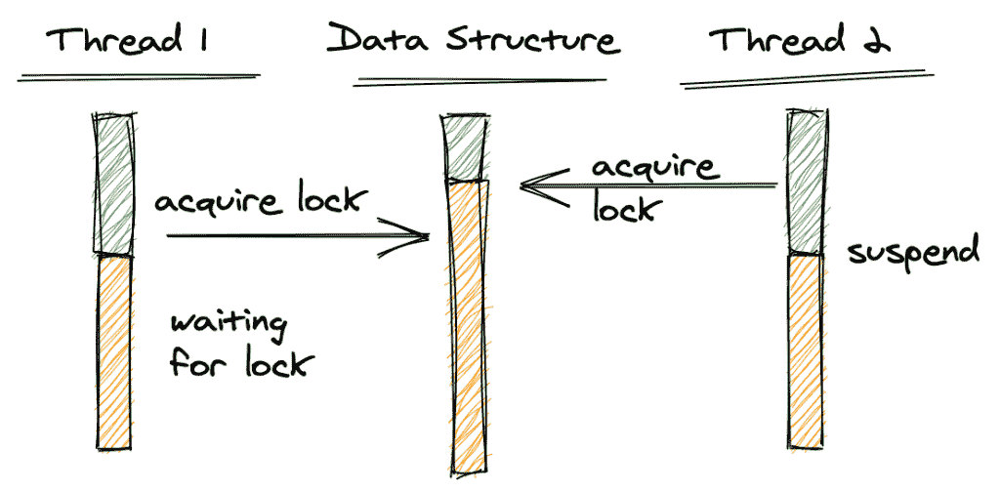
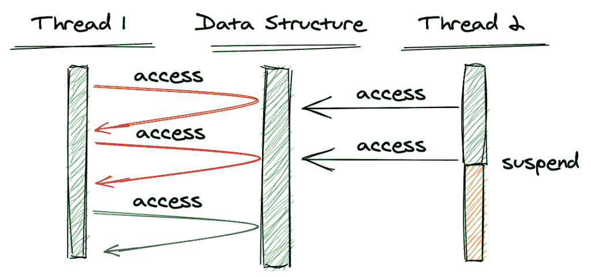
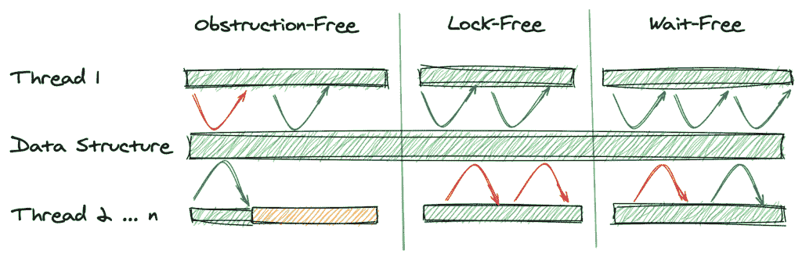
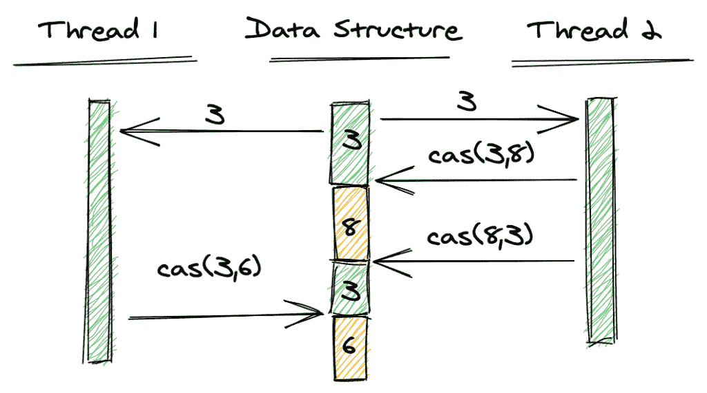
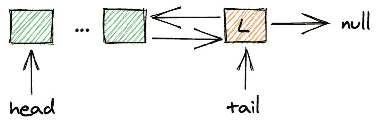
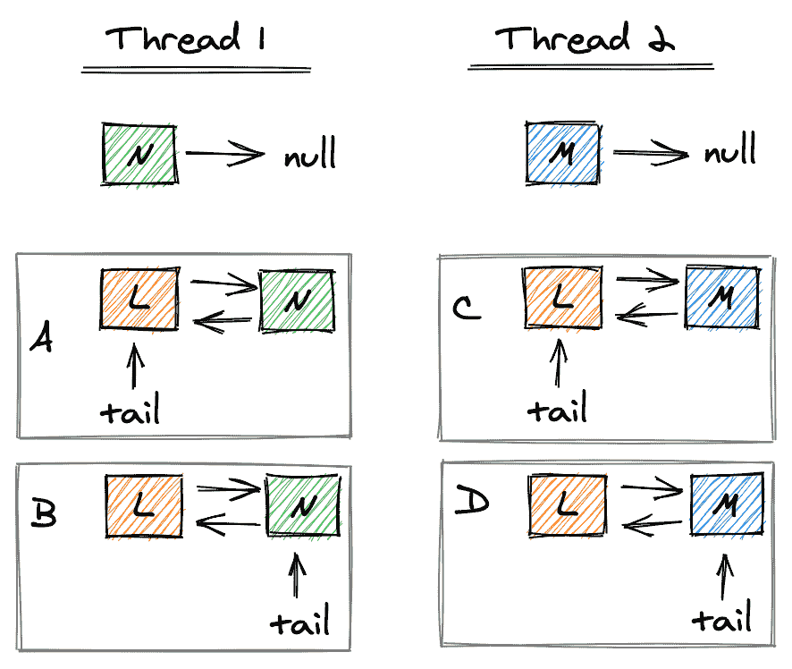
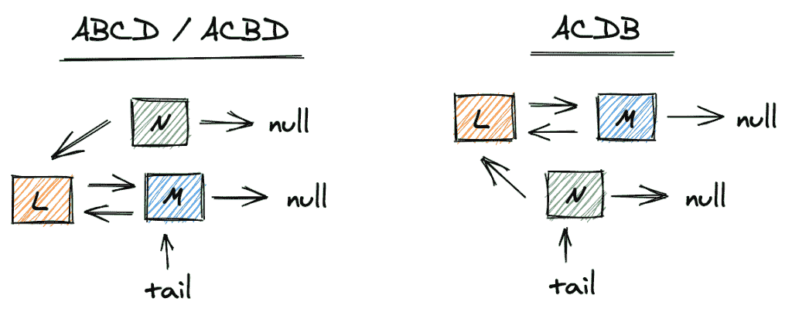
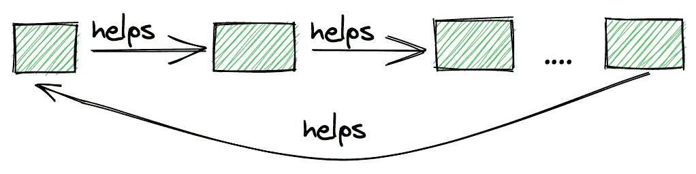

# 用 Java 例子介绍无锁数据结构

> 原文：<https://web.archive.org/web/20220930061024/https://www.baeldung.com/lock-free-programming>

## 1.介绍

在本教程中，我们将了解什么是非阻塞数据结构，以及为什么它们是基于锁的并发数据结构的重要替代。

首先，我们将复习一些术语，如`obstruction-free`、`lock-free`和`wait-free`。

其次，我们将看看像`CAS`(比较和交换)这样的非阻塞算法的基本构件。

第三，我们将看看无锁队列在 Java 中的实现，最后，我们将概述如何实现`wait-freedom`的方法。

## 2.锁定与饥饿

首先，让我们看看阻塞线程和饥饿线程之间的区别。

[](/web/20220607130823/https://www.baeldung.com/wp-content/uploads/2020/05/threads_lock-1024x504-1.png)

在上图中，线程 2 获取了数据结构上的锁。当线程 1 也试图获取锁时，它需要等待，直到线程 2 释放锁；在获得锁之前，它不会继续。如果我们在线程 2 持有锁的时候挂起它，线程 1 将不得不永远等待。

下图说明了线程匮乏的情况:

[](/web/20220607130823/https://www.baeldung.com/wp-content/uploads/2020/05/threads_lockfree-1024x482-1.png)

这里，线程 2 访问数据结构，但不获取锁。线程 1 尝试同时访问数据结构，检测并发访问，并立即返回，通知线程它无法完成(红色)操作。线程 1 将再次尝试，直到成功完成操作(绿色)。

这种方法的优点是我们不需要锁。**然而，可能发生的情况是，如果线程 2(或其他线程)以高频率访问数据结构，那么线程 1 需要大量的尝试，直到它最终成功。我们称之为饥饿。**

稍后我们将看到`compare-and-swap`操作如何实现无阻塞访问。

## 3.非阻塞数据结构的类型

我们可以区分三种级别的非阻塞数据结构。

### 3.1.无障碍的

自由阻塞是非阻塞数据结构的最弱形式。**这里，我们只要求在所有其他线程都挂起的情况下保证一个线程继续运行**。

更准确地说，如果所有其他线程都被挂起，一个线程不会继续挨饿。这不同于使用锁，如果线程正在等待锁，而持有锁的线程被挂起，那么等待的线程将永远等待下去。

### 3.2.无锁

如果在任何时候，至少有一个线程可以继续执行，那么数据结构提供了锁自由。所有其他线程可能都在挨饿。与自由阻塞的区别在于，即使没有线程被挂起，也至少有一个非饥饿线程。

### 3.3.无需等待

一个数据结构是无等待的，如果它是无锁的，并且每个线程都保证在有限数量的步骤后继续，也就是说，线程不会因为“不合理的大”数量的步骤而饥饿。

### 3.4.摘要

让我们用图形表示来总结这些定义:

[](/web/20220607130823/https://www.baeldung.com/wp-content/uploads/2020/05/threads_summary-1.png)

图像的第一部分显示了无阻碍，因为线程 1(顶部线程)可以在我们暂停其他线程(底部的黄色线程)后继续进行(绿色箭头)。

中间部分显示锁自由。至少线程 1 可以前进，而其他线程可能正在挨饿(红色箭头)。

最后一部分展示了等待自由。这里，我们保证线程 1 在一定时间的饥饿(红色箭头)后可以继续(绿色箭头)。

## 4.非阻塞原语

在这一节中，我们将研究三种基本操作，它们有助于我们在数据结构上构建无锁操作。

### 4.1.比较和交换

**用于避免锁定的基本操作之一是`compare-and-swap` (CAS)操作**。

比较和交换的思想是，只有当一个变量的值与我们从主内存中获取该变量的值相同时，它才会被更新。 **CAS 是一个原子操作，这意味着获取和更新是一个单一的操作**:

[](/web/20220607130823/https://www.baeldung.com/wp-content/uploads/2022/01/threads_cas-1-1024x572-2.png)

这里，两个线程都从主内存中获取值 3。线程 2 成功(绿色)并将变量更新为 8。由于线程 1 的第一个 CAS 预期值仍然是 3，CAS 失败(红色)。因此，线程 1 再次获取该值，第二次 CAS 成功。

**这里重要的一点是，CAS 不获取数据结构上的锁，但如果更新成功，则返回`true`，否则返回`false`。**

以下代码片段概述了 CAS 的工作原理:

```java
volatile int value;

boolean cas(int expectedValue, int newValue) {
    if(value == expectedValue) {
        value = newValue;
        return true;
    }
    return false;
}
```

如果它仍然有预期的值，我们只使用新值更新该值，否则，它返回`false`。以下代码片段显示了如何调用 CAS:

```java
void testCas() {
    int v = value;
    int x = v + 1;

    while(!cas(v, x)) {
        v = value;
        x = v + 1;
    }
}
```

我们尝试更新我们的值，直到 CAS 操作成功，即返回`true`。

**然而，线程可能会陷入饥饿状态**。如果其他线程同时对同一个变量执行 CAS，就会发生这种情况，因此特定线程的操作将永远不会成功(或者将花费不合理的时间来成功)。尽管如此，如果`compare-and-swap`失败了，我们知道另一个线程成功了，因此我们也确保了全局进度，这是锁自由所要求的。

**需要注意的是，硬件应该支持`compare-and-swap`，使其成为真正的原子操作，而不使用锁定。**

Java 在[类`sun.misc.Unsafe`](/web/20220607130823/https://www.baeldung.com/java-unsafe) 中提供了`compare-and-swap`的实现。但是，在大多数情况下，我们不应该直接使用这个类，而是用[原子变量](/web/20220607130823/https://www.baeldung.com/java-atomic-variables)来代替。

再者，`compare-and-swap`并不妨碍 A-B-A 的问题。我们将在下一节中讨论这个问题。

### 4.2.加载链接/存储条件

`compare-and-swap `的替代物是`load-link/store-conditional`。让我们先重温一下`compare-and-swap`。正如我们之前看到的，只有当主内存中的值仍然是我们期望的值时，CAS 才会更新这个值。

但是，如果该值已经更改，同时又改回了以前的值，CAS 也会成功。

下图说明了这种情况:

[](/web/20220607130823/https://www.baeldung.com/wp-content/uploads/2020/05/threads_aba-1024x571-1.png)

线程 1 和线程 2 都读取变量的值，即 3。然后线程 2 执行 CAS，成功地将变量设置为 8。然后，线程 2 再次执行 CAS，将变量设置回 3，同样成功。最后，线程 1 执行 CAS，期望值为 3，并且也成功了，即使我们的变量的值在两次之间被修改了两次。

这就是所谓的 A-B 问题。当然，根据用例的不同，这种行为可能不是问题。然而，其他人可能不希望这样。Java 用[和`AtomicStampedReference`类](/web/20220607130823/https://www.baeldung.com/java-atomicstampedreference)提供了`load-link/store-conditional`的实现。

### 4.3.获取并添加

另一个选择是`fetch-and-add`。该操作将主存储器中的变量增加一个给定值。再次强调，重要的一点是操作是自动进行的，这意味着没有其他线程可以干扰。

Java 在其原子类中提供了`fetch-and-add`的实现。例子有`AtomicInteger.incrementAndGet()`，它递增值并返回新值；和`AtomicInteger.getAndIncrement()`，它返回旧值，然后递增该值。

## 5.从多个线程访问链接队列

为了更好地理解两个(或更多)线程同时访问一个队列的问题，让我们看一个链接队列和两个试图同时添加一个元素的线程。

我们将看到的队列是一个双向链接的 FIFO 队列，我们在最后一个元素(L)后添加新元素，变量`tail`指向最后一个元素:

[](/web/20220607130823/https://www.baeldung.com/wp-content/uploads/2020/05/linkedQueue-768x265-1.png)

要添加新元素，线程需要执行三个步骤:1)创建新元素(N 和 M)，将指向下一个元素的指针设置为`null`；2)将对前一个元素的引用指向 L，将对 L 的下一个元素的引用指向 N(分别为 M)。3)有`tail`指向 N(分别为 M):

[](/web/20220607130823/https://www.baeldung.com/wp-content/uploads/2020/05/linkedQueue_threads.png)

如果两个线程同时执行这些步骤，会出现什么问题？如果上图中的步骤按照 ABCD 或 ACBD 的顺序执行，L 以及`tail`将指向 m，N 将保持与队列断开连接。

如果步骤以 ACDB 的顺序执行，`tail`将指向 N，而 L 将指向 M，这将导致队列中的不一致:

[](/web/20220607130823/https://www.baeldung.com/wp-content/uploads/2020/05/linkedQueue_threads_result-2-1024x417-1.png)

当然，解决这个问题的一个方法是让一个线程获得一个队列锁。我们将在下一章中看到的解决方案将通过使用我们之前看到的 CAS 操作，在无锁操作的帮助下解决这个问题。

## 6.Java 中的非阻塞队列

让我们看一个 Java 中的基本无锁队列。首先，让我们看看类成员和构造函数:

```java
public class NonBlockingQueue<T> {

    private final AtomicReference<Node<T>> head, tail;
    private final AtomicInteger size;

    public NonBlockingQueue() {
        head = new AtomicReference<>(null);
        tail = new AtomicReference<>(null);
        size = new AtomicInteger();
        size.set(0);
    }
}
```

**重要的部分是将头尾引用声明为`AtomicReference` s，这确保了对这些引用的任何更新都是原子操作**。Java 中的这种数据类型实现了必要的`compare-and-swap`操作。

接下来，让我们看看节点类的实现:

```java
private class Node<T> {
    private volatile T value;
    private volatile Node<T> next;
    private volatile Node<T> previous;

    public Node(T value) {
        this.value = value;
        this.next = null;
    }

    // getters and setters 
}
```

**这里，重要的部分是将对上一个和下一个节点的引用声明为`volatile`** 。这确保了我们总是在主内存中更新这些引用(因此对所有线程都是直接可见的)。实际节点值也是如此。

### 6.1.无锁定`add`

我们的无锁`add`操作将确保我们在尾部添加新元素，并且不会与队列断开连接，即使多个线程想要同时添加新元素:

```java
public void add(T element) {
    if (element == null) {
        throw new NullPointerException();
    }

    Node<T> node = new Node<>(element);
    Node<T> currentTail;
    do {
        currentTail = tail.get();
        node.setPrevious(currentTail);
    } while(!tail.compareAndSet(currentTail, node));

    if(node.previous != null) {
        node.previous.next = node;
    }

    head.compareAndSet(null, node); // for inserting the first element
    size.incrementAndGet();
}
```

需要注意的基本部分是突出显示的线条。我们尝试将新节点添加到队列中，直到 CAS 操作成功更新尾部，该尾部必须仍然是我们附加了新节点的尾部。

### 6.2.无锁定`get`

类似于 add 操作，无锁 get 操作将确保我们返回最后一个元素并将尾部移动到当前位置:

```java
public T get() {
    if(head.get() == null) {
        throw new NoSuchElementException();
    }

    Node<T> currentHead;
    Node<T> nextNode;
    do {
        currentHead = head.get();
        nextNode = currentHead.getNext();
    } while(!head.compareAndSet(currentHead, nextNode));

    size.decrementAndGet();
    return currentHead.getValue();
}
```

同样，需要注意的重要部分是高亮显示的行。CAS 操作确保只有在没有其他节点同时被移除的情况下，我们才移动当前头。

**Java 已经提供了一个非阻塞队列的实现`ConcurrentLinkedQueue`** 。这是 M. Michael 和 L. Scott 在本文[中描述的无锁队列的实现。这里一个有趣的旁注是，Java 文档声明它是一个`wait-free`队列，实际上它是`lock-free`。Java 8 文档正确地调用了实现`lock-free`。](https://web.archive.org/web/20220607130823/https://www.cs.rochester.edu/~scott/papers/1996_PODC_queues.pdf)

## 7.无等待队列

正如我们所见，上面的实现是`lock-free`，而不是`wait-free`。如果有许多线程访问我们的队列，那么`add`和`get`方法中的`while`循环可能会循环很长时间(或者，虽然不太可能，永远)。

我们怎样才能实现无等待？一般来说，无等待算法的实现是相当棘手的。我们向感兴趣的读者推荐这篇论文，它详细描述了无等待队列。**在本文中，让我们看看如何实现队列**的无等待实现的基本思想。

无等待队列要求每个线程都取得有保证的进度(在有限数量的步骤之后)。换句话说，我们的 add 和 get 方法中的`while`循环必须在一定数量的步骤后成功。

为了实现这一点，我们为每个线程分配一个助手线程。如果该助手线程成功地将一个元素添加到队列中，它将帮助另一个线程在插入另一个元素之前插入它的元素。

因为助手线程本身有一个助手，并且在整个线程列表中，每个线程都有一个助手，所以我们可以保证在每个线程完成一次插入后，最后一个线程成功插入。下图说明了这个想法:

[](/web/20220607130823/https://www.baeldung.com/wp-content/uploads/2020/05/wait-free.png)

当然，当我们可以动态地添加或删除线程时，事情变得更加复杂。

## 8.结论

在本文中，我们看到了非阻塞数据结构的基础。我们解释了类似`compare-and-swap`的不同等级和基本操作。

然后，我们看了 Java 中一个`lock-free`队列的基本实现。最后，我们概述了如何实现`wait-freedom`的想法。

GitHub 上的[提供了本文中所有示例的完整源代码。](https://web.archive.org/web/20220607130823/https://github.com/eugenp/tutorials/tree/master/core-java-modules/core-java-concurrency-advanced-3)