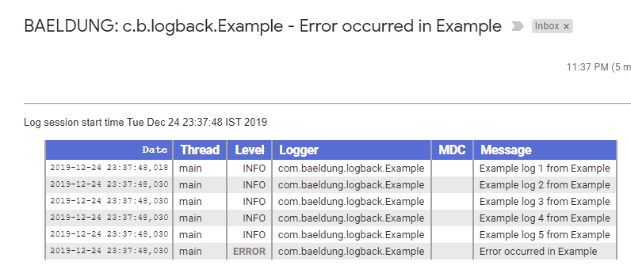

# 用回退发送电子邮件

> 原文：<https://web.archive.org/web/20220930061024/https://www.baeldung.com/logback-send-email>

## 1.概观

Logback 是基于 Java 的应用程序最流行的日志框架之一。它内置了对高级过滤、存档和删除旧日志文件以及通过电子邮件发送日志消息的支持。

在这个快速教程中，**我们将配置 Logback，以便在出现任何应用程序错误时发送电子邮件通知。**

## 2.设置

Logback 的电子邮件通知特性需要使用一个`SMTPAppender.`。`SMTPAppender`利用 Java Mail API，而 Java Mail API 又依赖于 JavaBeans 激活框架。

让我们在`POM`中添加这些依赖项:

```java
<dependency>
    <groupId>javax.mail</groupId>
    <artifactId>mail</artifactId>
    <version>1.4.7</version>
</dependency>
<dependency>
    <groupId>javax.activation</groupId>
    <artifactId>activation</artifactId>
    <version>1.1.1</version>
    <scope>runtime</scope>
</dependency>
```

我们可以在 Maven Central 上找到最新版本的 [Java Mail API](https://web.archive.org/web/20220926201230/https://search.maven.org/classic/#search%7Cgav%7C1%7Cg%3A%22javax.mail%22%20AND%20a%3A%22mail%22) 和 [JavaBeans 激活框架](https://web.archive.org/web/20220926201230/https://search.maven.org/classic/#search%7Cga%7C1%7Cg%3A%22javax.activation%22%20AND%20a%3A%22activation%22)。

## 3.配置`SMTPAppender`

默认情况下，Logback 的`SMTPAppender`、**会在记录`ERROR`事件时触发一封电子邮件。**

它将所有日志事件保存在一个循环缓冲区中，默认最大容量为 256 个事件。缓冲区变满后，它会丢弃任何旧的日志事件。

让我们在我们的`logback.xml`中配置一个`SMTPAppender`:

```java
<appender name="emailAppender" class="ch.qos.logback.classic.net.SMTPAppender">
    <smtpHost>OUR-SMTP-HOST-ADDRESS</smtpHost>
    <!-- one or more recipients are possible -->
    <to>EMAIL-RECIPIENT-1</to>
    <to>EMAIL-RECIPIENT-2</to>
    <from>SENDER-EMAIL-ADDRESS</from>
    <subject>BAELDUNG: %logger{20} - %msg</subject>
    <layout class="ch.qos.logback.classic.PatternLayout">
        <pattern>%d{HH:mm:ss.SSS} [%thread] %-5level %logger{35} - %msg%n</pattern>
    </layout>
</appender>
```

此外，我们将把这个 appender 添加到我们的 Logback 配置的`root`元素中:

```java
<root level="INFO">
    <appender-ref ref="emailAppender"/>
</root>
```

**因此，对于任何被记录的应用程序`ERROR`，它将发送一封电子邮件，其中包含由`PatternLayout`格式化的所有缓冲的记录事件**。

我们可以进一步用一个`HTMLLayout`来代替`PatternLayout`，将日志消息格式化为一个 HTML 表格:
[](/web/20220926201230/https://www.baeldung.com/wp-content/uploads/2019/12/SampleEmail-1.png)

## 4.自定义缓冲区大小

我们现在知道**默认情况下，传出的电子邮件将包含最后 256 条日志事件消息**。然而，我们可以通过包含`cyclicBufferTracker`配置并指定所需的`bufferSize`来定制这种行为。

为了触发仅包含最近五个日志事件的电子邮件通知，我们将:

```java
<appender name="emailAppender" class="ch.qos.logback.classic.net.SMTPAppender">
    <smtpHost>OUR-SMTP-HOST-ADDRESS</smtpHost>
    <to>EMAIL-RECIPIENT</to>
    <from>SENDER-EMAIL-ADDRESS</from>
    <subject>BAELDUNG: %logger{20} - %msg</subject>
    <layout class="ch.qos.logback.classic.html.HTMLLayout"/>
    <cyclicBufferTracker class="ch.qos.logback.core.spi.CyclicBufferTracker"> 
        <bufferSize>5</bufferSize>
    </cyclicBufferTracker>
</appender>
```

## 5.`SMTPAppender`对于 Gmail

如果我们使用 Gmail 作为我们的 SMTP 提供商，我们必须通过 SSL 或 STARTTLS 进行认证。

**为了通过 STARTTLS 建立连接，客户端首先向服务器发出 STARTTLS 命令。如果服务器支持这种通信，则连接会切换到 SSL。**

现在让我们使用 STARTTLS 为 Gmail 配置我们的 appender:

```java
<appender name="emailAppender" class="ch.qos.logback.classic.net.SMTPAppender">
    <smtpHost>smtp.gmail.com</smtpHost>
    <smtpPort>587</smtpPort>
    <STARTTLS>true</STARTTLS>
    <asynchronousSending>false</asynchronousSending>
    <username>[[email protected]](/web/20220926201230/https://www.baeldung.com/cdn-cgi/l/email-protection)</username>
    <password>GMAIL-ACCT-PASSWORD</password>
    <to>EMAIL-RECIPIENT</to>
    <from>[[email protected]](/web/20220926201230/https://www.baeldung.com/cdn-cgi/l/email-protection)</from>
    <subject>BAELDUNG: %logger{20} - %msg</subject>
    <layout class="ch.qos.logback.classic.html.HTMLLayout"/>
</appender>
```

## 6.结论

在本文中，我们探讨了如何配置日志返回的`SMTPAppender` ,以便在应用程序出错时发送电子邮件。

像往常一样，所有的代码示例都可以在 Github 上的[处获得。](https://web.archive.org/web/20220926201230/https://github.com/eugenp/tutorials/tree/master/logging-modules/logback)