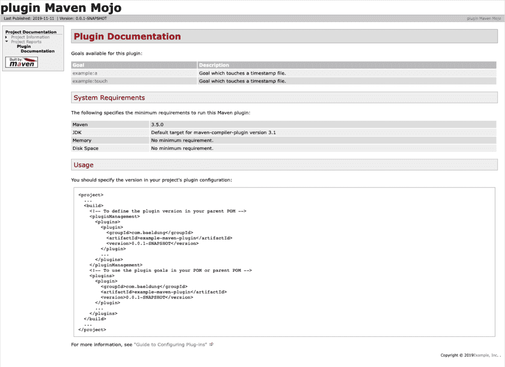

# 如何创建一个 Maven 插件

> 原文：<https://web.archive.org/web/20220930061024/https://www.baeldung.com/maven-plugin>

## 1。简介

Maven 提供了各种各样的插件来帮助我们构建项目。然而，我们可能会发现这些插件是不够的，我们必须开发自己的插件。

幸运的是， [Maven](/web/20221206084553/https://www.baeldung.com/maven) 提供了一些有用的工具来帮助我们完成这个过程。

在本教程中，我们将非常实际，将一步一步地展示如何从头开始创建一个 Maven 插件。

我们还将展示如何在我们的项目中使用它，以及如何为它创建文档。

## 2。创建插件

在本教程中，我们将开发一个名为`counter-maven-plugin`的插件，它将计算一个项目包含的依赖项的数量。**当我们为插件选择名字时，遵循 Maven 推荐的**的[插件命名惯例](https://web.archive.org/web/20221206084553/https://maven.apache.org/guides/plugin/guide-java-plugin-development.html#Plugin_Naming_Convention_and_Apache_Maven_Trademark)非常重要。

既然我们知道了我们要开发什么，接下来我们需要做的就是创建一个 Maven 项目。在`pom.xml`中，我们将定义插件的`groupId`、`artifactId`和`version`:

```
<project 
    xmlns:xsi="http://www.w3.org/2001/XMLSchema-instance"
    xsi:schemaLocation="http://maven.apache.org/POM/4.0.0 http://maven.apache.org/maven-v4_0_0.xsd">

    <modelVersion>4.0.0</modelVersion>
    <groupId>com.baeldung</groupId>
    <artifactId>counter-maven-plugin</artifactId>
    <packaging>maven-plugin</packaging>
    <version>0.0.1-SNAPSHOT</version>

    <name>counter-maven-plugin Maven Mojo</name>
    <url>http://maven.apache.org</url>

    <properties>
        <maven.compiler.target>1.8</maven.compiler.target>
        <maven.compiler.source>1.8</maven.compiler.source>
    </properties>
</project>
```

**注意，我们将打包设置为`maven-plugin`。**

在本例中，我们已经手动创建了项目，但是我们也可以通过使用`maven-archetype-mojo`来完成:

```
mvn archetype:generate 
  -DgroupId=com.baeldung 
  -DartifactId=counter-maven-plugin 
  -Dversion=0.0.1-SNAPSHOT 
  -DarchetypeGroupId=org.apache.maven.archetypes 
  -DarchetypeArtifactId=maven-archetype-mojo
```

这样做时，我们应该更新依赖项的默认版本，以使用最新的版本。

## 3。创造一种魔力

现在是时候创造我们的第一个魔咒了。Mojo 是一个 Java 类，表示我们的插件将执行的目标。**一个插件包含一个或多个魔咒。**

我们的 mojo 将负责计算项目的依赖项数量。

### 3.1。添加依赖关系

在创建 mojo 之前，我们需要向我们的`pom.xml`添加一些依赖项:

```
<dependencies>
    <dependency>
        <groupId>org.apache.maven</groupId>
        <artifactId>maven-plugin-api</artifactId>
        <version>3.6.3</version>
    </dependency>
    <dependency>
        <groupId>org.apache.maven.plugin-tools</groupId>
        <artifactId>maven-plugin-annotations</artifactId>
        <version>3.6.0</version>
        <scope>provided</scope>
    </dependency>
    <dependency>
        <groupId>org.apache.maven</groupId>
        <artifactId>maven-project</artifactId>
        <version>2.2.1</version>
    </dependency>
</dependencies>
```

**[`maven-plugin-api`](https://web.archive.org/web/20221206084553/https://search.maven.org/search?q=g:org.apache.maven%20AND%20a:maven-plugin-api)依赖项是必需的，它包含创建我们的 mojo** 所必需的类和接口。在我们的类中使用注释时， [`maven-plugin-annotations`](https://web.archive.org/web/20221206084553/https://search.maven.org/search?q=g:org.apache.maven.plugin-tools%20AND%20a:maven-plugin-annotations) 依赖很方便。 [`maven-project`](https://web.archive.org/web/20221206084553/https://search.maven.org/search?q=g:org.apache.maven%20AND%20a:maven-project) 依赖项让我们可以访问包含插件的项目的信息。

### 3.2。创建 Mojo 类

现在我们准备好创造我们的魔力了！

**一个 mojo 必须实现`Mojo`接口**。在我们的例子中，我们将从`AbstractMojo`扩展，所以我们只需要实现`execute`方法:

```
@Mojo(name = "dependency-counter", defaultPhase = LifecyclePhase.COMPILE)
public class DependencyCounterMojo extends AbstractMojo {
    // ...
}
```

正如我们所见，`dependency-counter`是目标的名称。另一方面，默认情况下，我们已经将它附加到了`compile`阶段，所以在使用这个目标时，我们不需要指定一个阶段。

要访问项目信息，我们必须添加一个`MavenProject`作为参数:

```
@Parameter(defaultValue = "${project}", required = true, readonly = true)
MavenProject project;
```

这个对象将在上下文创建时由 Maven 注入。

此时，我们能够实现 execute 方法并计算项目依赖项的数量:

```
public void execute() throws MojoExecutionException, MojoFailureException {
    List<Dependency> dependencies = project.getDependencies();
    long numDependencies = dependencies.stream().count();          
    getLog().info("Number of dependencies: " + numDependencies);
}
```

`getLog()`方法提供了对 Maven 日志的访问。`AbstractMojo` 已经处理了它的生命周期。

### 3.3。添加参数

我们之前添加的参数是只读的，用户无法配置。此外，它是由 Maven 注入的，所以我们可以说它有点特别。

在这一节中，我们将添加一个参数，用户可以在其中指定我们想要统计的依赖项的范围。

因此，让我们在 mojo 中创建一个`scope`参数:

```
@Parameter(property = "scope")
String scope;
```

我们只设置了`property` 属性。它允许我们通过命令行或一个`pom`属性来设置这个属性。对于其余的属性，我们用默认值就可以了。

现在我们将修改我们的`execute`方法来使用这个参数，并在计数时过滤依赖性:

```
public void execute() throws MojoExecutionException, MojoFailureException {
    List<Dependency> dependencies = project.getDependencies();
    long numDependencies = dependencies.stream()
      .filter(d -> (scope == null || scope.isEmpty()) || scope.equals(d.getScope()))
      .count();          
    getLog().info("Number of dependencies: " + numDependencies);
}
```

官方文件中[解释了更高级的参数类型。](https://web.archive.org/web/20221206084553/https://maven.apache.org/guides/plugin/guide-java-plugin-development.html#Parameters)

## 4。测试插件

我们已经完成了插件的开发。让我们测试一下，看看它是否有效！

首先，我们必须在本地存储库中安装插件:

```
mvn clean install
```

在接下来的部分中，我们将首先看看如何从命令行运行我们的插件。然后，我们还将介绍如何在 Maven 项目中使用它。

### 4.1。执行我们的插件

我们可以在命令行中通过指定完全限定名来运行插件的目标:

```
mvn groupId:artifactId:version:goal
```

在我们的例子中，它看起来像这样:

```
mvn com.baeldung:counter-maven-plugin:0.0.1-SNAPSHOT:dependency-counter
```

然而，**如果我们遵循了我们在本教程开始时提到的插件命名约定，Maven 将解析我们插件**的[前缀](https://web.archive.org/web/20221206084553/https://maven.apache.org/guides/introduction/introduction-to-plugin-prefix-mapping.html)，我们可以缩短命令:

```
mvn counter:dependency-counter
```

注意，这个命令使用的是最新版本的插件。另外，请记住，我们必须将我们的`groupId`添加到我们的`settings.xml`的`pluginGroups`中，因此 Maven 也在这个组中进行搜索:

```
<pluginGroups>
    <pluginGroup>com.baeldung</pluginGroup>
</pluginGroups>
```

如果我们检查命令的输出，我们可以看到插件计算了插件的`pom.xml`中依赖项的数量:

```
[INFO] Scanning for projects...
[INFO] 
[INFO] -----------------< com.baeldung:counter-maven-plugin >------------------
[INFO] Building counter-maven-plugin Maven Mojo 0.0.1-SNAPSHOT
[INFO] ----------------------------[ maven-plugin ]----------------------------
[INFO] 
[INFO] --- counter-maven-plugin:0.0.1-SNAPSHOT:dependency-counter (default-cli) @ counter-maven-plugin ---
[INFO] Number of dependencies: 3
[INFO] ------------------------------------------------------------------------
[INFO] BUILD SUCCESS
[INFO] ------------------------------------------------------------------------
[INFO] Total time: 0.529 s
[INFO] Finished at: 2019-11-30T20:43:41+01:00
[INFO] ------------------------------------------------------------------------
```

我们也可以通过命令行属性设置`scope`参数:

```
mvn counter:dependency-counter -Dscope=test
```

请注意，`scope`名称是我们在 mojo 参数的`property `属性中定义的名称。

### 4.2。在项目中使用我们的插件

现在让我们通过在项目中使用它来测试我们的插件！

我们将创建一个非常简单的 Maven 项目，其中包含一些我们的插件将会考虑到的依赖项:

```
<project 
    xmlns:xsi="http://www.w3.org/2001/XMLSchema-instance"
    xsi:schemaLocation="http://maven.apache.org/POM/4.0.0 http://maven.apache.org/xsd/maven-4.0.0.xsd">

    <modelVersion>4.0.0</modelVersion>
    <groupId>com.baeldung</groupId>
    <artifactId>example</artifactId>
    <packaging>pom</packaging>
    <version>0.0.1-SNAPSHOT</version>

    <dependencies>
        <dependency>
            <groupId>org.apache.commons</groupId>
            <artifactId>commons-lang3</artifactId>
            <version>3.12.0</version>
        </dependency>
        <dependency>
            <groupId>junit</groupId>
            <artifactId>junit</artifactId>
            <version>4.12</version>
            <scope>test</scope>
        </dependency>
    </dependencies>
</project>
```

最后一件事是将我们的插件添加到构建中。我们必须明确设定我们想要运行的`dependency-counter`目标:

```
<build>
    <plugins>
        <plugin>
            <groupId>com.baeldung</groupId>
            <artifactId>counter-maven-plugin</artifactId>
            <version>0.0.1-SNAPSHOT</version>
            <executions>
                <execution>
                    <goals>
                        <goal>dependency-counter</goal>
                    </goals>
                </execution>
            </executions>
            <configuration>
                <scope>test</scope>
            </configuration>
        </plugin>
    </plugins>
</build>
```

**注意，我们已经在`configuration`节点中指定了`scope`参数。**此外，我们还没有指定任何阶段，因为我们的 mojo 默认情况下附属于`compile`阶段。

现在，我们只需要运行`compile`阶段来执行我们的插件:

```
mvn clean compile
```

我们的插件将打印出`test`依赖项的数量:

```
[INFO] Scanning for projects...
[INFO] 
[INFO] ------------------------< com.baeldung:example >------------------------
[INFO] Building example 0.0.1-SNAPSHOT
[INFO] --------------------------------[ pom ]---------------------------------
[INFO] 
[INFO] --- maven-clean-plugin:2.5:clean (default-clean) @ example ---
[INFO] 
[INFO] --- counter-maven-plugin:0.0.1-SNAPSHOT:dependency-counter (default) @ example ---
[INFO] Number of dependencies: 1
[INFO] ------------------------------------------------------------------------
[INFO] BUILD SUCCESS
[INFO] ------------------------------------------------------------------------
[INFO] Total time: 0.627 s
[INFO] Finished at: 2019-11-25T18:57:22+01:00
[INFO] ------------------------------------------------------------------------
```

在本教程中，我们不会讨论如何为我们的插件编写单元测试或集成测试，但是 Maven 提供了一些[机制](https://web.archive.org/web/20221206084553/https://maven.apache.org/plugin-developers/plugin-testing.html)来做这件事。

## 5。添加文档

当我们创建一个 Maven 插件时，重要的是生成文档以方便其他人使用。

我们将简要介绍如何用 [`maven-plugin-plugin`](https://web.archive.org/web/20221206084553/https://maven.apache.org/plugin-tools/maven-plugin-plugin/) 生成这个文档。

[`maven-plugin-plugin`](https://web.archive.org/web/20221206084553/https://search.maven.org/search?q=g:org.apache.maven.plugins%20AND%20a:maven-plugin-plugin) 已经包含在项目中，但是我们要更新它以使用最新的版本。

同样，我们将对 [`maven-site-plugin`](https://web.archive.org/web/20221206084553/https://search.maven.org/search?q=g:org.apache.maven.plugins%20AND%20a:maven-site-plugin) 做同样的事情:

```
<build>
    <pluginManagement>
        <plugins>
            <plugin>
                <groupId>org.apache.maven.plugins</groupId>
                <artifactId>maven-plugin-plugin</artifactId>
                <version>3.6.0</version>
            </plugin>
            <plugin>
                <groupId>org.apache.maven.plugins</groupId>
                <artifactId>maven-site-plugin</artifactId>
                <version>3.8.2</version>
            </plugin>
        </plugins>
    </pluginManagement>
</build>
```

然后，我们必须确保我们已经将`javadoc`添加到了`Mojo`中，并且在插件的`pom.xml`中添加了一些元数据:

```
<organization>
    <name>Baeldung</name>
    <url>https://www.baeldung.com/</url>
</organization>
```

之后，我们需要在我们的`pom.xml`中添加一个报告部分:

```
<reporting>
    <plugins>
        <plugin>
            <groupId>org.apache.maven.plugins</groupId>
            <artifactId>maven-plugin-plugin</artifactId>
            <reportSets>
                <reportSet>
                    <reports>
                        <report>report</report>
                    </reports>
                </reportSet>
            </reportSets>
        </plugin>
    </plugins>
</reporting>
```

最后，我们将使用 maven site 命令生成文档:

```
mvn site
```

在目标文件夹中，我们可以找到一个包含所有生成的 HTML 文件的`site`目录。`plugin-info.html`是包含插件文档的文件:

[](/web/20221206084553/https://www.baeldung.com/wp-content/uploads/2019/12/Screenshot-2019-11-25-at-19.15.09.png)

更多添加到我们文档的选项可以在 [Maven 插件文档指南](https://web.archive.org/web/20221206084553/https://maven.apache.org/guides/development/guide-plugin-documentation.html)中找到。

## 6。结论

在本教程中，我们已经展示了如何创建一个 Maven 插件。我们首先实现了一个简单的插件，它帮助我们看到了一个典型的 Maven 插件项目结构。然后，我们介绍了 Maven 提供的帮助我们开发插件的一些工具。

我们保持简单，使事情更清晰，但同时，我们提供了一些有用的链接，提供了关于如何创建一个更强大的插件的必要信息。

与往常一样，GitHub 上的[提供了示例的完整源代码。](https://web.archive.org/web/20221206084553/https://github.com/eugenp/tutorials/tree/master/maven-modules/maven-custom-plugin)