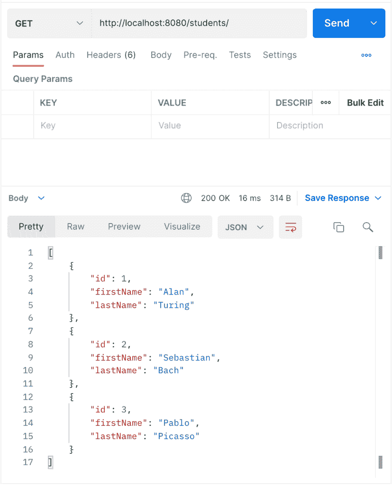
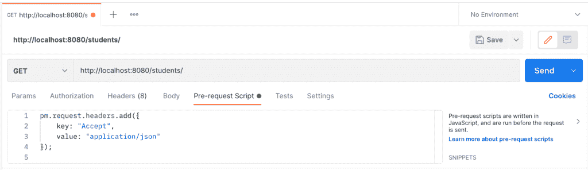
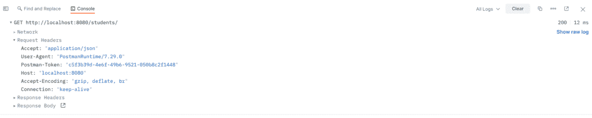
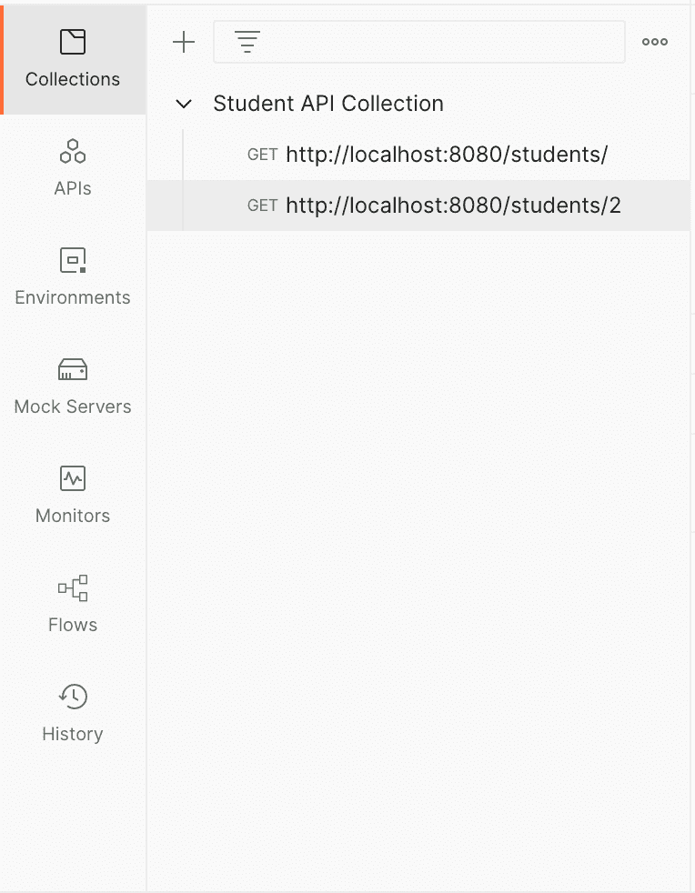
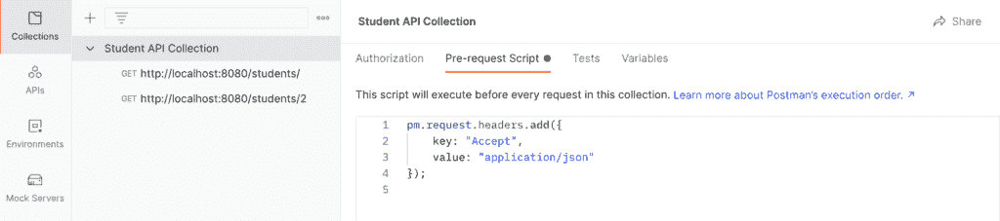
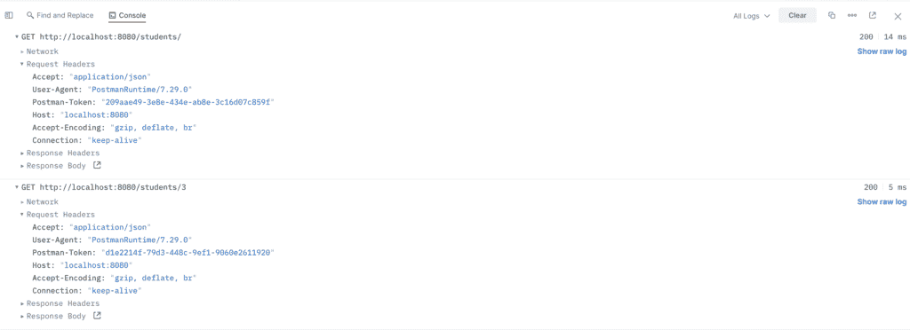

# 在邮递员的每个请求中添加标题

> 原文：<https://web.archive.org/web/20220930061024/https://www.baeldung.com/postman-add-headers-pre-request>

## 1.概观

在本教程中，我们将学习如何使用预请求脚本在 Postman 中为每个请求添加 HTTP 头。

## 2.HTTP 标题

在深入实现之前，让我们回顾一下什么是 [HTTP 头](/web/20221130182209/https://www.baeldung.com/spring-rest-http-headers)。

在 HTTP 请求中，头是在客户机和服务器 HTTP 通信之间提供附加信息的字段。HTTP 头具有键值对格式，可以附加到请求和响应中。

授权、内容类型和 cookies 是可以由 HTTP 头提供的元数据的例子。

例如:

```
Authorization: Bearer YmFyIiwiaWF0IjoxN;
Content-Type: application/json;
Cookie: foo=bar; 
```

**我们将使用 Postman 预请求脚本功能，通过执行 JavaScript 代码来设置标题。**

## 3.运行服务器

在本教程中，我们将使用以前的 Baeldung 项目 [`spring-boot-json`](/web/20221130182209/https://www.baeldung.com/spring-boot-json) 进行演示。这个应用程序由一个控制器组成，`StudentController,` 接受一个`Student` java 模型上的 CRUD 操作。

我们必须使用 Maven `install` 命令安装所有依赖项，然后运行`SpringBootStudentsApplication` 文件，这将在端口 8080 上启动 Tomcat 服务器。

使用 Postman，我们可以通过向以下端点发送 GET 请求来确认服务器正在运行，并期待 JSON 响应:

```
http://localhost:8080/students/
```

例如:

[](/web/20221130182209/https://www.baeldung.com/wp-content/uploads/2022/05/Initial-GET-Request.png)

现在我们已经验证了服务器正在运行，**我们可以通过编程将 HTTP 头添加到由 Postman** 发送的请求中。

## 4.添加带有预请求脚本的标题

要在 Postman 中使用预请求脚本向 HTTP 请求添加报头，我们需要访问 Postman JavaScript API 对象`pm` `.`提供的请求数据

**我们可以通过调用`pm` `.request` 对象对请求元数据进行操作；因此，我们可以在发送请求之前添加、修改和删除 HTTP 头。**

如前所述，HTTP 头有一个键值对格式。Postman JavaScript API 期望在向请求添加头时提供一个键和值。

我们可以通过使用`name: value` 格式作为字符串来添加标题:

```
pm.request.headers.add("foo: bar");
```

我们还可以传递一个带有`key` 和`value` 属性的 JavaScript 对象，如下所示:

```
pm.request.headers.add({
  key: "foo",
  value: "bar"
});
```

**然而，根据 Postman 文档，我们可以向 header 对象添加额外的属性，例如`id`、`name`和`disabled`，这将扩展 Postman JavaScript 运行时环境中的功能。**

现在，让我们来看看实际情况。首先，我们将为一个单独的邮递员请求添加一个脚本；然后，我们将为整个集合添加标题。

### 4.1.个人请求

我们可以通过使用预请求脚本在 Postman 中为单个请求添加标题。我们可以参考上一节中显示的实现；然而，我们将关注第二个，在这里我们传递一个 JavaScript 对象，这样我们可以添加额外的属性来扩展功能。

在 Postman 窗口上的预请求脚本中，我们添加了以下脚本，表明客户端期望 json 类型的响应:

```
pm.request.headers.add({
    key: "Accept",
    value: "application/json"
});
```

在 Postman 中，请求如下所示:

[](/web/20221130182209/https://www.baeldung.com/wp-content/uploads/2022/05/Individual-Pre-request-script-200.png)

现在，我们通过点击`Send` 按钮发送一个 GET 请求。一旦请求被发送，我们必须打开邮递员控制台(通常通过点击左下角的`console`按钮)并展开我们最近的请求以查看`Request Headers` 部分:

[](/web/20221130182209/https://www.baeldung.com/wp-content/uploads/2022/05/Individual-Request-Console-200.png)

在控制台中，我们可以看到`Accept: “application/json”`头，表明它被脚本成功地附加到 GET 请求上。此外，我们可以检查响应的主体和状态代码，以确认请求是否成功。

为了进一步验证预请求脚本，我们可以添加下面的头，并期待一个空响应和一个状态代码`406 Not Acceptable`:

```
pm.request.headers.add({ 
    key: "Accept",
    value: "image/*" 
});
```

### 4.2.收藏品

类似地，我们可以用预请求脚本向整个集合添加 HTTP 头。

首先，我们将创建一个学生 API 集合来用 Postman 测试我们的 API 端点，并确认每个请求都包含我们用预请求脚本添加的头。

在 Postman 中，我们可以通过进入左边的`Collections`菜单选项对 web API 端点进行分组。然后，我们单击加号按钮，创建一个名为`Student API Collection:`的新集合

[](/web/20221130182209/https://www.baeldung.com/wp-content/uploads/2022/05/Student-API-Collection.png)

注意，我们还向集合中添加了两个端点:`http://localhost:8080/students/` 和`http://localhost:8080/students/2`。

与单个请求类似，我们可以通过选择左侧菜单上的`Student API Collection`并转到`Pre-request Script` 选项卡，将请求前脚本添加到我们的集合中。现在，我们可以添加我们的脚本:

```
pm.request.headers.add({ 
    key: "Accept",
    value: "application/json" 
}); 
```

在 Postman 中，`Student API Collection`应该是这样的:

[](/web/20221130182209/https://www.baeldung.com/wp-content/uploads/2022/05/Student-API-Collection-with-Script.png)

在运行收集之前，我们必须确保删除了我们在上一节中最初添加的请求前脚本。否则，HTTP 标头将被请求脚本中指定的标头覆盖，而集合级别的标头将被删除。

现在，我们准备运行我们的集合。点击收藏栏上的`Run`按钮，`Runner` 标签会自动打开:

[](/web/20221130182209/https://www.baeldung.com/wp-content/uploads/2022/05/Student-API-Collection-Runner.png)

`Runner`选项卡允许我们对请求进行排序，从集合中选择或取消选择请求，并指定附加设置。点击`Run Student API Collection` 执行我们的请求。

一旦整个收集完成，我们可以看到执行的顺序和测试结果，如果有的话。但是，我们希望确保 HTTP 头是请求的一部分，我们可以通过打开 Postman 控制台来确认这一点:

[](/web/20221130182209/https://www.baeldung.com/wp-content/uploads/2022/05/Student-API-Collection-Console.png)

同样，我们可以在控制台中展开请求的`Request Headers` 部分，并确认我们的预请求脚本添加了`Accept` 头。此外，您可以通过查看状态代码和响应正文来确认请求是否成功。

## 5.结论

在本文中，我们使用了 Postman 的预请求脚本功能来为每个请求添加 HTTP 头。首先，我们回顾了什么是 HTTP 头；然后，我们向单个请求和集合添加了请求前脚本，以便添加标题。参考 [Postman 文档](https://web.archive.org/web/20221130182209/https://learning.postman.com/docs/writing-scripts/pre-request-scripts/)进一步了解预请求脚本和其他特性。

本教程中创建的收藏可以在 GitHub 上的[处获得。](https://web.archive.org/web/20221130182209/https://github.com/eugenp/tutorials/tree/master/spring-boot-modules/spring-boot-mvc-2)