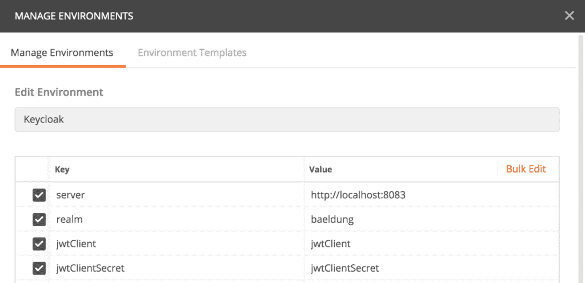
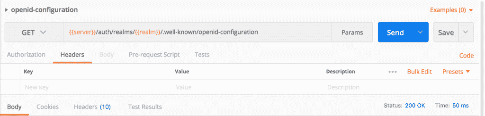
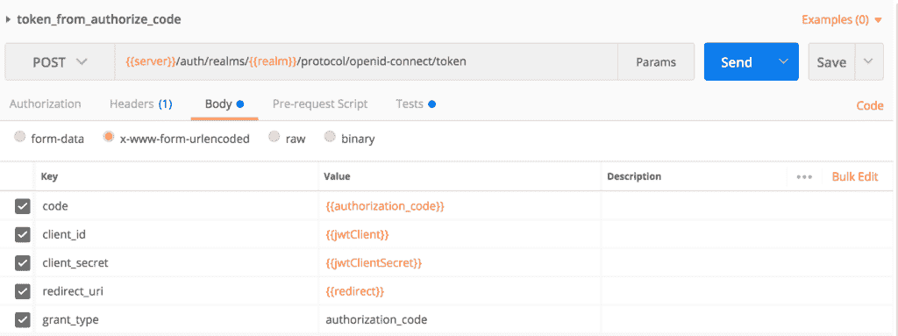
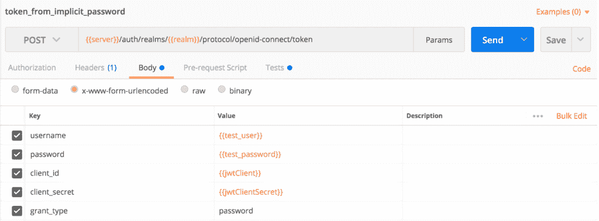
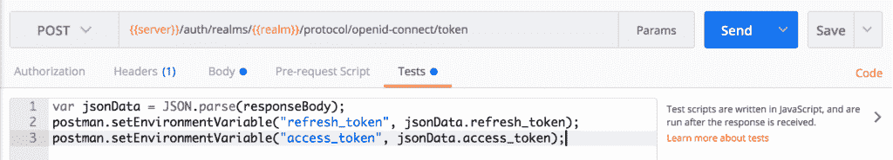
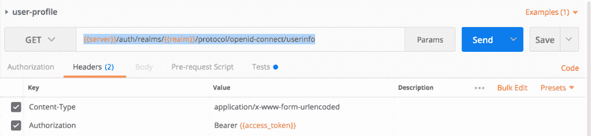
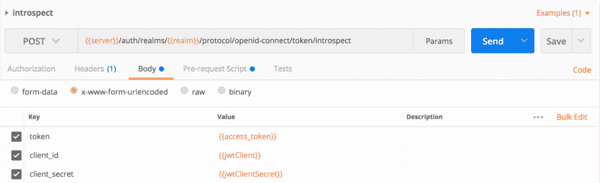

# 使用 Postman 访问 Keycloak 端点

> 原文：<https://web.archive.org/web/20220930061024/https://www.baeldung.com/postman-keycloak-endpoints>

## 1.介绍

在本文中，我们从快速回顾 OAuth 2.0、OpenID 和 Keycloak 开始。之后，我们将学习 Keycloak REST APIs 以及如何在 Postman 中调用它们。

## 2.OAuth 2.0

OAuth 2.0 是一个授权框架，允许通过身份验证的用户通过令牌向第三方授予访问权限。令牌通常限于一些具有有限生存期的作用域。因此，它是用户凭证的安全替代方案。

OAuth 2.0 有四个主要组件:

*   **资源所有者**–拥有受保护资源或数据的最终用户或系统
*   **资源服务器**–该服务通常通过基于 HTTP 的 API 公开受保护的资源
*   **客户端**–代表资源所有者调用受保护的资源
*   **授权服务器**–发布 OAuth 2.0 令牌，并在对资源所有者进行身份验证后将其交付给客户端

OAuth 2.0 是一个带有一些标准流程的[协议，但是我们对这里的授权服务器组件特别感兴趣。](https://web.archive.org/web/20220812013908/https://auth0.com/docs/protocols/protocol-oauth2)

## 3.OpenID 连接

[OpenID Connect 1.0](https://web.archive.org/web/20220812013908/https://openid.net/connect/) (OIDC)构建在 OAuth 2.0 之上，为协议增加了一个身份管理层。因此，它允许客户端验证最终用户的身份，并通过标准 OAuth 2.0 流程访问基本配置文件信息。OIDC[向 OAuth 2.0](/web/20220812013908/https://www.baeldung.com/spring-security-openid-connect) 引入了几个标准示波器，如`openid`、`profile`和`email`。

## 4.Keycloak 作为授权服务器

JBoss 开发了 [Keycloak](https://web.archive.org/web/20220812013908/http://www.keycloak.org/) 作为基于 Java 的开源身份和访问管理解决方案。除了支持 OAuth 2.0 和 OIDC，它还提供了身份代理、用户联盟和单点登录等功能。

我们可以将 Keycloak 作为一个带有管理控制台的独立服务器，或者将它嵌入到 Spring 应用程序中。一旦我们让 Keycloak 以这两种方式运行，我们就可以尝试端点了。

## 5.键盘锁端点

Keycloak 为 OAuth 2.0 流公开了各种 REST 端点。

为了将这些端点与 [Postman](https://web.archive.org/web/20220812013908/https://www.postman.com/) 一起使用，让我们从创建一个名为`Keycloak`的环境开始。然后，我们为 Keycloak 授权服务器 URL、领域、OAuth 2.0 客户端 id 和客户端密码添加一些键/值条目:

[](/web/20220812013908/https://www.baeldung.com/wp-content/uploads/2020/10/Screen-Shot-2020-10-22-at-6.25.07-PM.png)

然后，让我们创建一个集合来组织我们的 Keycloak 测试。现在，我们准备探索可用的端点。

### 5.1.OpenID 配置端点

配置端点类似于根目录。它返回所有其他可用的端点、支持的范围和声明，以及签名算法。

让我们在 Postman:**`{{server}}`/auth/realms/`{{realm}}`/中创建一个请求。已知/openid 配置。** Postman 在运行时从所选环境中设置`{{server}}`和`{{realm}}`的值:

[](/web/20220812013908/https://www.baeldung.com/wp-content/uploads/2020/10/postman-endpoint-openidconfig.png)

然后我们执行请求，如果一切顺利，我们会得到一个响应:

```java
{
    "issuer": "http://localhost:8083/auth/realms/baeldung",
    "authorization_endpoint": "http://localhost:8083/auth/realms/baeldung/protocol/openid-connect/auth",
    "token_endpoint": "http://localhost:8083/auth/realms/baeldung/protocol/openid-connect/token",
    "token_introspection_endpoint": "http://localhost:8083/auth/realms/baeldung/protocol/openid-connect/token/introspect",
    "userinfo_endpoint": "http://localhost:8083/auth/realms/baeldung/protocol/openid-connect/userinfo",
    "end_session_endpoint": "http://localhost:8083/auth/realms/baeldung/protocol/openid-connect/logout",
    "jwks_uri": "http://localhost:8083/auth/realms/baeldung/protocol/openid-connect/certs",
    "check_session_iframe": "http://localhost:8083/auth/realms/baeldung/protocol/openid-connect/login-status-iframe.html",
    "grant_types_supported": [...],
    ...
    "registration_endpoint": "http://localhost:8083/auth/realms/baeldung/clients-registrations/openid-connect",
    ...
    "introspection_endpoint": "http://localhost:8083/auth/realms/baeldung/protocol/openid-connect/token/introspect"
}
```

如前所述，我们可以看到响应中所有可用的端点—例如，“`authorization_endpoint`”、“`token_endpoint`”等等。

此外，响应中还有其他有用的属性。例如，我们可以从"`grant_types_supported`"中找出所有支持的授权类型，或者从"`scopes_supported`"中找出所有支持的范围。

### 5.2.授权端点

让我们通过负责 [OAuth 2.0 授权代码流](https://web.archive.org/web/20220812013908/https://auth0.com/docs/flows/authorization-code-flow)的授权端点继续我们的旅程。它在 OpenID 配置响应中作为`“authorization_endpoint”` 可用。

**终点为:**

**`{{server}}`/auth/realm/`{{realm}}`/protocol/OpenID-connect/auth？response_type=code &客户端；_id=jwtClient**

此外，该端点接受 `scope`和`redirect_uri`作为可选参数。

我们不会在 Postman 中使用这个端点。相反，我们通常通过浏览器启动授权代码流。如果没有可用的活动登录 cookie，Keycloak 会将用户重定向到登录页面。最后，授权码被传递到重定向 URL。

让我们进入下一步，看看如何获得访问令牌。

### 5.3.令牌端点

令牌端点允许我们检索访问令牌、刷新令牌或 id 令牌。OAuth 2.0 支持不同的授权类型，如`authorization_code`、 `refresh_token,` 或 `password.`

**令牌端点为:`{{server}}`/auth/realms/`{{realm}}`/protocol/OpenID-connect/token**

但是，每种授权类型都需要一些专用的表单参数。

让我们首先测试我们的令牌端点，为我们的授权代码获取一个访问令牌。我们必须在请求体中传递这些表单参数:`client_id`、`client_secret`、`grant_type`、`code`和`redirect_uri`。令牌端点也接受`scope`作为可选参数:

[](/web/20220812013908/https://www.baeldung.com/wp-content/uploads/2020/10/postman-token-authcode.png)

此外，如果我们想要绕过授权代码流， `password` 授权类型是选择`.` 这里我们需要用户凭证，所以当我们的网站或应用程序上有内置的登录页面时，我们可以使用这个流。

让我们创建一个 Postman 请求，并在主体中传递表单参数`client_id`、`client_secret`、`grant_type`、`username`和`password`:

[](/web/20220812013908/https://www.baeldung.com/wp-content/uploads/2020/10/postamn-token-password.png)

**在执行这个请求之前，我们必须将`username`和`password`变量添加到 Postman 的环境键/值对中。**

另一个有用的授权类型是 `refresh_token`。当我们从之前对令牌端点的调用中获得有效的刷新令牌时，我们可以使用这个方法。刷新令牌流需要参数`client_id`、`client_secret`、`grant_type`和`refresh_token`。

我们需要响应`access_token`来测试其他端点。为了加速我们对 Postman 的测试，我们可以在令牌端点请求的`Tests`部分编写一个脚本:

```java
var jsonData = JSON.parse(responseBody);
postman.setEnvironmentVariable("refresh_token", jsonData.refresh_token);
postman.setEnvironmentVariable("access_token", jsonData.access_token);
```

[](/web/20220812013908/https://www.baeldung.com/wp-content/uploads/2020/10/postman-test-script.png)

### 5.4.用户信息端点

当我们拥有有效的访问令牌时，我们可以从用户信息端点检索用户配置文件数据。

**用户信息端点位于:`{{server}}`/auth/realms/`{{realm}}`/protocol/OpenID-connect/userinfo**

让我们为它创建一个 Postman 请求，并在`Authorization`头中传递访问令牌:

[](/web/20220812013908/https://www.baeldung.com/wp-content/uploads/2020/10/postamn-userinfo.png)

然后我们执行请求。以下是成功的回应:

```java
{
    "sub": "a5461470-33eb-4b2d-82d4-b0484e96ad7f",
    "preferred_username": "[[email protected]](/web/20220812013908/https://www.baeldung.com/cdn-cgi/l/email-protection)",
    "DOB": "1984-07-01",
    "organization": "baeldung"
}
```

### 5.5.令牌自省端点

如果资源服务器需要验证一个访问令牌是活动的，或者需要更多关于它的元数据，特别是对于[不透明的访问令牌](https://web.archive.org/web/20220812013908/https://auth0.com/docs/tokens/access-tokens)，那么令牌自省端点就是答案。在这种情况下，资源服务器将自省过程与[安全配置](/web/20220812013908/https://www.baeldung.com/spring-security-oauth-resource-server)集成在一起。

**我们调用 Keycloak 的自省端点:`{{server}}`/auth/realms/`{{realm}}`/protocol/OpenID-connect/token/introspect**

让我们在 Postman 中创建一个自省请求，然后将`client_id`、`client_secret`和`token`作为表单参数传递:

[](/web/20220812013908/https://www.baeldung.com/wp-content/uploads/2020/10/postman-introspect.png)

如果`access_token`有效，那么我们得到我们的响应:

```java
{
    "exp": 1601824811,
    "iat": 1601824511,
    "jti": "d5a4831d-7236-4686-a17b-784cd8b5805d",
    "iss": "http://localhost:8083/auth/realms/baeldung",
    "sub": "a5461470-33eb-4b2d-82d4-b0484e96ad7f",
    "typ": "Bearer",
    "azp": "jwtClient",
    "session_state": "96030af2-1e48-4243-ba0b-dd4980c6e8fd",
    "preferred_username": "[[email protected]](/web/20220812013908/https://www.baeldung.com/cdn-cgi/l/email-protection)",
    "email_verified": false,
    "acr": "1",
    "scope": "profile email read",
    "DOB": "1984-07-01",
    "organization": "baeldung",
    "client_id": "jwtClient",
    "username": "[[email protected]](/web/20220812013908/https://www.baeldung.com/cdn-cgi/l/email-protection)",
    "active": true
}
```

但是，如果我们使用无效的访问令牌，那么响应是:

```java
{
    "active": false
}
```

## 6.结论

在本文中，通过运行 Keycloak 服务器，我们为授权、令牌、用户信息和自省端点创建了 Postman 请求。

GitHub 上一如既往地提供了完整的邮递员请求示例[。](https://web.archive.org/web/20220812013908/https://github.com/Baeldung/spring-security-oauth/tree/master/oauth-jwt/jwt-auth-server)