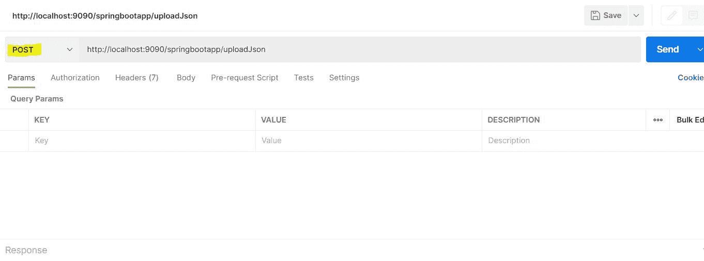
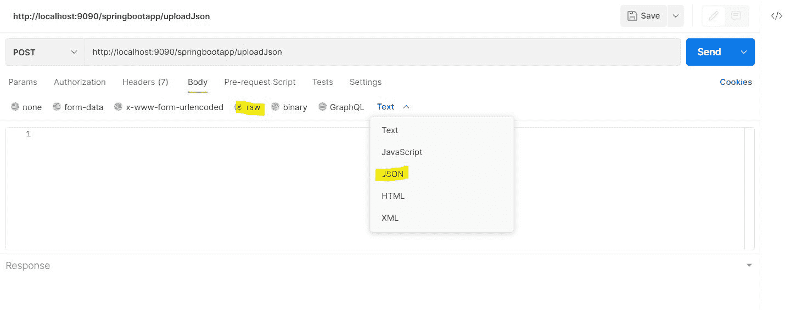
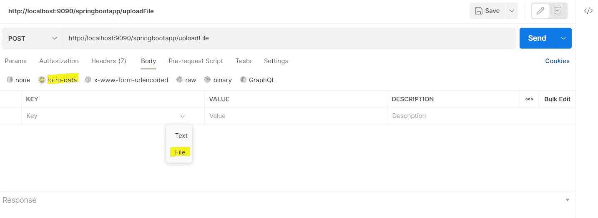
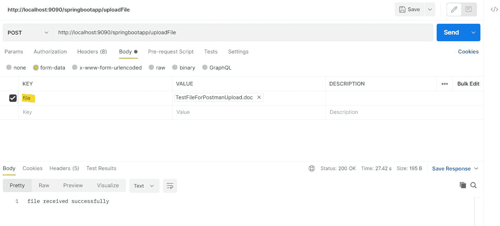

# 在 Postman 中上传文件和 JSON 数据

> 原文：<https://web.archive.org/web/20220930061024/https://www.baeldung.com/postman-upload-file-json>

## 1.概观

[Postman](/web/20221228100122/https://www.baeldung.com/tag/postman) 是一个流行的 API 平台，它优化了 API 开发生命周期的各个步骤。Postman 可以用来[测试我们的 API](/web/20221228100122/https://www.baeldung.com/postman-testing-collections) ，不用写任何代码。我们可以使用独立的应用程序或浏览器扩展。

在本教程中，我们将了解如何在使用 Postman 时上传文件和 JSON 数据。

## 2.应用程序设置

让我们设置一个基本的 **Spring Boot 应用程序，它公开端点来上传数据**。

### 2.1.属国

我们用`pom.xml`中的 [`spring-boot-starter-web`](https://web.archive.org/web/20221228100122/https://mvnrepository.com/artifact/org.springframework.boot/spring-boot-starter-web) 依赖关系定义了一个基本的 spring 应用程序:

```java
<dependency>
    <groupId>org.springframework.boot</groupId>
    <artifactId>spring-boot-starter-web</artifactId>
</dependency>
```

### 2.2.模型

接下来，让我们为 JSON 输入定义一个简单的模型类:

```java
public class JsonRequest {
    int id;
    String name;
}
```

为了简洁起见，我们删除了构造函数、getter/setter 等的声明。

### 2.3.端点

最后，让我们根据用例设置一个端点，将请求作为一个文件来处理:

```java
@PostMapping("/uploadFile")
public ResponseEntity<String> handleFileUpload(@RequestParam("file") MultipartFile file){
    return ResponseEntity.ok().body("file received successfully");
}
```

在方法`handleFileUpload(),` 中，我们期望一个`MultipartFile`作为输入，然后返回一个带有静态文本的`200`状态消息。我们保持它的简单，并没有探索保存或处理输入文件。

**[`MultipartFile`](/web/20221228100122/https://www.baeldung.com/sprint-boot-multipart-requests)由 Spring-Web 提供，代表一个上传的文件**。然后，这个文件被存储在内存中或临时存储在磁盘上，一旦请求处理完成，这个文件就会被刷新。

让我们也创建一个处理 JSON 数据的端点:

```java
@PostMapping("/uploadJson")
public ResponseEntity<String> handleJsonInput(@RequestBody JsonRequest json){
    return ResponseEntity.ok().body(json.getId()+json.getName());
}
```

这里，`handleJsonInput(),`我们期望一个类型为`JsonRequest,` 的对象，即我们定义的模型类。该方法在响应中返回一个带有输入细节`id`和`name` 的`200` HTTP 状态代码。

我们使用了注释 [`@RequestBody`](/web/20221228100122/https://www.baeldung.com/spring-request-response-body) ，它将输入反序列化到`JsonRequest` 对象中。这样，我们看到了 JSON 验证输入的简单处理。

## 3.上传数据

我们已经设置了应用程序，现在让我们检查向应用程序提供输入的两种方式。

### 3.1.将 JSON 上传到 Postman

JSON 是端点的文本输入类型之一。我们将按照下面的步骤将其传递给公开的端点。

默认方法设置为`GET`。所以一旦我们添加了`localhost` URL，我们需要选择`POST`作为方法:

[](/web/20221228100122/https://www.baeldung.com/wp-content/uploads/2022/10/JsonStep1.jpg)

让我们点击`Body`选项卡，然后在显示`Text`的下拉列表中选择`raw.` ，让我们选择`JSON`作为输入:

[](/web/20221228100122/https://www.baeldung.com/wp-content/uploads/2022/10/JsonStep2.jpg)

我们需要粘贴输入的 JSON，然后点击`Send`:

[](/web/20221228100122/https://www.baeldung.com/wp-content/uploads/2022/10/JsonStep3.jpg)

我们得到了一个`200`状态代码作为响应，正如我们在快照底部看到的。此外，来自输入的`id`和`name`在响应体中被返回，确认 JSON 在端点被正确处理。

### 3.2.将文件上传到邮递员

让我们以一个文档文件为例，因为我们没有定义端点可以使用哪些文件类型的约束。

让我们添加`localhost` URL 并选择`POST`作为方法，因为该方法默认为`GET`:

[](/web/20221228100122/https://www.baeldung.com/wp-content/uploads/2022/10/FileUploadStep1.jpg)

让我们单击`Body`选项卡，然后选择第一行的`form-data.` 作为键-值对，让我们单击右上角的下拉菜单作为键字段，并选择*文件*作为输入:

[](/web/20221228100122/https://www.baeldung.com/wp-content/uploads/2022/10/FileUploadStep2.jpg)

我们需要在键列中添加文本`file `,这是端点的`@RequestParam`,并浏览值列所需的文件。

最后，让我们点击`Send`:

[](/web/20221228100122/https://www.baeldung.com/wp-content/uploads/2022/10/FileUploadStep3.jpg)

当我们点击`Send`时，我们得到一个 **`200` HTTP 状态代码，静态文本在我们的端点定义中定义**。这意味着我们的**文件被成功地交付到端点，没有错误或异常**。

## 4.结论

在本文中，我们构建了一个简单的 Spring Boot 应用程序，并研究了通过 Postman 向公开的端点提供数据的两种不同方式。

和往常一样，代码样本可以在 GitHub 上的[处获得。](https://web.archive.org/web/20221228100122/https://github.com/eugenp/tutorials/tree/master/spring-boot-modules/spring-boot-mvc-4)