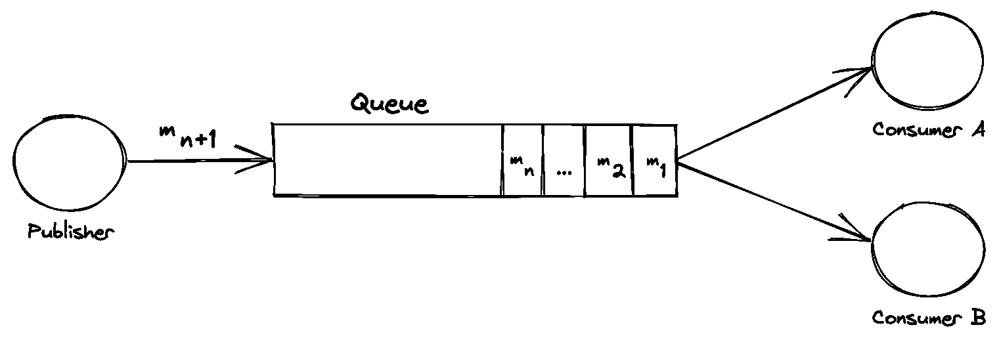
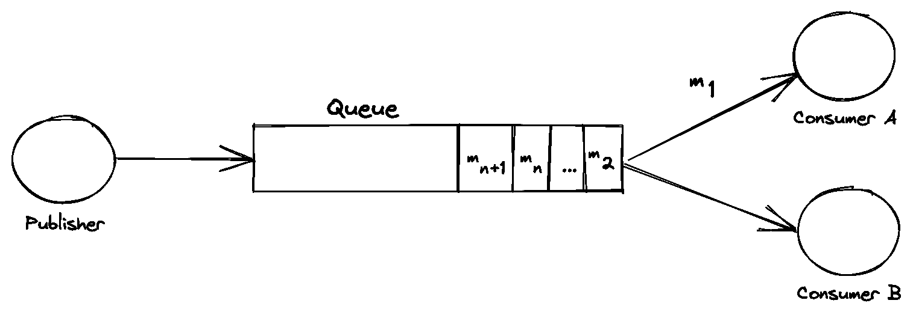
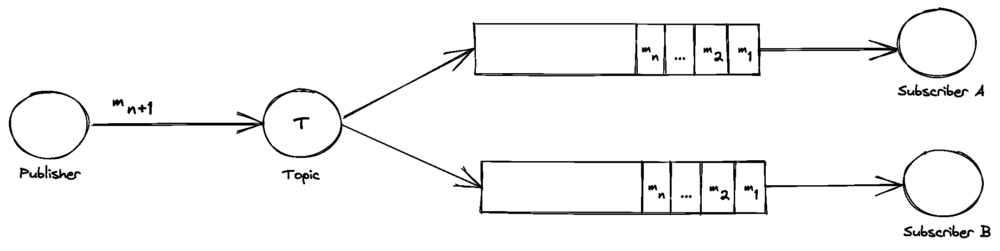
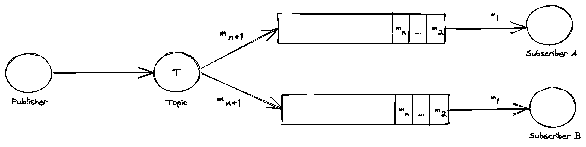

# 发布-订阅与消息队列

> 原文：<https://web.archive.org/web/20220930061024/https://www.baeldung.com/pub-sub-vs-message-queues>

## 1.概观

在本教程中，我们将研究消息队列和发布者/订阅者的使用。这些是分布式系统中两个或多个服务相互通信的常见模式。

对于本教程，所有的例子都将使用 RabbitMQ 消息代理来展示，所以首先要遵循 RabbitMQ 的教程来在本地启动和运行。为了更深入地了解 RabbitMQ，请查看我们的另一个[教程](/web/20220930021852/https://www.baeldung.com/rabbitmq)。

注意:RabbitMQ 有许多替代品可用于本教程中的相同示例，例如 [Kafka](https://web.archive.org/web/20220930021852/https://kafka.apache.org/) 、 [Google Cloud Pub-Sub](https://web.archive.org/web/20220930021852/https://cloud.google.com/pubsub) 和[亚马逊 SQS](https://web.archive.org/web/20220930021852/https://aws.amazon.com/sqs/) 等等。

## 2.什么是消息队列？

让我们从查看消息队列开始。消息队列由一个发布服务和多个通过队列通信的消费者服务组成。这种**沟通通常是一种方式**，发布者将向消费者发布命令。发布服务通常会将消息放入队列或交换中，单个消费者服务将使用此消息并基于此执行操作。

考虑下面的交换:

[](/web/20220930021852/https://www.baeldung.com/wp-content/uploads/2021/07/1-1.png)

从这里，我们可以看到一个 Publisher 服务正在将一条消息“m n+1”放到队列中。此外，我们还可以看到队列中已经存在多个消息等待使用。在右边，我们有两个消费服务“A”和“B ”,它们正在监听消息队列。

现在让我们考虑一段时间后的相同交换:

[](/web/20220930021852/https://www.baeldung.com/wp-content/uploads/2021/07/2-1.png)

首先，我们可以看到发布者的消息被推到了队列的末尾。接下来，要考虑的重要部分是图像的右侧。我们可以看到，消费者“A”已经阅读了消息“m 1 ”,因此，它在队列中不再可供另一个服务“B”使用。

### 2.1.在哪里使用消息队列

当我们想要从服务中委托工作时，经常使用消息队列。这样做，我们想确保工作只执行一次。

使用消息队列在微服务架构和开发基于云或无服务器的应用程序时很流行，因为它允许我们根据负载水平扩展我们的应用程序。

例如，如果队列中有许多消息等待处理，我们可以启动多个消费者服务，这些服务监听同一个消息队列并处理消息的流入。一旦消息得到处理，就可以在流量最小时关闭服务，以节省运行成本。

### 2.2.使用 RabbitMQ 的示例

为了清楚起见，让我们看一个例子。我们的例子将采用比萨饼餐馆的形式。想象一下，人们可以通过应用程序订购披萨，披萨店的厨师会在他们进来时收取订单。在这个例子中，顾客是我们的发布者，厨师是我们的消费者。

首先，让我们定义我们的队列:

```java
private static final String MESSAGE_QUEUE = "pizza-message-queue";

@Bean
public Queue queue() {
    return new Queue(MESSAGE_QUEUE);
}
```

使用 Spring AMQP，我们创建了一个名为“pizza-message-queue”的队列。接下来，让我们定义将消息发送到我们新定义的队列的发布者:

```java
public class Publisher {

    private RabbitTemplate rabbitTemplate;
    private String queue;

    public Publisher(RabbitTemplate rabbitTemplate, String queue) {
        this.rabbitTemplate = rabbitTemplate;
        this.queue = queue;
    }

    @PostConstruct
    public void postMessages() {
        rabbitTemplate.convertAndSend(queue, "1 Pepperoni");
        rabbitTemplate.convertAndSend(queue, "3 Margarita");
        rabbitTemplate.convertAndSend(queue, "1 Ham and Pineapple (yuck)");
    }
}
```

Spring AMQP 将为我们创建一个`RabbitTemplate ` bean，它连接到我们的 RabbitMQ 交换以减少配置开销。我们的发布者通过向我们的队列发送 3 条消息来利用这一点。

现在我们的比萨饼订单已经收到，我们需要一个单独的消费者应用程序。这将在示例中充当我们的厨师，并读取消息:

```java
public class Consumer {
    public void receiveOrder(String message) {
        System.out.printf("Order received: %s%n", message);
    }
}
```

现在让我们为队列创建一个`MessageListenerAdapter` ,它将使用反射调用消费者的 receive order 方法:

```java
@Bean
public SimpleMessageListenerContainer container(ConnectionFactory connectionFactory, MessageListenerAdapter listenerAdapter) {
    SimpleMessageListenerContainer container = new SimpleMessageListenerContainer();
    container.setConnectionFactory(connectionFactory);
    container.setQueueNames(MESSAGE_QUEUE);
    container.setMessageListener(listenerAdapter);
    return container;
}

@Bean
public MessageListenerAdapter listenerAdapter(Consumer consumer) {
    return new MessageListenerAdapter(consumer, "receiveOrder");
}
```

从队列中读取的消息现在将被路由到`Consumer`类的`receiveOrder`方法。为了运行这个应用程序，我们可以创建尽可能多的消费者应用程序来完成收到的订单。例如，如果 400 份比萨饼订单被放在队列中，那么我们可能需要不止一个消费者“厨师”，否则订单将会很慢。在这种情况下，我们可能会启动 10 个消费者实例来及时完成订单。

## 3.什么是酒馆？

现在我们已经讨论了消息队列，让我们来看看发布-订阅。**相反，对于消息队列，在发布-订阅架构中，我们希望所有消费(订阅)应用程序获得发布者发布到交换的消息的`at least 1`副本。**

考虑下面的交换:

[](/web/20220930021852/https://www.baeldung.com/wp-content/uploads/2021/07/3-1.png)

在左边，我们有一个发布者发送消息“m n+1”到一个主题。该主题将向其订阅者广播此消息。这些订阅被绑定到队列。每个队列都有一个等待消息的侦听订户服务。

现在让我们在一段时间过去后考虑同样的交换:

[](/web/20220930021852/https://www.baeldung.com/wp-content/uploads/2021/07/4.png)

两个订阅服务都在使用“m 1 ”,因为它们都收到了该消息的副本。此外，主题是将新消息“m n+1”分发给它的所有订阅者。

当我们需要保证每个订阅者都得到消息的副本时，应该使用 Pub sub。

### 3.1.使用 RabbitMQ 的示例

想象我们有一个服装网站。该网站能够向用户发送推送通知，通知他们交易。我们的系统可以通过电子邮件或文本提醒发送通知。在这种情况下，网站是我们的发布者，文本和电子邮件提醒服务是我们的订阅者。

首先，让我们定义我们的主题交换，并将两个队列绑定到它:

```java
private static final String PUB_SUB_TOPIC = "notification-topic";
private static final String PUB_SUB_EMAIL_QUEUE = "email-queue";
private static final String PUB_SUB_TEXT_QUEUE = "text-queue";

@Bean
public Queue emailQueue() {
    return new Queue(PUB_SUB_EMAIL_QUEUE);
}

@Bean
public Queue textQueue() {
    return new Queue(PUB_SUB_TEXT_QUEUE);
}

@Bean
public TopicExchange exchange() {
    return new TopicExchange(PUB_SUB_TOPIC);
}

@Bean
public Binding emailBinding(Queue emailQueue, TopicExchange exchange) {
    return BindingBuilder.bind(emailQueue).to(exchange).with("notification");
}

@Bean
public Binding textBinding(Queue textQueue, TopicExchange exchange) {
    return BindingBuilder.bind(textQueue).to(exchange).with("notification");
}
```

我们现在已经使用路由关键字“notification”绑定了两个队列，这意味着使用该路由关键字在主题上发布的任何消息都将进入这两个队列。更新我们之前创建的`Publisher `类，我们可以向我们的交换发送一些消息:

```java
rabbitTemplate.convertAndSend(topic, "notification", "New Deal on T-Shirts: 95% off!");
rabbitTemplate.convertAndSend(topic, "notification", "2 for 1 on all Jeans!");
```

## 4.比较

既然我们已经触及了这两个领域，让我们简单地比较一下这两种类型的交换。

如前所述，**消息队列和发布-订阅架构模式都是分解应用程序的好方法，使其更具水平可伸缩性。**

使用发布-订阅或消息队列的另一个好处是通信比传统的同步通信模式更持久。例如，如果应用程序 A 通过异步 HTTP 调用与应用程序 B 通信，那么如果其中一个应用程序出现故障，数据就会丢失，请求必须重试。

使用消息队列如果一个消费者应用程序实例关闭，那么另一个消费者将能够处理消息。使用发布-订阅，如果一个订阅者宕机，那么一旦它恢复，它错过的消息将可以在其订阅队列中使用。

最后，语境是关键。选择是使用发布-订阅还是消息队列架构归结为定义您希望消费服务的行为方式。要记住的最重要的因素是问“每个消费者收到每条信息重要吗？

## 5.结论

在本教程中，我们已经了解了发布-订阅和消息队列以及它们各自的一些特征。本教程中提到的所有代码都可以在 GitHub 上找到[。](https://web.archive.org/web/20220930021852/https://github.com/eugenp/tutorials/tree/master/rabbitmq)