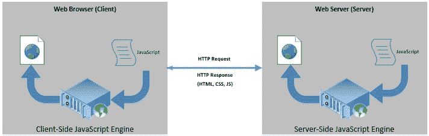
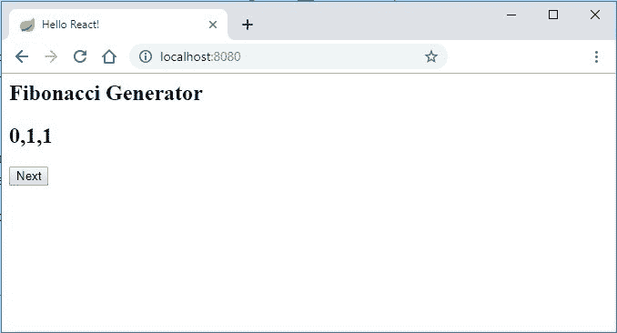

# React 和 Nashorn 的同构应用

> 原文：<https://web.archive.org/web/20220930061024/https://www.baeldung.com/react-nashorn-isomorphic-app>

## 1.概观

在本教程中，我们将了解什么是同构应用程序。我们还将讨论与 Java 捆绑的 JavaScript 引擎 [Nashorn](https://web.archive.org/web/20220627075421/https://www.oracle.com/technetwork/articles/java/jf14-nashorn-2126515.html) 。

此外，我们将探索如何使用 Nashorn 以及前端库，如 [React](https://web.archive.org/web/20220627075421/https://reactjs.org/) 来创建同构应用程序。

## 2.一点历史

传统上，客户端和服务器应用程序是以服务器端相当繁重的方式编写的。可以把 PHP 想象成一个脚本引擎，它生成大部分静态 HTML，并由 web 浏览器呈现。

早在 90 年代中期，网景就在浏览器中加入了对 JavaScript 的支持。这开始将一些处理从服务器端转移到客户端浏览器。很长一段时间，开发人员都在为 web 浏览器中 JavaScript 支持的不同问题而努力。

随着对更快和交互式用户体验的需求不断增长，边界已经被推得更紧了。最早改变游戏规则的框架之一是 jQuery 。它带来了几个用户友好的功能和对 AJAX 的增强支持。

很快，很多前端开发的框架开始出现，大大提升了开发者的体验。从谷歌的 [AngularJS](https://web.archive.org/web/20220627075421/https://angular.io/) ，脸书的 React，到后来的 [Vue，](https://web.archive.org/web/20220627075421/https://vuejs.org/)，他们开始抓住开发者的注意力。

有了现代的浏览器支持、卓越的框架和必需的工具，**潮流正在很大程度上转向客户端**。

越来越快的手持设备上的沉浸式体验需要更多的客户端处理。

## 3.什么是同构 App？

因此，我们看到了前端框架如何帮助我们开发一个 web 应用程序，其中用户界面完全呈现在客户端。

然而，**也可以在服务器端使用相同的框架**并生成相同的用户界面。

现在，我们不必坚持只有客户端或服务器端的解决方案。更好的方法是有一个解决方案，客户端和服务器都可以处理相同的前端代码并生成相同的用户界面。

这种方法有一些好处，我们将在后面讨论。

[](/web/20220627075421/https://www.baeldung.com/wp-content/uploads/2019/08/Isomorphic-Apps.jpg)

**这样的 web 应用被称为同构或通用**。现在客户端语言绝大多数都是 JavaScript。因此，对于一个同构的应用程序来说，我们也必须在服务器端使用 JavaScript。

Node.js 是构建服务器端呈现应用程序的最常见选择。

## 4.纳森是什么？

那么，Nashorn 适合在哪里，我们为什么要使用它？Nashorn 是一个默认与 Java 打包在一起的 JavaScript 引擎。因此，如果我们已经有了一个 Java 的 web 应用程序后端，并且想要构建一个同构的应用程序， [Nashorn 非常方便](/web/20220627075421/https://www.baeldung.com/java-nashorn)！

Nashorn 已经作为 Java 8 的一部分发布。这主要集中在允许在 Java 中嵌入 JavaScript 应用程序。

Nashorn **在内存中将 JavaScript 编译成 Java 字节码**并将其传递给 JVM 执行。与早期的引擎 Rhino 相比，它提供了更好的性能。

## 5.创建同构应用程序

我们已经讨论了足够多的内容。我们的应用程序将显示一个斐波那契数列，并提供一个按钮来生成和显示序列中的下一个数字。现在让我们创建一个简单的同构应用程序，包括后端和前端:

*   前端:一个简单的基于 React.js 的前端
*   后端:一个简单的 Spring Boot 后端，用 Nashorn 处理 JavaScript

## 6.应用程序前端

我们将使用 **React.js 来创建我们的前端**。React 是一个流行的 JavaScript 库，用于构建单页面应用程序。它**帮助我们将复杂的用户界面分解成具有可选状态和单向数据绑定的分层组件**。

React 解析这个层次结构，并创建一个名为虚拟 DOM 的内存数据结构。这有助于发现不同状态之间的变化，并对浏览器 DOM 进行最小的更改。

### 6.1.反应组分

让我们创建第一个 React 组件:

```java
var App = React.createClass({displayName: "App",
    handleSubmit: function() {
    	var last = this.state.data[this.state.data.length-1];
    	var secondLast = this.state.data[this.state.data.length-2];
        $.ajax({
            url: '/next/'+last+'/'+secondLast,
            dataType: 'text',
            success: function(msg) {
                var series = this.state.data;
                series.push(msg);
                this.setState({data: series});
            }.bind(this),
            error: function(xhr, status, err) {
                console.error('/next', status, err.toString());
            }.bind(this)
        });
    },
    componentDidMount: function() {
    	this.setState({data: this.props.data});
    },	
    getInitialState: function() {
        return {data: []};
    },	
    render: function() {
        return (
            React.createElement("div", {className: "app"},
            	React.createElement("h2", null, "Fibonacci Generator"),
            	React.createElement("h2", null, this.state.data.toString()),
                React.createElement("input", {type: "submit", value: "Next", onClick: this.handleSubmit})
            )     
        );
    }
});
```

现在，让我们了解一下上面的代码在做什么:

*   首先，我们在 React 中定义了一个名为“App”的类组件
*   这个组件里面最重要的**功能是“render”**，负责生成用户界面
*   我们已经提供了组件可以使用的样式`className`
*   我们在这里利用组件状态来存储和显示系列
*   当状态初始化为一个空列表时，它会在组件挂载时获取作为道具传递给组件的数据
*   最后，单击“Add”按钮，对 REST 服务进行 jQuery 调用
*   该调用获取序列中的下一个数字，并将其附加到组件的状态中
*   组件状态的变化会自动重新呈现组件

### 6.2.使用 React 组件

React 在 HTML 页面中寻找一个名为“div”的元素来锚定其内容。我们所要做的就是提供一个带有“div”元素的 HTML 页面，并加载 JS 文件:

```java
<%@ page contentType="text/html;charset=UTF-8" language="java" %>
<html>
<head>
    <title>Hello React</title>
    <script type="text/javascript" src="js/react.js"></script>
    <script type="text/javascript" src="js/react-dom.js"></script>
    <script type="text/javascript" src="http://code.jquery.com/jquery-1.10.0.min.js"></script>
</head>
<body>
<div id="root"></div>
<script type="text/javascript" src="app.js"></script>
<script type="text/javascript">
    ReactDOM.render(
        React.createElement(App, {data: [0,1,1]}),
        document.getElementById("root")
    );
</script>
</body>
</html>
```

那么，让我们看看我们在这里做了什么:

*   我们**导入了所需的 JS 库，react、react-dom 和 jQuery**
*   之后，我们定义了一个名为“root”的“div”元素
*   我们还用 React 组件导入了 JS 文件
*   接下来，我们用一些种子数据(前三个斐波那契数列)调用 React 组件“App”

## 7.应用程序后端

现在，让我们看看如何为我们的应用程序创建一个合适的后端。我们已经决定**使用 [Spring Boot](/web/20220627075421/https://www.baeldung.com/spring-boot) 和 Spring Web** 来构建这个应用程序。更重要的是，我们已经决定**使用 Nashorn 来处理我们在上一节开发的基于 JavaScript 的前端**。

### 7.1.Maven 依赖性

对于我们的简单应用程序，我们将结合使用 JSP 和 Spring MVC，因此我们将向 POM 添加几个依赖项:

```java
<dependency>
    <groupId>org.springframework.boot</groupId>
    <artifactId>spring-boot-starter-web</artifactId>
</dependency>
<dependency>
    <groupId>org.apache.tomcat.embed</groupId>
    <artifactId>tomcat-embed-jasper</artifactId>
    <scope>provided</scope>
</dependency>
```

第一个是 web 应用程序的标准 spring boot 依赖关系。第二个是编译 JSP 需要的。

### 7.2.网络控制器

现在让我们创建我们的 web 控制器，它将处理我们的 JavaScript 文件并使用 JSP 返回一个 HTML:

```java
@Controller
public class MyWebController {
    @RequestMapping("/")
    public String index(Map<String, Object> model) throws Exception {
        ScriptEngine nashorn = new ScriptEngineManager().getEngineByName("nashorn");
        nashorn.eval(new FileReader("static/js/react.js"));
        nashorn.eval(new FileReader("static/js/react-dom-server.js"));
        nashorn.eval(new FileReader("static/app.js"));
        Object html = nashorn.eval(
          "ReactDOMServer.renderToString(" + 
            "React.createElement(App, {data: [0,1,1]})" + 
          ");");
        model.put("content", String.valueOf(html));
        return "index";
    }
}
```

那么，这里到底发生了什么？

*   我们从`ScriptEngineManager`中获取一个 Nashorn 类型的`ScriptEngine`实例
*   然后，我们**加载相关库 React、react.js 和 react-dom-server.js**
*   我们还加载了包含 react 组件“App”的 JS 文件
*   最后，我们用组件“App”和一些种子数据评估创建 react 元素的 JS 片段
*   这为我们提供了 React 的输出，一个 HTML 片段作为`Object`
*   我们将这个 HTML 片段作为数据传递给相关的视图 JSP

### 7.3.JSP

现在，我们如何在 JSP 中处理这个 HTML 片段呢？

回想一下，React 自动将其输出添加到一个命名的“div”元素中，在我们的例子中是“root”。然而，**我们将把服务器端生成的 HTML 片段手动添加到 JSP 中的同一个元素**中。

让我们看看 JSP 现在是什么样子:

```java
<%@ page contentType="text/html;charset=UTF-8" language="java" %>
<html>
<head>
    <title>Hello React!</title>
    <script type="text/javascript" src="js/react.js"></script>
    <script type="text/javascript" src="js/react-dom.js"></script>
    <script type="text/javascript" src="http://code.jquery.com/jquery-1.10.0.min.js"></script>
</head>
<body>
<div id="root">${content}</div>
<script type="text/javascript" src="app.js"></script>
<script type="text/javascript">
	ReactDOM.render(
        React.createElement(App, {data: [0,1,1]}),
        document.getElementById("root")
    );
</script>
</body>
</html>
```

这是我们之前创建的同一个页面，除了我们已经将 HTML 片段添加到“root”div 中，它之前是空的。

### 7.4.休息控制器

最后，我们还需要一个服务器端 REST 端点，它给出序列中的下一个斐波那契数:

```java
@RestController
public class MyRestController {
    @RequestMapping("/next/{last}/{secondLast}")
    public int index(
      @PathVariable("last") int last, 
      @PathVariable("secondLast") int secondLast) throws Exception {
        return last + secondLast;
    }
}
```

这里没有什么花哨的，只是一个简单的弹簧休息控制器。

## 8.运行应用程序

现在，我们已经完成了前端和后端，是时候运行应用程序了。

我们应该使用引导类正常启动 Spring Boot 应用程序:

```java
@SpringBootApplication
public class Application extends SpringBootServletInitializer {
    @Override
    protected SpringApplicationBuilder configure(SpringApplicationBuilder application) {
        return application.sources(Application.class);
    }
    public static void main(String[] args) throws Exception {
        SpringApplication.run(Application.class, args);
    }
}
```

当我们运行这个类时， **Spring Boot 编译我们的 JSP，并使它们与 web 应用程序的其余部分一起在嵌入式 Tomcat 上可用。**

现在，如果我们访问我们的网站，我们会看到:

[](/web/20220627075421/https://www.baeldung.com/wp-content/uploads/2019/08/Index-Page-1.jpg)

让我们来理解事件的顺序:

*   浏览器请求此页面
*   当对这个页面的请求到达时，Spring web controller 处理 JS 文件
*   Nashorn 引擎生成一个 HTML 片段，并将其传递给 JSP
*   JSP 将这个 HTML 片段添加到“root”div 元素中，最后返回上面的 HTML 页面
*   浏览器呈现 HTML，同时开始下载 JS 文件
*   最后，页面已经为客户端操作做好了准备——我们可以在系列中添加更多的数字

这里需要理解的重要一点是，如果 React 在目标“div”元素中找到一个 HTML 片段，会发生什么。在这种情况下， **React 将这个片段与它所拥有的片段进行比较，如果它发现一个清晰的片段**，就不替换它。这正是服务器端渲染和同构应用的动力所在。

## 9.还有什么可能呢？

在我们这个简单的例子中，我们只是触及了可能的表面。具有现代基于 JS 框架的前端应用程序变得越来越强大和复杂。随着复杂性的增加，我们需要处理许多事情:

*   我们在应用程序中只创建了一个 React 组件，而实际上，它可以是几个组件组成一个层次结构，通过 props 传递数据
*   我们希望**为每个组件**创建单独的 JS 文件，使它们易于管理，并通过“导出/要求”或“导出/导入”来管理它们的依赖关系
*   此外，可能无法仅管理组件内的状态；我们可能想使用类似于[Redux](https://web.archive.org/web/20220627075421/https://redux.js.org/)的状态管理库
***   此外，作为行动的副作用，我们可能不得不与外部服务进行交互；这可能需要我们使用像 [redux-thunk](https://web.archive.org/web/20220627075421/https://github.com/reduxjs/redux-thunk) 或[Redux-Saga](https://web.archive.org/web/20220627075421/https://redux-saga.js.org/)这样的模式*   最重要的是，我们希望**利用 JSX，它是 JS** 的语法扩展，用于描述用户界面**

 **虽然 Nashorn 与 pure JS 完全兼容，但它可能不支持上面提到的所有功能。由于 JS 兼容性，其中许多需要转换编译和聚合填充。

这种情况下通常的做法是**利用一个模块捆绑器，比如 [Webpack](https://web.archive.org/web/20220627075421/https://webpack.js.org/) 或[roll up](https://web.archive.org/web/20220627075421/https://rollupjs.org/guide/en/)。他们主要做的是处理所有的 React 源文件，并将它们和所有的依赖项捆绑成一个 JS 文件。这总是需要像 [Babel](https://web.archive.org/web/20220627075421/https://babeljs.io/) 这样的现代 JavaScript 编译器来编译向后兼容的 JavaScript。**

最终的捆绑包只有很好的旧 JS，浏览器可以理解并且 Nashorn 也坚持使用。

## 10.同构应用的优势

所以，我们已经谈了很多关于同构应用的问题，现在甚至已经创建了一个简单的应用。但是我们为什么要关心这个呢？让我们了解一下使用同构应用程序的一些主要好处。

### 10.1.首页呈现

同构应用的最大好处之一是第一页的渲染速度更快。在典型的客户端呈现的应用程序中，浏览器从下载所有的 JS 和 CSS 工件开始。

之后，他们加载并开始呈现第一页。如果我们发送从服务器端呈现的第一个页面，这可以快得多，提供增强的用户体验。

### 10.2.搜索引擎友好

另一个经常提到的服务器端渲染的好处与 SEO 有关。据信，搜索机器人无法处理 JavaScript，因此无法通过 React 等库在客户端看到索引页面。因此，服务器端呈现的页面对 SEO 更友好。不过，值得注意的是，现代搜索引擎机器人声称可以处理 JavaScript。

## 11.结论

在本教程中，我们介绍了同构应用程序和 Nashorn JavaScript 引擎的基本概念。我们进一步探索了如何用 Spring Boot、React 和 Nashorn 构建一个同构的应用程序。

然后，我们讨论了扩展前端应用程序的其他可能性以及使用同构应用程序的好处。

和往常一样，代码可以在 GitHub 上找到[。](https://web.archive.org/web/20220627075421/https://github.com/eugenp/tutorials/tree/master/spring-boot-modules/spring-boot-nashorn)**