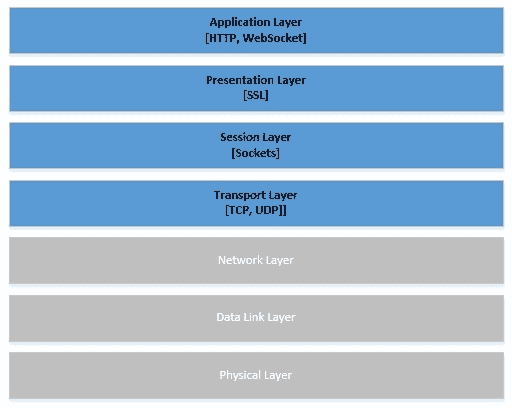
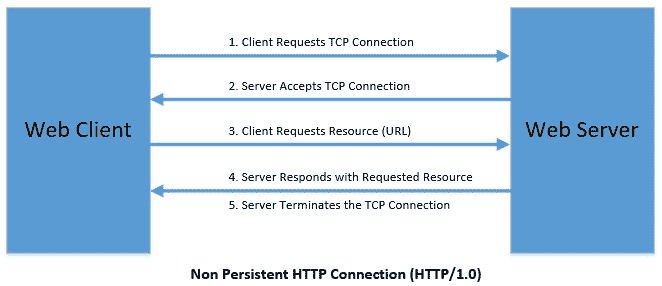
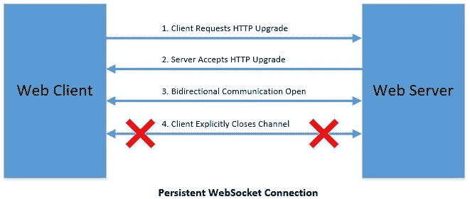

# REST vs WebSockets

> 原文：<https://web.archive.org/web/20220930061024/https://www.baeldung.com/rest-vs-websockets>

## 1.概观

在本教程中，我们将浏览客户端-服务器通信的基础知识，并通过目前可用的两个流行选项来探索这一点。我们将看到新进入者 WebSocket 如何对抗更受欢迎的 RESTful HTTP。

## 2.网络通信基础

在我们深入研究不同选项的细节及其优缺点之前，让我们快速刷新一下网络通信的格局。这将有助于正确看待事物并更好地理解这一点。

网络通信可以从[开放系统互连(OSI)模型](/web/20220926200620/https://www.baeldung.com/cs/osi-model)的角度来理解。

OSI 模型将通信系统划分为七个抽象层:

[](/web/20220926200620/https://www.baeldung.com/wp-content/uploads/2019/04/OCI-Model.jpg)

这个模型的顶部是应用层，这是我们在本教程中感兴趣的。然而，在比较 WebSocket 和 RESTful HTTP 时，我们将讨论前四层中的一些方面。

应用层离最终用户最近，负责与参与通信的应用程序进行交互。有几种[流行的协议](/web/20220926200620/https://www.baeldung.com/cs/popular-network-protocols)用在这一层，如 FTP、SMTP、SNMP、HTTP 和 WebSocket。

## 3.描述 WebSocket 和 RESTful HTTP

虽然通信可以发生在任意数量的系统之间，但是我们对客户机-服务器通信特别感兴趣。更具体地说，我们将关注 web 浏览器和 web 服务器之间的通信。这是我们用来比较 WebSocket 和 RESTful HTTP 的框架。

但是在我们继续之前，为什么不快速了解它们是什么！

### 3.1.WebSockets

根据正式定义， **[WebSocket](https://web.archive.org/web/20220926200620/https://tools.ietf.org/html/rfc6455) 是一种通信协议，其特点是通过持久 TCP 连接进行双向全双工通信。**现在，随着我们的深入，我们将详细理解这一陈述的每一部分。

WebSocket 在 2011 年被 IETF 标准化为通信协议 [RFC 6455](https://web.archive.org/web/20220926200620/https://tools.ietf.org/html/rfc6455) 。如今，大多数现代 web 浏览器都支持 WebSocket 协议。

### 3.2.RESTful HTTP

虽然我们都知道 [HTTP](https://web.archive.org/web/20220926200620/https://tools.ietf.org/html/rfc2616) 是因为它在互联网上无处不在，但它也是应用层通信协议。 **HTTP 是一个基于请求-响应的协议**，在本教程的后面我们会更好地理解这一点。

REST(表述性状态转移)是一种架构风格，它为 HTTP 创建 web 服务设置了一组约束。

## 4.WebSocket 子协议

虽然 WebSocket 定义了客户端和服务器之间双向通信的协议，**但是它没有对要交换的消息设置任何条件**。作为子协议协商的一部分，这留给通信中的各方同意。

为重要的应用程序开发子协议并不方便。幸运的是，**有许多流行的子程序可以使用，比如[跺脚](https://web.archive.org/web/20220926200620/https://stomp.github.io/)**。STOMP 代表简单面向文本的消息协议，通过 WebSocket 工作。Spring Boot 对跺脚有一流的支持，我们将在教程中用到。

## 5.Spring Boot 快速设置

没有什么比看到一个工作实例更好的了。因此，我们将在 WebSocket 和 RESTful HTTP 中构建简单的用例来进一步探索它们，然后对它们进行比较。让我们为两者创建一个简单的服务器和客户机组件。

我们将使用 JavaScript 创建一个简单的客户端，它将发送一个名称。而且，我们将使用 Java 创建一个服务器，它会用一个问候来响应。

### 5.1.WebSocket

要在 Spring Boot 使用 WebSocket，我们需要[合适的启动工具](https://web.archive.org/web/20220926200620/https://search.maven.org/artifact/org.springframework.boot/spring-boot-starter-websocket/2.1.4.RELEASE/jar):

```java
<dependency>
    <groupId>org.springframework.boot</groupId>
    <artifactId>spring-boot-starter-websocket</artifactId>
</dependency>
```

我们现在将配置 STOMP 端点:

```java
@Configuration
@EnableWebSocketMessageBroker
public class WebSocketMessageBrokerConfig implements WebSocketMessageBrokerConfigurer {

    @Override
    public void registerStompEndpoints(StompEndpointRegistry registry) {
        registry.addEndpoint("/ws");
    }

    @Override
    public void configureMessageBroker(MessageBrokerRegistry config) {
        config.setApplicationDestinationPrefixes("/app");
        config.enableSimpleBroker("/topic");
    }
}
```

让我们快速定义一个简单的 WebSocket 服务器，它接受一个名称并以一个问候作为响应:

```java
@Controller
public class WebSocketController {

    @MessageMapping("/hello")
    @SendTo("/topic/greetings")
    public Greeting greeting(Message message) throws Exception {
        return new Greeting("Hello, " + HtmlUtils.htmlEscape(message.getName()) + "!");
    }
}
```

最后，让我们构建客户机来与这个 WebSocket 服务器通信。因为我们强调浏览器到服务器的通信，所以让我们用 JavaScript 创建一个客户端:

```java
var stompClient = null;
function connect() {
    stompClient = Stomp.client('ws://localhost:8080/ws');
    stompClient.connect({}, function (frame) {
        stompClient.subscribe('/topic/greetings', function (response) {
            showGreeting(JSON.parse(response.body).content);
        });
    });
}
function sendName() {
	stompClient.send("/app/hello", {}, JSON.stringify({'name': $("#name").val()}));
}
function showGreeting(message) {
    $("#greetings").append("<tr><td>" + message + "</td></tr>");
}
```

这就完成了我们的 WebSocket 服务器和客户机的工作示例。代码库中有一个 HTML 页面，它提供了一个简单的用户界面来进行交互。

虽然这仅仅触及了表面，但是带有 Spring 的 WebSocket 可以用来构建复杂的聊天客户端。

### 5.2.RESTful HTTP

现在，我们将经历一个类似的 RESTful 服务设置。我们简单的 web 服务将接受一个带有名称的 GET 请求，并以问候作为响应。

这次让我们使用 Spring Boot 的网络启动器:

```java
<dependency>
    <groupId>org.springframework.boot</groupId>
    <artifactId>spring-boot-starter-web</artifactId>
</dependency>
```

现在，我们将利用 Spring 中强大的注释支持来定义一个 REST 端点:

```java
@RestController
@RequestMapping(path = "/rest")
public class RestAPIController {
    @GetMapping(path="/{name}", produces = "application/json")
    public String getGreeting(@PathVariable("name") String name)
    {
        return "{\"greeting\" : \"Hello, " + name + "!\"}";
    }
}
```

最后，让我们用 JavaScript 创建一个客户端:

```java
var request = new XMLHttpRequest()
function sendName() {
    request.open('GET', 'http://localhost:8080/rest/'+$("#name").val(), true)
    request.onload = function () {
    	var data = JSON.parse(this.response)
    	showGreeting(data.greeting)
    }
    request.send()
}

function showGreeting(message) {
    $("#greetings").append("<tr><td>" + message + "</td></tr>");
}
```

差不多就是这样！同样，在代码库中有一个 HTML 页面来处理用户界面。

虽然非常简单，但是定义产品级 REST API 可能是一项更为复杂的任务！

## 6.WebSocket 和 RESTful HTTP 的比较

创建了 WebSocket 和 RESTful HTTP 的最小但有效的示例后，我们现在可以理解它们之间的区别了。在接下来的小节中，我们将根据几个标准对此进行检查。

值得注意的是，虽然我们可以直接比较 HTTP 和 WebSocket，因为它们都是应用层协议，**但是将 REST 与 WebSocket** 进行比较并不自然。正如我们前面看到的，REST 是一种利用 HTTP 进行通信的架构风格。

因此**我们与 WebSocket 的比较主要是关于 HTTP** 中的功能或缺乏功能。

### 6.1.URL 方案

URL **定义了 web 资源的唯一位置和检索它的机制**。在客户端-服务器通信中，我们通常希望通过相关的 URL 获取静态或动态资源。

我们都熟悉 HTTP URL 方案:

```java
http://localhost:8080/rest
```

WebSocket URL 方案也没有太大不同:

```java
ws://localhost:8080/ws
```

开始时，唯一的区别似乎是冒号前的字符，但它抽象了很多发生在幕后的事情。让我们进一步探索。

### 6.2.握手

`Handshake` **是指通信双方**自动协商通信协议的方式。HTTP 是一种无状态协议，采用请求-响应机制。对于每个 HTTP 请求，通过套接字与服务器建立 TCP 连接。

然后，客户端等待，直到服务器用资源或错误进行响应。客户端的下一个请求会重复所有内容，就好像上一个请求从未发生过一样:

[](/web/20220926200620/https://www.baeldung.com/wp-content/uploads/2019/04/HTTP-Connection.jpg)

与 HTTP 相比，WebSocket 的工作方式非常不同，它在实际通信之前从握手开始。

让我们看看 WebSocket 握手由什么组成:

[](/web/20220926200620/https://www.baeldung.com/wp-content/uploads/2019/04/WebSocket-Connection.jpg)

在 WebSocket 的情况下，**客户端以 HTTP 发起协议握手请求，然后等待，直到服务器响应接受从 HTTP** 到 WebSocket 的升级。

当然，因为协议握手发生在 HTTP 上，所以它遵循上图中的顺序。但是一旦建立了连接，客户机和服务器就切换到 WebSocket 进行进一步的通信。

### 6.3.关系

正如我们在前一小节中看到的，WebSocket 和 HTTP 之间的一个明显区别是，WebSocket 工作在一个持久的 TCP 连接上，而 HTTP 为每个请求创建一个新的 TCP 连接。

现在，显然为每个请求创建新的 TCP 连接不是很高效，HTTP 并没有意识到这一点。事实上，作为 HTTP/1.1 的一部分，持久连接被引入来缓解 HTTP 的这一缺点。

尽管如此， **WebSocket 已经被从头设计来与持久 TCP 连接一起工作**。

### 6.4.沟通

WebSocket 相对于 HTTP 的优势是一个特定的场景，它源于这样一个事实，即客户机和服务器之间可以用以前的 HTTP 无法实现的方式进行通信。

例如，在 HTTP 中，通常客户端发送请求，然后服务器用请求的数据进行响应。服务器本身没有与客户端通信的通用方法。当然，已经设计了一些模式和解决方案来避免这种情况，比如服务器发送事件(SSE ),但是这些并不完全自然。

有了 WebSocket，在持久的 TCP 通信上工作，**服务器和客户端可以相互独立地发送数据**，事实上，可以向许多通信方发送数据！**这被称为双向交流。**

WebSocket 通信的另一个有趣的特性是它是全双工的。虽然这个术语听起来很深奥；这仅仅意味着**服务器和客户端可以同时发送数据**。与 HTTP 中发生的情况相比，在 HTTP 中，服务器必须等到完全接收到请求后才能用数据进行响应。

而双向和全双工通信的好处可能不会立即显现出来。我们将看到一些释放一些真正力量的用例。

### 6.5.安全性

最后但同样重要的是，【HTTP 和 WebSocket 都利用了 TLS 的安全性优势。虽然 HTTP 提供了`https`作为其 URL 方案的一部分来使用它，但是 WebSocket 提供了`wss` 作为其 URL 方案的一部分来达到同样的效果。

因此，上一小节中的 URL 的安全版本应该如下所示:

```java
https://localhost:443/rest
wss://localhost:443/ws
```

确保 RESTful 服务或 WebSocket 通信的安全是一个非常深入的主题，在这里无法讨论。就目前而言，我们只能说两者在这方面都得到了充分的支持。

### 6.6.表演

我们必须理解 WebSocket 是一个有状态的协议，其中通信通过专用的 TCP 连接进行。另一方面，HTTP 本质上是一种无状态协议。这对它们在负载下的表现有影响，但这实际上取决于使用情形。

由于 WebSocket 上的通信是通过可重用的 TCP 连接进行的，因此每条消息的开销比 HTTP 低。因此，每台服务器可以达到更高的吞吐量。但是单个服务器的可伸缩性是有限的，这就是 WebSocket 的问题所在。用 WebSockets 横向扩展应用程序并不容易。

这就是 HTTP 大放异彩的地方。有了 HTTP，每个新请求都有可能到达任何服务器。这意味着要增加总吞吐量，我们可以轻松地添加更多的服务器。这对运行 HTTP 的应用程序应该没有潜在的影响。

显然，应用程序本身可能需要状态和会话粘性，这使得说起来容易做起来难。

## 7.我们应该在哪里使用它们？

现在，我们已经看到了足够多的基于 HTTP 的 RESTful 服务和基于 WebSocket 的简单通信，从而形成了我们对它们的看法。但是我们应该在哪里使用什么呢？

重要的是要记住，虽然 WebSocket 是从 HTTP 的缺点中脱颖而出的，但事实上，它并不是 HTTP 的替代品。所以它们都有自己的位置和用途。让我们快速了解如何才能做出决定。

对于大部分场景**来说，偶尔需要与服务器进行通信，比如获取雇员的记录，使用 HTTP/S** 上的 REST 服务仍然是明智的。但是对于较新的客户端应用程序，比如需要来自服务器的实时更新的股票价格应用程序，利用 WebSocket 会方便得多。

总的来说， **WebSocket 更适合基于推送的实时通信更恰当地定义需求的情况**。此外， **WebSocket 非常适合需要将消息同时推送到多个客户端的场景**。在这些情况下，通过 RESTful 服务的客户机和服务器通信将会很困难，如果不是禁止的话。

然而，在 HTTP 上使用 WebSocket 和 RESTful 服务需要从需求中抽取。就像没有银弹一样，我们不能指望只挑一个来解决所有问题。因此，我们必须用我们的智慧和知识来设计一个有效的沟通模式。

## 8.结论

在本教程中，我们回顾了网络通信的基础知识，重点是应用层协议 HTTP 和 WebSocket。我们在 Spring Boot 看到了一些 WebSocket 和 RESTful API over HTTP 的快速演示。

最后，我们比较了 HTTP 和 WebSocket 协议的特性，并简要讨论了何时使用它们。

和往常一样，这些例子的代码可以在 GitHub 的[上找到。](https://web.archive.org/web/20220926200620/https://github.com/eugenp/tutorials/tree/master/spring-security-modules/spring-security-web-sockets)