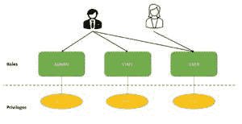
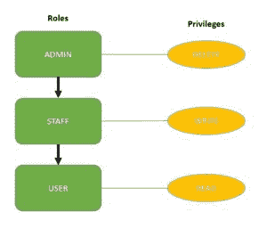

# spring Security–角色和权限

> 原文：<https://web.archive.org/web/20220930061024/https://www.baeldung.com/role-and-privilege-for-spring-security-registration>

## 1。概述

本教程继续 Spring Security 系列的注册，看看如何正确地实现**角色和特权。**

## 延伸阅读:

## [Spring 安全表达式简介](/web/20220628152411/https://www.baeldung.com/spring-security-expressions)

Simple and practical guide to Spring Security Expressions.[Read more](/web/20220628152411/https://www.baeldung.com/spring-security-expressions) →

## [Spring 方法安全性介绍](/web/20220628152411/https://www.baeldung.com/spring-security-method-security)

A guide to method-level security using the Spring Security framework.[Read more](/web/20220628152411/https://www.baeldung.com/spring-security-method-security) →

## [Spring Security–登录后重定向到以前的 URL](/web/20220628152411/https://www.baeldung.com/spring-security-redirect-login)

A short example of redirection after login in Spring Security[Read more](/web/20220628152411/https://www.baeldung.com/spring-security-redirect-login) →

## 2。`User`、`Role`和`Privilege`、

让我们从我们的实体开始。我们有三个主要实体:

*   `User`
*   `Role`代表用户在系统中的高级角色。每个角色都有一组低级权限。
*   `Privilege`代表系统中的低级、粒度特权/权限。

下面是**用户**:

```java
@Entity
public class User {

    @Id
    @GeneratedValue(strategy = GenerationType.AUTO)
    private Long id;

    private String firstName;
    private String lastName;
    private String email;
    private String password;
    private boolean enabled;
    private boolean tokenExpired;

    @ManyToMany 
    @JoinTable( 
        name = "users_roles", 
        joinColumns = @JoinColumn(
          name = "user_id", referencedColumnName = "id"), 
        inverseJoinColumns = @JoinColumn(
          name = "role_id", referencedColumnName = "id")) 
    private Collection<Role> roles;
}
```

正如我们所看到的，用户包含角色以及正确注册机制所必需的一些附加细节。

接下来是**这个角色**:

```java
@Entity
public class Role {

    @Id
    @GeneratedValue(strategy = GenerationType.AUTO)
    private Long id;

    private String name;
    @ManyToMany(mappedBy = "roles")
    private Collection<User> users;

    @ManyToMany
    @JoinTable(
        name = "roles_privileges", 
        joinColumns = @JoinColumn(
          name = "role_id", referencedColumnName = "id"), 
        inverseJoinColumns = @JoinColumn(
          name = "privilege_id", referencedColumnName = "id"))
    private Collection<Privilege> privileges;
}
```

最后，我们来看看**的特权**:

```java
@Entity
public class Privilege {

    @Id
    @GeneratedValue(strategy = GenerationType.AUTO)
    private Long id;

    private String name;

    @ManyToMany(mappedBy = "privileges")
    private Collection<Role> roles;
}
```

如我们所见，我们认为用户角色和角色特权关系是**多对多的双向关系。**

## 3。设置权限和角色

接下来，让我们集中精力对系统中的权限和角色进行一些早期设置。

我们将它与应用程序的启动联系起来，我们将在`ContextRefreshedEvent`上使用一个`ApplicationListener`来在服务器启动时加载我们的初始数据:

```java
@Component
public class SetupDataLoader implements
  ApplicationListener<ContextRefreshedEvent> {

    boolean alreadySetup = false;

    @Autowired
    private UserRepository userRepository;

    @Autowired
    private RoleRepository roleRepository;

    @Autowired
    private PrivilegeRepository privilegeRepository;

    @Autowired
    private PasswordEncoder passwordEncoder;

    @Override
    @Transactional
    public void onApplicationEvent(ContextRefreshedEvent event) {

        if (alreadySetup)
            return;
        Privilege readPrivilege
          = createPrivilegeIfNotFound("READ_PRIVILEGE");
        Privilege writePrivilege
          = createPrivilegeIfNotFound("WRITE_PRIVILEGE");

        List<Privilege> adminPrivileges = Arrays.asList(
          readPrivilege, writePrivilege);
        createRoleIfNotFound("ROLE_ADMIN", adminPrivileges);
        createRoleIfNotFound("ROLE_USER", Arrays.asList(readPrivilege));

        Role adminRole = roleRepository.findByName("ROLE_ADMIN");
        User user = new User();
        user.setFirstName("Test");
        user.setLastName("Test");
        user.setPassword(passwordEncoder.encode("test"));
        user.setEmail("[[email protected]](/web/20220628152411/https://www.baeldung.com/cdn-cgi/l/email-protection)");
        user.setRoles(Arrays.asList(adminRole));
        user.setEnabled(true);
        userRepository.save(user);

        alreadySetup = true;
    }

    @Transactional
    Privilege createPrivilegeIfNotFound(String name) {

        Privilege privilege = privilegeRepository.findByName(name);
        if (privilege == null) {
            privilege = new Privilege(name);
            privilegeRepository.save(privilege);
        }
        return privilege;
    }

    @Transactional
    Role createRoleIfNotFound(
      String name, Collection<Privilege> privileges) {

        Role role = roleRepository.findByName(name);
        if (role == null) {
            role = new Role(name);
            role.setPrivileges(privileges);
            roleRepository.save(role);
        }
        return role;
    }
}
```

那么，在这个简单的设置代码中发生了什么呢？没什么复杂的:

*   我们在创造特权。
*   然后，我们创建角色并为其分配权限。
*   最后，我们将创建一个用户并为其分配一个角色。

请注意我们如何使用一个`alreadySetup`标志来**决定安装是否需要运行。**这只是因为`ContextRefreshedEvent` 可能会被触发多次，这取决于我们在应用程序中配置了多少上下文。我们只想运行一次设置。

这里有两个快速注释。我们首先来看一下**术语。**我们在这里使用了`Privilege – Role`术语。但在春天，这些略有不同。在 Spring 中，我们的特权被称为角色，也称为(授予的)权限，这有点令人困惑。

这对于实现当然不是问题，但绝对值得注意。

第二，这些 Spring 角色(我们的特权)需要一个前缀。默认情况下，前缀是“ROLE ”,但是可以更改。我们在这里没有使用这个前缀，只是为了简单起见，但是请记住，如果我们没有明确地改变它，它将是必需的。

## 4。`UserDetailsService`风俗

现在让我们来看看认证过程。

我们将看到如何在我们的自定义`UserDetailsService`中检索用户，以及如何从用户分配的角色和特权中映射正确的权限集:

```java
@Service("userDetailsService")
@Transactional
public class MyUserDetailsService implements UserDetailsService {

    @Autowired
    private UserRepository userRepository;

    @Autowired
    private IUserService service;

    @Autowired
    private MessageSource messages;

    @Autowired
    private RoleRepository roleRepository;

    @Override
    public UserDetails loadUserByUsername(String email)
      throws UsernameNotFoundException {

        User user = userRepository.findByEmail(email);
        if (user == null) {
            return new org.springframework.security.core.userdetails.User(
              " ", " ", true, true, true, true, 
              getAuthorities(Arrays.asList(
                roleRepository.findByName("ROLE_USER"))));
        }

        return new org.springframework.security.core.userdetails.User(
          user.getEmail(), user.getPassword(), user.isEnabled(), true, true, 
          true, getAuthorities(user.getRoles()));
    }

    private Collection<? extends GrantedAuthority> getAuthorities(
      Collection<Role> roles) {

        return getGrantedAuthorities(getPrivileges(roles));
    }

    private List<String> getPrivileges(Collection<Role> roles) {

        List<String> privileges = new ArrayList<>();
        List<Privilege> collection = new ArrayList<>();
        for (Role role : roles) {
            privileges.add(role.getName());
            collection.addAll(role.getPrivileges());
        }
        for (Privilege item : collection) {
            privileges.add(item.getName());
        }
        return privileges;
    }

    private List<GrantedAuthority> getGrantedAuthorities(List<String> privileges) {
        List<GrantedAuthority> authorities = new ArrayList<>();
        for (String privilege : privileges) {
            authorities.add(new SimpleGrantedAuthority(privilege));
        }
        return authorities;
    }
}
```

这里有趣的是特权(和角色)是如何映射到 GrantedAuthority 实体的。

这种映射使得整个安全配置**高度灵活和强大。**我们可以根据需要混合和匹配角色和权限，最终，它们将被正确映射到权限并返回到框架中。

## 5.角色层次结构

此外，让我们将我们的角色组织成层次结构。

我们已经看到了如何通过将权限映射到角色来实现基于角色的访问控制。这允许我们为用户分配一个角色，而不是分配所有的特权。

然而，随着角色数量的增加，**用户可能需要多个角色**，导致角色爆炸:

[](/web/20220628152411/https://www.baeldung.com/wp-content/uploads/2015/01/role-explosion.jpg)

为了克服这个问题，我们可以使用 Spring Security 的角色层次结构:

[](/web/20220628152411/https://www.baeldung.com/wp-content/uploads/2015/01/role-h.jpg)

分配**角色`ADMIN`会自动赋予用户`STAFF`和`USER`角色的权限。**

但是，角色为`STAFF`的用户只能执行`STAFF`和`USER`角色动作。

让我们在 Spring Security 中通过简单地公开一个类型为`RoleHierarchy`的 bean 来创建这个层次结构:

```java
@Bean
public RoleHierarchy roleHierarchy() {
    RoleHierarchyImpl roleHierarchy = new RoleHierarchyImpl();
    String hierarchy = "ROLE_ADMIN > ROLE_STAFF \n ROLE_STAFF > ROLE_USER";
    roleHierarchy.setHierarchy(hierarchy);
    return roleHierarchy;
}
```

我们在表达式中使用`>` 符号来定义角色层次。这里，我们已经配置了角色`ADMIN`来包含角色`STAFF`，而角色【】又包含角色用户。

最后，为了在`Spring Web Expressions`中包含这个角色层次，我们将`roleHierarchy` 实例添加到`WebSecurityExpressionHandler`中:

```java
@Bean
public DefaultWebSecurityExpressionHandler webSecurityExpressionHandler() {
    DefaultWebSecurityExpressionHandler expressionHandler = new DefaultWebSecurityExpressionHandler();
    expressionHandler.setRoleHierarchy(roleHierarchy());
    return expressionHandler;
}
```

正如我们所见，角色层次结构是减少我们需要添加给用户的角色和权限数量的一个好方法。

## 6。`User`报名

最后，让我们看看新用户的注册。

我们已经看到了 setup 是如何创建用户并为其分配角色(和权限)的。

现在，让我们来看看在注册新用户时需要如何做:

```java
@Override
public User registerNewUserAccount(UserDto accountDto) throws EmailExistsException {

    if (emailExist(accountDto.getEmail())) {
        throw new EmailExistsException
          ("There is an account with that email adress: " + accountDto.getEmail());
    }
    User user = new User();

    user.setFirstName(accountDto.getFirstName());
    user.setLastName(accountDto.getLastName());
    user.setPassword(passwordEncoder.encode(accountDto.getPassword()));
    user.setEmail(accountDto.getEmail());

    user.setRoles(Arrays.asList(roleRepository.findByName("ROLE_USER")));
    return repository.save(user);
}
```

在这个简单的实现中，因为我们假设注册了一个标准用户，所以我们给它分配了`ROLE_USER` 角色。

当然，更复杂的逻辑也可以用同样的方式轻松实现，要么使用多个硬编码的注册方法，要么允许客户端发送正在注册的用户类型。

## 7。结论

在本文中，我们展示了如何使用 JPA 为 Spring 安全支持系统实现角色和特权。

我们还配置了一个角色层次结构来简化我们的访问控制配置。

这个注册 Spring 安全教程的**完整实现**可以在 GitHub 上面的[找到。](https://web.archive.org/web/20220628152411/https://github.com/Baeldung/spring-security-registration "The Full Registration Example Project on Github ")