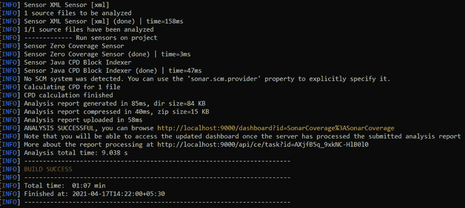
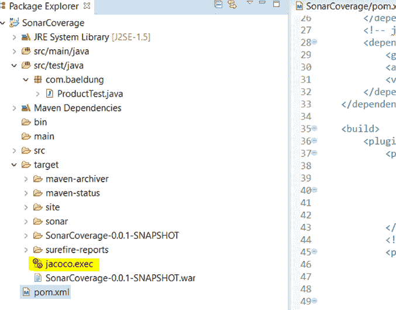
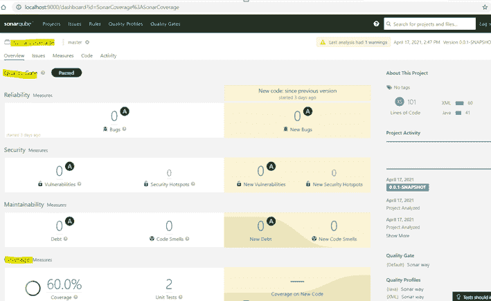

# SonarQube 和 JaCoCo 的代码覆盖率

> 原文：<https://web.archive.org/web/20220930061024/https://www.baeldung.com/sonarqube-jacoco-code-coverage>

## 1.概观

SonarQube 是一个开源的独立服务，它通过测量代码质量和代码覆盖率来概述我们源代码的整体健康状况。

在本教程中，我们将介绍使用 SonarQube 和 JaCoCo 测量代码覆盖率的过程。

## 2.描述

### 2.1.代码覆盖率

[代码覆盖率](/web/20221129015925/https://www.baeldung.com/cs/code-coverage)，也称为测试覆盖率，是对测试中运行了多少应用程序代码的度量。本质上，它是**,许多团队使用它来检查他们测试的质量，因为它代表了已经被测试和运行的产品代码的百分比。**

这让开发团队确信他们的程序已经过广泛的错误测试，应该是相对没有错误的。

### 2.2.索纳库贝和雅各布

sonar cube 检查和评估影响我们代码库的一切，从微小的样式细节到关键的设计错误。这使得开发人员能够访问和跟踪代码分析数据，从样式错误、潜在的错误和代码缺陷，到设计效率低下、代码重复、缺乏测试覆盖率和过度复杂。

它还定义了一个质量门，这是一组基于测量的布尔条件。此外，SonarQube 帮助我们了解我们的代码是否可以投入生产。

SonarQube 与 Java 的免费代码覆盖库 [JaCoCo](/web/20221129015925/https://www.baeldung.com/jacoco) 集成使用。

## 3.Maven 配置

### 3.1.下载 SonarQube

我们可以从它的[官网](https://web.archive.org/web/20221129015925/https://www.sonarqube.org/downloads/)下载 SonarQube。

要启动 SonarQube，在 Windows 机器上运行名为`StartSonar.bat`的文件，或者在 Linux 或 macOS 上运行文件`sonar.sh`。该文件位于解压缩后的下载文件的`bin`目录中。

### 3.2。设置 SonarQube 和 JaCoCo 的属性

让我们首先添加定义 JaCoCo 版本、插件名称、报告路径和 sonar 语言的必要属性:

```java
<properties>
    <!-- JaCoCo Properties -->
    <jacoco.version>0.8.6</jacoco.version>
    <sonar.java.coveragePlugin>jacoco</sonar.java.coveragePlugin>
    <sonar.dynamicAnalysis>reuseReports</sonar.dynamicAnalysis>
    <sonar.jacoco.reportPath>${project.basedir}/../target/jacoco.exec</sonar.jacoco.reportPath>
    <sonar.language>java</sonar.language>
</properties>
```

属性 `sonar.jacoco.reportPath`指定了生成 JaCoCo 报告的位置。

### 3.3。JaCoCo 的依赖项和插件

JaCoCo Maven 插件提供对 JaCoCo 运行时代理的访问，该代理记录执行覆盖数据并创建代码覆盖报告。

现在让我们看看我们将添加到`pom.xml` 文件中的依赖关系:

```java
<dependency>
    <groupId>org.jacoco</groupId> 
    <artifactId>jacoco-maven-plugin</artifactId>
    <version>0.8.6</version>
</dependency>
```

接下来，让我们配置将 Maven 项目与 JaCoCo 集成的插件:

```java
<plugin>
    <groupId>org.jacoco</groupId>
    <artifactId>jacoco-maven-plugin</artifactId>
    <version>${jacoco.version}</version>
    <executions>
        <execution>
            <id>jacoco-initialize</id>
            <goals>
                <goal>prepare-agent</goal>
            </goals>
        </execution>
        <execution>
            <id>jacoco-site</id>
            <phase>package</phase>
            <goals>
                <goal>report</goal>
            </goals>
        </execution>
    </executions>
</plugin>
```

## 4.SonarQube 正在运行

既然我们已经在`pom.xml file`中定义了所需的依赖项和插件，我们将运行`mvn clean install`来构建我们的项目。

然后，我们将在运行命令`mvn sonar:sonar`之前**启动 SonarQube 服务器。**

一旦该命令成功运行，它将为我们提供一个链接，指向我们项目的代码覆盖率报告的仪表板:

[](/web/20221129015925/https://www.baeldung.com/wp-content/uploads/2021/05/sonar.png)

注意，它在项目的目标文件夹中创建了一个名为`jacoco.exec`的文件。

该文件是 SonarQube 将进一步使用的代码覆盖的结果:

[](/web/20221129015925/https://www.baeldung.com/wp-content/uploads/2021/05/Jacoco_result.png)

它还在 SonarQube 门户中创建了一个仪表板。

这个仪表板显示了覆盖率报告，其中包含所有问题、安全漏洞、可维护性指标以及在我们的代码中发现的代码重复块:

[](/web/20221129015925/https://www.baeldung.com/wp-content/uploads/2021/05/sonarqube.png)

## 5.结论

SonarQube 和 JaCoCo 是两个工具，我们可以一起使用它们来简化代码覆盖率的测量。

它们还通过查找代码中的代码重复、错误和其他问题，提供源代码整体健康状况的概述。这有助于我们了解我们的代码是否可以投入生产。

这篇文章的完整源代码可以在 GitHub 的[上找到。](https://web.archive.org/web/20221129015925/https://github.com/eugenp/tutorials/tree/master/testing-modules/testing-libraries-2)