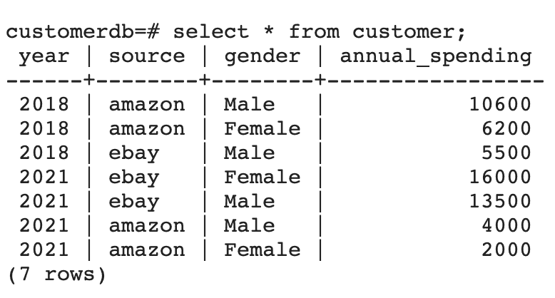

# 踢数据帧

> 原文：<https://web.archive.org/web/20220930061024/https://www.baeldung.com/spark-dataframes>

## 1.概观

[Apache Spark](/web/20220524054718/https://www.baeldung.com/apache-spark) 是一个开源的分布式分析和处理系统，支持大规模的数据工程和数据科学。它通过为数据传输、大规模转换和分发提供统一的 API，简化了面向分析的应用程序的开发。

`DataFrame`是 Spark API 的一个重要且必不可少的组件。在本教程中，我们将使用一个简单的客户数据示例来研究一些 Spark`DataFrame`API。

## 2.`DataFrame`在火花中

从逻辑上来说， **a `DataFrame`是一组不可变的记录，它们被组织成命名的列**。它与 RDBMS 中的表或 Java 中的`ResultSet`有相似之处。

作为一个 API，`DataFrame`提供了对多个 Spark 库的统一访问，包括 [Spark SQL、Spark Streaming、MLib 和 GraphX](/web/20220524054718/https://www.baeldung.com/apache-spark) 。

**在 Java 中，我们用`Dataset<Row>`来代表一个`DataFrame`。**

从本质上来说，`Row`使用称为 `Tungsten`的高效存储，与它的[前辈](/web/20220524054718/https://www.baeldung.com/java-spark-dataframe-dataset-rdd)相比，它高度优化了火花操作。

## 3.Maven 依赖性

让我们首先将 [`spark-core`](https://web.archive.org/web/20220524054718/https://search.maven.org/artifact/org.apache.spark/spark-core_2.11) 和 [`spark-sql`](https://web.archive.org/web/20220524054718/https://search.maven.org/artifact/org.apache.spark/spark-sql_2.11) 依赖项添加到我们的`pom.xml`中:

```
<dependency>
    <groupId>org.apache.spark</groupId>
    <artifactId>spark-core_2.11</artifactId>
    <version>2.4.8</version>
</dependency>

<dependency>
    <groupId>org.apache.spark</groupId>
    <artifactId>spark-sql_2.11</artifactId>
    <version>2.4.8</version>
</dependency> 
```

## 4.`DataFrame`和图式

本质上，一个`DataFrame`是一个带有模式的 [RDD](/web/20220524054718/https://www.baeldung.com/scala/apache-spark-rdd) 。该模式可以被推断或定义为一个`StructType`。

**`StructType`是 Spark SQL 中的内置数据类型，我们用它来表示一组`StructField`对象**。

让我们定义一个示例`Customer`模式`StructType`:

```
public static StructType minimumCustomerDataSchema() {
    return DataTypes.createStructType(new StructField[] {
      DataTypes.createStructField("id", DataTypes.StringType, true),
      DataTypes.createStructField("name", DataTypes.StringType, true),
      DataTypes.createStructField("gender", DataTypes.StringType, true),
      DataTypes.createStructField("transaction_amount", DataTypes.IntegerType, true) }
    );
}
```

这里，每个`StructField`都有一个代表`DataFrame`列名、类型的名称，以及代表它是否可空的`boolean`值。

## 5.正在构建`DataFrames`

每个 Spark 应用程序的第一个操作是通过主机获得一个`SparkSession`。

**它为我们提供了一个进入`DataFrames`** 的入口。让我们从创建`SparkSession`开始:

```
public static SparkSession getSparkSession() {
    return SparkSession.builder()
      .appName("Customer Aggregation pipeline")
      .master("local")
      .getOrCreate();
}
```

请注意，我们使用本地主机连接到 Spark。如果我们要连接到集群，我们应该给出集群地址。

一旦我们有了一个`SparkSession`，我们可以使用各种方法创建一个`DataFrame`。让我们简单看一下其中的一些。

### 5.1.`DataFrame`来自`List<POJO>`

先建一个`List<Customer>`:

```
List<Customer> customers = Arrays.asList(
  aCustomerWith("01", "jo", "Female", 2000), 
  aCustomerWith("02", "jack", "Male", 1200)
);
```

接下来，让我们使用 `createDataFrame`从`List<Customer>` 构造`DataFrame`:

```
Dataset<Row> df = SPARK_SESSION
  .createDataFrame(customerList, Customer.class);
```

### 5.2.`DataFrame`来自`Dataset`

如果我们有一个`Dataset`，我们可以通过调用 `Dataset`上的`toDF` 很容易地将其转换成一个 `DataFrame`。

让我们先创建一个`Dataset<Customer>`，使用*创建数据集*，它需要`org.apache.spark.sql.Encoders`:

```
Dataset<Customer> customerPOJODataSet = SPARK_SESSION
  .createDataset(CUSTOMERS, Encoders.bean(Customer.class));
```

接下来，我们把它转换成`DataFrame`:

```
Dataset<Row> df = customerPOJODataSet.toDF();
```

### 5.3.`Row`从 POJO 使用 `RowFactory`

由于`DataFrame`本质上是一个`Dataset<Row>`，让我们看看如何从一个`Customer` POJO 创建一个`Row`。

基本上，通过实现`MapFunction<Customer, Row>` 并覆盖 `call`方法，我们可以使用 `RowFactory.create`将每个`Customer`映射到`a Row `:

```
public class CustomerToRowMapper implements MapFunction<Customer, Row> {

    @Override
    public Row call(Customer customer) throws Exception {
        Row row = RowFactory.create(
          customer.getId(),
          customer.getName().toUpperCase(),
          StringUtils.substring(customer.getGender(),0, 1),
          customer.getTransaction_amount()
        );
        return row;
    }
}
```

我们应该注意，在将数据转换成 T1 之前，我们可以在这里处理 T0 数据。

### 5.4.`DataFrame`来自`List<Row>`

我们还可以从一列`Row`对象中创建一个`DataFrame`:

```
List<Row> rows = customer.stream()
  .map(c -> new CustomerToRowMapper().call(c))
  .collect(Collectors.toList());
```

现在，让我们把这个`List<Row>`和 `StructType`模式一起交给`SparkSession`:

```
Dataset<Row> df = SparkDriver.getSparkSession()
  .createDataFrame(rows, SchemaFactory.minimumCustomerDataSchema());
```

注意这里的 **`List<Row>`将根据模式定义**转换为`DataFrame`。模式中不存在的任何字段都不会成为`DataFrame.`的一部分

### 5.5. `DataFrame`来自结构化文件和数据库

`DataFrames`可以像 CSV 文件一样存储列信息，也可以像 JSON 文件一样存储嵌套的字段和数组。

**`DataFrame`API 保持不变，不管我们是处理 CSV 文件、JSON 文件还是其他格式以及数据库。**

让我们从多行 JSON 数据创建`DataFrame`:

```
Dataset<Row> df = SparkDriver.getSparkSession()
  .read()
  .format("org.apache.spark.sql.execution.datasources.json.JsonFileFormat")
  .option("multiline", true)
  .load("data/minCustomerData.json");
```

类似地，在从数据库读取的情况下，我们将有:

```
Dataset<Row> df = SparkDriver.getSparkSession()
  .read()
  .option("url", "jdbc:postgresql://localhost:5432/customerdb")
  .option("dbtable", "customer")
  .option("user", "user")
  .option("password", "password")
  .option("serverTimezone", "EST")
  .format("jdbc")
  .load();
```

## 6.将`DataFrame`转换为`Dataset`

现在，让我们看看如何将我们的`DataFrame `转换成`Dataset`。如果我们想操作现有的 POJOs 和只适用于`DataFrame`的扩展 API，这种转换是有用的。

我们将继续上一节中从 JSON 创建的`DataFrame`。

让我们调用一个 mapper 函数，它获取`Dataset<Row>`的每一行，并将其转换成一个`Customer`对象:

```
Dataset<Customer> ds = df.map(
  new CustomerMapper(),
  Encoders.bean(Customer.class)
);
```

这里，`CustomerMapper`实现了`MapFunction<Row, Customer>`:

```
public class CustomerMapper implements MapFunction<Row, Customer> {

    @Override
    public Customer call(Row row) {
        Customer customer = new Customer();
        customer.setId(row.getAs("id"));
        customer.setName(row.getAs("name"));
        customer.setGender(row.getAs("gender"));
        customer.setTransaction_amount(Math.toIntExact(row.getAs("transaction_amount")));
        return customer;
    }
}
```

我们应该注意到 **`MapFunction<Row, Customer>`只被实例化一次，不管我们需要处理多少条记录**。

## 7.`DataFrame`操作和转换

现在，让我们使用一个客户数据示例来构建一个简单的管道。我们希望从两个不同的文件源获取客户数据，对它们进行规范化，然后对数据执行一些转换。

最后，我们将把转换后的数据写入数据库。

这些转换的目的是找出按性别和来源排序的年度支出。

### 7.1.摄取数据

首先，让我们从 JSON 数据开始，使用`SparkSession`的`read`方法从几个源获取数据:

```
Dataset<Row> jsonDataToDF = SPARK_SESSION.read()
  .format("org.apache.spark.sql.execution.datasources.json.JsonFileFormat")
  .option("multiline", true)
  .load("data/customerData.json"); 
```

现在，让我们对我们的 CSV 源做同样的事情:

```
Dataset<Row> csvDataToDF = SPARK_SESSION.read()
  .format("csv")
  .option("header", "true")
  .schema(SchemaFactory.customerSchema())
  .option("dateFormat", "m/d/YYYY")
  .load("data/customerData.csv"); 

csvDataToDF.show(); 
csvDataToDF.printSchema(); 
return csvData;
```

重要的是，为了读取这个 CSV 数据，我们提供了一个确定列数据类型的 `StructType`模式。

**一旦我们获取了数据，我们就可以使用`show` 方法**检查`DataFrame`的内容。

此外，我们还可以通过在`show` 方法`.`中提供大小来限制行数，并且我们可以使用`printSchema` 来检查新创建的`DataFrames.` 的模式

我们会注意到这两个模式有一些不同。因此，在进行任何转换之前，我们需要规范化模式。

### 7.2.正常化`DataFrames`

接下来，我们将标准化代表 CSV 和 JSON 数据的原始数据`DataFrames`。

在这里，让我们来看看执行的一些转换:

```
private Dataset<Row> normalizeCustomerDataFromEbay(Dataset<Row> rawDataset) {
    Dataset<Row> transformedDF = rawDataset
      .withColumn("id", concat(rawDataset.col("zoneId"),lit("-"), rawDataset.col("customerId")))
      .drop(column("customerId"))
      .withColumn("source", lit("ebay"))
      .withColumn("city", rawDataset.col("contact.customer_city"))
      .drop(column("contact"))
      .drop(column("zoneId"))
      .withColumn("year", functions.year(col("transaction_date")))
      .drop("transaction_date")
      .withColumn("firstName", functions.split(column("name"), " ")
        .getItem(0))
      .withColumn("lastName", functions.split(column("name"), " ")
        .getItem(1))
      .drop(column("name"));

    return transformedDF; 
}
```

上例中对`DataFrame`的一些重要操作是:

*   c `oncat`连接来自多个列和文字的数据，形成一个新的`id`列
*   `lit`静态函数返回带有文字值的列
*   `functions. year`从`transactionDate`中提取年份
*   `function.split`将`name`拆分为`firstname`和`lastname`列
*   `drop`方法删除数据框中的一列
*   `col`方法根据数据集的名称返回数据集的列
*   `withColumnRenamed`返回具有重命名值的列

**重要的是，我们可以看到 `DataFrame`是不可变的。**因此，无论什么时候需要改变，我们都必须创建一个新的`DataFrame`。

最终，两个数据框都规范化为相同的模式，如下所示:

```
root
 |-- gender: string (nullable = true)
 |-- transaction_amount: long (nullable = true)
 |-- id: string (nullable = true)
 |-- source: string (nullable = false)
 |-- city: string (nullable = true)
 |-- year: integer (nullable = true)
 |-- firstName: string (nullable = true)
 |-- lastName: string (nullable = true)
```

### 7.3.组合`DataFrames`

接下来我们结合归一化的`DataFrames`:

```
Dataset<Row> combineDataframes(Dataset<Row> df1, Dataset<Row> df2) {
    return df1.unionByName(df2); 
}
```

重要的是，我们应该注意到:

*   如果我们在联合两个`DataFrames`时关心列名，我们应该使用`unionByName`
*   如果我们在联合两个`DataFrames`时不关心列名，我们应该使用`union`

### 7.4.聚集 `DataFrames`

接下来，让我们将合并后的`DataFrames`分组，按年份、来源和性别找出年度支出。

然后，我们将按列`year`升序和 `yearly spent`降序对聚合数据进行排序:

```
Dataset<Row> aggDF = dataset
  .groupBy(column("year"), column("source"), column("gender"))
  .sum("transactionAmount")
  .withColumnRenamed("sum(transaction_amount)", "yearly spent")
  .orderBy(col("year").asc(), col("yearly spent").desc());
```

上例中对`DataFrame`的一些重要操作是:

*   `groupBy `用于在`DataFrame`上将相同的数据分组，然后执行类似于 `SQL “GROUP BY”`子句的聚合功能
*   `sum `分组后对列`transactionAmount`应用聚合函数
*   `orderBy `按一列或多列对`DataFrame`进行排序
*   来自`Column` 类的`asc`和`desc`函数可用于指定排序顺序

最后，我们用 `the show`的方法来看看数据帧转换后是什么样子的:

```
+----+------+------+---------------+
|year|source|gender|annual_spending|
+----+------+------+---------------+
|2018|amazon|  Male|          10600|
|2018|amazon|Female|           6200|
|2018|  ebay|  Male|           5500|
|2021|  ebay|Female|          16000|
|2021|  ebay|  Male|          13500|
|2021|amazon|  Male|           4000|
|2021|amazon|Female|           2000|
+----+------+------+---------------+
```

因此，最终转换后的模式应该是:

```
root
 |-- source: string (nullable = false)
 |-- gender: string (nullable = true)
 |-- year: integer (nullable = true)
 |-- yearly spent: long (nullable = true) 
```

### 7.5.从`DataFrame`写入关系数据库

最后，让我们将转换后的`DataFrame`写成关系数据库中的一个表:

```
Properties dbProps = new Properties();

dbProps.setProperty("connectionURL", "jdbc:postgresql://localhost:5432/customerdb");
dbProps.setProperty("driver", "org.postgresql.Driver");
dbProps.setProperty("user", "postgres");
dbProps.setProperty("password", "postgres");
```

接下来，我们可以使用 Spark 会话写入数据库:

```
String connectionURL = dbProperties.getProperty("connectionURL");

dataset.write()
  .mode(SaveMode.Overwrite)
  .jdbc(connectionURL, "customer", dbProperties);
```

## 8.测试

现在，我们可以使用两个摄取源，通过`postgres`和`pgAdmin` Docker 图像，对管道进行端到端测试:

```
@Test
void givenCSVAndJSON_whenRun_thenStoresAggregatedDataFrameInDB() throws Exception {
    Properties dbProps = new Properties();
    dbProps.setProperty("connectionURL", "jdbc:postgresql://localhost:5432/customerdb");
    dbProps.setProperty("driver", "org.postgresql.Driver");
    dbProps.setProperty("user", "postgres");
    dbProps.setProperty("password", "postgres");

    pipeline = new CustomerDataAggregationPipeline(dbProps);
    pipeline.run();

    String allCustomersSql = "Select count(*) from customer";

    Statement statement = conn.createStatement();
    ResultSet resultSet = statement.executeQuery(allCustomersSql);
    resultSet.next();
    int count = resultSet.getInt(1);
    assertEquals(7, count);
}
```

运行之后，我们可以验证**是否存在一个包含对应于`DataFrame`** 的列和行的表。最后，我们还可以通过`pgAdmin4`客户端观察这个输出:

[](/web/20220524054718/https://www.baeldung.com/wp-content/uploads/2022/05/Screenshot-2022-04-23-at-01.11.37.png)

这里我们应该注意几个要点:

*   作为`write`操作的结果，自动创建`customer`表。
*   使用的模式是`SaveMode.Overwrite.`因此，这将覆盖表中已经存在的任何内容。其他可用选项有`Append`、`Ignore`和`ErrorIfExists`。

此外，我们还可以使用`write`将`DataFrame`数据导出为`CSV`、`JSON`或`parquet`等格式。

## 9.结论

在本教程中，我们看了如何使用`DataFrames`在 Apache Spark 中执行数据操作和聚合。

首先，我们从各种输入源创建了`DataFrames`。然后，我们使用一些 API 方法来标准化、组合和聚合数据。

最后，我们将`DataFrame`导出为关系数据库中的一个表。

和往常一样，完整的源代码可以在 GitHub 上找到[。](https://web.archive.org/web/20220524054718/https://github.com/eugenp/tutorials/tree/master/apache-spark)