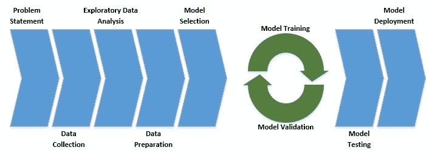

# 使用 Spark MLlib 的机器学习

> 原文：<https://web.archive.org/web/20220930061024/https://www.baeldung.com/spark-mlib-machine-learning>

## 1.概观

在本教程中，我们将了解如何利用 [Apache Spark MLlib](https://web.archive.org/web/20221205153215/https://spark.apache.org/mllib/) 来开发机器学习产品。我们将使用 Spark MLlib 开发一个简单的机器学习产品来演示核心概念。

## 2.机器学习的简明入门

机器学习是人工智能大伞的一部分。机器学习指的是对统计模型的**研究，用模式和推理来解决具体问题**。这些模型通过从问题空间中提取的训练数据来针对特定问题进行“训练”。

当我们举这个例子的时候，我们会看到这个定义到底意味着什么。

### 2.1.机器学习类别

我们可以根据方法将机器学习大致分为监督和非监督两类。还有其他类别，但我们将只讨论这两个类别:

*   监督学习**处理一组包含输入和期望输出**的数据——例如，一组包含房产各种特征和预期租金收入的数据。监督学习进一步分为两大子类，称为分类和回归:
    *   分类算法与分类输出相关，比如一处房产是否有人居住
    *   回归算法与连续的输出范围相关，就像属性值一样
*   另一方面，无监督学习**处理一组只有输入值**的数据。它的工作原理是试图识别输入数据中的固有结构。例如，通过消费者消费行为的数据集来发现不同类型的消费者。

### 2.2.机器学习工作流

机器学习确实是一个跨学科的研究领域。它需要商业领域、统计学、概率、线性代数和编程方面的知识。由于这显然会变得难以承受，**最好以有序的方式来处理这个问题**，我们通常称之为机器学习工作流:

[](/web/20221205153215/https://www.baeldung.com/wp-content/uploads/2019/08/Machine-Learning-Workflow-1.jpg)

正如我们所看到的，每个机器学习项目都应该从一个明确定义的问题陈述开始。接下来应该是一系列与数据相关的步骤，这些步骤可能会回答这个问题。

然后，我们通常选择一个模型来研究问题的本质。接下来是一系列的模型训练和验证，这就是所谓的模型微调。最后，我们在以前未见过的数据上测试该模型，如果满意，就将其部署到生产中。

## 3.什么是火花`MLlib`？

Spark ml lib**是 Spark 核心之上的一个模块，提供机器学习原语**作为 API。机器学习通常会处理大量数据来进行模型训练。

Spark 的基础计算框架是一个巨大的优势。在此之上，MLlib 提供了大多数流行的机器学习和统计算法。这大大简化了大规模机器学习项目的工作任务。

## 4.使用 MLlib 的机器学习

我们现在有足够的关于机器学习的背景知识，以及 MLlib 如何在这方面提供帮助。让我们从使用 Spark MLlib 实现机器学习项目的基本示例开始。

如果我们回忆一下我们对机器学习工作流的讨论，我们应该从问题陈述开始，然后转移到数据。幸运的是，我们将选择机器学习的“hello world”，[虹膜数据集](https://web.archive.org/web/20221205153215/https://archive.ics.uci.edu/ml/datasets/Iris)。这是一个多变量标记数据集，由不同鸢尾属物种的萼片和花瓣的长度和宽度组成。

这给了我们问题的目标:**我们能从鸢尾的萼片和花瓣的长度和宽度**来预测鸢尾的种类吗？

### 4.1.设置依赖关系

首先，我们必须在 Maven 中定义下面的[依赖项来提取相关的库:](https://web.archive.org/web/20221205153215/https://search.maven.org/classic/#search%7Cga%7C1%7Cg%3A%22org.apache.spark%22%20AND%20a%3A%22spark-mllib_2.11%22)

```java
<dependency>
    <groupId>org.apache.spark</groupId>
    <artifactId>spark-mllib_2.11</artifactId>
    <version>2.4.3</version>
    <scope>provided</scope>
</dependency>
```

我们需要初始化 SparkContext 来使用 Spark APIs:

```java
SparkConf conf = new SparkConf()
  .setAppName("Main")
  .setMaster("local[2]");
JavaSparkContext sc = new JavaSparkContext(conf);
```

### 4.2.加载数据

首先，我们应该下载数据，这是一个 CSV 格式的文本文件。然后我们必须将这些数据加载到 Spark 中:

```java
String dataFile = "data\\iris.data";
JavaRDD<String> data = sc.textFile(dataFile);
```

Spark MLlib 提供了几种本地和分布式数据类型，来表示输入数据和相应的标签。最简单的数据类型是`Vector`:

```java
JavaRDD<Vector> inputData = data
  .map(line -> {
      String[] parts = line.split(",");
      double[] v = new double[parts.length - 1];
      for (int i = 0; i < parts.length - 1; i++) {
          v[i] = Double.parseDouble(parts[i]);
      }
      return Vectors.dense(v);
});
```

请注意，我们在这里只包括了输入要素，主要是为了执行统计分析。

一个训练示例通常由多个输入特征和一个标签组成，由类`LabeledPoint`表示:

```java
Map<String, Integer> map = new HashMap<>();
map.put("Iris-setosa", 0);
map.put("Iris-versicolor", 1);
map.put("Iris-virginica", 2);

JavaRDD<LabeledPoint> labeledData = data
  .map(line -> {
      String[] parts = line.split(",");
      double[] v = new double[parts.length - 1];
      for (int i = 0; i < parts.length - 1; i++) {
          v[i] = Double.parseDouble(parts[i]);
      }
      return new LabeledPoint(map.get(parts[parts.length - 1]), Vectors.dense(v));
});
```

我们在数据集中的输出标签是文本的，表示鸢尾的种类。为了将它输入到机器学习模型中，我们必须将其转换成数值。

### 4.3.探索性数据分析

探索性数据分析包括分析可用数据。现在，**机器学习算法对数据质量很敏感**，因此高质量的数据有更好的交付预期结果的前景。

典型的分析目标包括消除异常和检测模式。这甚至会反馈到特征工程的关键步骤中，以从可用数据中获得有用的特征。

在这个例子中，我们的数据集很小，并且结构良好。因此，我们不必沉迷于大量的数据分析。然而，Spark MLlib 配备了 API 来提供相当深刻的见解。

让我们从一些简单的统计分析开始:

```java
MultivariateStatisticalSummary summary = Statistics.colStats(inputData.rdd());
System.out.println("Summary Mean:");
System.out.println(summary.mean());
System.out.println("Summary Variance:");
System.out.println(summary.variance());
System.out.println("Summary Non-zero:");
System.out.println(summary.numNonzeros());
```

在这里，我们观察我们所拥有的特征的均值和方差。这有助于确定我们是否需要对特征进行归一化。在相似的尺度上拥有所有的特征是很有用的**。我们还注意到非零值，这可能会对模型性能产生负面影响。**

以下是我们输入数据的输出:

```java
Summary Mean:
[5.843333333333332,3.0540000000000003,3.7586666666666666,1.1986666666666668]
Summary Variance:
[0.6856935123042509,0.18800402684563744,3.113179418344516,0.5824143176733783]
Summary Non-zero:
[150.0,150.0,150.0,150.0]
```

另一个需要分析的重要指标是输入数据中要素之间的相关性:

```java
Matrix correlMatrix = Statistics.corr(inputData.rdd(), "pearson");
System.out.println("Correlation Matrix:");
System.out.println(correlMatrix.toString());
```

任何两个特征之间的高相关性表明它们没有增加任何增量值,其中一个可以被丢弃。下面是我们的特征是如何相互关联的:

```java
Correlation Matrix:
1.0                   -0.10936924995064387  0.8717541573048727   0.8179536333691672   
-0.10936924995064387  1.0                   -0.4205160964011671  -0.3565440896138163  
0.8717541573048727    -0.4205160964011671   1.0                  0.9627570970509661   
0.8179536333691672    -0.3565440896138163   0.9627570970509661   1.0
```

### 4.4.拆分数据

如果我们回想一下我们对机器学习工作流的讨论，它涉及模型训练和验证的几次迭代，然后是最终测试。

为了做到这一点，**我们必须将我们的训练数据分成训练集、验证集和测试集**。为了简单起见，我们将跳过验证部分。因此，让我们将数据分成训练集和测试集:

```java
JavaRDD<LabeledPoint>[] splits = parsedData.randomSplit(new double[] { 0.8, 0.2 }, 11L);
JavaRDD<LabeledPoint> trainingData = splits[0];
JavaRDD<LabeledPoint> testData = splits[1];
```

### 4.5.模特培训

因此，我们已经到了分析和准备数据集的阶段。剩下的就是把这个输入到一个模型中，然后开始变魔术！嗯，说起来容易做起来难。我们需要为我们的问题选择一个合适的算法——回想一下我们之前谈到的不同类别的机器学习。

不难理解**我们的问题属于被监管类别**的范畴。现在，有相当多的算法可以在这个类别下使用。

其中最简单的是逻辑回归(让回归这个词不要迷惑我们；它毕竟是一种分类算法):

```java
LogisticRegressionModel model = new LogisticRegressionWithLBFGS()
  .setNumClasses(3)
  .run(trainingData.rdd());
```

这里，我们使用基于三类有限内存 BFGS 的分类器。这个算法的细节超出了本教程的范围，但这是最广泛使用的一个。

### 4.6.模型评估

请记住，模型训练涉及到多次迭代，但是为了简单起见，我们在这里只使用了一次。现在我们已经训练了我们的模型，是时候在测试数据集上测试它了:

```java
JavaPairRDD<Object, Object> predictionAndLabels = testData
  .mapToPair(p -> new Tuple2<>(model.predict(p.features()), p.label()));
MulticlassMetrics metrics = new MulticlassMetrics(predictionAndLabels.rdd());
double accuracy = metrics.accuracy();
System.out.println("Model Accuracy on Test Data: " + accuracy);
```

现在，我们如何衡量一个模型的有效性？我们可以使用几个度量标准，但最简单的一个是准确性。简单来说，准确率就是预测正确数和预测总数的比值。下面是我们的模型在一次运行中可以实现的结果:

```java
Model Accuracy on Test Data: 0.9310344827586207
```

请注意，由于算法的随机性，每次运行之间会略有不同。

然而，在一些问题领域中，准确性并不是一个非常有效的度量标准。其他**更复杂的指标是精确度和召回率(F1 分数)、ROC 曲线和混淆矩阵**。

### 4.7.保存和加载模型

最后，我们经常需要将训练好的模型保存到文件系统中，并加载它来预测生产数据。这在 Spark 中是微不足道的:

```java
model.save(sc, "model\\logistic-regression");
LogisticRegressionModel sameModel = LogisticRegressionModel
  .load(sc, "model\\logistic-regression");
Vector newData = Vectors.dense(new double[]{1,1,1,1});
double prediction = sameModel.predict(newData);
System.out.println("Model Prediction on New Data = " + prediction);
```

因此，我们将模型保存到文件系统中，并将其加载回来。加载后，模型可以直接用于预测新数据的输出。以下是对随机新数据的预测示例:

```java
Model Prediction on New Data = 2.0
```

## 5.超越原始的例子

虽然我们所经历的例子广泛地涵盖了机器学习项目的工作流程，但它留下了许多微妙而重要的要点。虽然不可能在这里详细讨论它们，但我们肯定可以浏览一些重要的。

Spark MLlib 通过其 API 在所有这些领域都有广泛的支持。

### 5.1.型号选择

模型选择通常是复杂且关键的任务之一。训练一个模型是一个复杂的过程，最好在一个我们更有信心会产生预期结果的模型上进行。

虽然问题的性质可以帮助我们确定机器学习算法的类别，但这并不是一项完全完成的工作。在分类这样的类别中，正如我们前面看到的，**通常有许多可能的不同算法及其变体可供选择**。

通常情况下，最好的做法是在更小的数据集上快速建立原型。像 Spark MLlib 这样的库使得快速原型化的工作变得更加容易。

### 5.2.模型超参数调整

典型的模型由特征、参数和超参数组成。特征是我们作为输入数据输入到模型中的内容。模型参数是模型在训练过程中学习的变量。根据型号的不同，**我们必须根据经验设置某些附加参数，并反复调整**。这些被称为模型超参数。

例如，在基于梯度下降的算法中，学习率是典型的超参数。学习率控制训练周期中参数调整的速度。这必须被恰当地设置，以便模型以合理的速度有效地学习。

虽然我们可以根据经验从这些超参数的初始值开始，但我们必须执行模型验证并手动迭代调整它们。

### 5.3.模型性能

统计模型在被训练时**容易过度拟合和欠拟合，这两种情况都会导致模型性能不佳**。拟合不足是指模型没有从数据中充分提取一般细节的情况。另一方面，当模型也开始从数据中拾取噪声时，会发生过度拟合。

有几种方法可以避免欠拟合和过拟合的问题，这些方法经常组合使用。例如，**为了应对过度拟合，最常用的技术包括交叉验证和正则化**。类似地，为了改善欠拟合，我们可以增加模型的复杂性并增加训练时间。

Spark MLlib 对这些技术中的大部分都有很好的支持，比如正则化和交叉验证。事实上，大多数算法都有默认的支持。

## 6.比较中的火花 MLlib

虽然 Spark MLlib 对于机器学习项目来说是一个非常强大的库，但它肯定不是唯一适合这项工作的库。不同的编程语言提供了相当多的支持不同的库。我们将在这里浏览一些流行的。

### 6.1\. Tensorflow/Keras

[Tensorflow](https://web.archive.org/web/20221205153215/https://www.tensorflow.org/) 是一个针对数据流和可微分编程的开源**库，广泛应用于机器学习应用**。连同它的高级抽象， [Keras](https://web.archive.org/web/20221205153215/https://keras.io/) ，它是机器学习的首选工具。它们主要是用 Python 和 C++编写的，并且主要用在 Python 中。与 Spark MLlib 不同，它没有多语言版本。

### 6.2 .提亚诺

[Theano](https://web.archive.org/web/20221205153215/https://github.com/Theano/Theano) 是另一个基于 Python 的开源**库，用于操作和评估数学表达式**——例如，基于矩阵的表达式，常用于机器学习算法。与 Spark MLlib 不同，Theano 主要用于 Python。然而，Keras 可以与 an ano 后端一起使用。

### 6.3.CNTK

[微软认知工具包(CNTK)](https://web.archive.org/web/20221205153215/https://docs.microsoft.com/en-us/cognitive-toolkit/) 是一个用 C++编写的**深度学习框架，通过有向图**描述计算步骤。它可以在 Python 和 C++程序中使用，主要用于开发神经网络。有一个基于 CNTK 的 Keras 后端可供使用，它提供了熟悉的直观抽象。

## 7.结论

总而言之，在本教程中，我们学习了机器学习的基础知识，包括不同的类别和工作流程。我们浏览了 Spark MLlib 的基础知识，这是一个可供我们使用的机器学习库。

此外，我们基于可用的数据集开发了一个简单的机器学习应用程序。在我们的示例中，我们实现了机器学习工作流中一些最常见的步骤。

我们还经历了一个典型的机器学习项目中的一些高级步骤，以及 Spark MLlib 如何在这些方面提供帮助。最后，我们看到了一些可供我们使用的替代机器学习库。

和往常一样，代码可以在 GitHub 上找到[。](https://web.archive.org/web/20221205153215/https://github.com/eugenp/tutorials/tree/master/apache-spark)