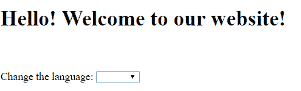
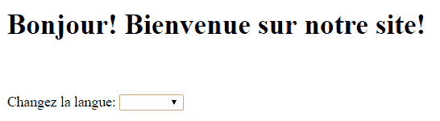

# Spring Boot 国际化指南

> 原文：<https://web.archive.org/web/20220930061024/https://www.baeldung.com/spring-boot-internationalization>

## 1。概述

在这个快速教程中，我们将看看如何为 Spring Boot 应用程序添加国际化。

## 2。Maven 依赖关系

对于开发，我们需要以下依赖关系:

```java
<dependency>
    <groupId>org.springframework.boot</groupId>
    <artifactId>spring-boot-starter-thymeleaf</artifactId>
    <version>1.5.2.RELEASE</version>
</dependency>
```

最新版本的[spring-boot-starter-百里香叶](https://web.archive.org/web/20220630143355/https://search.maven.org/classic/#search%7Cga%7C1%7Ca%3A%22spring-boot-starter-thymeleaf%22)可以从 Maven Central 下载。

## 3。`LocaleResolver`

为了让我们的应用程序能够确定当前正在使用哪个语言环境，我们需要添加一个`LocaleResolver` bean:

```java
@Bean
public LocaleResolver localeResolver() {
    SessionLocaleResolver slr = new SessionLocaleResolver();
    slr.setDefaultLocale(Locale.US);
    return slr;
}
```

`LocaleResolver`接口实现了基于会话、cookies、`Accept-Language`头或固定值来确定当前的语言环境。

在我们的例子中，我们使用了基于会话的解析器`SessionLocaleResolver`，并用值`US`设置了一个默认的区域设置。

## 4。`LocaleChangeInterceptor`

接下来，我们需要添加一个拦截器 bean，它将根据附加到请求的参数`lang`的值切换到一个新的语言环境:

```java
@Bean
public LocaleChangeInterceptor localeChangeInterceptor() {
    LocaleChangeInterceptor lci = new LocaleChangeInterceptor();
    lci.setParamName("lang");
    return lci;
}
```

为了生效，这个 bean 需要被添加到应用程序的拦截器注册表中。

为了实现这一点，我们的`@Configuration`类必须实现`WebMvcConfigurer`接口并覆盖`addInterceptors()`方法:

```java
@Override
public void addInterceptors(InterceptorRegistry registry) {
    registry.addInterceptor(localeChangeInterceptor());
}
```

## 5。定义消息来源

默认情况下，Spring Boot 应用程序会在`src/main/resources`文件夹中查找包含国际化键和值的消息文件。

默认区域设置的文件将被命名为`messages.properties`，每个区域设置的文件将被命名为`messages_XX.properties`，其中`XX`是区域设置代码。

将被本地化的值的键在每个文件中必须是相同的，值适合于它们对应的语言。

如果某个键在某个请求的区域设置中不存在，那么应用程序将返回到默认的区域设置值。

让我们为英语定义一个名为`messages.properties`的默认消息文件:

```java
greeting=Hello! Welcome to our website!
lang.change=Change the language
lang.eng=English
lang.fr=French
```

接下来，让我们用相同的关键字为法语创建一个名为`messages_fr.properties`的文件:

```java
greeting=Bonjour! Bienvenue sur notre site!
lang.change=Changez la langue
lang.eng=Anglais
lang.fr=Francais
```

## 6。控制器和 HTML 页面

让我们创建一个控制器映射，该映射将返回一个名为 `international.html`的简单 HTML 页面，我们希望以两种不同的语言查看该页面:

```java
@Controller
public class PageController {

    @GetMapping("/international")
    public String getInternationalPage() {
        return "international";
    }
}
```

因为我们使用百里香叶来显示 HTML 页面，所以将使用带有语法`#{key}`的键来访问特定于地区的值:

```java
<h1 th:text="#{greeting}"></h1>
```

如果使用 JSP 文件，语法是:

```java
<h1><spring:message code="greeting" text="default"/></h1>
```

如果我们想要访问具有两个不同地区的页面，我们必须将参数`lang`添加到 URL 中，格式为: `/international?lang=fr`

如果 URL 上没有出现`lang`参数，应用程序将使用默认的区域设置，在我们的例子中是`US` 区域设置。

让我们向 HTML 页面添加一个下拉列表，其中包含两个语言环境，它们的名称也在我们的属性文件中进行了本地化:

```java
<span th:text="#{lang.change}"></span>:
<select id="locales">
    <option value=""></option>
    <option value="en" th:text="#{lang.eng}"></option>
    <option value="fr" th:text="#{lang.fr}"></option>
</select>
```

然后，我们可以添加一个 jQuery 脚本，该脚本将根据选择的下拉选项，使用相应的`lang`参数调用 `/international` URL:

```java
<script src="https://ajax.googleapis.com/ajax/libs/jquery/3.1.1/jquery.min.js">
</script>
<script type="text/javascript">
$(document).ready(function() {
    $("#locales").change(function () {
        var selectedOption = $('#locales').val();
        if (selectedOption != ''){
            window.location.replace('international?lang=' + selectedOption);
        }
    });
});
</script>
```

## 7 .**。运行应用程序**

为了初始化我们的应用程序，我们必须添加用`@SpringBootApplication`注释的主类:

```java
@SpringBootApplication
public class InternationalizationApp {

    public static void main(String[] args) {
        SpringApplication.run(InternationalizationApp.class, args);
    }
}
```

根据所选的语言环境，我们将在运行应用程序时以英语或法语查看页面。

让我们看看英文版:

[](/web/20220630143355/https://www.baeldung.com/wp-content/uploads/2017/03/piceng.png)And now let's see the French version:[](/web/20220630143355/https://www.baeldung.com/wp-content/uploads/2017/03/picfr.png)

## 8。结论

在本教程中，我们展示了如何在 Spring Boot 应用程序中使用国际化支持。

该示例的完整源代码可以在 GitHub 上找到[。](https://web.archive.org/web/20220630143355/https://github.com/eugenp/tutorials/tree/master/spring-boot-modules/spring-boot-mvc)