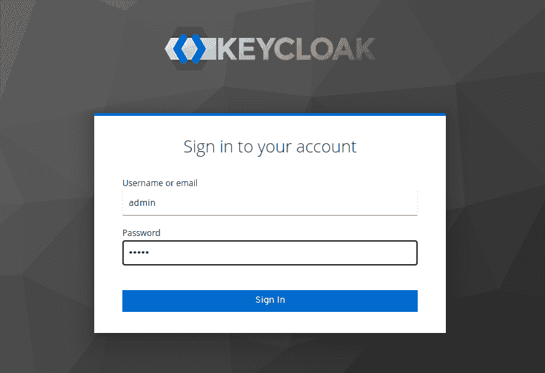
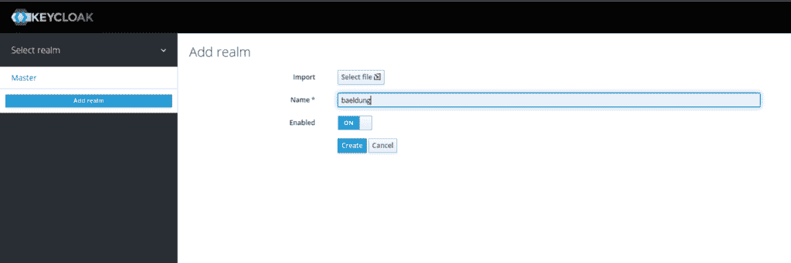
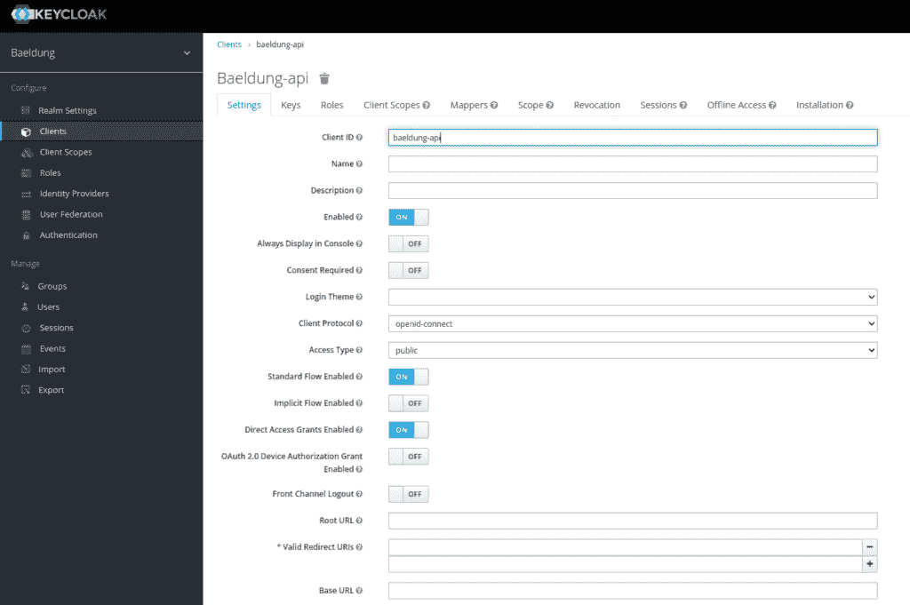
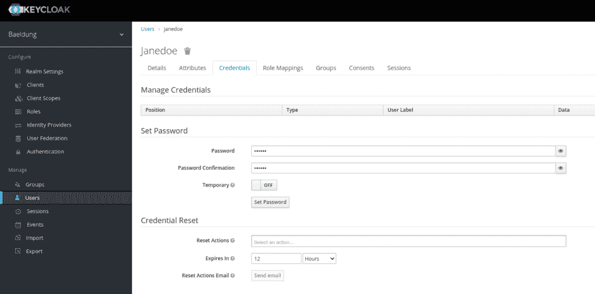
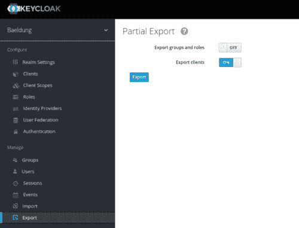

# Spring Boot——用 Testcontainers 进行 Keycloak 集成测试

> 原文：<https://web.archive.org/web/20220930061024/https://www.baeldung.com/spring-boot-keycloak-integration-testing>

## 1.介绍

在验证应用程序是否正常工作时，集成测试至关重要。另外，**我们应该正确地测试认证，因为它是一个敏感的部分**。Testcontainers 允许我们在测试阶段启动 Docker 容器来运行我们对实际技术栈的测试。

在本文中，**我们将看到如何使用 Testcontainers 针对一个实际的 [Keycloak](/web/20220810180302/https://www.baeldung.com/spring-boot-keycloak)** 实例设置集成测试。

## 2.用 Keycloak 设置 Spring 安全性

我们需要设置 [Spring Security](/web/20220810180302/https://www.baeldung.com/security-spring) ，Keycloak 配置，最后是 Testcontainers。

### 2.1.设置 Spring Boot 和春季安全性

先说设置安全，感谢春天安全。我们将需要[弹簧启动-启动-安全](https://web.archive.org/web/20220810180302/https://search.maven.org/search?q=g:org.springframework.boot%20a:spring-boot-starter-security)依赖。让我们将它添加到我们的 pom 中:

```java
<dependency>
    <groupId>org.springframework.boot</groupId>
    <artifactId>spring-boot-starter-security</artifactId>
</dependency>
```

我们将使用 spring-boot parent pom。因此，我们不需要指定依赖管理中指定的库的版本。

接下来，让我们创建一个简单的控制器来返回用户:

```java
@RestController
@RequestMapping("/users")
public class UserController {

    @GetMapping("me")
    public UserDto getMe() {
        return new UserDto(1L, "janedoe", "Doe", "Jane", "[[email protected]](/web/20220810180302/https://www.baeldung.com/cdn-cgi/l/email-protection)");
    }
}
```

在这一点上，**我们有了一个安全的控制器，它对“`/users/me”`”**上的请求做出响应。当启动应用程序时，Spring Security 为用户“user”生成一个密码，可以在应用程序日志中看到。

### 2.2.配置键盘锁

启动本地键盘锁最简单的方法是使用[Docker](/web/20220810180302/https://www.baeldung.com/ops/docker-guide)T3。让我们运行一个已经配置了管理员帐户的 Keycloak 容器:

```java
docker run -p 8081:8080 -e KEYCLOAK_ADMIN=admin -e KEYCLOAK_ADMIN_PASSWORD=admin quay.io/keycloak/keycloak:17.0.1 start-dev
```

让我们打开一个浏览器，通过 URL[http://localhost:8081](https://web.archive.org/web/20220810180302/http://localhost:8081/)访问 Keycloak 控制台:

[](/web/20220810180302/https://www.baeldung.com/wp-content/uploads/2022/07/4_Screenshot-from-2022-06-21-23-36-07.png)

接下来，让我们创建我们的境界。我们称之为 baeldung:

[](/web/20220810180302/https://www.baeldung.com/wp-content/uploads/2022/07/2_realm.png)

我们需要添加一个客户机，我们将其命名为 baeldung-api:

[](/web/20220810180302/https://www.baeldung.com/wp-content/uploads/2022/07/client.png)

最后，让我们使用用户菜单添加一个 Jane Doe 用户:

[](/web/20220810180302/https://www.baeldung.com/wp-content/uploads/2022/07/user.png)

既然我们已经创建了用户，我们必须为它分配一个密码。让我们选择 s3cr3t 并取消选中临时按钮:

[](/web/20220810180302/https://www.baeldung.com/wp-content/uploads/2022/07/Screenshot-from-2022-06-22-21-26-44.png)

**我们现在已经用一个 baeldung-api 客户端和一个 Jane Doe 用户**建立了我们的 Keycloak 领域。

接下来我们将配置 Spring 使用 Keycloak 作为身份提供者。

### 2.3.将两者放在一起

首先，我们将把识别控制委托给一个 Keycloak 服务器。为此，我们将使用一个方便的启动器，[key cloak-spring-boot-starter](https://web.archive.org/web/20220810180302/https://search.maven.org/search?q=g:org.keycloak%20AND%20a:keycloak-spring-boot-starter)。因此，让我们将它添加到 pom 中:

```java
<dependency>
    <groupId>org.keycloak</groupId>
    <artifactId>keycloak-spring-boot-starter</artifactId>
</dependency>
```

我们还需要 [keycloak-adapter-bom](https://web.archive.org/web/20220810180302/https://search.maven.org/search?q=g:org.keycloak.bom%20AND%20a:keycloak-adapter-bom) 依赖关系。具体来说，它添加了主适配器以完全使用 Spring 自动配置，以及连接 Keycloak 和不同 web 容器所需的库，包括 Tomcat:

```java
<dependencyManagement>
    <dependencies>
        <dependency>
            <groupId>org.keycloak.bom</groupId>
            <artifactId>keycloak-adapter-bom</artifactId>
            <version>${keycloak-adapter.version}</version>
            <type>pom</type>
            <scope>import</scope>
        </dependency>
    </dependencies>
</dependencyManagement>
```

然后，让我们创建一个配置类，它使用 Spring 属性来配置 Keycloak 适配器。

```java
@Configuration
public class KeycloakConfiguration {

    @Bean
    public KeycloakSpringBootConfigResolver keycloakConfigResolver() {
        return new KeycloakSpringBootConfigResolver();
    }
}
```

让我们继续配置 Spring Security 来使用 Keycloak 配置:

```java
@KeycloakConfiguration
@ConditionalOnProperty(name = "keycloak.enabled", havingValue = "true", matchIfMissing = true)
public class KeycloakSecurityConfiguration extends KeycloakWebSecurityConfigurerAdapter {

    @Autowired
    public void configureGlobal(AuthenticationManagerBuilder auth) {
        auth.authenticationProvider(keycloakAuthenticationProvider());
    }

    @Bean
    @Override
    protected SessionAuthenticationStrategy sessionAuthenticationStrategy() {
        return new NullAuthenticatedSessionStrategy();
    }

    @Override
    protected void configure(HttpSecurity http) throws Exception {
        super.configure(http);

        http.csrf()
            .disable()
            .cors()
            .and()
            .authorizeRequests()
            .anyRequest()
            .authenticated();
    }
}
```

我们正在构建一个只有承载认证的无状态应用程序。**为此，我们将使用`NullAuthenticatedSessionStrategy`作为会话策略**。此外，`@ConditionalOnProperty`允许我们通过将`keycloak.enable`属性设置为`false`来[禁用键盘锁配置](/web/20220810180302/https://www.baeldung.com/spring-keycloak-security-disable)。

最后，让我们在`application.properties`文件中添加连接到 Keycloak 所需的配置:

```java
keycloak.enabled=true
keycloak.realm=baeldung
keycloak.resource=baeldung-api
keycloak.auth-server-url=http://localhost:8081 
```

**我们的应用程序现在是安全的，并在每个请求上查询 Keycloak 来验证身份验证**。

## 3.为 Keycloak 设置 Testcontainers

### 3.1.导出领域配置

Keycloak 容器启动时没有任何配置。因此，**我们必须在容器作为 JSON 文件**启动时导入它。让我们从当前运行的实例中导出该文件:

[](/web/20220810180302/https://www.baeldung.com/wp-content/uploads/2022/07/2_Screenshot-from-2022-06-22-22-56-31-1.png)

遗憾的是，Keycloak 不导出用户。在这种情况下，我们必须手动编辑生成的`realm-export.json`文件，并将我们的 Jane Doe 添加到其中。让我们在最后一个花括号前添加这个配置:

```java
"users": [
  {
    "username": "janedoe",
    "email": "j[[email protected]](/web/20220810180302/https://www.baeldung.com/cdn-cgi/l/email-protection)",
    "firstName": "Jane",
    "lastName": "Doe",
    "enabled": true,
    "credentials": [
      {
        "type": "password",
        "value": "s3cr3t"
      }
    ],
    "clientRoles": {
      "account": [
        "view-profile",
        "manage-account"
      ]
    }
  }
]
```

让我们将我们的`realm-export.json`文件包含到项目的`src/test/resources/keycloak`文件夹中。我们将在推出 Keycloak 容器时使用它。

### 3.2.设置测试容器

让我们添加 [testcontainers](https://web.archive.org/web/20220810180302/https://search.maven.org/search?q=g:org.testcontainers%20AND%20a:testcontainers) 依赖项以及 [testcontainers-keycloak](https://web.archive.org/web/20220810180302/https://search.maven.org/search?q=g:com.github.dasniko%20AND%20a:testcontainers-keycloak) ，这允许我们启动一个 keycloak 容器:

```java
<dependency>
    <groupId>com.github.dasniko</groupId>
    <artifactId>testcontainers-keycloak</artifactId>
    <version>2.1.2</version>
    <scope>test</scope>
</dependency>
<dependency>
    <groupId>org.testcontainers</groupId>
    <artifactId>testcontainers</artifactId>
    <version>1.16.3</version>
</dependency>
```

接下来，让我们创建一个类，我们所有的测试都将从这个类中派生出来。我们用它来配置由 Testcontainers 启动的 Keycloak 容器:

```java
@SpringBootTest(webEnvironment = WebEnvironment.RANDOM_PORT)
public abstract class KeycloakTestContainers {

    static final KeycloakContainer keycloak = new KeycloakContainer().withRealmImportFile("keycloak/realm-export.json");
}
```

静态声明我们的容器将确保它在我们所有的测试中被实例化一次。**我们使用来自`KeycloakContainer`对象的`withRealmImportFile`方法**指定启动时要导入的领域配置。

### 3.3.Spring Boot 测试配置

现在，让我们在测试开始时启动 Keycloak 容器。它使用随机端口。因此，一旦启动，我们需要覆盖在我们的`application.properties`中定义的`keycloak.auth-server-url`配置。为此，我们将在刷新上下文之前实现一个由 Spring 触发的回调接口:

```java
static class Initializer implements ApplicationContextInitializer<ConfigurableApplicationContext> {

    public void initialize(ConfigurableApplicationContext configurableApplicationContext) {
        keycloak.start();
        TestPropertyValues.of("keycloak.auth-server-url=" + keycloak.getAuthServerUrl())
          .applyTo(configurableApplicationContext.getEnvironment());
    }
} 
```

我们还需要告诉 Spring 使用这个类来初始化它的上下文。让我们在类级别添加这个注释:

```java
@ContextConfiguration(initializers = { IntegrationTest.Initializer.class })
```

## 4.创建集成测试

现在我们有了负责启动 Keycloak 容器和配置 Spring 属性的主测试类，让我们创建一个调用我们的`User`控制器的[集成测试](/web/20220810180302/https://www.baeldung.com/integration-testing-in-spring)。

### 4.1.获取访问令牌

首先，让我们在抽象类 IntegrationTest 中添加一个方法，用于使用 Jane Doe 的凭据请求令牌:

```java
URI authorizationURI = new URIBuilder(keycloak.getAuthServerUrl() + "/realms/baeldung/protocol/openid-connect/token").build();
WebClient webclient = WebClient.builder().build();
MultiValueMap<String, String> formData = new LinkedMultiValueMap<>();
formData.put("grant_type", Collections.singletonList("password"));
formData.put("client_id", Collections.singletonList("baeldung-api"));
formData.put("username", Collections.singletonList("[[email protected]](/web/20220810180302/https://www.baeldung.com/cdn-cgi/l/email-protection)"));
formData.put("password", Collections.singletonList("s3cr3t"));

String result = webclient.post()
  .uri(authorizationURI)
  .contentType(MediaType.APPLICATION_FORM_URLENCODED)
  .body(BodyInserters.fromFormData(formData))
  .retrieve()
  .bodyToMono(String.class)
  .block();
```

这里，我们使用 Webflux 的 WebClient 发布一个表单，其中包含获取访问令牌所需的不同参数。

最后，我们将**解析 Keycloak 服务器响应，从中提取令牌**。具体来说，我们生成一个包含关键字`Bearer`的经典认证字符串，后跟令牌的内容，可以在头中使用:

```java
JacksonJsonParser jsonParser = new JacksonJsonParser();
return "Bearer " + jsonParser.parseMap(result)
  .get("access_token")
  .toString();
```

### 4.2.创建集成测试

让我们针对配置好的 Keycloak 容器快速设置集成测试。我们将使用 RestAssured 和 Hamcrest 进行测试。让我们添加[放心](https://web.archive.org/web/20220810180302/https://search.maven.org/search?q=g:io.rest-assured%20AND%20a:rest-assured)依赖:

```java
<dependency>
    <groupId>io.rest-assured</groupId>
    <artifactId>rest-assured</artifactId>
    <scope>test</scope>
</dependency>
```

我们现在可以使用抽象的`IntegrationTest`类来创建我们的测试:

```java
@Test
void givenAuthenticatedUser_whenGetMe_shouldReturnMyInfo() {

    given().header("Authorization", getJaneDoeBearer())
      .when()
      .get("/users/me")
      .then()
      .body("username", equalTo("janedoe"))
      .body("lastname", equalTo("Doe"))
      .body("firstname", equalTo("Jane"))
      .body("email", equalTo("[[email protected]](/web/20220810180302/https://www.baeldung.com/cdn-cgi/l/email-protection)"));
}
```

因此，从 Keycloak 获取的访问令牌被添加到请求的授权头中。

## 5.结论

在本文中，**我们针对实际的 Keycloak 设置了集成测试，由 Testcontainers** 管理。我们导入了一个领域配置，以便在每次启动测试阶段都有一个预配置的环境。

像往常一样，本文中使用的所有代码示例都可以在 GitHub 上找到[。](https://web.archive.org/web/20220810180302/https://github.com/eugenp/tutorials/tree/master/spring-boot-modules/spring-boot-testing-2)