# 与 Spring Boot 一起使用 Keycloak 的快速指南

> 原文：<https://web.archive.org/web/20220930061024/https://www.baeldung.com/spring-boot-keycloak>

## 1。概述

在本教程中，我们将讨论使用 Spring Security OAuth2.0 设置 Keycloak 服务器和连接 Spring Boot 应用程序的基础知识

## 延伸阅读:

## [Spring Security 和 OpenID 连接](/web/20220924064051/https://www.baeldung.com/spring-security-openid-connect)

Learn how to set up OpenID Connect (from Google) with a simple Spring Security application.[Read more](/web/20220924064051/https://www.baeldung.com/spring-security-openid-connect) →

## [使用 Spring Security OAuth 的简单单点登录 2](/web/20220924064051/https://www.baeldung.com/sso-spring-security-oauth2)

A simple SSO implementation using Spring Security 5 and Boot.[Read more](/web/20220924064051/https://www.baeldung.com/sso-spring-security-oauth2) →

## [带 Spring 安全的 CAS SSO](/web/20220924064051/https://www.baeldung.com/spring-security-cas-sso)

Learn how to integrate the Central Authentication Service (CAS) with Spring Security.[Read more](/web/20220924064051/https://www.baeldung.com/spring-security-cas-sso) →

## 2。什么是钥匙锁？

Keycloak 是一款面向现代应用和服务的开源身份和访问管理解决方案。

Keycloak 提供了单点登录(SSO)、身份代理和社交登录、用户联盟、客户端适配器、管理控制台和帐户管理控制台等功能。

在我们的教程中，我们将使用 Keycloak 的管理控制台来设置和连接到使用 Spring Security OAuth2.0 的 Spring Boot

## 3。设置 Keycloak 服务器

在本节中，我们将设置和配置 Keycloak 服务器。

### 3.1。下载并安装 Keycloak

有几种发行版可供选择。然而，在本教程中，我们将使用独立版本。

让我们从官方下载 [Keycloak-19.0.1 独立服务器分发版](https://web.archive.org/web/20220924064051/http://www.keycloak.org/downloads.html)。

**一旦我们下载了独立服务器发行版，我们就可以从终端解压并启动 key cloak:**

```java
$ unzip keycloak-legacy-19.0.1.zip 
$ cd keycloak-legacy-19.0.1/keycloak-19.0.1/bin
$ ./standalone.sh -Djboss.socket.binding.port-offset=100
```

在运行`./standalone.sh`之后，Keycloak 将启动它的服务。一旦我们看到包含`Keycloak 19.0.1 (WildFly Core 18.1.1.Final) started`的行，我们就知道它的启动完成了。

现在，让我们打开浏览器并访问`[http://localhost:8180](https://web.archive.org/web/20220924064051/http://localhost:8180/).` **，我们将被重定向到`http://localhost:8180/auth`以创建一个管理登录:**

[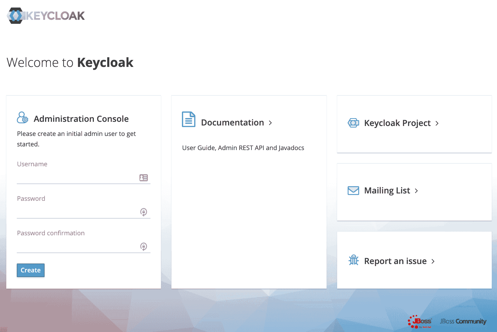](/web/20220924064051/https://www.baeldung.com/wp-content/uploads/2017/11/keycloak1.png)

让我们创建一个名为`initial1`的初始管理员用户，密码为`zaq1!QAZ`。点击`Create`，我们会看到信息`User Created`。

我们现在可以进入管理控制台。在登录页面上，我们将输入初始管理员用户凭据:

[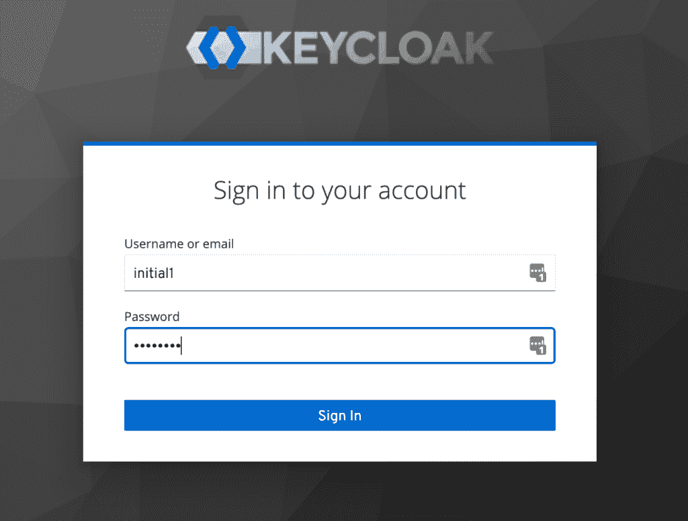](/web/20220924064051/https://www.baeldung.com/wp-content/uploads/2021/06/1_keycloak_admin_console.png)

### 3.2。创建一个领域

成功登录会将我们带到控制台，并为我们打开默认的`Master`领域。

在这里，我们将重点创建一个自定义领域。

让我们**导航到左上角，找到 `Add realm`按钮:**

[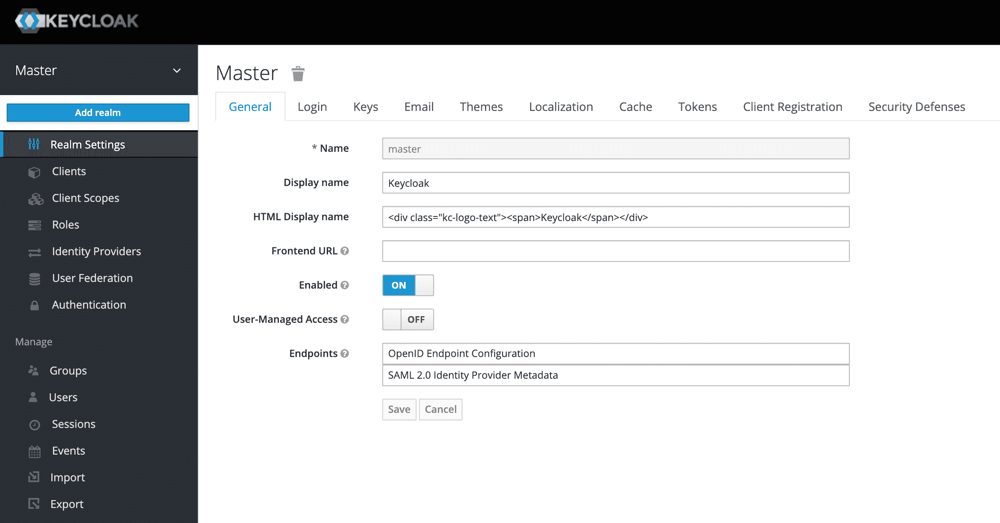](/web/20220924064051/https://www.baeldung.com/wp-content/uploads/2017/11/2_keycloak_add_realm.png)

在下一个屏幕上，**让我们添加一个名为`SpringBootKeycloak` :** 的新领域

[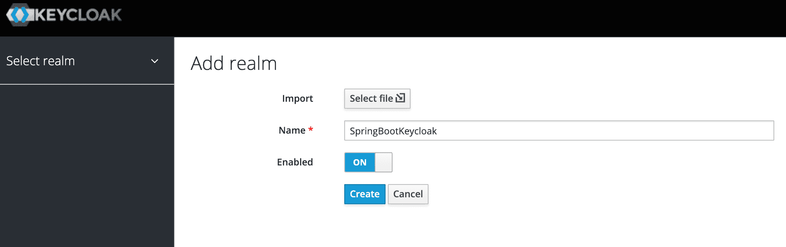](/web/20220924064051/https://www.baeldung.com/wp-content/uploads/2017/11/keycloak-new-realm.png)

点击`Create`按钮后，一个新的领域将被创建，我们将被重定向到它。下一节中的所有操作都将在这个新的`SpringBootKeycloak`领域中执行。

### 3.3。创建客户端

现在，我们将导航到客户端页面。正如我们在下图中看到的， **Keycloak 附带了已经内置的客户端**:

[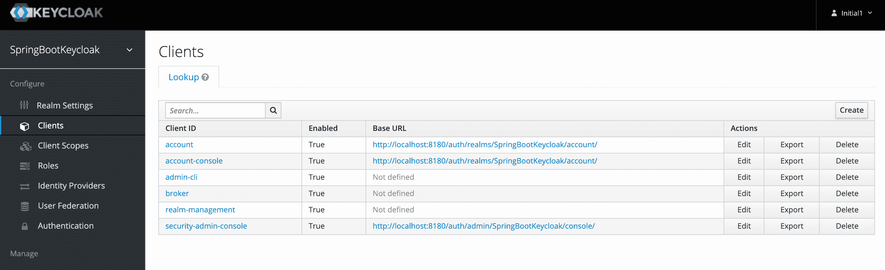](/web/20220924064051/https://www.baeldung.com/wp-content/uploads/2017/11/keycloak-clients.png)

我们仍然需要向我们的应用程序添加一个新的客户端，所以我们将单击`Create`。**我们称新客户为`login-app` `:`**

[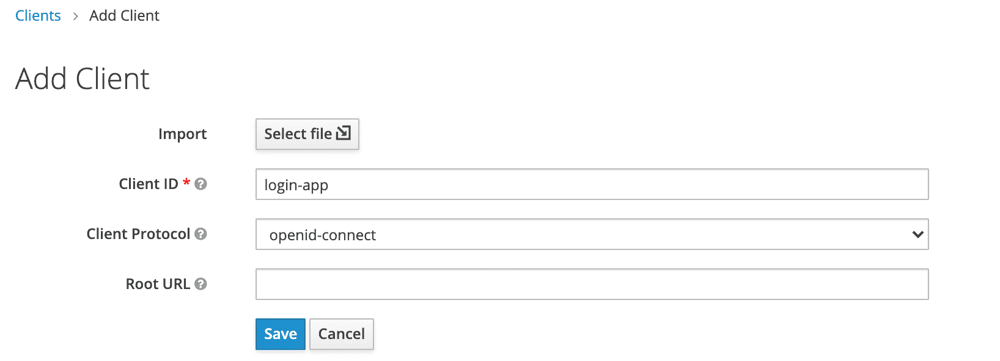](/web/20220924064051/https://www.baeldung.com/wp-content/uploads/2017/11/keycloak-add-client-1.png)

在下一个屏幕中，出于本教程的目的，我们将保留除**字段之外的所有默认值。该字段应包含将使用该客户端进行身份验证的应用程序 URL**:

[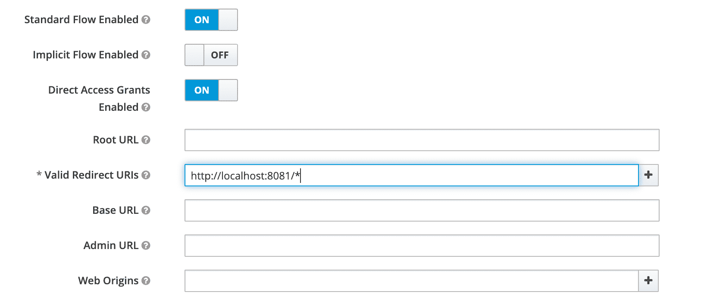](/web/20220924064051/https://www.baeldung.com/wp-content/uploads/2017/11/keycloak-valid-redirect-uris.png)

稍后，我们将创建一个运行在端口 8081 的 Spring Boot 应用程序，它将使用这个客户端。因此，我们使用了上面的重定向 URL`http://localhost:8081/`*。

### 3.4。创建角色和用户

Keycloak 使用基于角色的访问；因此，每个用户都必须有一个角色。

为此，我们需要导航到`Roles`页面:

[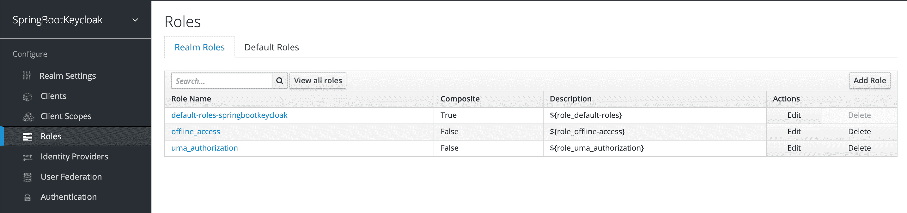](/web/20220924064051/https://www.baeldung.com/wp-content/uploads/2017/11/3_keycloak_roles.png)

然后我们将添加`user`角色:

[](/web/20220924064051/https://www.baeldung.com/wp-content/uploads/2017/11/keycloak-add-role.png)

现在我们有了一个可以分配给用户的角色，但是由于还没有用户，**让我们转到`Users`页面并添加一个:**

[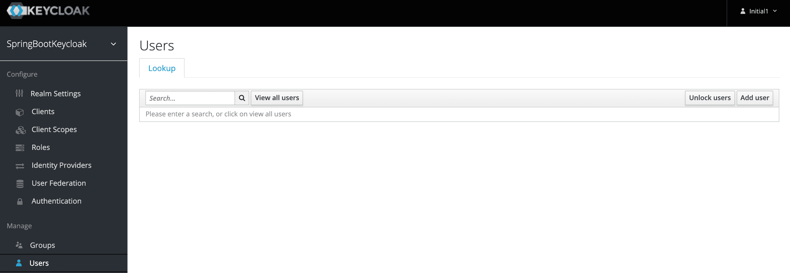](/web/20220924064051/https://www.baeldung.com/wp-content/uploads/2017/11/keycloak-users.png)

我们将添加一个名为`user1:`的用户

[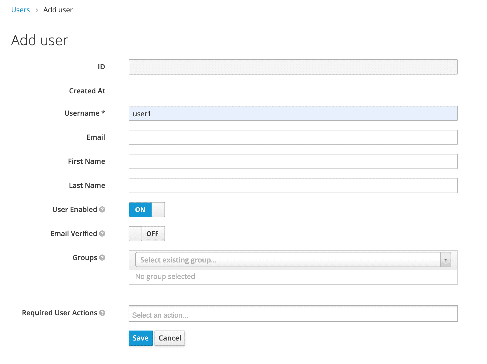](/web/20220924064051/https://www.baeldung.com/wp-content/uploads/2017/11/4_keycloak_adduser.png)

创建用户后，将显示一个包含其详细信息的页面:

[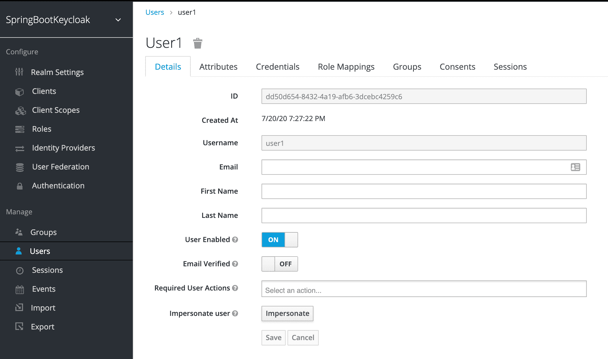](/web/20220924064051/https://www.baeldung.com/wp-content/uploads/2017/11/keycloak-user.png)

我们现在可以转到`Credentials`选项卡。我们将初始密码设置为`[[email protected]](/web/20220924064051/https://www.baeldung.com/cdn-cgi/l/email-protection)`:

[](/web/20220924064051/https://www.baeldung.com/wp-content/uploads/2017/11/keycloak-credentials.png)

最后，我们将导航到`Role Mappings`选项卡。我们将把`user`角色分配给我们的`user1`:

[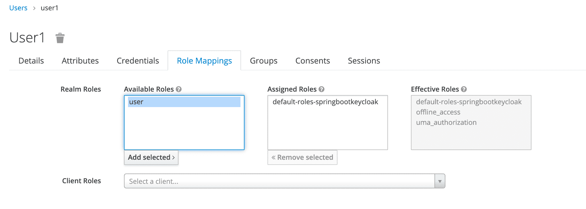](/web/20220924064051/https://www.baeldung.com/wp-content/uploads/2017/11/5_keycloak_userrole.png)

## 4.使用 Keycloak 的 API 生成访问令牌

Keycloak 提供了一个 REST API 来生成和刷新访问令牌。我们可以很容易地使用这个 API 来创建自己的登录页面。

首先，我们需要通过向以下 URL 发送 POST 请求，从 Keycloak 获取一个访问令牌:

```java
http://localhost:8180/auth/realms/SpringBootKeycloak/protocol/openid-connect/token
```

该请求的正文格式应为`x-www-form-urlencoded`:

```java
client_id:<your_client_id>
username:<your_username>
password:<your_password>
grant_type:password
```

作为响应，我们将得到一个`access_token`和一个`refresh_token`。

访问令牌应该在对受 Keycloak 保护的资源的每个请求中使用，只需将它放在`Authorization`头中:

```java
headers: {
    'Authorization': 'Bearer' + access_token
}
```

一旦访问令牌过期，我们可以通过向上述相同的 URL 发送 POST 请求来刷新它，但是包含刷新令牌而不是用户名和密码:

```java
{
    'client_id': 'your_client_id',
    'refresh_token': refresh_token_from_previous_request,
    'grant_type': 'refresh_token'
}
```

Keycloak 将用一个新的`access_token`和`refresh_token.`对此做出响应

## 5。创建和配置 Spring Boot 应用程序

在这一节中，我们将创建一个 Spring Boot 应用程序，并将其配置为 OAuth 客户端，以便与 Keycloak 服务器进行交互。

### 5.1。依赖性

**我们使用 Spring Security OAuth2.0 客户端连接到 Keycloak 服务器**。

让我们从在 Spring Boot 应用程序的`pom.xml`中声明 [`spring-boot-starter-oauth2-client`](https://web.archive.org/web/20220924064051/https://search.maven.org/search?q=a:spring-boot-starter-oauth2-client) 依赖关系开始:

```java
<dependency>
    <groupId>org.springframework.boot</groupId>
    <artifactId>spring-boot-starter-oauth2-client</artifactId>
</dependency>
```

此外，由于我们需要对 Spring Boot 使用 Spring Security，我们必须添加这个[依赖项](https://web.archive.org/web/20220924064051/https://search.maven.org/classic/#search%7Cgav%7C1%7Cg%3A%22org.springframework.boot%22%20AND%20a%3A%22spring-boot-starter-security%22):

```java
<dependency>
    <groupId>org.springframework.boot</groupId>
    <artifactId>spring-boot-starter-security</artifactId>
</dependency>
```

现在，Spring Boot 应用程序可以与 Keycloak 交互。

### 5.2。键盘锁配置

我们认为 Keycloak 客户端是一个 OAuth 客户端。因此，我们需要配置 Spring Boot 应用程序来使用 OAuth 客户端。

`ClientRegistration`类保存关于客户机的所有基本信息。Spring 自动配置使用模式`spring.security.oauth2.client.registration.[registrationId]`查找属性，并向 OAuth 2.0 或 [OpenID Connect (OIDC)](/web/20220924064051/https://www.baeldung.com/spring-security-openid-connect#introduction) 注册客户端。

让我们配置客户端注册配置:

```java
spring.security.oauth2.client.registration.keycloak.client-id=login-app
spring.security.oauth2.client.registration.keycloak.authorization-grant-type=authorization_code
spring.security.oauth2.client.registration.keycloak.scope=openid
```

**我们在`client-id `中指定的值与我们在管理控制台中命名的客户端相匹配。**

**Spring Boot 应用程序需要与 OAuth 2.0 或 OIDC 提供商交互，以处理不同授权类型的实际请求逻辑。因此，我们需要配置 OIDC 提供程序。**可以通过模式`spring.security.oauth2.client.provider.[provider name]`根据属性值自动配置。

让我们配置 OIDC 提供者配置:

```java
spring.security.oauth2.client.provider.keycloak.issuer-uri=http://localhost:8180/auth/realms/SpringBootKeycloak
spring.security.oauth2.client.provider.keycloak.user-name-attribute=preferred_username
```

我们可以回忆一下，我们在端口`8180`上启动了 Keycloak，因此在 `issuer-uri`中指定了路径。该属性标识授权服务器的基本 URI。我们在 Keycloak 管理控制台中输入我们创建的领域名称。此外，我们可以将 `user-name-attribute`定义为`preferred_username`，以便用适当的用户填充控制器的`Principal`。

### 5.3。配置类别

**我们扩展了`WebSecurityConfigurerAdapter`并覆盖了`configure(HttpSecurity http)`方法。此外，我们需要使用`http.oauth2Login()`启用 OAuth2 登录。**

让我们创建安全配置:

```java
@Configuration
@EnableWebSecurity
class SecurityConfig extends WebSecurityConfigurerAdapter {

    private final KeycloakLogoutHandler keycloakLogoutHandler;

    SecurityConfig(KeycloakLogoutHandler keycloakLogoutHandler) {
        this.keycloakLogoutHandler = keycloakLogoutHandler;
    }

    @Bean
    protected SessionAuthenticationStrategy sessionAuthenticationStrategy() {
        return new RegisterSessionAuthenticationStrategy(new SessionRegistryImpl());
    }

    @Override
    protected void configure(HttpSecurity http) throws Exception {
        http.authorizeRequests()
          .antMatchers("/customers*", "/users*")
          .hasRole("USER")
          .anyRequest()
          .permitAll();
        http.oauth2Login()
           .and()
           .logout()
           .addLogoutHandler(keycloakLogoutHandler)
           .logoutSuccessUrl("/");
    }

}
```

在上面的代码中，**`oauth2Login()`方法将 [`OAuth2LoginAuthenticationFilter`](https://web.archive.org/web/20220924064051/https://docs.spring.io/spring-security/site/docs/current/api/org/springframework/security/oauth2/client/web/OAuth2LoginAuthenticationFilter.html) 添加到过滤器链中。该过滤器拦截请求并应用 OAuth 2 认证所需的逻辑**。

我们在`configure()` 方法中基于权限和角色配置访问。这些约束确保了对`/customers/*`的每个请求只有在请求者是角色为`USER`的认证用户时才会被授权。

最后，我们需要处理 Keycloak 的注销。为此，我们添加`KeycloakLogoutHandler`类:

```java
@Component
public class KeycloakLogoutHandler implements LogoutHandler {

    private static final Logger logger = LoggerFactory.getLogger(KeycloakLogoutHandler.class);
    private final RestTemplate restTemplate;

    public KeycloakLogoutHandler(RestTemplate restTemplate) {
        this.restTemplate = restTemplate;
    }

    @Override
    public void logout(HttpServletRequest request, HttpServletResponse response, Authentication auth) {
        logoutFromKeycloak((OidcUser) auth.getPrincipal());
    }

    private void logoutFromKeycloak(OidcUser user) {
        String endSessionEndpoint = user.getIssuer() + "/protocol/openid-connect/logout";
        UriComponentsBuilder builder = UriComponentsBuilder
          .fromUriString(endSessionEndpoint)
          .queryParam("id_token_hint", user.getIdToken().getTokenValue());

        ResponseEntity<String> logoutResponse = restTemplate.getForEntity(builder.toUriString(), String.class);
        if (logoutResponse.getStatusCode().is2xxSuccessful()) {
            logger.info("Successfulley logged out from Keycloak");
        } else {
            logger.error("Could not propagate logout to Keycloak");
        }
    }

}
```

`KeycloakLogoutHandler`类实现`LogoutHandler` 类，向 Keycloak 发送注销请求。

现在，通过身份认证后，我们将能够访问内部客户页面。

### 5.4。百里香网页

我们用百里香做网页。

我们有三页纸:

*   面向公众的外部网页
*   `customers.html` –一个面向内部的页面，其访问权限仅限于角色为`user`的认证用户
*   `layout.html`–一个简单的布局，由两个片段组成，用于外部页面和内部页面

百里香模板的代码[可在 Github](https://web.archive.org/web/20220924064051/https://github.com/eugenp/tutorials/tree/master/spring-boot-modules/spring-boot-keycloak/src/main/resources/templates) 上获得。

### 5.5。控制器

web 控制器将内部和外部 URL 映射到适当的百里香模板:

```java
@GetMapping(path = "/")
public String index() {
    return "external";
}

@GetMapping(path = "/customers")
public String customers(Principal principal, Model model) {
    addCustomers();
    model.addAttribute("customers", customerDAO.findAll());
    model.addAttribute("username", principal.getName());
    return "customers";
}
```

对于路径`/customers`，我们从存储库中检索所有客户，并将结果作为属性添加到`Model`。稍后，我们在百里香叶中迭代结果。

为了能够显示用户名，我们也注入了`Principal`。

我们应该注意，我们在这里使用 customer 只是作为显示的原始数据，仅此而已。

## 6。演示

现在我们准备测试我们的应用程序。要运行 Spring Boot 应用程序，我们可以通过 IDE 轻松启动它，比如 Spring Tool Suite (STS ),或者在终端中运行以下命令:

```java
mvn clean spring-boot:run
```

在参观`[http://localhost:8081](https://web.archive.org/web/20220924064051/http://localhost:8081/)` 时我们看到:

[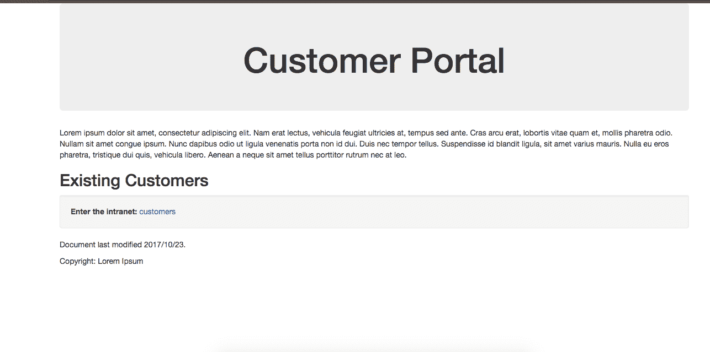](/web/20220924064051/https://www.baeldung.com/wp-content/uploads/2017/11/externalFacingKeycloakPage.png)

现在我们点击`customers`进入内网，这是敏感信息的位置。

**请注意，我们已被重定向到通过 Keycloak 进行身份验证，以查看我们是否有权查看此内容:**

[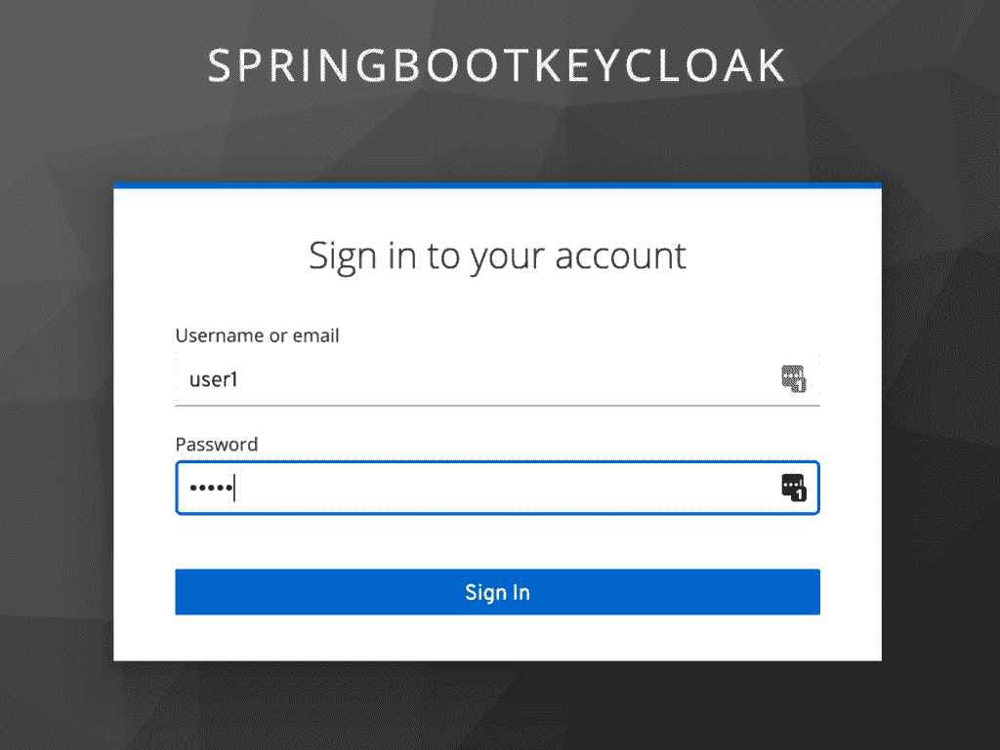](/web/20220924064051/https://www.baeldung.com/wp-content/uploads/2017/11/6_keycloak_userlogin.png)

一旦我们以`user1`的身份登录，Keycloak 将验证我们的授权，证明我们拥有`user`角色，我们将被重定向到受限的`customers`页面:

[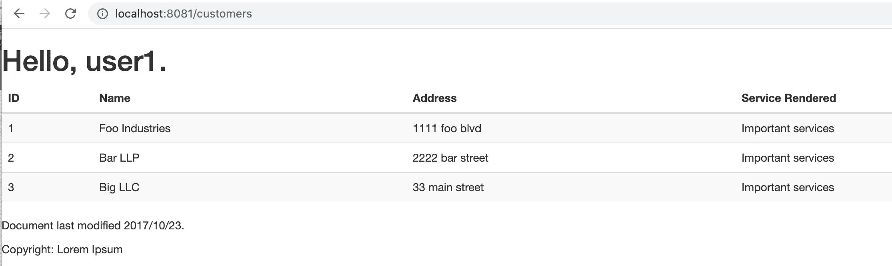](/web/20220924064051/https://www.baeldung.com/wp-content/uploads/2017/11/customers-page.png)

现在我们已经完成了连接 Spring Boot 和奇洛克的设置，并演示了它是如何工作的。

我们可以看到， **Spring Boot 无缝处理了** **调用 Keycloak 授权服务器**的整个过程。我们不必调用 Keycloak API 来自己生成访问令牌，甚至不必在请求受保护资源时显式发送授权头。

接下来，我们将回顾如何将 Spring Security 与我们现有的应用程序结合使用。

## 7。结论

在本文中，我们配置了一个 Keycloak 服务器，并将其用于一个 Spring Boot 应用程序。

我们还学习了如何设置 Spring 安全性，以及如何将它与 Keycloak 结合使用。Github 上的[提供了本文所示代码的工作版本。](https://web.archive.org/web/20220924064051/https://github.com/eugenp/tutorials/tree/master/spring-boot-modules/spring-boot-keycloak)