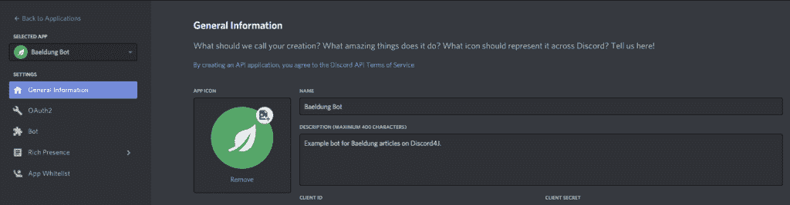
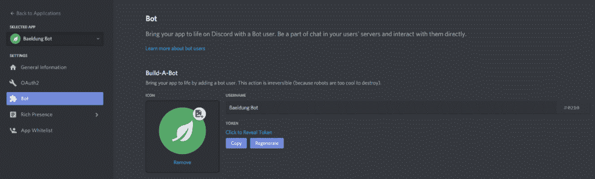
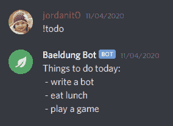

# 用 Discord4J + Spring Boot 创建一个不和谐机器人

> 原文：<https://web.archive.org/web/20220930061024/https://www.baeldung.com/spring-discord4j-bot>

## 1.概观

[Discord4J](https://web.archive.org/web/20220703155159/https://discord4j.com/) 是一个开源的 Java 库，主要可以用来快速访问 [Discord Bot API](https://web.archive.org/web/20220703155159/https://discord.com/developers/docs/intro) 。它与[项目反应器](https://web.archive.org/web/20220703155159/https://projectreactor.io/)高度集成，提供了一个完全无阻塞的反应式 API。

在本教程中，我们将使用 Discord4J 来创建一个能够响应预定义命令的简单的 Discord bot。我们将在 Spring Boot 的基础上构建这个机器人，以展示跨 Spring Boot 支持的许多其他功能扩展我们的机器人是多么容易。

当我们完成时，这个机器人将能够监听一个名为“！todo”并将打印出一个静态定义的待办事项列表。

## 2.创建一个 Discord 应用程序

为了让我们的机器人从 Discord 接收更新并在通道中发布响应，我们需要在 Discord 开发人员门户中创建一个 Discord 应用程序，并将其设置为机器人。这是一个简单的过程。由于 Discord 允许在一个开发人员帐户下创建多个应用程序或机器人，因此可以随意使用不同的设置尝试多次。

以下是创建新应用程序的步骤:

*   登录 [Discord 开发者门户](https://web.archive.org/web/20220703155159/https://discord.com/developers/applications)
*   在“应用程序”选项卡中，单击“新建应用程序”
*   为我们的机器人输入一个名称，然后单击“创建”
*   上传应用程序图标和描述，然后点击“保存更改”

[](/web/20220703155159/https://www.baeldung.com/wp-content/uploads/2020/11/BaeldungBotApplication.png)

既然应用程序已经存在，我们只需向它添加 bot 功能。这将生成 Discord4J 需要的 bot 令牌。

以下是将应用程序转换为机器人的步骤:

*   在 Applications 选项卡中，选择我们的应用程序(如果尚未选择)。
*   在 Bot 选项卡中，单击“添加 Bot”并确认我们要这样做。

[](/web/20220703155159/https://www.baeldung.com/wp-content/uploads/2020/11/BaeldungBotBot.png)

现在我们的应用程序已经变成了一个真正的机器人，复制令牌，这样我们就可以将它添加到我们的应用程序属性中。注意不要公开分享这个令牌，因为其他人可能会在模仿我们的机器人时执行恶意代码。

我们现在准备写一些代码！

## 3.创建 Spring Boot 应用程序

在构建一个新的 Spring Boot 应用程序后，我们需要确保包含 [Discord4J 核心](https://web.archive.org/web/20220703155159/https://search.maven.org/artifact/com.discord4j/bom)依赖项:

```java
<dependency>
    <groupId>com.discord4j</groupId>
    <artifactId>discord4j-core</artifactId>
    <version>3.1.1</version>
</dependency>
```

Discord4J 的工作原理是用我们之前创建的 bot 令牌初始化一个 [`GatewayDiscordClient`](https://web.archive.org/web/20220703155159/https://javadoc.io/doc/com.discord4j/discord4j-core/3.1.1/discord4j/core/GatewayDiscordClient.html) 。这个客户端对象允许我们注册事件监听器和配置许多东西，但是最起码，我们必须至少调用`login()`方法。这将显示我们的机器人在线。

首先，让我们将 bot 令牌添加到我们的`application.yml`文件中:

```java
token: 'our-token-here'
```

接下来，让我们将它注入到一个`@Configuration`类中，在这里我们可以实例化我们的`GatewayDiscordClient`:

```java
@Configuration
public class BotConfiguration {

    @Value("${token}")
    private String token;

    @Bean
    public GatewayDiscordClient gatewayDiscordClient() {
        return DiscordClientBuilder.create(token)
          .build()
          .login()
          .block();
    }
}
```

在这一点上，我们的机器人将被视为在线，但它还没有做任何事情。让我们添加一些功能。

## 4.添加事件侦听器

聊天机器人最常见的功能是命令。这是在 [CLIs](/web/20220703155159/https://www.baeldung.com/spring-shell-cli) 中看到的一种抽象，用户键入一些文本来触发某些功能。在我们的 Discord bot 中，我们可以通过监听用户发送的新消息并在适当的时候用智能响应进行回复来实现这一点。

我们可以监听许多类型的事件。然而，注册一个监听器对所有事件监听器都是一样的，所以让我们首先为所有事件监听器创建一个接口:

```java
import discord4j.core.event.domain.Event;

public interface EventListener<T extends Event> {

    Logger LOG = LoggerFactory.getLogger(EventListener.class);

    Class<T> getEventType();
    Mono<Void> execute(T event);

    default Mono<Void> handleError(Throwable error) {
        LOG.error("Unable to process " + getEventType().getSimpleName(), error);
        return Mono.empty();
    }
}
```

现在我们可以为任意多的 [`discord4j.core.event.domain.Event`](https://web.archive.org/web/20220703155159/https://javadoc.io/doc/com.discord4j/discord4j-core/3.1.1/discord4j/core/event/domain/Event.html) 扩展实现这个接口。

在我们实现我们的第一个事件监听器之前，让我们修改我们的客户端`@Bean`配置来期望一个`EventListener`列表，这样它可以注册在 [Spring `ApplicationContext`](/web/20220703155159/https://www.baeldung.com/spring-application-context) 中找到的每一个:

```java
@Bean
public <T extends Event> GatewayDiscordClient gatewayDiscordClient(List<EventListener<T>> eventListeners) {
    GatewayDiscordClient client = DiscordClientBuilder.create(token)
      .build()
      .login()
      .block();

    for(EventListener<T> listener : eventListeners) {
        client.on(listener.getEventType())
          .flatMap(listener::execute)
          .onErrorResume(listener::handleError)
          .subscribe();
    }

    return client;
}
```

**现在，我们注册事件监听器所要做的就是实现我们的接口，并用 Spring 的 [`@Component`基于原型注释](/web/20220703155159/https://www.baeldung.com/spring-bean-annotations)对其进行注释。**我们现在可以自动注册了！

我们可以选择分别明确地注册每个事件。然而，为了更好的代码可伸缩性，通常最好采用更模块化的方法。

我们的事件监听器设置现在已经完成，但是机器人仍然没有做任何事情，所以让我们添加一些事件来监听。

### 4.1.指令处理

为了接收用户的命令，我们可以监听两种不同的事件类型: [`MessageCreateEvent`](https://web.archive.org/web/20220703155159/https://javadoc.io/doc/com.discord4j/discord4j-core/3.1.1/discord4j/core/event/domain/message/MessageCreateEvent.html) 新消息和 [`MessageUpdateEvent`](https://web.archive.org/web/20220703155159/https://javadoc.io/doc/com.discord4j/discord4j-core/3.1.1/discord4j/core/event/domain/message/MessageUpdateEvent.html) 更新消息。我们可能只想监听新消息，但是作为一个学习的机会，让我们假设我们希望为我们的机器人支持这两种事件。这将为我们的用户提供一个额外的健壮性层。

两个事件对象都包含每个事件的所有相关信息。**我们特别感兴趣的是消息内容、消息作者以及消息发布的渠道。**幸运的是，所有这些数据点都存在于这两种事件类型提供的`Message`对象中。

一旦我们有了`Message`，我们可以检查作者以确保它不是一个机器人，我们可以检查消息内容以确保它与我们的命令匹配，并且我们可以使用消息的通道来发送响应。

因为我们可以通过它们的`Message`对象完全操作这两个事件，所以让我们将所有下游逻辑放在一个公共位置，这样两个事件监听器都可以使用它:

```java
import discord4j.core.object.entity.Message;

public abstract class MessageListener {

    public Mono<Void> processCommand(Message eventMessage) {
        return Mono.just(eventMessage)
          .filter(message -> message.getAuthor().map(user -> !user.isBot()).orElse(false))
          .filter(message -> message.getContent().equalsIgnoreCase("!todo"))
          .flatMap(Message::getChannel)
          .flatMap(channel -> channel.createMessage("Things to do today:\n - write a bot\n - eat lunch\n - play a game"))
          .then();
    }
}
```

这里发生了很多事情，但这是命令和响应的最基本形式。这种方法使用了[反应式功能设计](/web/20220703155159/https://www.baeldung.com/reactor-core)，但是也可以使用`block()`以更传统的命令式方式来编写。

跨多个 bot 命令伸缩、调用不同的服务或数据存储库，甚至使用不一致的角色作为某些命令的授权，都是好的 bot 命令架构的常见部分。由于我们的侦听器是 Spring 管理的，我们可以轻松地注入其他 Spring 管理的 beans 来完成这些任务。然而，我们不会在本文中解决任何问题。

### 4.2.`EventListener<MessageCreateEvent>`

要接收来自用户的新消息，我们必须监听`MessageCreateEvent`。由于命令处理逻辑已经存在于`MessageListener`中，我们可以扩展它来继承该功能。此外，我们需要实现我们的`EventListener`接口，以符合我们的注册设计:

```java
@Service
public class MessageCreateListener extends MessageListener implements EventListener<MessageCreateEvent> {

    @Override
    public Class<MessageCreateEvent> getEventType() {
        return MessageCreateEvent.class;
    }

    @Override
    public Mono<Void> execute(MessageCreateEvent event) {
        return processCommand(event.getMessage());
    }
}
```

通过继承，消息被传递给我们的`processCommand()`方法，在那里进行所有的验证和响应。

此时，我们的机器人将接收并响应“！todo "命令。然而，如果用户纠正他们输入错误的命令，机器人不会响应。让我们用另一个事件监听器来支持这个用例。

### 4.3.`EventListener<MessageUpdateEvent>`

当用户编辑消息时发出`MessageUpdateEvent`。我们可以监听这个事件来识别命令，就像我们监听`MessageCreateEvent`一样。

出于我们的目的，我们只关心消息内容被更改时的事件。我们可以忽略这个事件的其他实例。幸运的是，我们可以使用`isContentChanged()`方法过滤掉这样的实例:

```java
@Service
public class MessageUpdateListener extends MessageListener implements EventListener<MessageUpdateEvent> {

    @Override
    public Class<MessageUpdateEvent> getEventType() {
        return MessageUpdateEvent.class;
    }

    @Override
    public Mono<Void> execute(MessageUpdateEvent event) {
        return Mono.just(event)
          .filter(MessageUpdateEvent::isContentChanged)
          .flatMap(MessageUpdateEvent::getMessage)
          .flatMap(super::processCommand);
    }
}
```

在这种情况下，由于`getMessage()`返回的是`Mono<Message>`而不是原始的`Message`，我们需要使用`flatMap()`将它发送给我们的超类。

## 5.测试机器人不和谐

现在我们有了一个正常运行的 Discord 机器人，我们可以邀请它到 Discord 服务器并测试它。

要创建邀请链接，我们必须指定 bot 需要哪些权限才能正常工作。一个流行的第三方 [Discord 权限计算器](https://web.archive.org/web/20220703155159/https://discordapi.com/permissions.html)经常被用来生成一个带有所需权限的邀请链接。**虽然不建议在生产中使用，但我们可以简单地选择“管理员”进行测试，而不用担心其他权限。**只需为我们的机器人提供客户端 ID(在 Discord 开发者门户中找到)并使用生成的链接邀请我们的机器人到[服务器](https://web.archive.org/web/20220703155159/https://support.discord.com/hc/en-us/articles/204849977-How-do-I-create-a-server-)。

如果我们不授予 bot 管理员权限，我们可能需要调整通道权限，以便 bot 可以在通道中读写。

机器人现在对消息做出响应！todo "以及当消息被编辑为说"！待办事项:

[](/web/20220703155159/https://www.baeldung.com/wp-content/uploads/2020/11/BaeldungBotCommand.png)

## 6.概观

本教程描述了使用 Discord4J 库和 Spring Boot 创建 Discord bot 的所有必要步骤。最后，描述了如何为 bot 建立一个基本的可伸缩的命令和响应结构。

对于一个完整的工作机器人，查看 GitHub 上的源代码[。**运行它需要一个有效的 bot 令牌。**](https://web.archive.org/web/20220703155159/https://github.com/eugenp/tutorials/tree/master/discord4j)