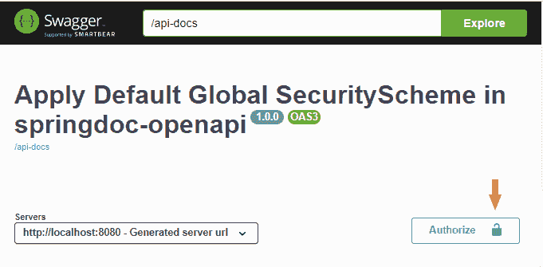
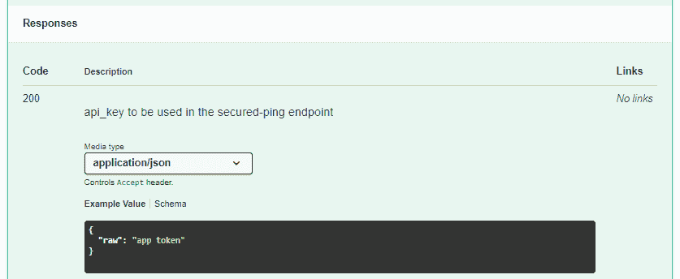
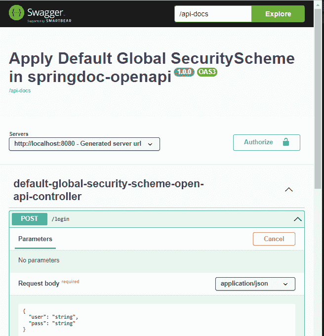
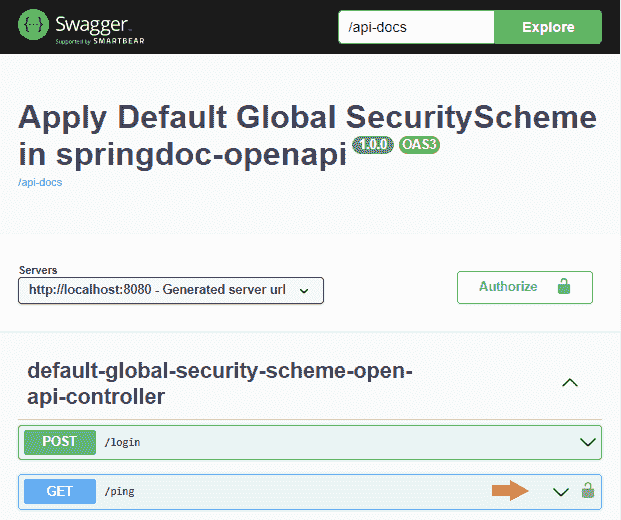

# 在 springdoc-openapi 中应用默认的全局安全模式

> 原文：<https://web.archive.org/web/20220930061024/https://www.baeldung.com/spring-openapi-global-securityscheme>

## 1.概观

在本教程中，**我们将学习如何配置一个默认的全局安全方案，并在 Spring MVC web 应用程序中使用`springdoc-openapi`库将其作为 API 的默认安全需求。**此外，我们将讨论如何覆盖这些默认的安全需求。

OpenAPI 规范让我们为 API 定义一套安全方案。我们可以全局配置 API 的安全要求，或者针对每个端点应用/删除它们。

## 2.设置

因为我们正在使用 Spring Boot 构建一个 Maven 项目，所以让我们探索一下项目的设置。在本节的最后，我们将有一个简单的 web 应用程序。

### 2.1.属国

该示例有两个依赖项。**第一个依赖者是 [`spring-boot-starter-web`](https://web.archive.org/web/20220908120135/https://mvnrepository.com/artifact/org.springframework.boot/spring-boot-starter-web)** 。这是构建 web 应用程序的主要依赖项:

```java
<dependency>
    <groupId>org.springframework.boot</groupId>
    <artifactId>spring-boot-starter-web</artifactId>
    <version>2.7.1</version>
</dependency>
```

**另一个依赖项是** `**[springdoc-openapi-ui](https://web.archive.org/web/20220908120135/https://mvnrepository.com/artifact/org.springdoc/springdoc-openapi-ui "springdoc-openapi-ui")**`，它是以 HTML、JSON 或 YAML 的形式呈现 API 文档的库:

```java
<dependency>
    <groupId>org.springdoc</groupId>
    <artifactId>springdoc-openapi-ui</artifactId>
    <version>1.6.9</version>
</dependency>
```

### 2.2.应用程序入口点

一旦依赖项准备好了，让我们定义应用程序的入口点。

**我们将使用`@SpringBootApplication` 注释来引导应用程序，并使用**T4`SpringApplication` 助手类来启动它:

```java
@SpringBootApplication
public class DefaultGlobalSecuritySchemeApplication {
    public static void main(String[] args) {
        SpringApplication.run(DefaultGlobalSecuritySchemeApplication.class, args);
    }
}
```

## 3.`springdoc-openapi`基本配置

一旦我们配置了 Spring MVC，让我们看看 API 语义信息。

**我们将通过向`DefaultGlobalSecuritySchemeApplication` 类**添加`springdoc-openapi`注释来定义默认的全局安全方案和 API 元数据。为了定义全局安全方案，我们将使用`@SecurityScheme` 注释:

```java
@SecurityScheme(type = SecuritySchemeType.APIKEY, name = "api_key", in = SecuritySchemeIn.HEADER)
```

我们选择了一个`APIKEY`安全方案类型，但是我们可以配置其他安全方案，例如， [JWT](/web/20220908120135/https://www.baeldung.com/openapi-jwt-authentication) 。在定义了安全方案之后，我们将添加元数据并为 API 建立默认的安全需求。我们使用`@OpenApiDefinition`注释来实现这一点:

```java
@OpenAPIDefinition(info = @Info(title = "Apply Default Global SecurityScheme in springdoc-openapi", version = "1.0.0"), security = { @SecurityRequirement(name = "api_key") })
```

这里， **`info`属性定义了 API 元数据**。此外， **`security`属性决定了默认的全局安全需求**。

让我们看看带注释的 HTML 文档会是什么样子。我们将看到元数据和一个应用于整个 API 的安全按钮:

[](/web/20220908120135/https://www.baeldung.com/wp-content/uploads/2022/07/default_global_security_requirement.png)

## 4.控制器

现在我们已经配置了 Spring 框架和`springdoc-openapi`库，**让我们向上下文基本路径**添加一个 REST 控制器。为了实现这一点，我们将使用`@RestController`和`@RequestMapping`注释:

```java
@RestController
@RequestMapping("/")
public class DefaultGlobalSecuritySchemeOpenApiController {
    ...
} 
```

之后，**我们将定义两个端点或[路径](https://web.archive.org/web/20220908120135/https://swagger.io/docs/specification/paths-and-operations/)** 。

第一个端点将是`/login`端点。它将接收用户凭证并验证用户。如果认证成功，端点将返回一个令牌。

API 的另一个端点是`/ping`端点，它需要由`/login`方法生成的令牌。在执行请求之前，该方法验证令牌并检查用户是否得到授权。

总之，**`/login`端点认证用户并提供令牌。`/ping`端点接收由`/login`端点返回的令牌，并检查它是否有效以及用户是否可以执行操作**。

### 4.1.`login()`方法

这种方法没有任何安全要求。因此，我们需要覆盖默认的安全需求配置。

首先，我们需要告诉 Spring 这是我们 API 的一个端点，所以我们将添加注释`@RequestMapping`来配置端点:

```java
@RequestMapping(method = RequestMethod.POST, value = "/login", produces = { "application/json" }, consumes = { "application/json" })
```

之后，我们需要向端点添加语义信息。所以我们将使用`@Operation`和`@SecurityRequirements`注释。`@Operation`将定义端点，而`@SecurityRequirements`将定义适用于端点的特定安全需求集:

```java
@Operation(operationId = "login", responses = {
    @ApiResponse(responseCode = "200", description = "api_key to be used in the secured-ping endpoint", content = { @Content(mediaType = "application/json", schema = @Schema(implementation = TokenDto.class)) }),
    @ApiResponse(responseCode = "401", description = "Unauthorized request", content = { @Content(mediaType = "application/json", schema = @Schema(implementation = ApplicationExceptionDto.class)) }) })
@SecurityRequirements() 
```

例如，以下是状态代码为 200 的响应的 HTML 文档:

[](/web/20220908120135/https://www.baeldung.com/wp-content/uploads/2022/07/login_response_status_code_200.png)

最后，让我们看看`login()`方法的签名:

```java
public ResponseEntity login(@Parameter(name = "LoginDto", description = "Login") @Valid @RequestBody(required = true) LoginDto loginDto) {
    ...
}
```

正如我们所看到的，API 请求的主体接收了一个`LoginDto`实例。我们还必须用语义信息来修饰 dto，以便在文档中显示信息:

```java
public class LoginDto {
    private String user;
    private String pass;

    ...

    @Schema(name = "user", required = true)
    public String getUser() {
        return user;
    }

    @Schema(name = "pass", required = true)
    public String getPass() {
        return pass;
    }
}
```

这里我们可以看到`/login`端点 HTML 文档的样子:

[](/web/20220908120135/https://www.baeldung.com/wp-content/uploads/2022/07/login_execute.png)

### 4.2.`ping()`方法

此时，我们将定义`ping()`方法。**`ping()`方法将使用默认的全局安全方案**:

```java
@Operation(operationId = "ping", responses = {
    @ApiResponse(responseCode = "200", description = "Ping that needs an api_key attribute in the header", content = {
        @Content(mediaType = "application/json", schema = @Schema(implementation = PingResponseDto.class), examples = { @ExampleObject(value = "{ pong: '2022-06-17T18:30:33.465+02:00' }") }) }),
    @ApiResponse(responseCode = "401", description = "Unauthorized request", content = { @Content(mediaType = "application/json", schema = @Schema(implementation = ApplicationExceptionDto.class)) }),
    @ApiResponse(responseCode = "403", description = "Forbidden request", content = { @Content(mediaType = "application/json", schema = @Schema(implementation = ApplicationExceptionDto.class)) }) })
@RequestMapping(method = RequestMethod.GET, value = "/ping", produces = { "application/json" })
public ResponseEntity ping(@RequestHeader(name = "api_key", required = false) String api_key) {
    ...
} 
```

`login()`和`ping()`方法的主要区别在于将要应用的安全要求。`login()`没有任何安全性要求，但是`ping()`方法将具有 API 级别定义的安全性。因此，HTML 文档将表示只为`/ping`端点显示锁的情况:

[](/web/20220908120135/https://www.baeldung.com/wp-content/uploads/2022/07/ping_endpoint.png)

## 5.REST API 文档 URL

此时，我们已经准备好了 Spring MVC web 应用程序，我们可以启动服务器了:

```java
mvn spring-boot:run -Dstart-class="com.baeldung.defaultglobalsecurityscheme.DefaultGlobalSecuritySchemeApplication"
```

一旦服务器准备好了，我们就可以在`http://localhost:8080/swagger-ui-custom.html` URL 看到 HTML 文档，如前面的例子所示。

API 定义的 JSON 版本在`http://localhost:8080/api-docs`处，YAML 版本在`http://localhost:8080/api-docs.yaml`处。

**这些输出可用于[使用](/web/20220908120135/https://www.baeldung.com/spring-boot-rest-client-swagger-codegen)`[swagger-codegen-maven-plugin](https://web.archive.org/web/20220908120135/https://mvnrepository.com/artifact/io.swagger.core.v3)`** 以不同语言构建 API 的客户端或服务器。

## 6.结论

在本文中，我们学习了如何使用`springdoc-openapi`库来定义默认的全局安全方案。此外，我们还看到了如何将它作为默认安全需求应用到 API 中。此外，我们还了解了如何更改特定端点的默认安全要求。

我们发现的另一件事是，我们可以使用来自`springdoc-openapi`的 JSON 和 YAML 输出来自动化代码生成。

像往常一样，本文的完整源代码可以在 GitHub 上的[处获得。](https://web.archive.org/web/20220908120135/https://github.com/eugenp/tutorials/tree/master/spring-boot-modules/spring-boot-springdoc)