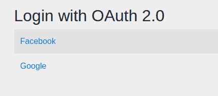
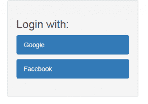

# spring Security 5–oauth 2 登录

> 原文：<https://web.archive.org/web/20220930061024/https://www.baeldung.com/spring-security-5-oauth2-login>

## 1。概述

Spring Security 5 引入了一个新的`OAuth2LoginConfigurer`类，我们可以用它来配置外部授权服务器。

在本教程中，**我们将探索一些可用于`oauth2Login()`元素的各种配置选项。**

## 2。Maven 依赖关系

**在一个 Spring Boot 项目中，我们只需要添加启动器 [`spring-boot-starter-oauth2-client`](https://web.archive.org/web/20220921221550/https://search.maven.org/search?q=a:spring-boot-starter-oauth2-client)** :

```
<dependency>
    <groupId>org.springframework.boot</groupId>
    <artifactId>spring-boot-starter-oauth2-client</artifactId>
    <version>2.3.3.RELEASE</version>
</dependency>
```

在一个非引导项目中，除了标准的 Spring 和 Spring 安全依赖项，我们还需要显式地添加 [`spring-security-oauth2-client`](https://web.archive.org/web/20220921221550/https://search.maven.org/classic/#search%7Cga%7C1%7Ca%3A%22spring-security-oauth2-client%22%20AND%20g%3A%22org.springframework.security%22) 和 [`spring-security-oauth2-jose`](https://web.archive.org/web/20220921221550/https://search.maven.org/classic/#search%7Cga%7C1%7Ca%3A%22spring-security-oauth2-jose%22) 依赖项:

```
<dependency>
    <groupId>org.springframework.security</groupId>
    <artifactId>spring-security-oauth2-client</artifactId>
    <version>5.3.4.RELEASE</version>
</dependency>
<dependency>
    <groupId>org.springframework.security</groupId>
    <artifactId>spring-security-oauth2-jose</artifactId>
    <version>5.3.4.RELEASE</version>
</dependency>
```

## 3。客户端设置

在 Spring Boot 项目中，我们需要做的就是为我们想要配置的每个客户端添加一些标准属性。

**让我们设置我们的项目，让在谷歌和脸书注册为身份验证提供商的客户端登录。**

### 3.1。获取客户端凭证

要获得 Google OAuth2 身份验证的客户端凭证，请前往 [Google API 控制台](https://web.archive.org/web/20220921221550/https://console.developers.google.com/)“凭证”部分。

这里，我们将为 web 应用程序创建“OAuth2 Client ID”类型的凭证。这导致谷歌为我们设置了一个客户端 id 和密码。

我们还必须在 Google 控制台中配置一个授权的重定向 URI，这是用户成功登录 Google 后将被重定向到的路径。

默认情况下，Spring Boot 将这个重定向 URI 配置为`/login/oauth2/code/{registrationId}`。

因此，对于谷歌，我们将添加这个 URI:

```
http://localhost:8081/login/oauth2/code/google
```

为了获得通过脸书认证的客户端凭证，我们需要在[开发者脸书](https://web.archive.org/web/20220921221550/https://developers.facebook.com/docs/facebook-login)网站上注册一个应用程序，并将相应的 URI 设置为“有效的 OAuth 重定向 URI”:

```
http://localhost:8081/login/oauth2/code/facebook
```

### 3.2。安全配置

接下来，我们需要将客户端凭证添加到`application.properties`文件中。

**Spring 安全属性的前缀是`spring.security.oauth2.client.registration`，后面是客户端名称，然后是客户端属性的名称**:

```
spring.security.oauth2.client.registration.google.client-id=<your client id>
spring.security.oauth2.client.registration.google.client-secret=<your client secret>

spring.security.oauth2.client.registration.facebook.client-id=<your client id> 
spring.security.oauth2.client.registration.facebook.client-secret=<your client secret>
```

**为至少一个客户机添加这些属性将启用`Oauth2ClientAutoConfiguration`类**，它将设置所有必需的 beans。

**自动 web 安全配置相当于定义一个简单的`oauth2Login()`元素**:

```
@Configuration
public class SecurityConfig extends WebSecurityConfigurerAdapter {

    @Override
    protected void configure(HttpSecurity http) throws Exception {
        http.authorizeRequests()
         .anyRequest().authenticated()
         .and()
         .oauth2Login();
    }
}
```

这里我们可以看到`oauth2Login()`元素的使用方式类似于已知的`httpBasic()`和`formLogin()`元素。

**现在，当我们试图访问一个受保护的 URL 时，应用程序将显示一个自动生成的登录页面，其中有两个客户端**:

[](/web/20220921221550/https://www.baeldung.com/wp-content/uploads/2018/01/oauth-login-default.png)

### 3.3。其他客户

注意，除了谷歌和脸书，Spring 安全项目还包含 GitHub 和 Okta 的默认配置。这些默认配置提供了身份验证所需的所有信息，因此我们只需输入客户端凭据。

如果我们想使用 Spring Security 中没有配置的不同的身份验证提供者，我们需要定义完整的配置，包括授权 URI 和令牌 URI 等信息。下面是 Spring Security 中的默认配置，以了解所需的属性。

## 4。非引导项目中的设置

### 4.1。创造一个`ClientRegistrationRepository`豆

**如果我们没有使用 Spring Boot 应用程序，我们将需要定义一个`ClientRegistrationRepository` bean** ，它包含授权服务器拥有的客户端信息的内部表示:

```
@Configuration
@EnableWebSecurity
@PropertySource("classpath:application.properties")
public class SecurityConfig extends WebSecurityConfigurerAdapter {
    private static List<String> clients = Arrays.asList("google", "facebook");

    @Bean
    public ClientRegistrationRepository clientRegistrationRepository() {
        List<ClientRegistration> registrations = clients.stream()
          .map(c -> getRegistration(c))
          .filter(registration -> registration != null)
          .collect(Collectors.toList());

        return new InMemoryClientRegistrationRepository(registrations);
    }
}
```

这里我们创建一个包含一系列`ClientRegistration`对象的`InMemoryClientRegistrationRepository`。

### 4.2。建筑`ClientRegistration`物体

让我们看看构建这些对象的`getRegistration()`方法:

```
private static String CLIENT_PROPERTY_KEY 
  = "spring.security.oauth2.client.registration.";

@Autowired
private Environment env;

private ClientRegistration getRegistration(String client) {
    String clientId = env.getProperty(
      CLIENT_PROPERTY_KEY + client + ".client-id");

    if (clientId == null) {
        return null;
    }

    String clientSecret = env.getProperty(
      CLIENT_PROPERTY_KEY + client + ".client-secret");

    if (client.equals("google")) {
        return CommonOAuth2Provider.GOOGLE.getBuilder(client)
          .clientId(clientId).clientSecret(clientSecret).build();
    }
    if (client.equals("facebook")) {
        return CommonOAuth2Provider.FACEBOOK.getBuilder(client)
          .clientId(clientId).clientSecret(clientSecret).build();
    }
    return null;
}
```

这里我们从一个类似的`application.properties`文件中读取客户端凭证。然后，我们使用已经在 Spring Security 中定义的`CommonOauth2Provider` enum 作为 Google 和脸书客户端的其余客户端属性。

每个`ClientRegistration`实例对应一个客户端。

### 4.3。`ClientRegistrationRepository`现出

最后，我们必须基于`ClientRegistrationRepository` bean 创建一个`OAuth2AuthorizedClientService` bean，并用`oauth2Login()`元素注册两者:

```
@Override
protected void configure(HttpSecurity http) throws Exception {
    http.authorizeRequests().anyRequest().authenticated()
      .and()
      .oauth2Login()
      .clientRegistrationRepository(clientRegistrationRepository())
      .authorizedClientService(authorizedClientService());
}

@Bean
public OAuth2AuthorizedClientService authorizedClientService() {

    return new InMemoryOAuth2AuthorizedClientService(
      clientRegistrationRepository());
}
```

正如我们所看到的，**我们可以使用`oauth2Login()`的`clientRegistrationRepository()`方法来注册一个定制的注册库。**

我们还必须定义一个定制的登录页面，因为它不会再自动生成。我们将在下一节看到更多的信息。

让我们继续进一步定制我们的登录过程。

## 5。定制`oauth2Login()`

OAuth 2 流程使用了几个元素，我们可以用`oauth2Login()`方法定制这些元素。

**注意，所有这些元素在 Spring Boot 中都有默认配置，不需要显式配置。**

让我们看看如何在我们的配置中定制这些。

### 5.1。自定义登录页面

即使 Spring Boot 为我们生成了一个默认的登录页面，我们通常也想定义自己的定制页面。

**让我们从使用** **`loginPage()`方法**为`oauth2Login()`元素配置一个新的登录 URL 开始:

```
@Override
protected void configure(HttpSecurity http) throws Exception {
    http.authorizeRequests()
      .antMatchers("/oauth_login")
      .permitAll()
      .anyRequest()
      .authenticated()
      .and()
      .oauth2Login()
      .loginPage("/oauth_login");
}
```

在这里，我们将我们的登录 URL 设置为`/oauth_login`。

接下来，让我们用映射到这个 URL 的方法定义一个`LoginController`:

```
@Controller
public class LoginController {

    private static String authorizationRequestBaseUri
      = "oauth2/authorization";
    Map<String, String> oauth2AuthenticationUrls
      = new HashMap<>();

    @Autowired
    private ClientRegistrationRepository clientRegistrationRepository;

    @GetMapping("/oauth_login")
    public String getLoginPage(Model model) {
        // ...

        return "oauth_login";
    }
}
```

**这个方法必须向视图**发送一个可用客户端及其授权端点的映射，我们将从`ClientRegistrationRepository` bean 中获得这个映射:

```
public String getLoginPage(Model model) {
    Iterable<ClientRegistration> clientRegistrations = null;
    ResolvableType type = ResolvableType.forInstance(clientRegistrationRepository)
      .as(Iterable.class);
    if (type != ResolvableType.NONE && 
      ClientRegistration.class.isAssignableFrom(type.resolveGenerics()[0])) {
        clientRegistrations = (Iterable<ClientRegistration>) clientRegistrationRepository;
    }

    clientRegistrations.forEach(registration -> 
      oauth2AuthenticationUrls.put(registration.getClientName(), 
      authorizationRequestBaseUri + "/" + registration.getRegistrationId()));
    model.addAttribute("urls", oauth2AuthenticationUrls);

    return "oauth_login";
}
```

最后，我们需要定义我们的`oauth_login.html`页面:

```
<h3>Login with:</h3>
<p th:each="url : ${urls}">
    <a th:text="${url.key}" th:href="${url.value}">Client</a>
</p>
```

这是一个简单的 HTML 页面，显示与每个客户端进行身份验证的链接。

添加一些样式后，我们可以更改登录页面的外观:



### 5.2。自定义认证成功和失败行为

我们可以用不同的方法控制身份验证后的行为:

*   `defaultSuccessUrl()`和`failureUrl()`将用户重定向到给定的 URL
*   `successHandler()`和`failureHandler()`在认证过程之后运行定制逻辑

让我们看看如何设置自定义 URL 来将用户重定向到:

```
.oauth2Login()
  .defaultSuccessUrl("/loginSuccess")
  .failureUrl("/loginFailure");
```

如果用户在身份验证之前访问了受保护的页面，他们将在登录后被重定向到该页面。否则，它们将被重定向到`/loginSuccess`。

如果我们希望用户总是被发送到`/loginSuccess` URL，不管他们之前是否在一个安全的页面上，我们可以使用方法`defaultSuccessUrl(“/loginSuccess”, true)`。

要使用自定义处理程序，我们必须创建一个实现`AuthenticationSuccessHandler`或`AuthenticationFailureHandler`接口的类，覆盖继承的方法，然后使用`successHandler()`和`failureHandler()`方法设置 beans。

### 5.3。自定义授权端点

授权端点是 Spring Security 用来触发对外部服务器的授权请求的端点。

首先，**让我们为授权端点**设置新的属性:

```
.oauth2Login() 
  .authorizationEndpoint()
  .baseUri("/oauth2/authorize-client")
  .authorizationRequestRepository(authorizationRequestRepository());
```

这里我们将`baseUri`修改为`/oauth2/authorize-client`，而不是默认的`/oauth2/authorization`。

我们还显式地设置了一个我们必须定义的`authorizationRequestRepository()` bean:

```
@Bean
public AuthorizationRequestRepository<OAuth2AuthorizationRequest> 
  authorizationRequestRepository() {

    return new HttpSessionOAuth2AuthorizationRequestRepository();
}
```

我们已经为 bean 使用了 Spring 提供的实现，但是我们也可以提供一个自定义的实现。

### 5.4。自定义令牌端点

令牌 `endpoint`处理访问令牌。

**让我们用默认的响应客户端实现显式配置`tokenEndpoint()`** :

```
.oauth2Login()
  .tokenEndpoint()
  .accessTokenResponseClient(accessTokenResponseClient());
```

下面是响应客户端 bean:

```
@Bean
public OAuth2AccessTokenResponseClient<OAuth2AuthorizationCodeGrantRequest> 
  accessTokenResponseClient() {

    return new NimbusAuthorizationCodeTokenResponseClient();
}
```

这个配置与默认配置相同，它使用 Spring 实现，该实现基于与提供者交换授权代码。

当然，我们也可以用定制的响应客户端来代替。

### 5.5。自定义重定向端点

这是向外部提供者进行身份验证后重定向到的端点。

**让我们看看如何更改重定向端点**的`baseUri`:

```
.oauth2Login()
  .redirectionEndpoint()
  .baseUri("/oauth2/redirect")
```

默认的 URI 是`login/oauth2/code`。

注意，如果我们更改它，我们还必须更新每个`ClientRegistration`的`redirectUriTemplate`属性，并添加新的 URI 作为每个客户端的授权重定向 URI。

### 5.6。自定义用户信息端点

用户信息端点是我们可以用来获取用户信息的位置。

**我们可以使用`userInfoEndpoint()`方法定制这个端点。**为此，我们可以使用`userService()`和`customUserType()`等方法来修改用户信息的检索方式。

## 6。访问用户信息

我们可能想要完成的一个常见任务是查找关于登录用户的信息。为此，**我们可以向用户信息端点发出请求。**

首先，我们必须获得对应于当前用户令牌的客户机:

```
@Autowired
private OAuth2AuthorizedClientService authorizedClientService;

@GetMapping("/loginSuccess")
public String getLoginInfo(Model model, OAuth2AuthenticationToken authentication) {
    OAuth2AuthorizedClient client = authorizedClientService
      .loadAuthorizedClient(
        authentication.getAuthorizedClientRegistrationId(), 
          authentication.getName());
    //...
    return "loginSuccess";
}
```

接下来，我们将向客户机的用户信息端点发送一个请求，并检索`userAttributes Map`:

```
String userInfoEndpointUri = client.getClientRegistration()
  .getProviderDetails().getUserInfoEndpoint().getUri();

if (!StringUtils.isEmpty(userInfoEndpointUri)) {
    RestTemplate restTemplate = new RestTemplate();
    HttpHeaders headers = new HttpHeaders();
    headers.add(HttpHeaders.AUTHORIZATION, "Bearer " + client.getAccessToken()
      .getTokenValue());
    HttpEntity entity = new HttpEntity("", headers);
    ResponseEntity <map>response = restTemplate
      .exchange(userInfoEndpointUri, HttpMethod.GET, entity, Map.class);
    Map userAttributes = response.getBody();
    model.addAttribute("name", userAttributes.get("name"));
}
```

通过添加`name`属性作为`Model`属性，我们可以在`loginSuccess`视图中将它显示为对用户的欢迎消息:


除了`name`，`userAttributes Map`还包含`email`， `family_name`，`picture`， `locale`等属性。

## 7 .**。结论**

在本文中，我们看到了如何在 Spring Security 中使用`oauth2Login()`元素来认证不同的提供商，比如 Google 和脸书。

我们还经历了定制这个过程的一些常见场景。

这些例子的完整源代码可以在 GitHub 上找到[。](https://web.archive.org/web/20220921221550/https://github.com/eugenp/tutorials/tree/master/spring-security-modules/spring-security-oauth2)