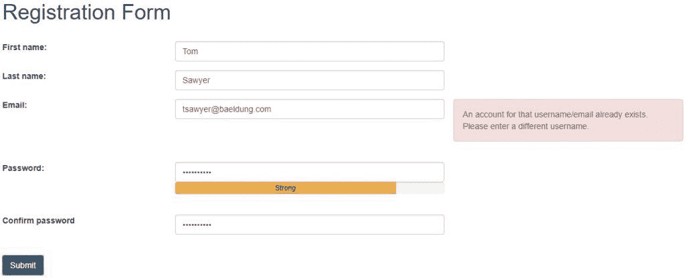
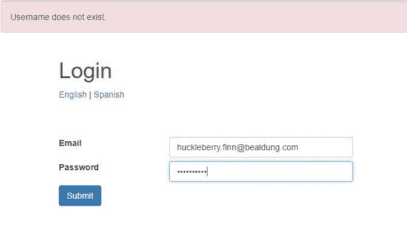
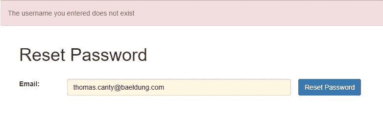
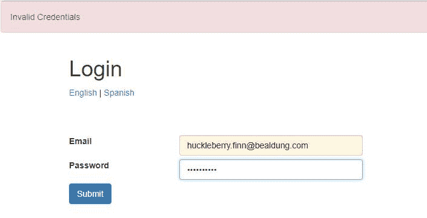
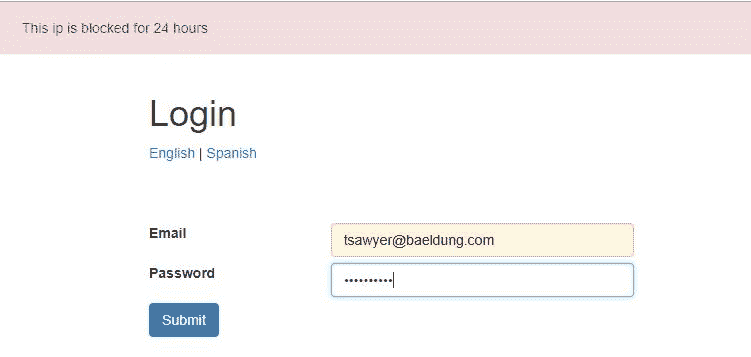

# 使用 Spring Security 防止用户名枚举攻击

> 原文：<https://web.archive.org/web/20220930061024/https://www.baeldung.com/spring-security-enumeration-attacks>

## 1。概述

在本教程中，我们将描述一般的枚举攻击。更具体地说，我们将探索针对 web 应用程序的用户名枚举攻击。最重要的是，我们将探索通过 Spring Security 处理它们的选项。

## 2.解释枚举攻击

枚举在技术上是指集合中所有项目的完整有序的列表。虽然这个定义仅限于数学，但它的本质使它成为一个强有力的黑客工具。**枚举通常会暴露可被利用的攻击媒介。**在这种情况下，通常称为资源枚举。

顾名思义，资源枚举是从任何主机收集资源列表的一种方式。这些资源可以是任何有价值的东西，包括用户名、服务或页面。这些资源会暴露主机中的潜在漏洞。

现在，可以有几种可能的方法，探索甚至未探索，利用这些漏洞。

## 3.针对 Web 应用程序的常见枚举攻击

在 web 应用中，最常用的枚举攻击之一是用户名枚举攻击。这基本上利用 web 应用程序的任何显式或隐式特性来收集有效的用户名。攻击者可以使用常用的用户名来攻击 web 应用程序。

现在，web 应用程序中的哪种特性可以揭示用户名是否有效？老实说，可以尽量多种多样。它可能是设计的一个功能，例如，让用户知道用户名已被占用的注册页面。

或者，这可能是一个隐含的事实，即与使用无效用户名的登录尝试相比，使用有效用户名的登录尝试花费的时间量大不相同。

## 4.模拟用户名枚举攻击的设置

我们将使用一个使用 Spring Boot 和 Spring Security 的简单用户 web 应用程序来演示这些攻击媒介。这个 web 应用程序将有一个最小的特性集来支持这个演示。关于如何建立这样一个应用程序的详细讨论在之前的教程中已经介绍过了。

web 应用程序的常见功能通常会暴露可用于发起枚举攻击的信息。让我们过一遍。

### 4.1.用户注册

用户注册需要一个唯一的用户名，为了简单起见，通常选择电子邮件地址。现在，如果我们选择一封已经存在的电子邮件，应用程序应该告诉我们:

再加上电子邮件列表很容易获得，这可能导致用户名枚举攻击，从而在应用程序中找出有效的用户名。

### 4.2.用户登录

类似地，当我们尝试登录一个应用程序时，它要求我们提供用户名和密码。现在，如果我们提供的用户名不存在，应用程序可能会将此信息返回给我们:

和以前一样，这对于利用用户名枚举攻击来说非常简单。

### 4.3.重置密码

重置密码通常用于向用户的电子邮件发送密码重置链接。现在，这将再次要求我们提供用户名或电子邮件:

如果该用户名或电子邮件在应用程序中不存在，应用程序将通知，从而导致我们前面看到的类似漏洞。

## 5.防止用户名枚举攻击

有几种方法可以防止用户名枚举攻击。其中许多我们可以通过对功能的简单调整来实现，比如 web 应用程序上的用户消息。

此外，随着时间的推移，Spring 安全性已经足够成熟，可以支持处理许多这样的攻击媒介。有现成的功能和扩展点来创建自定义安全措施。我们将探索其中的一些技术。

让我们来看看防止此类攻击的常用方法。**请注意，并非所有这些解决方案在 web 应用程序的每一部分都是合适的，甚至是可能的。**我们将继续详细讨论这一点。

### 5.1.调整消息

首先，我们必须排除无意中泄露过多信息的所有可能性。这在注册时会很困难，但在登录和重置密码页面时却相当简单。

例如，我们可以很容易地将登录页面的消息抽象化:

我们可以对密码重置页面的消息做类似的调整。

### 5.2.包括验证码

虽然调整消息在某些页面上效果很好，但在注册这样的页面上却很难做到。在这种情况下，我们可以使用另一个叫做 [CAPTCHA](/web/20220628132003/https://www.baeldung.com/cs/captcha-intro) 的工具。

现在，在这一点上，值得注意的是，任何枚举攻击最有可能是机器人攻击，因为有大量的可能性要经历。因此，**探测人类或机器人的存在可以帮助我们防止攻击**。验证码作为一种流行的方式来实现这一点。

在 web 应用程序中实现或集成 CAPTCHA 服务有几种可能的方法。其中一个服务是谷歌的 reCAPTCHA，它可以很容易地集成在注册页面上。

### 5.3.限速

虽然 CAPTCHA 很好地满足了这个目的，但它确实增加了延迟，更重要的是，给合法用户带来了不便。这与登录等常用页面更相关。

有一种技术可以帮助防止机器人对登录等常用页面的攻击，这就是速率限制。速率限制指的是在某个阈值之后防止对资源的连续尝试。

例如，我们可以在三次登录尝试失败后阻止来自特定 IP 的请求一天:

Spring Security 让这变得特别方便。

我们首先为`AuthenticationFailureBadCredentialsEvent and AuthenticationSuccessEvent.`定义侦听器，这些侦听器调用一个服务，记录来自特定 IP 的失败尝试次数。一旦超过设定的阈值，后续请求将在`UserDetailsService`中被阻塞。

另一篇教程对这种方法进行了详细讨论。

### 5.4.地理限制

此外，我们可以在注册过程中根据用户所在的国家捕获位置。我们可以使用它来验证来自不同位置的登录尝试。如果我们检测到异常位置，可以采取适当的措施:

*   选择性地启用验证码
*   实施逐步身份认证(作为多因素身份认证的一部分)
*   要求用户安全地验证位置
*   在连续请求时临时阻止用户

同样，Spring Security 通过它的扩展点，使得在`AuthenticationProvider`中插入一个定制的位置验证服务成为可能。在之前的教程中已经详细描述了这种特殊风格。

### 5.5.多因素认证

最后，我们应该注意，基于密码的身份验证通常是第一步，而且在大多数情况下，是唯一需要的一步。但是**为了更好的安全性，应用程序采用多因素认证机制的情况并不少见**。对于像网上银行这样的敏感应用来说尤其如此。

对于多因素身份认证，有许多可能的因素:

*   知识因素:这指的是用户知道什么，比如 PIN
*   拥有因素:这是指用户拥有的东西，比如令牌或智能手机
*   固有因素:这是指用户固有的东西，比如指纹

Spring Security 在这里也很方便，因为它允许我们插入一个自定义的`AuthenticationProvider.`Google Authenticator 应用程序是实现额外所有权因素的一个流行选择。这使得用户可以在智能手机的应用程序上生成一个临时令牌，并在任何应用程序中使用它进行身份验证。显然，这需要预先在应用程序中设置用户，无论是在注册期间还是稍后。

在之前的教程中已经很好地介绍了在 Spring 安全应用中集成 Google Authenticator。

更重要的是，**像多因素身份认证这样的解决方案只有在应用程序需要时才适用**。因此，我们不应该主要使用它来防止枚举攻击。

### 5.6.处理时间延迟

在处理像登录这样的请求时，检查用户名是否存在通常是我们要做的第一件事。如果用户名不存在，请求会立即返回一个错误。相反，具有有效用户名的请求将涉及许多进一步的步骤，如密码匹配和角色验证。自然，对这两种情况做出响应的时间可能会有所不同。

现在，即使我们抽象错误消息来隐藏用户名是否有效的事实，处理时间的显著差异也可能会引起攻击者的注意。

这个问题的一个可能的解决方案是添加一个强制延迟来排除处理时间的差异。然而，由于这不是一个肯定会发生的问题，我们应该只在必要时才采用这种解决方案。

## 6.包扎

虽然我们讨论了很多关于用户名枚举攻击的技巧，但是人们很自然会问，什么时候使用什么？显然，这个问题没有一个答案，因为它很大程度上取决于应用程序的类型及其需求。

有些事情，比如给用户的消息，必须尽可能少地泄露信息。此外，明智的做法是限制对登录等资源的连续失败尝试。

但是，只有在需求认为有必要时，我们才应该使用任何额外的措施。我们也应该理性地权衡它们对可用性的阻碍。

此外，重要的是要认识到，我们可以对不同的资源应用这些措施的任意组合，以选择性地保护它们。

## 7。结论

在本教程中，我们讨论了枚举攻击，特别是用户名枚举攻击。我们通过一个带有 Spring Security 的简单 Spring Boot 应用程序看到了这一点。

我们讨论了几种逐步解决用户名枚举攻击问题的方法。

最后，我们讨论了这些措施在应用程序安全中的适用性。

和往常一样，这些例子的代码可以在 GitHub 的[上找到。](https://web.archive.org/web/20220628132003/https://github.com/Baeldung/spring-security-registration)