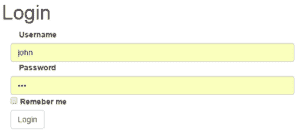

# OAuth2 用刷新令牌记住我(使用 Spring Security OAuth 遗留堆栈)

> 原文：<https://web.archive.org/web/20220930061024/https://www.baeldung.com/spring-security-oauth2-remember-me>

## 1。概述

在本文中，我们将通过利用 OAuth 2 刷新令牌，为 OAuth 2 安全应用程序添加“记住我”功能。

本文是我们关于使用 OAuth 2 保护 Spring REST API 的系列文章的继续，Spring REST API 是通过 AngularJS 客户端访问的。要设置授权服务器、资源服务器和前端客户端，您可以按照介绍文章中的[进行操作。](/web/20220822105732/https://www.baeldung.com/rest-api-spring-oauth2-angular-legacy)

**注**:本文使用的是 [Spring OAuth 遗留项目](https://web.archive.org/web/20220822105732/https://spring.io/projects/spring-security-oauth)。

## 2。OAuth 2 访问令牌和刷新令牌

首先，让我们快速回顾一下`OAuth 2`令牌以及如何使用它们。

在使用`password`授权类型的第一次认证尝试中，用户需要发送有效的用户名和密码，以及客户端 id 和密码。如果身份验证请求成功，服务器将发回以下形式的响应:

```
{
    "access_token": "2e17505e-1c34-4ea6-a901-40e49ba786fa",
    "token_type": "bearer",
    "refresh_token": "e5f19364-862d-4212-ad14-9d6275ab1a62",
    "expires_in": 59,
    "scope": "read write",
}
```

我们可以看到服务器响应既包含访问令牌，也包含刷新令牌。访问令牌将用于需要认证的后续 API 调用，而**刷新令牌的目的是获得新的有效访问令牌**或者只是撤销先前的访问令牌。

要使用`refresh_token`授权类型接收新的访问令牌，用户不再需要输入他们的凭证，而只需输入客户端 id、密码，当然还有刷新令牌。

使用两种令牌的目的是增强用户安全性。通常，访问令牌具有较短的有效期，因此如果攻击者获得了访问令牌，他们只有有限的时间来使用它。另一方面，如果刷新令牌被泄露，这是没有用的，因为还需要客户端 id 和密码。

刷新令牌的另一个好处是，它允许撤销访问令牌，并且如果用户表现出异常行为(如新 IP 登录),则不会发送回另一个令牌。

## 3。带刷新令牌的勿忘我功能

用户通常会发现保留会话的选项非常有用，因为他们不需要在每次访问应用程序时都输入凭据。

由于访问令牌具有较短的有效时间，因此我们可以利用刷新令牌来生成新的访问令牌，从而避免每次访问令牌到期时都必须向用户询问他们的凭证。

在接下来的部分中，我们将讨论实现该功能的两种方法:

*   首先，拦截任何返回 401 状态码的用户请求，这意味着访问令牌无效。当这种情况发生时，如果用户选中了“记住我”选项，我们将使用 `refresh_token`授权类型自动发出新访问令牌的请求，然后再次执行初始请求。
*   其次，我们可以主动刷新访问令牌—我们将在令牌过期前几秒发送刷新令牌的请求

第二个选项的优点是用户的请求不会被延迟。

## 4。存储刷新令牌

在[上一篇关于刷新令牌](/web/20220822105732/https://www.baeldung.com/spring-security-oauth2-refresh-token-angular-js-legacy)的文章中，我们添加了一个`CustomPostZuulFilter`，它拦截对`OAuth`服务器的请求，提取身份验证时发回的刷新令牌，并将其存储在服务器端 cookie 中:

```
@Component
public class CustomPostZuulFilter extends ZuulFilter {

    @Override
    public Object run() {
        //...
        Cookie cookie = new Cookie("refreshToken", refreshToken);
        cookie.setHttpOnly(true);
        cookie.setPath(ctx.getRequest().getContextPath() + "/oauth/token");
        cookie.setMaxAge(2592000); // 30 days
        ctx.getResponse().addCookie(cookie);
        //...
    }
}
```

接下来，让我们在登录表单上添加一个复选框，它有一个到`loginData.remember`变量的数据绑定:

```
<input type="checkbox"  ng-model="loginData.remember" id="remember"/>
<label for="remember">Remeber me</label>
```

我们的登录表单现在将显示一个额外的复选框:

[](/web/20220822105732/https://www.baeldung.com/wp-content/uploads/2017/07/remember.png)

`loginData`对象随认证请求一起发送，因此它将包含`remember`参数。在发送认证请求之前，我们将根据参数设置一个名为`remember`的 cookie:

```
function obtainAccessToken(params){
    if (params.username != null){
        if (params.remember != null){
            $cookies.put("remember","yes");
        }
        else {
            $cookies.remove("remember");
        }
    }
    //...
}
```

因此，我们将检查这个 cookie 来确定我们是否应该尝试刷新访问令牌，这取决于用户是否希望被记住。

## 5。通过拦截 401 响应刷新令牌

为了拦截返回 401 响应的请求，让我们修改我们的`AngularJS`应用程序，添加一个带有`responseError`函数的拦截器:

```
app.factory('rememberMeInterceptor', ['$q', '$injector', '$httpParamSerializer', 
  function($q, $injector, $httpParamSerializer) {  
    var interceptor = {
        responseError: function(response) {
            if (response.status == 401){

                // refresh access token

                // make the backend call again and chain the request
                return deferred.promise.then(function() {
                    return $http(response.config);
                });
            }
            return $q.reject(response);
        }
    };
    return interceptor;
}]);
```

我们的函数检查状态是否为 401——这意味着访问令牌无效，如果是，则尝试使用刷新令牌来获取新的有效访问令牌。

如果成功，该函数将继续重试导致 401 错误的初始请求。这确保了用户的无缝体验。

让我们仔细看看刷新访问令牌的过程。首先，我们将初始化必要的变量:

```
var $http = $injector.get('$http');
var $cookies = $injector.get('$cookies');
var deferred = $q.defer();

var refreshData = {grant_type:"refresh_token"};

var req = {
    method: 'POST',
    url: "oauth/token",
    headers: {"Content-type": "application/x-www-form-urlencoded; charset=utf-8"},
    data: $httpParamSerializer(refreshData)
}
```

您可以看到我们将使用参数`grant_type=refresh_token`向/oauth/token 端点发送 POST 请求的`req`变量。

接下来，让我们使用我们注入的`$http`模块来发送请求。如果请求成功，我们将使用新的访问令牌值设置一个新的`Authentication`头，并为`access_token` cookie 设置一个新值。如果请求失败(如果刷新令牌最终也过期，可能会发生这种情况)，则用户会被重定向到登录页面:

```
$http(req).then(
    function(data){
        $http.defaults.headers.common.Authorization= 'Bearer ' + data.data.access_token;
        var expireDate = new Date (new Date().getTime() + (1000 * data.data.expires_in));
        $cookies.put("access_token", data.data.access_token, {'expires': expireDate});
        window.location.href="index";
    },function(){
        console.log("error");
        $cookies.remove("access_token");
        window.location.href = "login";
    }
);
```

刷新令牌由我们在上一篇文章中实现的`CustomPreZuulFilter`添加到请求中:

```
@Component
public class CustomPreZuulFilter extends ZuulFilter {

    @Override
    public Object run() {
        //...
        String refreshToken = extractRefreshToken(req);
        if (refreshToken != null) {
            Map<String, String[]> param = new HashMap<String, String[]>();
            param.put("refresh_token", new String[] { refreshToken });
            param.put("grant_type", new String[] { "refresh_token" });

            ctx.setRequest(new CustomHttpServletRequest(req, param));
        }
        //...
    }
}
```

除了定义拦截器，我们还需要用`$httpProvider`注册它:

```
app.config(['$httpProvider', function($httpProvider) {  
    $httpProvider.interceptors.push('rememberMeInterceptor');
}]);
```

## 6。主动刷新令牌

实现“记住我”功能的另一种方式是在当前访问令牌过期之前请求新的访问令牌。

当接收到一个访问令牌时，JSON 响应包含一个`expires_in`值，该值指定令牌有效的秒数。

让我们为每个身份验证将这个值保存在一个 cookie 中:

```
$cookies.put("validity", data.data.expires_in);
```

然后，为了发送刷新请求，让我们使用`AngularJS $timeout`服务在令牌过期前 10 秒安排一个刷新调用:

```
if ($cookies.get("remember") == "yes"){
    var validity = $cookies.get("validity");
    if (validity >10) validity -= 10;
    $timeout( function(){ $scope.refreshAccessToken(); }, validity * 1000);
}
```

## 7。结论

在本教程中，我们探索了用 OAuth2 应用程序和`AngularJS`前端实现“记住我”功能的两种方法。

例子的完整源代码可以在 GitHub 上找到。您可以通过 URL `/login_remember`访问具有“记住我”功能的登录页面。