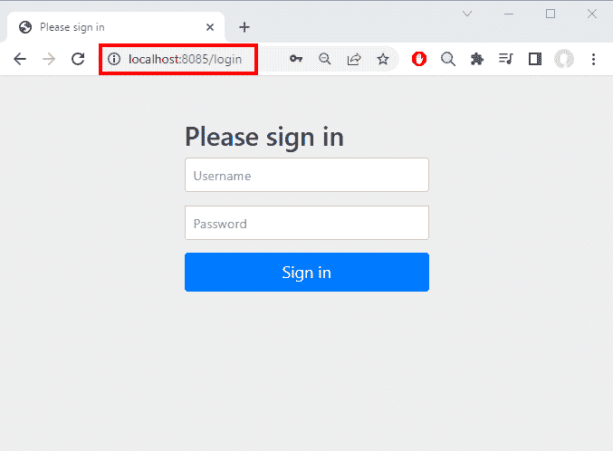
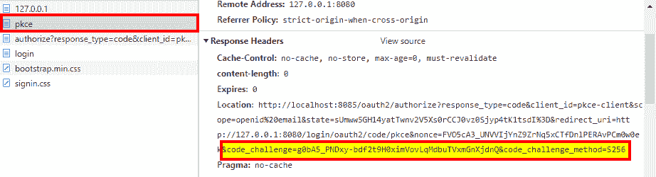

# PKCE 用 Spring Security 支持秘密客户端

> 原文：<https://web.archive.org/web/20220930061024/https://www.baeldung.com/spring-security-pkce-secret-clients>

## 1.介绍

在本教程中，我们将展示如何在 Spring Boot 机密客户端应用程序中使用 PKCE。

## 2.背景

代码交换证明密钥(Proof Key for Code Exchange，PKCE)是 OAuth 协议的扩展，最初面向公共客户端，通常是 SPA web 应用程序或移动应用程序。**它被用作授权码授权流的一部分，有助于减轻恶意第三方的某些攻击**。

这些攻击的主要媒介是当提供者已经建立了用户的身份并使用 HTTP 重定向发送授权代码时发生的步骤。根据具体情况，此授权代码可能会泄漏和/或被截获，从而允许攻击者使用它来获取有效的访问令牌。

一旦拥有这个访问令牌，攻击者就可以使用它来访问受保护的资源，并像合法所有者一样使用它。例如，如果这个访问令牌与一个银行帐户相关联，那么他们就可以访问报表、投资组合价值或其他敏感信息。

## 3.对 OAuth 的 PKCE 修改

PKCE 机制对标准授权代码流做了一些调整:

*   客户端在初始授权请求中发送两个附加参数:`code_challenge`和`code_challenge_method`
*   在最后一步中，当客户端用授权码交换访问令牌时，还有一个新参数:`code_verifier`

启用 PKCE 的客户端采取以下步骤来实现此机制:

**首先，它生成一个随机字符串作为`code_verifier`参数**。根据 [RFC 7636](https://web.archive.org/web/20221014180636/https://www.rfc-editor.org/rfc/rfc7636.html#section-4.1) ，该字符串的长度必须至少为 43 个八位字节，但少于 128 个八位字节。关键是使用一个安全的随机生成器，比如 JVM 的`SecureRandom`或者类似的。

除了长度之外，对允许的字符范围也有限制:只支持字母数字 ASCII 字符，以及一些符号。

**接下来，客户端获取生成的值，并使用支持的方法**将其转换为`code_challenge`参数。目前，规范[只提到了](https://web.archive.org/web/20221014180636/https://www.rfc-editor.org/rfc/rfc7636.html#section-4.2)两种转换方法:`plain`和`S256`。

*   `plain`只是一个无操作转换，所以转换后的值与`code_verifier`相同
*   `S256`对应于 SHA-256 哈希算法，其结果以 BASE64 编码

然后，客户端使用常规参数(`client_id`、`scope`、`state`等)构建 OAuth 授权 URL。)并将结果`code_challenge`和`code_challenge_method`相加。

### 3.1.代码挑战验证

在 OAuth 授权代码流的最后一步中，客户机发送原始的`code_verifier`值以及该流定义的常规值。然后，服务器根据挑战的方法验证`code_verifier`:

*   对于`plain`方法，`code_verifier`和挑战必须相同
*   对于`S256`方法，服务器计算提供的值的 SHA-256，并在与原始挑战进行比较之前将其编码为 BASE64。

那么，为什么 PKCE 能有效抵御授权码攻击呢？正如我们之前提到的，这些通常以授权服务器发送的重定向为目标，包含授权代码。然而，对于 PKCE，该信息不再足以完成流程，至少对于`S256 `方法是如此。**代码对令牌的交换只有在客户端提供授权代码和验证器的情况下才会发生，这在重定向中是不存在的。**

当然，当使用`plain`方法时，验证者和挑战是相同的，所以在现实应用程序中使用这种方法没有意义。

### 3.2.秘密客户的 PKCE

在 OAuth 2.0 中，PKCE 是可选的，主要用于移动和 web 应用程序。然而，即将到来的 OAuth 2.1 版本使得 PKCE 不仅对公共客户而且对秘密客户都是强制性的。

请记住，秘密客户端通常是运行在云中或本地服务器上的托管应用程序。这种客户端也使用授权代码流，但是由于最终的代码交换步骤发生在后端和授权服务器之间，因此用户代理(web 或移动)永远不会“看到”访问令牌。

除此之外，步骤与公共客户端的情况完全相同。

## 4.对 PKCE 的春季安全支持

从 Spring Security 5.7 开始，servlet 和反应式 web 应用程序都完全支持 PKCE。但是，默认情况下不启用此功能，因为并非所有身份提供者都支持此扩展。Spring Boot 应用程序必须使用 2.7 版或更高版本的框架，并依赖于标准的依赖关系管理。这确保了项目选择正确的 Spring 安全版本，以及它的可传递依赖项。

PKCE 支持住在`spring-security-oauth2-client`模块里。对于 Spring Boot 应用程序，实现这种依赖性的最简单方法是使用相应的 starter 模块:

```java
<dependency>
    <groupId>org.springframework.boot</groupId>
    <artifactId>spring-boot-starter-webflux</artifactId>
    <version>2.7.2</version>
</dependency>
<dependency>
    <groupId>org.springframework.boot</groupId>
    <artifactId>spring-boot-starter-oauth2-client</artifactId>
    <version>2.7.2</version>
</dependency> 
```

那些依赖关系的最新版本可以从 Maven Central 下载。

有了依赖关系，我们现在需要定制 OAuth 2.0 登录过程来支持 PKCE。对于反应式应用程序，这意味着添加一个应用此设置的 SecurityWebFilterChain bean:

```java
@Bean
public SecurityWebFilterChain pkceFilterChain(ServerHttpSecurity http,
  ServerOAuth2AuthorizationRequestResolver resolver) {
    http.authorizeExchange(r -> r.anyExchange().authenticated());
    http.oauth2Login(auth -> auth.authorizationRequestResolver(resolver));
    return http.build();
} 
```

**关键步骤是在登录规范中设置自定义`ServerOAuth2AuthorizationRequestResolver`。** Spring Security 使用这个接口的实现来为给定的客户端注册构建 OAuth 授权请求。

幸运的是，我们不必实现这个接口。相反，我们可以使用现成的`DefaultServerOAuth2AuthorizationRequestResolver`类，它允许我们应用进一步的定制:

```java
@Bean
public ServerOAuth2AuthorizationRequestResolver pkceResolver(ReactiveClientRegistrationRepository repo) {
    var resolver = new DefaultServerOAuth2AuthorizationRequestResolver(repo);
    resolver.setAuthorizationRequestCustomizer(OAuth2AuthorizationRequestCustomizers.withPkce());
    return resolver;
} 
```

这里，我们实例化请求解析器，传递一个`ReactiveClientRegistrationRepository`实例。然后，我们使用`OAuth2AuthorizationRequestCustomizers.withPkce(),`,它提供了将额外的 PKCE 参数添加到授权请求 URL 所需的逻辑。

## 5.测试

为了测试我们支持 PKCE 的应用程序，我们需要一个支持这个扩展的授权服务器。在本教程中，我们将使用 [Spring 授权服务器来实现这个目的](/web/20221014180636/https://www.baeldung.com/spring-security-oauth-auth-server)。这个项目是 Spring 家族的新成员，它允许我们快速构建一个 OAuth 2.1/OIDC 兼容的授权服务器。

### 5.1.授权服务器设置

在我们的实时测试环境中，授权服务器作为独立于客户端的进程运行。该项目是一个标准的 Spring Boot web 应用程序，我们已经添加了相关的 maven 依赖项:

```java
<dependency>
    <groupId>org.springframework.boot</groupId>
    <artifactId>spring-boot-starter-web</artifactId>
    <version>2.7.2</version>
</dependency>
<dependency>
    <groupId>org.springframework.security</groupId>
    <artifactId>spring-security-oauth2-authorization-server</artifactId>
    <version>0.3.1</version>
</dependency> 
```

最新版本的[启动器](https://web.archive.org/web/20221014180636/https://search.maven.org/search?q=g:org.springframework.boot%20a:spring-boot-starter-web)和 [Spring 授权服务器](https://web.archive.org/web/20221014180636/https://search.maven.org/search?q=g:org.springframework.security%20AND%20a:spring-security-oauth2-authorization-server)可以从 Maven Central 下载。

为了正常工作，授权服务器要求我们提供一些配置 beans，包括一个`RegisteredClientRepository`和一个`UserDetailsService`。出于测试目的，我们可以使用两者的内存实现，包含一组固定的测试值。对于本教程，前者更相关:

```java
@Bean 
public RegisteredClientRepository registeredClientRepository() {      
    var pkceClient = RegisteredClient
      .withId(UUID.randomUUID().toString())
      .clientId("pkce-client")
      .clientSecret("{noop}obscura")
      .clientAuthenticationMethod(ClientAuthenticationMethod.CLIENT_SECRET_BASIC)
      .authorizationGrantType(AuthorizationGrantType.AUTHORIZATION_CODE)
      .authorizationGrantType(AuthorizationGrantType.REFRESH_TOKEN)
      .authorizationGrantType(AuthorizationGrantType.CLIENT_CREDENTIALS)
      .scope(OidcScopes.OPENID)          
      .scope(OidcScopes.EMAIL)          
      .scope(OidcScopes.PROFILE)
      .clientSettings(ClientSettings.builder()
        .requireAuthorizationConsent(false)
        .requireProofKey(true)
        .build())
      .redirectUri("http://127.0.0.1:8080/login/oauth2/code/pkce")
      .build();

    return new InMemoryRegisteredClientRepository(pkceClient);
} 
```

**关键是使用`clientSettings()`方法来强制特定客户**使用 PKCE。我们通过传递一个在`requireProofKey()`设置为真的情况下创建的`ClientSettings`对象来做到这一点。

在我们的测试设置中，客户端将在与授权服务器相同的主机上运行，因此我们使用 127.0.0.1 作为重定向 URL 的主机名部分。值得注意的是，这里不允许使用“localhost ”,因此使用了等效的 IP 地址。

为了完成设置，我们还需要修改应用程序属性文件中的默认端口设置:

```java
server.port=8085
```

### 5.2.运行实时测试

现在，让我们运行一个现场测试来验证一切都按预期运行。我们可以直接从 IDE 运行这两个项目，或者打开两个 shell 窗口，对每个模块发出命令`mvn spring-boot:run`。不管用什么方法，一旦两个应用程序都启动了，我们就可以打开一个浏览器并指向`http://127.0.0.1:8080`。

我们应该会看到 Spring Security 的默认登录页面:

[](/web/20221014180636/https://www.baeldung.com/wp-content/uploads/2022/08/pkce-sign-in.png)

注意地址栏的网址:`http://localhost:8085`。**这意味着登录表单通过重定向**来自授权服务器。为了验证这一说法，我们可以在登录表单上打开 Chrome 的 DevTools(或您选择的浏览器中的等效工具),并在地址栏中重新输入初始 URL:

[](/web/20221014180636/https://www.baeldung.com/wp-content/uploads/2022/08/pkce-challenge.png)

我们可以在 Location 头中看到 PKCE 参数，这些参数出现在我们的客户端应用程序对向`http://127.0.0.1:8080/oauth2/authorization/pkce`发出的请求所生成的响应中:

```java
Location: http://localhost:8085/oauth2/authorize?
  response_type=code&
  client_id=pkce-client&
  scope=openid email&
  state=sUmww5GH14yatTwnv2V5Xs0rCCJ0vz0Sjyp4tK1tsdI=&
  redirect_uri=http://127.0.0.1:8080/login/oauth2/code/pkce&
  nonce=FVO5cA3_UNVVIjYnZ9ZrNq5xCTfDnlPERAvPCm0w0ek&
  code_challenge=g0bA5_PNDxy-bdf2t9H0ximVovLqMdbuTVxmGnXjdnQ&
  code_challenge_method=S256
```

为了完成登录序列，我们将使用“用户”和“密码”作为凭证。如果我们继续跟踪请求，我们将会看到代码验证器和访问令牌都不存在，而这正是我们的目标。

## 6.结论

在本教程中，我们展示了如何用几行代码在 Spring 安全应用程序中启用 OAuth 的 PKCE 扩展。此外，我们还展示了如何使用 Spring Authorization Server 库来创建用于测试目的的定制服务器。

像往常一样，GitHub 上的所有代码[都是可用的。](https://web.archive.org/web/20221014180636/https://github.com/eugenp/tutorials/tree/master/spring-security-modules/spring-security-pkce)