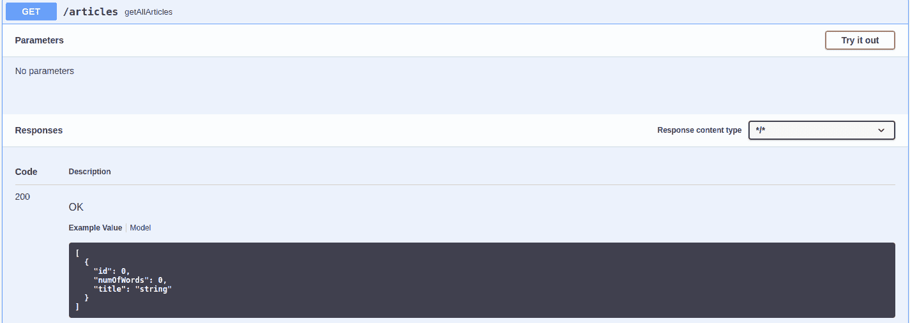
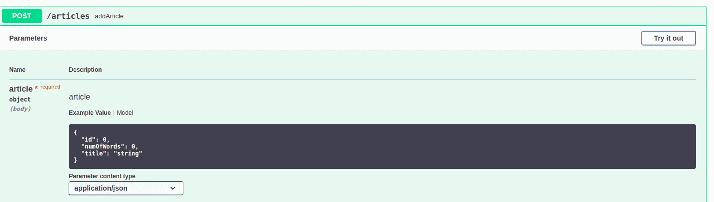
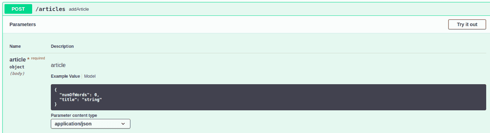
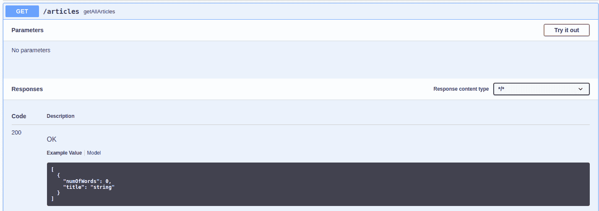
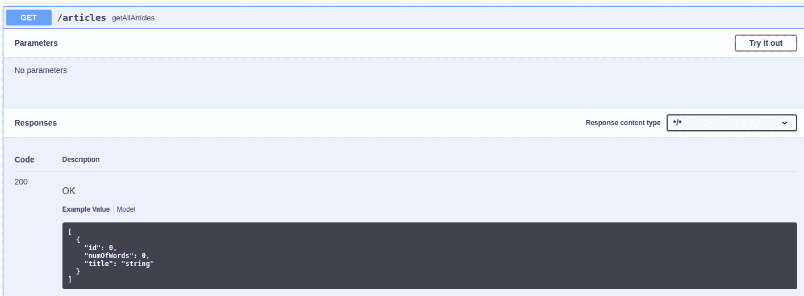
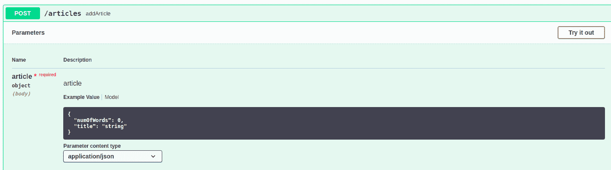
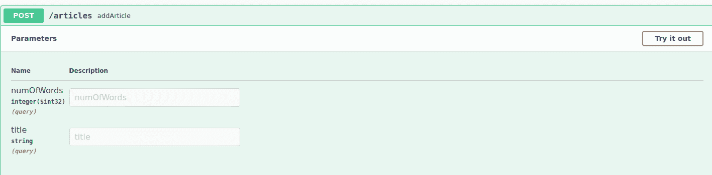
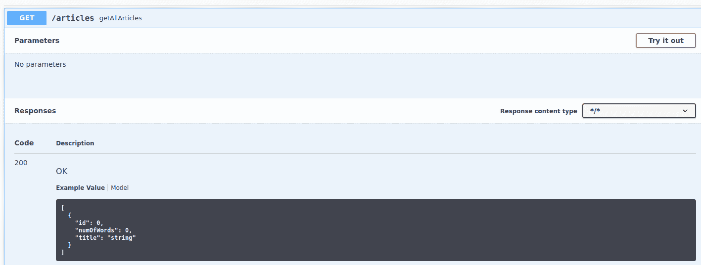

# 隐藏 Swagger API 中的请求字段

> 原文：<https://web.archive.org/web/20220930061024/https://www.baeldung.com/spring-swagger-hide-field>

## 1.概观

我们可以使用 [Swagger UI](https://web.archive.org/web/20220617075715/https://swagger.io/tools/swagger-ui/) 作为一个平台，以一种方便的方式可视化 API 接口并与之交互。这是一个功能强大的工具，只需要很少的配置就可以生成 API 结构。

在本文中，我们将重点关注如何将 [Swagger 与 Spring Boot REST API](/web/20220617075715/https://www.baeldung.com/swagger-2-documentation-for-spring-rest-api)结合使用。具体来说，我们将探索在 Swagger UI 中隐藏请求字段的不同方法。

## 2.介绍

为了简单起见，我们将创建一个基本的 Spring Boot 应用程序，并使用 Swagger UI 探索 API。

让我们使用 Spring Boot 创建一个简单的*文章应用程序*。我们使用 *ArticlesController* 来公开两个 API。使用 *GET* API，我们希望接收与所有文章相关的细节。

另一方面，我们使用 *POST* API 为一篇新文章添加细节:

```
@RestController
@RequestMapping("/articles")
public class ArticlesController {

    @Autowired
    private ArticleService articleService;

    @GetMapping("")
    public List<Article> getAllArticles() {
        return articleService.getAllArticles();
    }

    @PostMapping("")
    public void addArticle(@RequestBody Article article) {
        articleService.addArticle(article);
    }

}
```

我们将使用`Article`类作为这些 API 的数据传输对象(DTO)。现在，让我们在*文章*类中添加几个字段:

```
public class Article {

    private int id;
    private String title;
    private int numOfWords;

    // standard getters and setters

} 
```

我们可以在[http://localhost:8080/Swagger-UI/#/articles-controller](https://web.archive.org/web/20220617075715/http://localhost:8080/swagger-ui/#/articles-controller)访问 Swagger UI。让我们运行应用程序，看看上面两个 API 的默认行为:

[](/web/20220617075715/https://www.baeldung.com/wp-content/uploads/2022/04/2_BAEL-5329-Img1-e1648650028181.png) [](/web/20220617075715/https://www.baeldung.com/wp-content/uploads/2022/04/2_BAEL-5329-Img2-e1648650100457.png)

在 *POST* API 中，我们接受来自用户的所有细节——即 *id* 、*标题*和 *numOfWords* 。在 *GET* API 中，我们在响应中返回相同的字段。我们可以看到，默认情况下，两个 API 的所有字段都由 Swagger 显示。

现在，假设我们想要使用一个单独的后端逻辑来设置 *id* 字段。在这样的场景中，我们不希望用户输入与 *id* 字段相关的信息。为了避免任何混淆，我们想在 Swagger UI 中隐藏这个字段。

我们想到的一个直接选项是创建一个单独的 DTO，并在其中隐藏必需的字段。如果我们想为 dto 添加额外的逻辑，这种方法会很有帮助。如果这个选项符合我们的总体要求，我们可以选择使用它。

对于本文，让我们使用不同的注释来隐藏 Swagger UI 中的字段。

## 3.使用`@JsonIgnore`

*@JsonIgnore* 是标准的[杰克森注释](/web/20220617075715/https://www.baeldung.com/jackson-annotations)。我们可以用它来**指定一个字段在序列化和反序列化过程中被 Jackson 忽略**。我们可以将注释添加到要被忽略的字段，并且**它将隐藏指定字段的 getters 和 setter**。

让我们试一试:

```
@JsonIgnore
private int id; 
```

让我们重新运行应用程序并检查 Swagger UI:[](/web/20220617075715/https://www.baeldung.com/wp-content/uploads/2022/04/BAEL-5329-Img4.png)[](/web/20220617075715/https://www.baeldung.com/wp-content/uploads/2022/04/BAEL-5329-Img-3.png)

我们可以看到，现在, *id* 字段没有显示在 API 描述中。Swagger 还提供了注释来实现类似的行为。

## 4.使用`@ApiModelProperty`

`@ApiModelProperty` **提供与模型对象属性相关的元数据**。我们**可以使用注释的`hidden` 属性来隐藏 Swagger UI 中模型对象定义中的字段**。

让我们在`id` 字段尝试一下:

```
@ApiModelProperty(hidden = true)
private int id;
```

在上面的场景中，我们发现 *GET* 和*POST*API 的 *id* 字段都是隐藏的。假设我们希望允许用户查看 *id* 细节，作为 *GET* API 响应的一部分。在这种情况下，我们需要寻找其他选择。

Swagger 为**提供了一个可选属性，*只读*，**也是如此。我们可以用它来**在更新操作中隐藏指定的字段，但在检索操作中仍然显示它**。

让我们来检查一下:

```
@ApiModelProperty(readOnly = true)
private int id;
```

现在让我们来看看更新后的 Swagger UI:

[](/web/20220617075715/https://www.baeldung.com/wp-content/uploads/2022/04/BAEL-5329-Img5.png) [](/web/20220617075715/https://www.baeldung.com/wp-content/uploads/2022/04/BAEL-5329-Img6.png)

我们可以看到， *id* 字段现在对于 *GET* API 是可见的，但是对于 *POST* API 仍然是隐藏的——它支持*只读*操作。

**从版本 1.5.19** 起，该属性被标记为已弃用。对于更高的版本，让我们探索其他注释。

## 5.使用`@JsonProperty`

Jackson 提供了 *@JsonProperty* 注释。我们可以使用它来添加与 POJO 字段的 getter/setter 相关的元数据，这些元数据可以在对象的序列化/反序列化过程中使用。我们可以**设置注释的*访问*属性，只允许对特定字段进行*读取*操作**:

```
@JsonProperty(access = JsonProperty.Access.READ_ONLY)
private int id;
```

以这种方式，我们能够隐藏 *POST* API 模型定义的 *id* 字段，但仍然可以在`GET` API 响应中显示它。
让我们探索实现所需功能的另一种方式。

## 6.使用`@ApiParam`

`@ApiParam`也是一个 Swagger 注释，我们可以用它来指定与请求参数相关的元数据。我们**可以将`hidden`属性设置为`true`** 来隐藏任何属性。但是，我们在这里有一个限制:只有当我们使用`@ModelAttribute` 而不是`@RequestBody` 来访问请求数据时，它**才起作用。**

让我们试一试:

```
@PostMapping("")
public void addArticle(@ModelAttribute Article article) {
    articleService.addArticle(article);
} 
```

```
@ApiParam(hidden = true)
private int id;
```

让我们检查一下这种情况下的 Swagger UI 规范:

[](/web/20220617075715/https://www.baeldung.com/wp-content/uploads/2022/04/BAEL-5329-Img8.png) [](/web/20220617075715/https://www.baeldung.com/wp-content/uploads/2022/04/BAEL-5329-Img-7.png)

我们成功地隐藏了`POST` API 请求数据定义中的`id`字段。

## 7.结论

我们已经探索了在 Swagger UI 中修改模型对象属性可见性的不同选项。所讨论的注释还提供了其他几个特性，我们可以用它们来更新 Swagger 规范。我们应该根据我们的要求使用适当的方法。

GitHub 上的[提供了源代码。](https://web.archive.org/web/20220617075715/https://github.com/eugenp/tutorials/tree/master/spring-boot-modules/spring-boot-mvc-4)