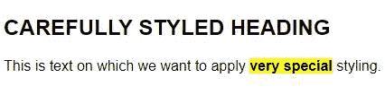

# 将 CSS 和 JS 添加到百里香叶

> 原文：<https://web.archive.org/web/20220930061024/https://www.baeldung.com/spring-thymeleaf-css-js>

## 1.介绍

在这个快速教程中，我们将学习如何在我们的[百里香](/web/20220728105348/https://www.baeldung.com/thymeleaf-in-spring-mvc)模板中使用 CSS 和 JavaScript。

首先，我们将检查预期的文件夹结构，这样我们就知道把文件放在哪里。之后，我们会看到我们需要做些什么来从一个百里香模板访问这些文件。

我们将从向页面添加 CSS 样式开始，然后继续添加一些 JavaScript 功能。

## 2.设置

为了在我们的应用程序中使用百里香叶，让我们将百里香叶的 [Spring Boot 启动器添加到我们的 Maven 配置中:](https://web.archive.org/web/20220728105348/https://search.maven.org/search?q=a:spring-boot-starter-thymeleaf%20AND%20g:org.springframework.boot)

```
<dependency>
    <groupId>org.springframework.boot</groupId>
    <artifactId>spring-boot-starter-thymeleaf</artifactId>
    <version>2.2.6.RELEASE</version>
</dependency>
```

## 3.基本示例

### 3.1.目录结构

现在，提醒一下，百里香叶是一个模板库，可以很容易地与 Spring Boot 应用程序集成。**默认情况下，百里香希望我们将这些模板放在`src/main/resources/templates`文件夹中。**我们可以创建子文件夹，所以在本例中我们将使用名为`cssandjs`的子文件夹。

**对于 CSS 和 JavaScript 文件，默认目录是`src/main/resources/static`。**让我们分别为 CSS 和 JS 文件创建`static/styles/cssandjs`和`static/js/cssandjs`文件夹。

### 3.2.添加 CSS

让我们在`static/styles/cssandjs`文件夹中创建一个名为`main.css`的简单 CSS 文件，并定义一些基本样式:

```
h2 {
    font-family: sans-serif;
    font-size: 1.5em;
    text-transform: uppercase;
}

strong {
    font-weight: 700;
    background-color: yellow;
}

p {
    font-family: sans-serif;
}
```

接下来，让我们在`templates/cssandjs`文件夹中创建一个名为`styledPage.html` 的百里香模板来使用这些样式:

```
<!DOCTYPE html>
<html xmlns:th="http://www.thymeleaf.org">
<head>
    <meta charset="UTF-8">
    <title>Add CSS and JS to Thymeleaf</title>
    <link th:href="@{/styles/cssandjs/main.css}" rel="stylesheet" />
</head>
<body>
    <h2>Carefully Styled Heading</h2>
    <p>
        This is text on which we want to apply <strong>very special</strong> styling.
    </p>
</body>
</html>
```

我们使用带有百里香特殊属性的 link 标签加载样式表。如果我们使用了预期的目录结构，我们只需要在`src/main/resources/static`下面指定路径。在这种情况下，那就是`/styles/cssandjs/main.css`。`@{/styles/cssandjs/main.css}`语法是百里香链接 URL 的方式。

如果我们运行我们的应用程序，我们将看到我们的样式已经被应用:

[](/web/20220728105348/https://www.baeldung.com/wp-content/uploads/2020/04/BAEL-3827-styled.jpg)

3.3.使用 JavaScript

接下来，我们将学习如何添加一个 JavaScript 文件到我们的百里香页面。

让我们从向`src/main/resources/static/js/cssandjs/actions.js`中的文件添加一些 JavaScript 开始:

```
function showAlert() {
    alert("The button was clicked!");
}
```

然后我们跳回百里香模板，添加一个指向 JavaScript 文件的`<script>`标签:

```
<script type="text/javascript" th:src="@{/js/cssandjs/actions.js}"></script>
```

现在，我们从模板调用我们的方法:

```
<button type="button" th:onclick="showAlert()">Show Alert</button>
```

当我们运行我们的应用程序并点击`Show Alert`按钮时，我们将看到警告窗口。

在我们结束之前，让我们通过学习如何在我们的 JavaScript 中使用来自 Spring 控制器的数据来稍微构建一下这个例子。

让我们首先修改控制器，为页面提供一个名称:

```
@GetMapping("/styled-page")
public String getStyledPage(Model model) {
    model.addAttribute("name", "Baeldung Reader");
    return "cssandjs/styledPage";
}
```

接下来，让我们向我们的`actions.js`文件添加一个函数，以便在警报中使用这个名称:

```
function showName(name) {
    alert("Here's the name: " + name);
}
```

最后，为了用来自控制器的数据调用我们的函数，我们需要使用[脚本内联](/web/20220728105348/https://www.baeldung.com/spring-mvc-model-objects-js)。因此，让我们将`name`值放在一个本地 JavaScript 变量中:

```
<script th:inline="javascript">
    var nameJs = /*[[${name}]]*/;
</script>
```

通过这样做，我们已经创建了一个本地 JavaScript 变量，该变量包含来自控件的`name`模型值，我们可以在页面其余部分的 JavaScript 中使用该值。

现在我们已经完成了，我们可以使用`nameJs`变量调用我们的 JavaScript 函数:

```
<button type="button" th:onclick="showName(nameJs);">Show Name</button>
```

## 4.结论

在这个简短的教程中，我们学习了如何将 CSS 样式和外部 JavaScript 功能应用于我们的百里香页面。我们从推荐的目录结构开始，用 Spring 控制器类中提供的数据调用 JavaScript。

和往常一样，代码可以在 GitHub 的[上获得。](https://web.archive.org/web/20220728105348/https://github.com/eugenp/tutorials/tree/master/spring-web-modules/spring-thymeleaf-3)