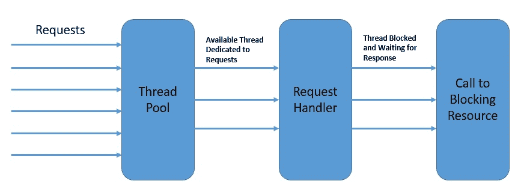
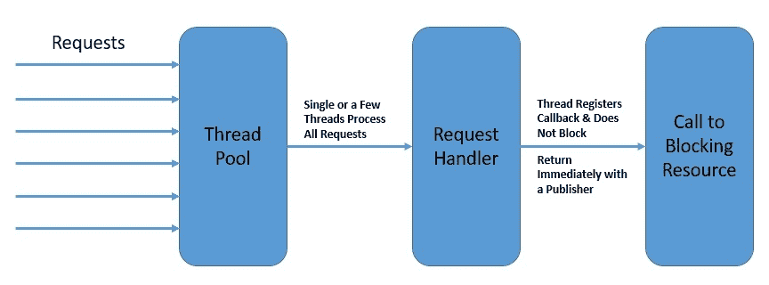
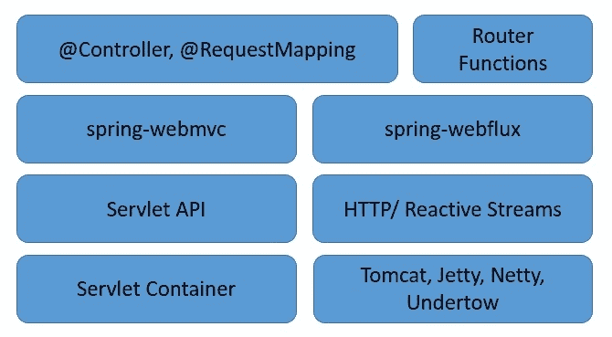
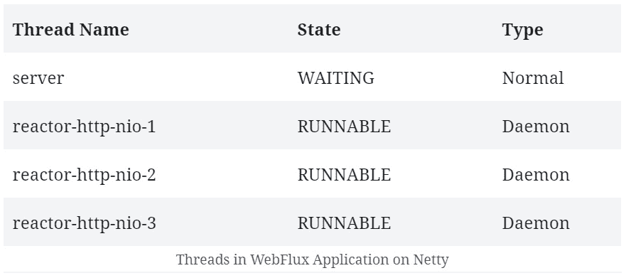
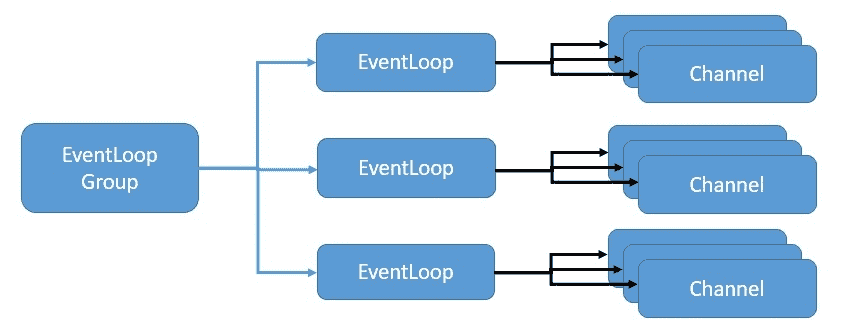
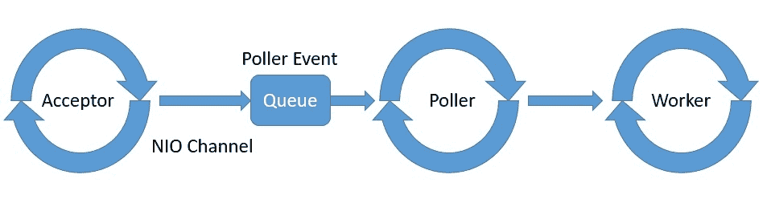
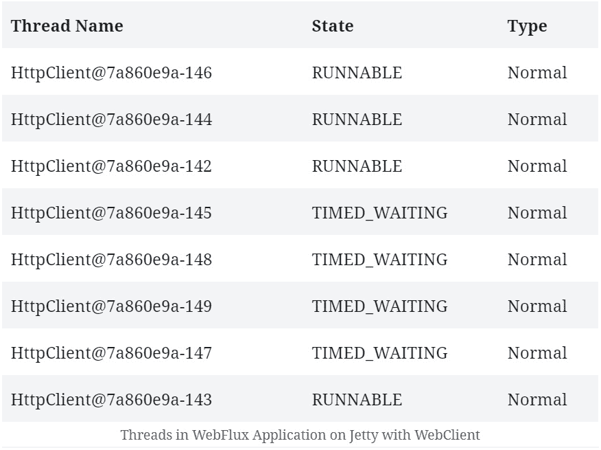
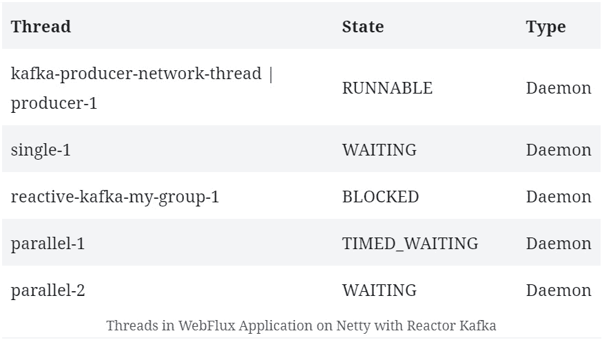
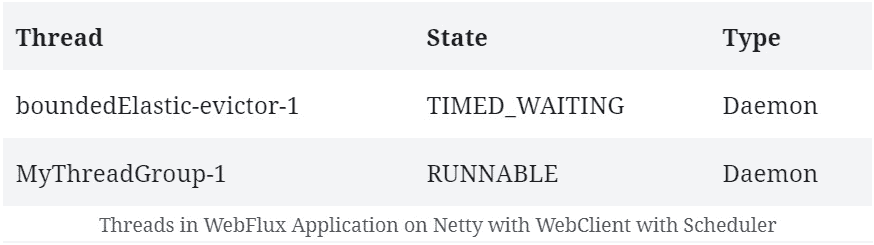
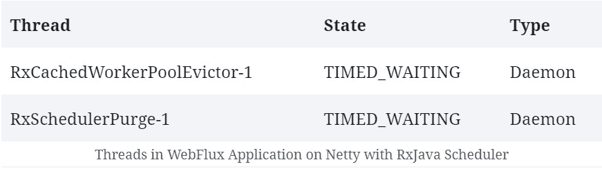

# Spring WebFlux 中的并发性

> 原文：<https://web.archive.org/web/20220930061024/https://www.baeldung.com/spring-webflux-concurrency>

## 1.介绍

在本教程中，我们将探索用 [Spring WebFlux](https://web.archive.org/web/20220617075720/https://docs.spring.io/spring/docs/current/spring-framework-reference/web-reactive.html) 编写的反应式程序中的并发性。

我们将从讨论与反应式编程相关的并发性开始。之后，我们将探索 Spring WebFlux 如何在不同的反应式服务器库上提供并发抽象。

## 2.反应式编程的动机

一个典型的 **web 应用程序包含几个复杂的、相互作用的部分**。**这些交互中有许多本质上是阻塞的**，例如，那些涉及获取或更新数据的数据库调用。**然而，其他几个是独立的，可以同时执行，**可能是并行的。

**例如，两个用户对一个 web 服务器的请求可以由不同的线程处理。**在`multi-core` 平台上，这在总体响应时间方面具有明显的优势。因此，**这种并发模式被称为 `thread-per-request model`** :

[](/web/20220617075720/https://www.baeldung.com/wp-content/uploads/2020/08/Thread-per-Request-Model.jpg)

在上图中，每个线程一次处理一个请求。

虽然基于线程的并发为我们解决了一部分问题，但它并没有解决这样一个事实，即**我们在单个线程中的大多数交互仍然阻塞着**。此外，我们在 Java 中用来实现并发性的本机线程在上下文切换方面付出了巨大的代价。

与此同时，随着 web 应用程序面临越来越多的请求，**`thread-per-request model`开始低于预期**。

因此，**我们需要的是一个并发模型，它可以帮助我们用相对较少的线程数量处理越来越多的请求**。**这是采用[反应式编程](/web/20220617075720/https://www.baeldung.com/java-reactive-systems)的主要动机之一。**

## 3.反应式编程中的并发性

**反应式编程帮助我们根据数据流和通过它们的变化传播来构建程序**。因此，在一个完全非阻塞的环境中，这可以使我们实现更高的并发性和更好的资源利用率。

然而，反应式编程是否完全背离了基于线程的并发？虽然这是一个强有力的声明，但**反应式编程肯定有一个非常不同的方法来使用线程实现并发**。因此，**反应式编程带来的根本区别是异步性。**

换句话说，程序流从一系列同步操作转换成异步事件流。

例如，在反应式模型下，在获取数据时，对数据库的读调用不会阻塞调用线程。**调用立即返回一个其他人可以订阅**的发布者。订户可以在事件发生后对其进行处理，甚至可以自己进一步生成事件:

[](/web/20220617075720/https://www.baeldung.com/wp-content/uploads/2020/08/Reactive-Model.jpg)

最重要的是，反应式编程并不强调应该生成和使用哪些线程事件。更确切地说，重点是将程序构建成一个异步事件流。

这里的发布者和订阅者不需要属于同一个线程。这有助于我们更好地利用可用线程，从而提高整体并发性。

## 4.事件循环

有几种编程模型描述了一种反应式的并发方法。

在本节中，我们将研究其中的一些，以理解反应式编程如何用更少的线程实现更高的并发性。

**服务器的一个这样的反应式异步编程模型是`event loop` `model`** :

[](/web/20220617075720/https://www.baeldung.com/wp-content/uploads/2020/08/Event-Loop.jpg)

上图是一个`event loop` 的抽象设计，展示了反应式异步编程的思想:

*   **`event loop`在单线程**中持续运行，尽管我们可以拥有与可用内核数量一样多的 `event loops`
*   **`event loop`依次处理来自`event queue`的事件，并在`platform`注册`callback`后立即返回**
*   `platform`可以触发数据库调用或外部服务调用等操作的完成
*   **`event loop`可以触发`operation completion`通知上的`callback`，并将结果返回给原呼叫者**

`event loop` `model`在多个平台实现，包括`[Node.js](https://web.archive.org/web/20220617075720/https://nodejs.org/en/)`、`[Netty](https://web.archive.org/web/20220617075720/https://netty.io/)`、`[Ngnix](https://web.archive.org/web/20220617075720/https://www.nginx.com/)`。它们提供了比传统平台`[Apache HTTP Server](https://web.archive.org/web/20220617075720/https://httpd.apache.org/)`、`[Tomcat](/web/20220617075720/https://www.baeldung.com/tomcat)`或`[JBoss](https://web.archive.org/web/20220617075720/https://www.redhat.com/fr/technologies/jboss-middleware/application-platform)`更好的可伸缩性。

## 5.用 Spring WebFlux 进行反应式编程

现在，我们对反应式编程及其并发模型有了足够的了解，可以在 Spring WebFlux 中探索这个主题。

**WebFlux 是** ****Spring** **的** **reactive-stack web 框架**，是 5.0 版本新增的。**

 **让我们探索 Spring WebFlux 的服务器端堆栈，以了解它如何补充 Spring 中的传统 web 堆栈:

[](/web/20220617075720/https://www.baeldung.com/wp-content/uploads/2020/08/Spring-Web-Stack.jpg)

正如我们所见， **Spring WebFlux 与 Spring 中的传统 web 框架并行，并不一定要取代它**。

这里有几个要点需要注意:

*   Spring WebFlux 用函数路由扩展了传统的基于注释的编程模型
*   此外，它使底层 HTTP 运行时适应于`Reactive Streams API`,使运行时具有互操作性
*   因此，它能够支持各种各样的反应式运行时，包括 Servlet 3.1+容器，如 Tomcat、Reactor、Netty 或[under flow](/web/20220617075720/https://www.baeldung.com/jboss-undertow)
*   最后，它包括`WebClient`，一个针对 HTTP 请求的反应式非阻塞客户端，提供功能性和流畅的 API

## 6.支持的运行时中的线程模型

正如我们之前讨论过的，**反应式程序倾向于只使用几个线程**并充分利用它们。然而，线程的数量和性质取决于我们选择的实际反应流 API 运行时。

为了澄清， **Spring WebFlux 可以通过`HttpHandler`** 提供的一个通用 API 来适应不同的运行时。这个 API 是一个简单的契约，只有一个方法提供不同服务器 API 的抽象，如 Reactor Netty、Servlet 3.1 API 或 Undertow APIs。

现在让我们来了解一下其中几个实现的线程模型。

**虽然 Netty 是 WebFlux 应用程序中的默认服务器，但只需声明正确的依赖关系即可切换到任何其他支持的服务器**:

```java
<dependency>
    <groupId>org.springframework.boot</groupId>
    <artifactId>spring-boot-starter-webflux</artifactId>
    <exclusions>
        <exclusion>
            <groupId>org.springframework.boot</groupId>
            <artifactId>spring-boot-starter-reactor-netty</artifactId>
        </exclusion>
    </exclusions>
</dependency>
<dependency>
    <groupId>org.springframework.boot</groupId>
    <artifactId>spring-boot-starter-tomcat</artifactId>
</dependency>
```

虽然可以用多种方式观察 Java 虚拟机中创建的线程，但是从`Thread`类本身中提取它们是非常容易的:

```java
Thread.getAllStackTraces()
  .keySet()
  .stream()
  .collect(Collectors.toList());
```

### 6.1.反应器网状结构

正如我们所说的， [Reactor Netty](https://web.archive.org/web/20220617075720/https://netty.io/) 是 Spring Boot WebFlux starter 中默认的嵌入式服务器。让我们来看看 Netty 默认创建的线程。因此，在开始时，我们不会添加任何其他依赖项或使用 WebClient。因此，如果我们启动一个使用 SpringBoot starter 创建的 Spring WebFlux 应用程序，我们可以看到它创建的一些默认线程:

[](/web/20220617075720/https://www.baeldung.com/wp-content/uploads/2020/08/1.jpg)

请注意，除了服务器的一个正常线程之外， **Netty 还产生了一堆用于请求处理的工作线程**。**这些通常不超过可用的 CPU 核心。**这是四核机器上的输出。我们还会看到 JVM 环境中常见的一些内务线程，但它们在这里并不重要。

Netty 使用事件循环模型，以反应式异步方式提供高度可扩展的并发性。让我们看看 Netty 如何实现一个事件循环**利用 Java NIO 来提供这种可伸缩性**:

[](/web/20220617075720/https://www.baeldung.com/wp-content/uploads/2020/08/Netty-Threading-Model.jpg)

这里， **`EventLoopGroup` 管理一个或多个`EventLoop`，这些`EventLoop`必须连续运行**。因此，**不建议创建超过可用内核数量的`EventLoops`。**

`EventLoopGroup` 进一步为每个新创建的`Channel`分配一个`EventLoop` 。因此，在`Channel`的生命周期中，所有操作都由同一个线程执行。

### 6.2.阿帕奇雄猫

传统的 Servlet 容器也支持 Spring WebFlux，比如 Apache Tomcat T2。

**WebFlux 依赖于具有非阻塞 I/O 的 Servlet 3.1 API**。虽然它在低级适配器后面使用 Servlet API，但是 Servlet API 不能直接使用。

让我们看看在 Tomcat 上运行的 WebFlux 应用程序中我们期望什么样的线程:

[](/web/20220617075720/https://www.baeldung.com/wp-content/uploads/2020/08/2-841x1024-1.jpg)

我们在这里看到的线的数量和类型与我们先前观察到的完全不同。

首先， **Tomcat 从更多的工作线程开始，默认为十个**。当然，我们还会看到一些 JVM 和 Catalina 容器特有的内务线程，在本次讨论中我们可以忽略它们。

让我们来理解 Tomcat 与 Java NIO 的架构，以便将它与我们上面看到的线程联系起来。

Tomcat 5 以后在其连接器组件中支持 NIO，它主要负责接收请求。

另一个 Tomcat 组件是容器组件，它负责容器管理功能。

这里我们感兴趣的是连接器组件为支持 NIO 而实现的线程模型。它由`Acceptor`、`Poller,` 和`Worker` 组成，是`NioEndpoint`模块的一部分；

[](/web/20220617075720/https://www.baeldung.com/wp-content/uploads/2020/08/Tomcat-NIO-Connector.jpg)

**Tomcat 为`Acceptor`、`Poller`和`Worker`生成一个或多个线程，通常有一个线程池专用于`Worker`、T5。**

虽然关于 Tomcat 架构的详细讨论超出了本教程的范围，但是我们现在应该有足够的洞察力来理解我们前面看到的线程。

## 7.`WebClient`中的线程模型

**[`WebClient`](/web/20220617075720/https://www.baeldung.com/spring-5-webclient)** 是**作为 Spring WebFlux** 一部分的反应式 HTTP 客户端。我们可以在任何需要基于 REST 的通信的时候使用它，这使我们能够创建`end-to-end` `reactive`的应用程序。

正如我们之前看到的，反应式应用程序只使用几个线程，因此，应用程序的任何部分都没有阻塞线程的余地。因此，`WebClient`在帮助我们实现 WebFlux 的潜力方面起着至关重要的作用。

### 7.1.使用`WebClient`

使用`WebClient`也很简单。我们不需要包含任何特定的依赖项，因为它是 Spring WebFlux 的一部分。

让我们创建一个简单的 REST 端点，它返回一个 [`Mono`](/web/20220617075720/https://www.baeldung.com/java-string-from-mono) :

```java
@GetMapping("/index")
public Mono<String> getIndex() {
    return Mono.just("Hello World!");
}
```

然后，我们将使用`WebClient`来调用这个 REST 端点，并被动地使用数据:

```java
WebClient.create("http://localhost:8080/index").get()
  .retrieve()
  .bodyToMono(String.class)
  .doOnNext(s -> printThreads());
```

这里，我们还打印了使用前面讨论的方法创建的线程。

### 7.2.了解线程模型

那么，线程模型在`WebClient`的情况下是如何工作的呢？

嗯，毫不奇怪， **`WebClient`也使用`event loop model`** 实现了并发。当然，它依赖底层运行时来提供必要的基础设施。

**如果我们在反应器 Netty 上运行`WebClient`，它将共享 Netty 为服务器**使用的事件循环。因此，在这种情况下，我们可能不会注意到创建的线程有太大的不同。

然而， **`WebClient`在像 Jetty 这样的 Servlet 3.1+容器上也受支持，但是它在那里的工作方式与**不同。

如果我们比较运行 [Jetty](https://web.archive.org/web/20220617075720/https://www.eclipse.org/jetty/) 和不运行`WebClient`的 WebFlux 应用程序上创建的线程，我们会注意到一些额外的线程。

这里，`WebClient`要创建它的`event loop`。因此，我们可以看到这个事件循环创建了固定数量的处理线程:

[](/web/20220617075720/https://www.baeldung.com/wp-content/uploads/2020/08/3.jpg)

**在某些情况下，** **为客户端和服务器拥有单独的线程池可以提供更好的性能**。虽然这不是 Netty 的默认行为，但是如果需要的话，总是可以为`WebClient`声明一个专用的线程池。

我们将在后面的章节中看到这是如何实现的。

## 8.数据访问库中的线程模型

正如我们前面所看到的，即使是一个简单的应用程序通常也由几个需要连接的部分组成。

这些部分的典型例子包括数据库和消息代理。与许多图书馆连接的现有图书馆仍处于封闭状态，但这种情况正在迅速改变。

**现在有几个数据库提供了用于连接的反应库**。**这些库中的许多都可以在 [Spring Data](/web/20220617075720/https://www.baeldung.com/spring-data)** 中获得，同时我们也可以直接使用其他库。

我们对这些库使用的线程模型特别感兴趣。

### 8.1.Spring 数据 MongoDB

[Spring Data MongoDB](/web/20220617075720/https://www.baeldung.com/spring-data-mongodb-tutorial) 为构建在 [MongoDB 反应流驱动](https://web.archive.org/web/20220617075720/https://mongodb.github.io/mongo-java-driver/)之上的 MongoDB 提供反应库支持。最值得注意的是，这个驱动程序**完全实现了 Reactive Streams API 来提供与`non-blocking back-pressure`的异步流处理**。

在 Spring Boot 应用程序中设置对 MongoDB 反应式存储库的支持就像添加一个依赖项一样简单:

```java
<dependency>
    <groupId>org.springframework.boot</groupId>
    <artifactId>spring-boot-starter-data-mongodb-reactive</artifactId>
</dependency>
```

这将允许我们创建一个存储库，并使用它以非阻塞的方式在 MongoDB 上执行一些基本操作:

```java
public interface PersonRepository extends ReactiveMongoRepository<Person, ObjectId> {
}
.....
personRepository.findAll().doOnComplete(this::printThreads);
```

那么，当我们在 Netty 服务器上运行这个应用程序时，我们会看到什么样的线程呢？

嗯，毫不奇怪，我们不会看到太大的区别，因为****Spring Data reactive repository 使用服务器可用的相同事件循环。****

 **### 8.2.卡夫卡反应堆

Spring 仍在为反应式 Kafka 构建成熟的支持。然而，除了春天，我们还有其他选择。

**[反应器 Kafka](https://web.archive.org/web/20220617075720/https://projectreactor.io/docs/kafka/release/reference/#_introduction) 是 Kafka 基于反应器**的一个反应式 API。Reactor Kafka 支持使用功能 API 发布和消费消息，也支持使用`non-blocking back-pressure`。

首先，我们需要在应用程序中添加所需的依赖项，以便开始使用 Reactor Kafka:

```java
<dependency>
    <groupId>io.projectreactor.kafka</groupId>
    <artifactId>reactor-kafka</artifactId>
    <version>1.3.10</version>
</dependency>
```

这应该使我们能够以非阻塞的方式向卡夫卡传达信息:

```java
// producerProps: Map of Standard Kafka Producer Configurations
SenderOptions<Integer, String> senderOptions = SenderOptions.create(producerProps);
KafkaSender<Integer, String> sender =  KafkaSender.create(senderOptions);
Flux<SenderRecord<Integer, String, Integer>> outboundFlux = Flux
  .range(1, 10)
  .map(i -> SenderRecord.create(new ProducerRecord<>("reactive-test", i, "Message_" + i), i));
sender.send(outboundFlux).subscribe();
```

类似地，我们也应该能够以一种非阻塞的方式消费来自卡夫卡的信息:

```java
// consumerProps: Map of Standard Kafka Consumer Configurations
ReceiverOptions<Integer, String> receiverOptions = ReceiverOptions.create(consumerProps);
receiverOptions.subscription(Collections.singleton("reactive-test"));
KafkaReceiver<Integer, String> receiver = KafkaReceiver.create(receiverOptions);
Flux<ReceiverRecord<Integer, String>> inboundFlux = receiver.receive();
inboundFlux.doOnComplete(this::printThreads)
```

这非常简单，不言自明。

我们在卡夫卡中订阅了一个主题`reactive-test`,并收到了一条`Flux` 消息。

对我们来说，**有趣的事情是创建的线程**:

[](/web/20220617075720/https://www.baeldung.com/wp-content/uploads/2020/08/4.jpg)

**我们可以看到 Netty 服务器**的一些非典型线程。

这表明 Reactor Kafka 管理它自己的线程池，有几个工作线程，专门参与 Kafka 消息处理。当然，我们会看到一堆与 Netty 和 JVM 相关的线程，我们可以忽略它们。

**Kafka 生产者使用单独的网络线程向代理发送请求。**此外，他们在`single-threaded pooled scheduler`对申请做出回应。

另一方面，Kafka consumer 的每个用户群都有一个线程——该线程阻止侦听传入的消息。然后，传入的消息被安排在不同的线程池上进行处理。

## 9.WebFlux 中的计划选项

到目前为止，我们已经看到**反应式编程在一个只有几个线程**的完全非阻塞的环境中大放异彩。但是，这也意味着，如果确实有一部分发生阻塞，将会导致更差的性能。这是因为阻塞操作可以完全冻结事件循环。

那么，**在反应式编程中，我们如何处理长时间运行的进程或者阻塞操作呢？**

老实说，最好的选择就是避开他们。然而，这并不总是可能的，我们可能需要一个专用的调度策略来调度我们应用程序的那些部分。

Spring WebFlux **提供了一种将处理切换到数据流链**之间的不同线程池的机制。这可以为我们提供对特定任务所需的调度策略的精确控制。当然，`WebFlux`能够基于底层反应库中可用的线程池抽象(称为调度器)来提供这一点。

### 9.1.反应堆

在[反应器](https://web.archive.org/web/20220617075720/https://projectreactor.io/)中， **`Scheduler`类定义了执行模型以及在哪里执行**。

`[Schedulers](https://web.archive.org/web/20220617075720/https://projectreactor.io/docs/core/release/api/reactor/core/scheduler/Schedulers.html)`类提供了许多执行上下文，如`immediate`、`single`、`elastic`和`parallel`。

这些提供了不同类型的线程池，可用于不同的作业。而且，我们总是可以用预先存在的 [`ExecutorService`](https://web.archive.org/web/20220617075720/https://docs.oracle.com/en/java/javase/11/docs/api/java.base/java/util/concurrent/ExecutorService.html) 来创建自己的 [`Scheduler`](https://web.archive.org/web/20220617075720/https://projectreactor.io/docs/core/release/api/reactor/core/scheduler/Scheduler.html) 。

在`Schedulers` 给我们几个执行上下文的同时，Reactor **也给我们提供了切换执行上下文**的不同方式。它们是方法`publishOn` 和`subscribeOn`。

我们可以在链中的任何地方将`publishOn` 与`Scheduler` 一起使用，而`Scheduler`会影响所有后续的操作符。

虽然我们也可以在链中的任何地方将`subscribeOn` 与`Scheduler` 一起使用，但它只会影响排放源的上下文。

如果我们回想一下，Netty 上的`WebClient`共享为服务器创建的相同的 `event loop`作为默认行为。然而，我们可能有充分的理由为 WebClient 创建一个专用的线程池。

让我们看看如何在 Reactor 中实现这一点，Reactor 是 WebFlux 中的默认反应库:

```java
Scheduler scheduler = Schedulers.newBoundedElastic(5, 10, "MyThreadGroup");

WebClient.create("http://localhost:8080/index").get()
  .retrieve()
  .bodyToMono(String.class)
  .publishOn(scheduler)
  .doOnNext(s -> printThreads());
```

早些时候，我们没有观察到 Netty 上创建的线程在有或没有`WebClient`的情况下有任何差异。然而，如果我们现在运行上面的代码，**我们会观察到一些新线程被创建**:

[](/web/20220617075720/https://www.baeldung.com/wp-content/uploads/2020/08/5.jpg)

在这里，**我们可以看到作为我们`bounded elastic thread pool`** 的一部分创建的线程。来自`WebClient`的响应一旦被订阅就在这里发布。

这使得主线程池可以处理服务器请求。

### 9.2\. RxJava

RxJava 中的**默认行为与反应器**没有太大的不同。

`Observable`以及我们在其上应用的操作符链在调用订阅的同一个线程上完成它们的工作——并通知观察者。另外， [RxJava](https://web.archive.org/web/20220617075720/https://github.com/ReactiveX/RxJava) 和 Reactor 一样，提供了在链中引入前缀或定制调度策略的方法。

RxJava 还**提供了一个类`[Schedulers](https://web.archive.org/web/20220617075720/http://reactivex.io/RxJava/javadoc/io/reactivex/schedulers/Schedulers.html),` ，它为 [`Observable`](https://web.archive.org/web/20220617075720/http://reactivex.io/RxJava/javadoc/io/reactivex/Observable.html) 链**提供了许多执行模型。这些包括`new thread`、`immediate`、`trampoline`、`io`、`computation`和`test`。当然，它也允许我们从一个 Java [`Executor`](https://web.archive.org/web/20220617075720/https://docs.oracle.com/en/java/javase/11/docs/api/java.base/java/util/concurrent/Executor.html) 定义一个`[Scheduler](https://web.archive.org/web/20220617075720/http://reactivex.io/documentation/scheduler.html)` 。

而且，RxJava 还**提供了两个扩展方法来实现这个**、`subscribeOn`和 `observeOn`。

`subscribeOn` 方法通过指定一个不同的`Scheduler`来改变默认行为，在这个不同的`Scheduler`上`Observable` 应该操作。

另一方面，`observeOn` 方法指定了一个不同的调度器，`Observable`可以用它来向观察者发送通知。

正如我们之前讨论过的，Spring WebFlux 默认使用 Reactor 作为其反应库。但是，因为它与 Reactive Streams API 完全兼容，所以**可以切换到另一个 Reactive Streams 实现，如 RxJava** (对于带有 Reactive Streams 适配器的 RxJava 1.x)。

我们需要显式地添加依赖关系:

```java
<dependency>
    <groupId>io.reactivex.rxjava2</groupId>
    <artifactId>rxjava</artifactId>
    <version>2.2.21</version>
</dependency>
```

然后，我们可以开始在应用程序中使用 RxJava 类型，如`Observable` 以及 RxJava 特有的`Schedulers`:

```java
io.reactivex.Observable
  .fromIterable(Arrays.asList("Tom", "Sawyer"))
  .map(s -> s.toUpperCase())
  .observeOn(io.reactivex.schedulers.Schedulers.trampoline())
  .doOnComplete(this::printThreads);
```

因此，如果我们运行这个应用程序，除了常规的 Netty 和 JVM 相关线程**之外，我们应该看到一些与我们的 RxJava `Scheduler`** 相关的线程:

[](/web/20220617075720/https://www.baeldung.com/wp-content/uploads/2020/08/6.jpg)

## 10.结论

在本文中，我们从并发性的角度探讨了反应式编程的前提。

我们观察了传统和反应式编程中并发模型的差异。这使我们能够检查 Spring WebFlux 中的并发模型，以及它采用线程模型来实现它。

此外，我们结合不同的 HTTP 运行时和反应库，探索了 WebFlux 中的线程模型。

我们还讨论了使用`WebClient`或数据访问库时线程模型的不同。

最后，我们谈到了在 WebFlux 的反应式程序中控制调度策略的选项。

和往常一样，这篇文章的源代码可以在 GitHub 上找到[。](https://web.archive.org/web/20220617075720/https://github.com/eugenp/tutorials/tree/master/spring-reactive)****