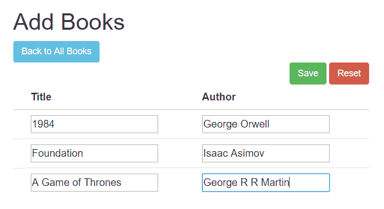

# 用百里香叶装订清单

> 原文：<https://web.archive.org/web/20220930061024/https://www.baeldung.com/thymeleaf-list>

## 1。概述

在这个快速教程中，我们将向**展示如何在百里香叶**中绑定`List`对象。

要了解如何将百里香与 Spring 集成，您可以在这里查看我们的主要 Spring 文章——在这里您还可以了解如何显示字段、接受输入、显示验证错误或转换数据以供显示。

## 2。百里香示例中的列表

我们将首先展示**如何在百里香页面中显示`List`的元素，以及如何在百里香表单**中绑定作为用户输入的对象列表。

为此，我们将使用以下代码所示的简单模型:

```java
public class Book {
    private long id;

    private String title;

    private String author;

    // getters and setters
}
```

在我们的示例中，除了显示现有的书籍，我们还将使用户能够向集合中添加多本书，并同时编辑所有现有的书籍。

## 3。显示列表元素

让我们来看看下面这个返回`allBooks`页面的`Controller`方法:

```java
@GetMapping("/all")
public String showAll(Model model) {
    model.addAttribute("books", bookService.findAll());
    return "books/allBooks";
}
```

这里，我们添加了`Book`对象的`List`作为发送到视图的模型属性，我们将使用 HTML 表显示它:

```java
<table>
    <thead>
        <tr>
            <th> Title </th>
            <th> Author </th>
        </tr>
    </thead>
    <tbody>
	<tr th:if="${books.empty}">
            <td colspan="2"> No Books Available </td>
        </tr>
        <tr th:each="book : ${books}">
            <td><span th:text="${book.title}"> Title </span></td>
            <td><span th:text="${book.author}"> Author </span></td>
        </tr>
    </tbody>
</table>
```

这里，**我们使用`th:each`属性来遍历列表**并显示其中每个对象的属性。

## 4。使用选择表达式绑定列表

要通过表单提交将对象列表从视图发送到控制器，我们不能使用`List`对象本身。

相反，**我们必须添加一个包装器对象来保存提交的列表:**

```java
public class BooksCreationDto {
    private List<Book> books;

    // default and parameterized constructor

    public void addBook(Book book) {
        this.books.add(book);
    }

    // getter and setter
}
```

现在让我们允许用户在一次表单提交中添加三本书。

首先，我们将准备表单页面，将我们的命令对象作为一个`Model`属性传递:

```java
@GetMapping("/create")
public String showCreateForm(Model model) {
    BooksCreationDto booksForm = new BooksCreationDto();

    for (int i = 1; i <= 3; i++) {
        booksForm.addBook(new Book());
    }

    model.addAttribute("form", booksForm);
    return "books/createBooksForm";
}
```

正如我们所看到的，我们通过包装类向视图传递了一个包含 3 个空`Book`对象的列表。

接下来，我们需要将表单添加到百里香页面:

```java
<form action="#" th:action="@{/books/save}" th:object="${form}"
  method="post">
    <fieldset>
        <input type="submit" id="submitButton" th:value="Save">
        <input type="reset" id="resetButton" name="reset" th:value="Reset"/>
        <table>
            <thead>
                <tr>
                    <th> Title</th>
                    <th> Author</th>
                </tr>
            </thead>
            <tbody>
                <tr th:each="book, itemStat : *{books}">
                    <td><input th:field="*{books[__${itemStat.index}__].title}" /></td>
                    <td><input th:field="*{books[__${itemStat.index}__].author}" /></td>
                </tr>
            </tbody>
        </table>
    </fieldset>
</form>
```

这是上面页面的样子:



让我们仔细看看我们在这里做了什么。首先，**我们使用`th:object=”${form}”`来指定命令对象**(我们作为`Model`属性传递的对象)。

下一件值得注意的事情是，我们使用选择表达式来访问列表:

```java
<tr th:each="book, itemStat : *{books}">
```

最后，**我们使用`th:field.`** 将输入映射为列表元素的属性

然而，我们还需要使用`itemStat` 变量来定义我们引用的列表元素，如:

```java
th:field="*{books[__${itemStat.index}__].title}"
```

最后一步实际上是在后端操作提交的数据。我们将在控制器的`@PostMapping`方法中使用命令对象作为`@ModelAttribute`，保存检索到的图书列表，并将所有现有图书返回给用户:

```java
@PostMapping("/save")
public String saveBooks(@ModelAttribute BooksCreationDto form, Model model) {
    bookService.saveAll(form.getBooks());

    model.addAttribute("books", bookService.findAll());
    return "redirect:/books/all";
}
```

将表单提交到`/save`端点后，我们将获得包含所有新添加书籍的页面:


## 5。使用变量表达式绑定列表

对于这个例子，我们首先将所有现有的书籍加载到命令对象中:

```java
@GetMapping("/edit")
public String showEditForm(Model model) {
    List<Book> books = new ArrayList<>();
    bookService.findAll().iterator().forEachRemaining(books::add);

    model.addAttribute("form", new BooksCreationDto(books));
    return "books/editBooksForm";
}
```

HTML 页面是相似的，最值得注意的区别在`th:each`块中:

```java
<tr th:each="book, itemStat : ${form.books}">
    <td>
        <input hidden th:name="|books[${itemStat.index}].id|" th:value="${book.getId()}"/>
    </td>
    <td>
        <input th:name="|books[${itemStat.index}].title|" th:value="${book.getTitle()}"/>
    </td>
    <td>
        <input th:name="|books[${itemStat.index}].author|" th:value="${book.getAuthor()}"/>
    </td>
</tr>
```

如`<tr th:each=”book, itemStat : ${form.books}”>`所示，我们以稍微不同的方式访问列表，这次使用变量表达式。特别相关的是**注意，我们为输入元素提供了`name`和`value`，以正确提交数据**。

我们还必须添加将绑定当前图书 id 的隐藏输入，因为我们不想创建新的图书，而是编辑现有的图书。

## 6。结论

在本文中，我们展示了如何在百里香和 Spring MVC 中使用`List`对象。我们已经展示了如何显示发送到视图的对象列表，但是我们主要关注将用户输入绑定为百里香形式的列表的两种方式。

文章中提到的所有代码片段都可以在我们的 GitHub 资源库中找到。