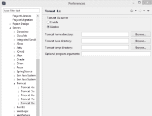
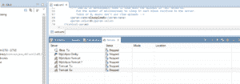
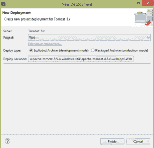
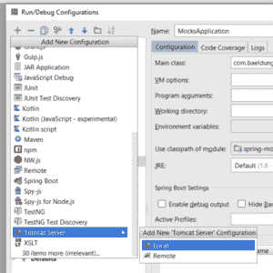
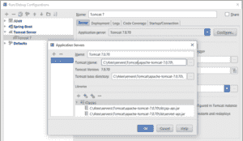
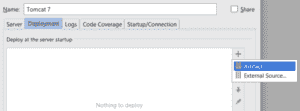

# 如何将 WAR 文件部署到 Tomcat

> 原文：<https://web.archive.org/web/20220930061024/https://www.baeldung.com/tomcat-deploy-war>

## 1。概述

Apache Tomcat 是 Java 社区中最流行的 web 服务器之一。它作为一个 **servlet 容器**发布，能够为带有 WAR 扩展的 Web 文档提供服务。

它提供了一个管理仪表板,我们可以通过它部署新的 web 应用程序，或者取消部署现有的应用程序，而无需重启容器。这在生产环境中尤其有用。

在本教程中，我们将快速概述 Tomcat，然后介绍部署 WAR 文件的各种方法。

## 延伸阅读:

## [Apache Tomcat 简介](/web/20220623120241/https://www.baeldung.com/tomcat)

A short and practical guide to installing and configuring Apache Tomcat.[Read more](/web/20220623120241/https://www.baeldung.com/tomcat) →

## [将 Spring Boot 战争部署到 Tomcat 服务器上](/web/20220623120241/https://www.baeldung.com/spring-boot-war-tomcat-deploy)

Learn how to configure a Spring Boot application to be deployed on a Tomcat server.[Read more](/web/20220623120241/https://www.baeldung.com/spring-boot-war-tomcat-deploy) →

## [将 Tomcat HTTP 端口改为 80](/web/20220623120241/https://www.baeldung.com/tomcat-change-port)

Learn how to configure an Apache Tomcat HTTP server to run on port 80.[Read more](/web/20220623120241/https://www.baeldung.com/tomcat-change-port) →

## 2。Tomcat 结构

在开始之前，我们应该熟悉一些术语和环境变量。

### 2.1。环境变量

如果我们以前使用过 Tomcat，这些对我们来说会很熟悉。

这个变量指向安装我们的服务器的目录:

`**$CATALINA_HOME**`

这个变量指向 Tomcat 的一个特定实例的目录(我们可能安装了多个实例):

`**$CATALINA_BASE**`

如果这个变量没有被显式设置，那么它将被赋予与`$CATALINA_HOME`相同的值。

Web 应用部署在`$CATALINA_HOME\webapps`目录下。

### 2.2。术语

**文档根–**指的是 web 应用程序的顶层目录，所有应用程序资源都位于该目录中，如 JSP 文件、HTML 页面、Java 类和图像。

**上下文路径–**指的是相对于服务器地址的位置，代表 web 应用程序的名称。

例如，如果我们的 web 应用程序被放在`$CATALINA_HOME\webapps\myapp`目录下，它将被 URL `http://localhost/myapp`访问，它的上下文路径将是 */myapp* 。

**WAR—**Web Archive 的简称。它是以 ZIP 格式打包 web 应用程序目录层次结构的文件的扩展。Java web 应用程序通常打包成 WAR 文件进行部署。这些文件可以在命令行上创建，也可以用 IDE 创建，比如 Eclipse。

部署 WAR 文件后，Tomcat 将它解包，并将所有项目文件从`webapps`目录存储到一个以项目命名的新目录中。

## 3。Tomcat 设置

Tomcat Apache 网络服务器是免费软件，可以从他们的网站下载。要求用户的机器有可用的 JDK，并且环境变量`JAVA_HOME`设置正确。

### 3.1。启动 Tomcat

我们可以通过运行位于`$CATALINA_HOME\bin\startup`的`startup`脚本来启动 Tomcat 服务器。每个装置中都有一个`.bat`和`.sh`。

我们将根据我们使用的是基于 Windows 还是 Unix 的操作系统来选择合适的选项。

### 3.2。配置角色

在部署阶段，我们将有一些选择，其中之一是使用 Tomcat 的管理仪表板。要访问此控制面板，我们必须为管理员用户配置适当的角色。

要访问仪表板，管理员用户需要`manager-gui`角色。稍后，我们将需要使用 Maven 部署一个 WAR 文件，为此我们还需要`manager-script`角色。

让我们在`$CATALINA_HOME\conf\tomcat-users`中进行这些更改:

```java
<role rolename="manager-gui"/>
<role rolename="manager-script"/>
<user username="admin" password="password" roles="manager-gui, manager-script"/>
```

关于不同 Tomcat 角色的更多细节可以通过关注[这个官方链接](https://web.archive.org/web/20220623120241/https://tomcat.apache.org/tomcat-6.0-doc/manager-howto.html)找到。

### 3.3。设置目录权限

最后，我们将确保 Tomcat 安装目录上有读/写权限。

### 3.4。测试安装

为了测试 Tomcat 是否设置正确，我们将运行启动脚本(`startup.bat` / `startup.sh`)。如果控制台上没有显示错误，我们可以通过访问`http://localhost:8080`进行复查。

如果我们看到 Tomcat 登录页面，那么我们已经正确安装了服务器。

### 3.5。解决端口冲突

默认情况下，Tomcat 被设置为监听端口`8080`上的连接。如果有另一个应用程序已经绑定到这个端口，启动控制台会让我们知道。

要更改端口，我们可以编辑服务器配置文件，`server.xml,`默认位于`$CATALINA_HOME\conf\server.xml.`，连接器配置为:

```java
<Connector port="8080" protocol="HTTP/1.1" 
  connectionTimeout="20000" redirectPort="8443" />
```

例如，如果我们想将我们的端口更改为`8081`，那么我们必须更改连接器的端口属性:

```java
<Connector port="8081" protocol="HTTP/1.1" 
  connectionTimeout="20000" redirectPort="8443" />
```

有时候，我们选择的端口默认是不开放的。在这种情况下，我们需要在 Unix 内核中使用适当的命令打开端口，或者在 Windows 中创建适当的防火墙规则。我们不会在这里深入讨论细节，因为这超出了本文的范围。

## 4。从 Maven 部署

如果我们想使用 Maven 部署我们的 web 档案，我们必须在 Maven 的`settings.xml`文件中将 Tomcat 配置为服务器。

有两个位置可以找到`settings.xml`文件:

*   Maven 安装:`${maven.home}/conf/settings.xml`
*   用户安装:`${user.home}/.m2/settings.xml`

一旦我们找到它，我们将添加 Tomcat:

```java
<server>
    <id>TomcatServer</id>
    <username>admin</username>
    <password>password</password>
</server>
```

现在我们需要从 Maven 创建一个基本的 web 应用程序来测试部署。让我们导航到我们想要创建应用程序的位置。

我们将在控制台上运行这个命令来创建一个新的 Java web 应用程序:

```java
mvn archetype:generate -DgroupId=com.baeldung -DartifactId=tomcat-war-deployment 
  -DarchetypeArtifactId=maven-archetype-webapp -DinteractiveMode=false
```

这将在目录`tomcat-war-deployment,`中创建一个完整的 web 应用程序，如果我们现在部署它并通过浏览器访问它，它将打印`hello world! `。

但是在此之前，我们需要做一个更改来启用 Maven 部署。让我们前往 `pom.xml`并添加这个插件:

```java
<plugin>
    <groupId>org.apache.tomcat.maven</groupId>
    <artifactId>tomcat7-maven-plugin</artifactId>
    <version>2.2</version>
    <configuration>
        <url>http://localhost:8080/manager/text</url>
        <server>TomcatServer</server>
        <path>/myapp</path>
    </configuration>
</plugin>
```

请注意，我们使用的是 Tomcat 7 插件，因为它在没有任何特殊更改的情况下适用于版本 7 和 8。

配置`url`是我们将部署发送到的 url，Tomcat 将知道如何处理它。`server`元素是 Maven 识别的服务器实例的名称。最后，`path`元素定义了我们部署的**上下文路径**。

这意味着如果我们的部署成功，我们将通过点击`http://localhost:8080/myapp`来访问 web 应用程序。

现在我们可以从 Maven 运行以下命令。

要部署 web 应用程序:

```java
mvn tomcat7:deploy
```

然后取消部署它:

```java
mvn tomcat7:undeploy
```

最后，要在进行更改后重新部署它:

```java
mvn tomcat7:redeploy
```

## 5。部署货物插件

[Cargo](https://web.archive.org/web/20220623120241/https://codehaus-cargo.github.io/cargo/Home.html) 是一个多功能的库，允许我们以标准的方式操作各种类型的应用程序容器。

### 5.1。货物部署设置

在这一节中，我们将学习如何使用 Cargo 的 Maven 插件将 WAR 部署到 Tomcat。在这种情况下，我们将把它部署到版本 7 的实例中。

为了更好地理解整个过程，我们将从头开始，从命令行创建一个新的 Java web 应用程序:

```java
mvn archetype:generate -DgroupId=com.baeldung -DartifactId=cargo-deploy 
  -DarchetypeArtifactId=maven-archetype-webapp -DinteractiveMode=false
```

这将在`cargo-deploy`目录中创建一个完整的 Java web 应用程序。如果我们按原样构建、部署和加载这个应用程序，它将在浏览器中打印出`Hello World!`。

与 Tomcat7 Maven 插件不同，Cargo Maven 插件要求该文件存在。

因为我们的 web 应用程序不包含任何 servlets，所以我们的`web.xml`文件将非常简单。我们将导航到新创建项目的`WEB-INF`文件夹，并创建一个包含以下内容的`web.xml`文件:

```java
<?xml version="1.0" encoding="UTF-8"?>
<web-app xmlns:xsi="http://www.w3.org/2001/XMLSchema-instance" 

    xsi:schemaLocation="http://java.sun.com/xml/ns/javaee 
      http://java.sun.com/xml/ns/javaee/web-app_3_0.xsd" 
        id="WebApp_ID" version="3.0">

    <display-name>cargo-deploy</display-name>
    <welcome-file-list>
        <welcome-file>index.jsp</welcome-file>
    </welcome-file-list>
</web-app>
```

为了使 Maven 能够识别 Cargo 的命令而无需输入完全限定名，我们需要将 Cargo Maven 插件添加到 Maven 的`settings.xml.` 中的插件组中

作为根元素`<settings></settings>`的直接子元素，我们将添加:

```java
<pluginGroups>
    <pluginGroup>org.codehaus.cargo</pluginGroup>
</pluginGroups>
```

### 5.2。本地部署

在这一小节中，我们将编辑我们的`pom.xml`以适应我们新的部署需求。

我们将添加这个插件:

```java
<build>
    <plugins>
        <plugin>
            <groupId>org.codehaus.cargo</groupId>
            <artifactId>cargo-maven2-plugin</artifactId>
            <version>1.5.0</version>
            <configuration>
                <container>
                    <containerId>tomcat7x</containerId>
                    <type>installed</type>
                    <home>Insert absolute path to tomcat 7 installation</home>
                </container>
                <configuration>
                    <type>existing</type>
                    <home>Insert absolute path to tomcat 7 installation</home>
                </configuration>
            </configuration>
       </plugin>
    </plugins>
</build> 
```

在撰写本文时，最新的版本是`1.5.0`。然而，最新版本总能在[这里](https://web.archive.org/web/20220623120241/https://codehaus-cargo.github.io/cargo/Downloads.html)找到。

请注意，我们明确地将包装定义为一场战争；没有这一点，我们的构建将会失败。在插件部分，我们将添加 cargo maven2 插件。另外，**我们将添加一个配置部分，告诉 Maven 我们正在使用一个 Tomcat 容器和一个现有的安装。**

通过将容器类型设置为`installed`，我们告诉 Maven 我们在机器上安装了一个实例，并且我们提供了这个安装的绝对 URL。

通过将配置类型设置为`existing`，我们告诉 Tomcat 我们正在使用一个现有的设置，不需要进一步的配置。

另一种方法是告诉 cargo 通过提供一个 URL 来下载并设置指定的版本。然而，我们的重点是战争部署。

值得注意的是，无论我们使用的是 Maven 2.x 还是 Maven 3.x，cargo maven2 插件都适用。

我们现在可以通过执行以下命令来安装我们的应用程序:

```java
mvn install
```

然后我们将部署它:

```java
mvn cargo:deploy
```

如果一切顺利，我们应该能够通过加载`http://localhost:8080/cargo-deploy.`来运行我们的 web 应用程序

### 5.3。远程部署

要进行远程部署，我们只需要更改我们的`pom.xml`的配置部分。远程部署意味着我们没有 Tomcat 的本地安装，但是可以访问远程服务器上的管理器仪表板。

让我们更改`pom.xml`，使配置部分看起来像这样:

```java
<configuration>
    <container>
        <containerId>tomcat8x</containerId>
        <type>remote</type>
    </container>
    <configuration>
        <type>runtime</type>
        <properties>
            <cargo.remote.username>admin</cargo.remote.username>
            <cargo.remote.password>admin</cargo.remote.password>
            <cargo.tomcat.manager.url>http://localhost:8080/manager/text
              </cargo.tomcat.manager.url>
        </properties>
    </configuration>
</configuration>
```

这次，我们将容器类型从`installed`更改为`remote,`，将配置类型从`existing`更改为`runtime`。最后，我们将身份验证和远程 URL 属性添加到配置中。

我们将确保角色和用户已经像以前一样出现在`$CATALINA_HOME/conf/tomcat-users.xml,`中。

如果我们为`remote`部署编辑同一个项目，我们将首先取消部署现有的 WAR:

```java
mvn cargo:undeploy
```

然后我们将清理项目:

```java
mvn clean
```

接下来，我们将安装它:

```java
mvn install
```

最后，我们将部署它:

```java
mvn cargo:deploy
```

就是这样。

## 6。从 Eclipse 部署

Eclipse 允许我们嵌入服务器，以便在正常工作流中添加 web 项目部署，而无需离开 IDE。

### 6.1。在 Eclipse 中嵌入 Tomcat

为了将安装嵌入 eclipse，我们从任务栏中选择`window`菜单项，然后从下拉菜单中选择`preferences`。

然后，我们将在出现的窗口的左侧面板上看到一个偏好项的树形网格。接下来，我们导航到`eclipse -> servers,`或者在搜索栏中输入`servers`。

然后我们可以选择安装目录，如果还没有打开的话，并选择我们下载的 Tomcat 版本。

在面板的右侧，将出现一个配置页面。在这里，我们选择启用选项来激活此服务器版本，并浏览到安装文件夹。

[](/web/20220623120241/https://www.baeldung.com/wp-content/uploads/2016/09/Capture1.png)

我们将应用这些更改，然后下次我们从 Eclipse 的`windows -> show view`子菜单中打开 servers 视图时，新配置的服务器就会出现，我们可以启动、停止和部署应用程序。

### 6.2。在嵌入式 Tomcat 中部署 Web 应用程序

要将 web 应用程序部署到 Tomcat，它必须存在于我们的工作区中。

让我们从`window -> show view`打开`servers`视图，寻找服务器。打开后，我们只需右键单击我们配置的服务器，并从出现的上下文菜单中选择`add deployment`。

[](/web/20220623120241/https://www.baeldung.com/wp-content/uploads/2016/09/Capture-1-1-2.png)

从出现的`New Deployment`对话框中，我们将打开`project`下拉菜单，并选择 web 项目。

在`Project`组合框下面有一个`Deploy Type`部分。当我们选择`Exploded Archive(development mode)`、**时，应用程序中的更改将被实时同步，无需重新部署。**这是开发过程中的最佳选择，因为它非常高效。

[](/web/20220623120241/https://www.baeldung.com/wp-content/uploads/2016/09/Capture-2-1-2.png)

选择`Packaged Archive(production mode)`将要求我们在每次进行更改时重新部署，并在浏览器中看到它们。这仅适用于生产环境，但 Eclipse 仍然让它变得同样简单。

### 6.3。在外部位置部署 Web 应用程序

我们通常选择通过 Eclipse 部署 WAR，以使调试更容易。然而，可能有一天我们会希望将它部署到 Eclipse 的嵌入式服务器以外的位置。最常见的情况是当我们的生产服务器在线时，我们想要更新 web 应用程序。

**我们可以通过在生产模式下部署来绕过这个过程，注意`New Deployment`对话框中的`Deploy Location`，然后从那里选择战争。**

在部署期间，我们可以从嵌入式服务器列表旁边的`servers`视图中选择`<Externally Launched>`选项，而不是选择嵌入式服务器。然后我们导航到外部 Tomcat 安装的`webapps`目录。

## 7 .**。从 IntelliJ IDEA 部署**

要将 web 应用程序部署到 Tomcat，它必须存在，并且已经被下载和安装。

### 7.1。本地配置

让我们打开`Run`菜单，点击`Edit Configurations`选项。

[](/web/20220623120241/https://www.baeldung.com/wp-content/uploads/2016/09/Capture.png)

在左边的面板中，我们将搜索`Tomcat Server.`，如果没有，我们将单击菜单中的+号，搜索`Tomcat,`并选择`Local`。在 name 字段中，我们将输入`Tomcat 7/8`(取决于我们的版本)。

[](/web/20220623120241/https://www.baeldung.com/wp-content/uploads/2016/09/Capture-1-2.png)

然后，我们将单击`Configure…`按钮，在`Tomcat Home` 字段中，我们将导航到我们安装的主位置并选择它。

[](/web/20220623120241/https://www.baeldung.com/wp-content/uploads/2016/09/Capture-2.png)

可选地，我们可以将`Startup`页面设置为`http://localhost:8080/` 和`HTTP port: 8080;` ，我们将根据需要更改端口。

最后，我们将转到`Deployment`选项卡，单击+符号，选择我们想要添加到服务器的工件，然后单击 OK。

[](/web/20220623120241/https://www.baeldung.com/wp-content/uploads/2016/09/Capture-3-1.png)

### 7.2。远程配置

我们将遵循与本地 Tomcat 配置相同的说明，但是在 server 选项卡中，我们必须输入安装的远程位置。

## 8。通过复制档案部署

我们已经学习了如何从 Eclipse 中导出战争。我们可以做的另一件事是通过简单地将它放到任何 Tomcat 实例的`$CATALINA_HOME\webapps`目录中来部署它。如果实例正在运行，那么当 Tomcat 打开归档文件并配置其上下文路径时，部署将立即开始。

如果实例没有运行，那么服务器将在下次启动时部署项目。

## 9。从 Tomcat 管理器部署

假设我们手头已经有了 WAR 文件，并且希望使用管理仪表板来部署它，我们可以通过访问:`http://localhost:8080/manager`来访问 manager 仪表板。

仪表板有五个不同的部分:`Manager`、`Applications`、`Deploy`、`Diagnostics`和`Server Information.`

如果我们转到`Deploy`部分，我们会发现两个子部分。

### 9.1。部署位于服务器上的目录或 WAR 文件

如果 WAR 文件位于运行 Tomcat 实例的服务器上，那么我们可以在必需的`Context Path`字段前面加上一个正斜杠“/”。

**例如，如果我们希望我们的 web 应用程序可以通过 URL `http://localhost:8080/myapp`从浏览器访问，那么我们的上下文路径字段将会有`/myapp.`**

我们也可以跳过`XML Configuration file URL`字段，直接进入`WAR` 或 `Directory URL`字段。这里，我们将输入 Web 归档文件在服务器上出现时的绝对 URL。例如，如果我们文件的位置是`C:/apps/myapp.war`，那么我们输入这个位置。重要的是我们不要忘记战争的延续。

之后，我们可以点击`deploy`按钮。页面将重新加载，我们应该会在页面顶部看到以下消息:

```java
OK - Deployed application at context path /myapp
```

我们的应用程序也应该出现在页面的`Applications`部分。

### 9.2。要部署的 WAR 文件

在这里，我们只需单击`choose file`按钮，导航到 WAR 文件的位置，选择它，然后单击`deploy`按钮。

在这两种情况下，如果一切顺利，Tomcat 控制台将通过以下消息通知我们部署已经成功:

```java
INFO: Deployment of web application archive \path\to\deployed_war has finished in 4,833 ms
```

## 10。结论

在本文中，我们主要关注如何将 WAR 部署到 Tomcat 服务器中。